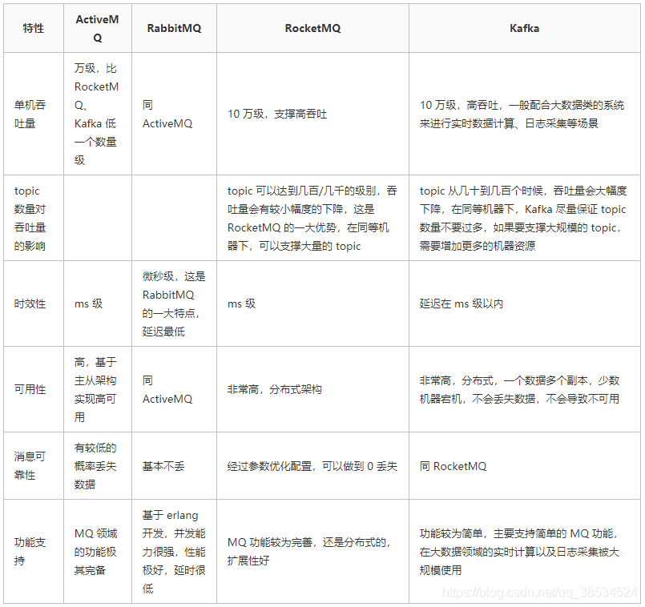
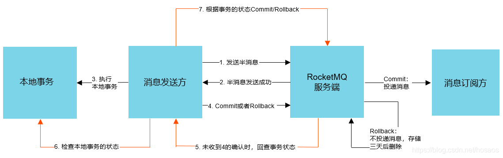

1.  RabbitMQ的原理
2. mq的作用（异步、削峰、解耦）
3. 从银行转账出发， 要求描述出两阶段提交基于（RocketMQ）

### 消息队列的应用场景🐋
1. 异步处理
2. 应用解耦：假如库存系统无法访问，则订单减库存将失败，从而导致订单失败，订单系统与库存系统耦合。订阅下单的消息，采用拉/推的方式，获取下单信息，库存系统根据下单信息，进行库存操作。
3. 流量削峰：用户的请求，服务器接收后，首先写入消息队列。假如消息队列长度超过最大数量，则直接抛弃用户请求或跳转到错误页面。秒杀业务根据消息队列中的请求信息，再做后续处理。
4. 日志处理：解决大量日志传输的问题。
5. 消息通讯

### [消息队列的延时如何实现？](https://zhuanlan.zhihu.com/p/266156267)
对于数据量比较少并且时效性要求不那么高的场景，一种比较简单的方式是轮询数据库，比如每秒轮询一下数据库中所有数据，处理所有到期的数据。

Redis ZSet：ZSet 中每个元素都有一个对应 Score，ZSet 中所有元素是按照其 Score 进行排序的。
我们将需要处理的任务，按其需要延迟处理时间作为 Score 加入到 ZSet 中。
起一个进程定时（比如每隔一秒）通过ZREANGEBYSCORE方法查询 ZSet 中 Score 最小的元素。
a. 查询出的分数小于等于当前时间戳，说明到这个任务需要执行的时间了，则去异步处理该任务；  
b. 查询出的分数大于当前时间戳，由于刚刚的查询操作取出来的是分数最小的元素，所以说明ZSet 中所有的任务都还没有到需要执行的时间，则休眠一秒后继续查询；

RabbitMQ 本身并不直接提供对延迟队列的支持，我们依靠 RabbitMQ 的**TTL**以及**死信队列**功能，来实现延迟队列的效果。

TimeWheel 时间轮算法，是一种实现延迟队列的巧妙且高效的算法，被应用在 Netty，Zookeeper，Kafka 等各种框架中。
多层时间轮：当任务的到期时间超过了当前时间轮所表示的时间范围时，就会尝试添加到上层时间轮中。

### 消息队列该建立在哪里，怎么去重？
在生产消息时，业务方在消息体中插入去重 key，消费时通过该去重 key 来识别重复消息。去重 key 可以是由 <生产者 IP + 线程 ID + 时间戳 + 时间内递增值> 组成的唯一值。

建立一个消息表，拿到这个消息做数据库的insert操作。给这个消息做一个唯一主键（primary key）或者唯一约束，那么就算出现重复消费的情况，就会导致主键冲突。

高并发下去重：采用Redis去重（key天然支持原子性并要求不可重复），但是由于不在一个事务，要求有适当的补偿策略，但是对于很重要的业务，不应该支持补偿。

### [如何保证全链路消息不丢失？](https://codeantenna.com/a/vnDPcoxnXo)
一个消息会经历四个节点，只有保证这四个节点的可靠性才能保证整个系统的可靠性。

-   生产者发出后保证到达了MQ。
	发送方确认机制，消息发送到MQ那端之后，MQ会回一个确认收到的消息给我们。
-   MQ收到消息保证分发到了消息对应的Exchange。
	- 消息找不到对应的Exchange。
	- 找到了Exchange但是找不到对应的Queue。
	这两种情况都可以用RabbitMQ提供的mandatory参数来解决，它会设置消息投递失败的策略，有两种策略：自动删除或返回到客户端。保证可靠性需要选择返回到客户端
-   Exchange分发消息入队之后保证消息的持久性。
	做队列的持久化和Exchange的持久化。【发送的消息默认就是持久化消息。】
-   消费者收到消息之后保证消息的正确消费。
	打开手动消息确认之后，只要我们这条消息没有成功消费，无论中间是出现消费者宕机还是代码异常，只要连接断开之后这条信息还没有被消费那么这条消息就会被重新放入队列再次被消费。

### 如何保证消息的可靠性传输？要是消息丢失了怎么办？
[参考](http://learn.lianglianglee.com/%E6%96%87%E7%AB%A0/RocketMQ%20%E9%9D%A2%E8%AF%95%E9%A2%98%E9%9B%86%E9%94%A6.md)
- Producer：生产者端默认采用同步阻塞式发送消息，如果状态返回 OK 表示消息一定发送到了 Broker，如果状态返回失败或者超时，会重试两次，重试次数用完后可能发送成功也可能继续失败。
- Broker：发送到 Broker 的消息会通过同步刷盘或者异步刷盘的方式持久化到 CommitLog 里面，即时 Broker 服务宕机，服务恢复后仍然可以找到消息，除非磁盘损坏才会导致消息丢失；另外在多主多从的 Broker 集群模式下，采用同步复制将 Master Broker 中的消息同步到 Slave Broker，就是 Master Broker 宕机甚至磁盘损坏也可以找到该消息。
- Consumer：消费端维护了一个 MessageQueue 的队列，不管消息消费成功或者失败都会将当前消息的消费进度 offset 持久化到 MessageQueue 里面；如果消息消费失败会把消息重新发回到 Broker，如果操作失败或者 Broker 挂掉了会定时重试，成功后更新本地的消费进度 offset；就算 Broker 和 Consumer 都挂掉了由于 Consumer 会定期持久化消费进度，等服务恢复后重新拉取 offset 之前的消息到消费端本地也可以保证消息不丢失；消费端消费失败后会把消息重新发回到 Broker 中的重试队列中，如果消费重试次数超过了最大消费重试次数的话 Broker 会把消息移到死信队列中，然后人工干预处理。

### [各种消息队列有什么特点？](https://blog.csdn.net/qq_38534524/article/details/110957518)

### 从银行转账出发， 要求描述出两阶段提交（基于RocketMQ）
[两阶段提交](https://blog.csdn.net/lengxiao1993/article/details/88290514)
[RocketMQ高级特性总结(事务消息、顺序消息、延迟消息)](https://www.i4k.xyz/article/hosaos/100053480)

RocketMq通过将本地事务与消息的发送放在一个本地事务中，来保证：
1. 本地事务执行成功时，消息一定被成功投递到消息服务器中
2. 利用消息中间件的高可靠性，保证消息一定会被下游业务所消费至少一次

RocketMQ基于两阶段提交协议做了如下改动：
1. 第一阶段：**生产者向MQ服务器发送事务消息(prepare消息)**，服务端确认后回调通知生产者执行本地事务(此时消息为Prepare消息，存储于RMQ_SYS_TRANS_HALF_TOPIC 队列中，不会被消费者消费)
2. 第二阶段：生产者执行完本地事务后(业务执行完成，同时将消息唯一标记，如transactionId与该业务执行记录同时入库，方便事务回查)，**根据本地事务执行结果，返回Commit/Rollback/Unknow状态码**
	- 服务端若收到Commit状态码，则将prepare消息变为提交(正常消息，可被消费者消费)
	- 收到Rollback则对消息进行回滚(丢弃消息)
	- 若状态为Unknow，则等待MQ服务端定时发起消息状态回查，超过一定重试次数或者超时，消息会被丢弃

设由于网络原因发送失败怎么办？本地事务已经提交/回滚了，但是Commit/Rollback状态码却没发出去，那么MQ服务器上这条prepare消息状态岂不是无法被投递/回滚。

因此，MQ服务端会定时扫描存储于RMQ_SYS_TRANS_HALF_TOPIC中的消息，若消息未被处理，则向消费发送者发起回调检查，检查消息对应本地事务执行状态。从而保证消息事务状态最终能和本地事务的状态一致。上图中的4、5、6就是MQ服务端定时回查步骤。

### 延迟消息发送
1. producer端设置消息delayLevel延迟级别，消息属性DELAY中存储了对应了延时级别
2. broker端收到消息后，判断延时消息延迟级别，如果大于0，则备份消息原始topic，queueId，并将消息topic改为延时消息队列特定topic(SCHEDULE_TOPIC)，queueId改为延时级别-1
3. mq服务端ScheduleMessageService中，为每一个延迟级别单独设置一个定时器，定时(每隔1秒)拉取对应延迟级别的消费队列
4. 根据消费偏移量offset从commitLog中解析出对应消息
5. 从消息tagsCode中解析出消息应当被投递的时间，与当前时间做比较，判断是否应该进行投递
6. 若到达了投递时间，则构建一个新的消息，并从消息属性中恢复出原始的topic，queueId，并清除消息延迟属性，从新进行消息投递

延迟队列由最小堆实现，插入任务的时间复杂度为Olog(n)，消息TPS较高时性能仍不够快，有没O(1)复杂度的方案呢？

TimeWheel时间轮，Netty、Kafka中使用TimeWheel来优化I/O超时的操作。

分区顺序：
如电商系统中的订单创建，以订单 ID 作为 Sharding Key，那么同一个订单相关的创建订单消息、订单支付消息、订单退款消息、订单物流消息都会按照发布的先后顺序来消费

### RabbitMQ消息模式
[参考](https://www.cnblogs.com/davidgu/p/14702449.html)

### RocketMQ相对于其他消息队列的优点🐋
[参考](https://cloud.tencent.com/developer/article/1921917)
- 单机吞吐量：十万级；
- topic 可以达到几百/几千的级别，吞吐量会有较小幅度的下降。
- 采用分布式架构，可用性非常高
- 经过参数优化配置，可以做到 0 丢失
- 支持10亿级别的消息堆积，不会因为堆积导致性能下降；
- 源码是java，我们可以自己阅读源码，定制自己公司的MQ，可以掌控。