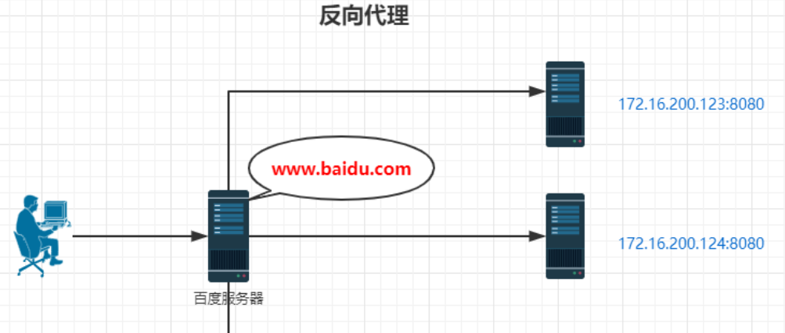

### [如何配置Nginx反向代理？](https://blog.csdn.net/zxd1435513775/article/details/102508463)


Nginx 默认的配置文件是在安装目录下的 conf 目录下。
访问 http://127.0.0.1:9001/edu/ 直接跳转到 127.0.0.1:8081  
访问 http://127.0.0.1:9001/vod/ 直接跳转到 127.0.0.1:8082
```
server {
	listen       9001;
	server_name  192.168.17.129;

	location ~ /edu/ {
		proxy_pass  http://127.0.0.1:8080
	}

	location ~ /vod/ {
		proxy_pass  http://127.0.0.1:8081
	}
}
```

### 反向代理
是指以代理服务器来接受internet上的连接请求，然后将请求转发给内部网络上的服务器，并将从服务器上得到的结果返回给internet上请求连接的客户端，此时代理服务器对外就表现为一个反向代理服务器。

正向代理，其实是"代理服务器"代理了"客户端"，去和"目标服务器"进行交互。
反向代理，其实是"代理服务器"代理了"目标服务器"，去和"客户端"进行交互。

反向代理的**用途**：
- 使用反向代理，可以对客户端隐藏服务器的IP地址
- 可以做负载均衡，根据所有真实服务器的负载情况，将客户端请求分发到不同的真实服务器上
- 可以对于静态内容及短时间内有大量访问请求的动态内容提供缓存服务，提高访问速度
- 可以作为应用层防火墙，为网站提供对基于Web的攻击行为（例如DoS/DDoS）的防护，更容易排查恶意软件等。还可以为后端服务器统一提供加密和SSL加速（如SSL终端代理），提供HTTP访问认证等。