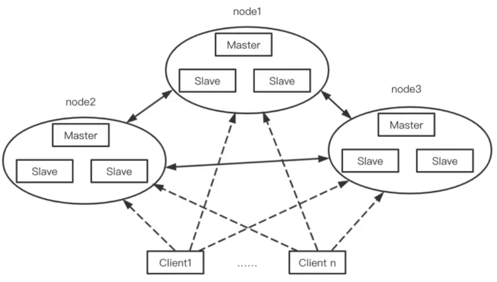

项目用到[redis](https://www.nowcoder.com/jump/super-jump/word?word=redis) [redis](https://www.nowcoder.com/jump/super-jump/word?word=redis)过期数据删除的机制 删除的策略

实际项目中用到了[redis](https://www.nowcoder.com/jump/super-jump/word?word=redis)哪些数据结构 用list做了什么

1.  [redis](https://www.nowcoder.com/jump/super-jump/word?word=redis)过期数据的处理
1.  [redis](https://www.nowcoder.com/jump/super-jump/word?word=redis)雪崩 击穿
2. 1.  介绍下布隆过滤器
3. 1.  Redis的常用数据结构
2.  如何对用户画像标签做缓存
3. 1.  缓存穿透的解决方案
4. 1.  Redis解决缓存穿透
5. Redis 的数据结构有哪些？使用场景？
6. -   场景题：记录活跃用户
7. [redis](https://www.nowcoder.com/jump/super-jump/word?word=redis)数据结构（5个基础数据结构和3个高级数据结构）  
[redis](https://www.nowcoder.com/jump/super-jump/word?word=redis)过期键删除策略（定期删除、惰性删除、定时删除）
8.缓存穿透， 缓存击穿， 缓存雪崩基本概念及解决方案。

9.[redis](https://www.nowcoder.com/jump/super-jump/word?word=redis)哨兵集群相关问题（怎么主从同步，怎么哨兵选举， 怎么master选举）

### Redis 为什么快？🌟
1. 完全基于内存，数据存在内存中，绝大部分请求是纯粹的内存操作，非常快速，跟传统的磁盘文件数据存储相比，避免了通过磁盘IO读取到内存这部分的开销。
2. 数据结构简单，对数据操作也简单。
3. 采用单线程，省去了很多上下文切换的时间以及CPU消耗，不存在竞争条件，不用去考虑各种锁的问题，不存在加锁释放锁操作，也不会出现死锁而导致的性能消耗。
4. 使用基于IO多路复用机制的线程模型，可以处理并发的连接。

Redis不适合的场景：数据量太大、数据访问频率非常低的业务都不适合使用Redis，数据太大会增加成本，访问频率太低，保存在内存中纯属浪费资源。

### 缓存的一致性怎么保证？🌟🌟
**缓存延迟双删策略**

[缓存的一致性怎么保证？](http://kaito-kidd.com/2021/09/08/how-to-keep-cache-and-consistency-of-db/)
[参考2](https://cloud.tencent.com/developer/news/634004)

更新数据库 + 更新缓存的方案，不仅缓存利用率不高，还会造成机器性能的浪费。
删除缓存对应的方案有 2 种：
1.  先删除缓存，后更新数据库
2.  先更新数据库，后删除缓存

先删除缓存，后更新数据库在并发情况下的问题：
1.  线程 A 要更新 X = 2（原值 X = 1）
2.  线程 A 先删除缓存
3.  线程 B 读缓存，发现不存在，从数据库中读取到旧值（X = 1）
4.  线程 A 将新值写入数据库（X = 2）
5.  线程 B 将旧值写入缓存（X = 1）
最终 X 的值在缓存中是 1（旧值），在数据库中是 2（新值），发生不一致。

**先更新数据库，后删除缓存：**
1.  缓存中 X 不存在（数据库 X = 1）
2.  线程 A 读取数据库，得到旧值（X = 1）
3.  线程 B 更新数据库（X = 2)
4.  线程 B 删除缓存
5.  线程 A 将旧值写入缓存（X = 1）

其实概率「很低」，这是因为它必须满足 3 个条件：
1.  缓存刚好已失效
2.  读请求 + 写请求并发
3.  更新数据库 + 删除缓存的时间（步骤 3-4），要比读数据库 + 写缓存时间短（步骤 2 和 5）

因为写数据库一般会先「加锁」，所以写数据库，通常是要比读数据库的时间更长的。

**如果第二个步骤删除缓存失败了怎么办？异步重试**
把重试请求写到「消息队列」中，然后由专门的消费者来重试，直到成功。【把删除缓存的操作写到消息队列中】

不想在应用程序代码中写消息队列的其他方法：
**订阅数据库变更日志，再操作缓存**。

我们的业务应用在修改数据时，「只需」修改数据库，无需操作缓存。当一条数据发生修改时，MySQL 就会产生一条变更日志（Binlog），我们可以订阅这个日志，拿到具体操作的数据，然后再根据这条数据，去删除对应的缓存。

总结：想要保证数据库和缓存一致性，**推荐采用「先更新数据库，再删除缓存」方案，并配合「消息队列」或「订阅变更日志」的方式来做**。

**缓存延迟双删策略**
这 2 个问题的核心在于：**缓存都被回种了「旧值」**。
解决第一个问题：在线程 A 删除缓存、更新完数据库之后，先「休眠一会」，再「删除」一次缓存。
解决第二个问题：线程 A 可以生成一条「延时消息」，写到消息队列中，消费者延时「删除」缓存。

### Redis的使用场景
[Redis的使用场景](https://segmentfault.com/a/1190000016188385)
缓存、排行榜、计数器、分布式会话、分布式锁、社交网络、最新列表、消息系统

### Redis常用数据结构🌟🌟🌟🌟
基础数据结构
1. String：字符串对象
2. List：列表对象
3. Hash：哈希对象
4.  Set：集合对象
5. ZSet：有序集合

扩展数据接口：
bitmap、hyperloglog、geospatial【/ˌdʒiːəʊˈspeɪʃəl/】 indexes

### Hash的底层数据结构
ziplist和hashtable
[参考](https://juejin.cn/post/6863258283483807752)
[参考二](https://developer.aliyun.com/article/666400)
redis的哈希对象的底层存储可以使用ziplist（压缩列表）和hashtable。当hash对象可以同时满足一下两个条件时，哈希对象使用ziplist编码。
- 哈希对象保存的所有键值对的键和值的字符串长度都小于64字节
- 哈希对象保存的键值对数量小于512个

### zset 底层的实现原理
[参考](https://segmentfault.com/a/1190000037473381)
有序集合对象的编码可以是ziplist或者skiplist。同时满足以下条件时使用ziplist编码：
- 元素数量小于128个
- 所有member的长度都小于64字节

ziplist编码的有序集合使用紧挨在一起的压缩列表节点来保存，第一个节点保存member，第二个保存score。ziplist内的集合元素按score从小到大排序，score较小的排在表头位置。

skiplist编码的有序集合底层是一个命名为zset的结构体，而一个zset结构同时包含一个字典和一个跳跃表。跳跃表按score从小到大保存所有集合元素。而字典则保存着从member到score的映射，这样就可以用O(1)的复杂度来查找member对应的score值。

### Redis中的跳表🌟
随机选择了n/2 个元素做为一级索引
在每次新插入元素的时候，尽量让该元素有 1/2 的几率建立一级索引、1/4 的几率建立二级索引、1/8 的几率建立三级索引
该方法有 1/2 的概率返回 1、1/4 的概率返回 2、1/8的概率返回 3，以此类推。

- randomLevel() 方法返回 1 表示当前插入的该元素不需要建索引，只需要存储数据到原始链表即可（概率 1/2）
- randomLevel() 方法返回 2 表示当前插入的该元素需要建一级索引（概率 1/4）
- randomLevel() 方法返回 3 表示当前插入的该元素需要建二级索引（概率 1/8）
- randomLevel() 方法返回 4 表示当前插入的该元素需要建三级索引（概率 1/16）

按照区间来查找数据这个操作，红黑树的效率没有跳表高。

### 跳表源码🐋
跳跃表通过在节点中提取索引的方式，实现有序链表的快速查找。本质上是一个空间(额外的步进指针)换时间的操作。
跳跃表采用了随机算法(层高越高概率越小)来决定层高，相同层之间通过指针相连。redis实现中某节点层高为i的概率为 $(1-p) * p^{i-1}$。默认p为0.25。

跳表的索引高度 h = log2n，且每层索引最多遍历 3 个元素。所以跳表中查找一个元素的时间复杂度为 O(3* logn)，省略常数即：O(logn)。

假如原始链表包含 n 个元素，则一级索引元素个数为 n/2、二级索引元素个数为 n/4、三级索引元素个数为 n/8 以此类推。所以，索引节点的总和是：n/2 + n/4 + n/8 + … + 8 + 4 + 2 = n-2，空间复杂度是 O(n)。

**如果需要统计某一天的用户的访问次数应该用Redis哪个数据结构？**
当一个用户访问的时候，如果用户登陆过，那么我们就使用用户的id，如果用户没有登陆过，那么我们也能够前端页面随机生成一个key用来标识用户，当用户访问的时候，我们可以使用HSET命令，key可以选择URI与对应的日期进行拼凑，field可以使用用户的id或者随机标识，value可以简单设置为1。

当我们要统计某一个网站某一天的访问量的时候，就可以直接使用HLEN来得到最终的结果了。

**如何找到排名前十的用户？**
在Sorted-Set中添加、删除或更新一个成员都是非常快速的操作，其时间复杂度为集合中成员数量的对数。由于Sorted-Sets中的成员在集合中的位置是有序的，因此，即便是访问位于集合中部的成员也仍然是非常高效的。

Sorted-Set底层的实现是跳表(skiplist),插入和删除的效率都很高.

### Redis持久化如何实现
[参考](https://segmentfault.com/a/1190000039208726)
Redis支持两种方式的持久化：RDB快照和AOF。

RDB持久化方案是按照指定时间间隔对你的数据集生成的时间点快照（point-to-time snapshot）。它以紧缩的二进制文件保存Redis数据库某一时刻所有数据对象的内存快照，可用于Redis的数据备份、转移与恢复。操作系统提供的fork()函数创建的子进程可获得与父进程一致的内存数据，相当于获取了内存数据副本；

AOF是Append Only File的缩写，它是Redis的完全持久化策略，从1.1版本开始支持；这里的file存储的是引起Redis数据修改的命令集合（比如：set/hset/del等），这些集合按照Redis Server的处理顺序追加到文件中。当重启Redis时，Redis就可以从头读取AOF中的指令并重放，进而恢复关闭前的数据状态。

使用4.0以上版本Redis，使用AOF+RDB混合持久化功能：先按照RDB格式写入数据状态，然后把重写期间AOF缓冲区的内容以AOF格式写入，文件前半部分为RDB格式，后半部分为AOF格式。

### 如果Redis单台机器不够放了怎么办？
尽量压缩单机上的存储空间，比如对key和value压缩。修改序列化方案或者压缩方式。

使用Redis集群

### Redis集群是怎么划分位置的，假如新增节点怎么办？
[参考](https://blog.51cto.com/alex4dream/2802508)
[Redis cluster集群模式介绍](https://www.jianshu.com/p/ca071e57c887)



Redis 集群既没有用哈希取模，也没有用一致性哈希，而是用Hash槽来实现的。Redis集群创建了 16384 个槽（slot），每个节点负责一定区间的slot。
key 与 slot 的关系是永远不会变的，会变的只有 slot 和 Redis 节点的关系。

### 布隆过滤器
算法：
- 首先需要k个hash函数，每个函数可以把key散列成为1个整数
- 初始化时，需要一个长度为n比特的数组【二进制数组】，每个比特位初始化为0
- 某个key加入集合时，用k个hash函数计算出k个散列值，并把数组中对应的比特位置为1
- 判断某个key是否在集合时，用k个hash函数计算出k个散列值，并查询数组中对应的比特位，如果所有的比特位都是1，认为在集合中。

优点：
- 不需要存储key，节省空间

缺点：
- 算法判断key在集合中时，有一定的概率key其实不在集合中
- 无法删除

### Redis缓存穿透🌟
[参考](https://segmentfault.com/a/1190000022029639)
我们使用Redis大部分情况都是通过Key查询对应的值，假如发送的请求传进来的key是不存在Redis中的，那么就查不到缓存，查不到缓存就会去数据库查询。假如有大量这样的请求，这些请求像“穿透”了缓存一样直接打在数据库上，这种现象就叫做缓存穿透。【用户不断发起请求缓存和数据库中都没有的数据。】

使用布隆过滤器。布隆过滤器的作用是某个 key 不存在，那么就一定不存在，它说某个 key 存在，那么很大可能是存在(存在一定的误判率)。于是我们可以在缓存之前再加一层布隆过滤器，在查询的时候先去布隆过滤器查询 key 是否存在，如果不存在就直接返回。

1. 接口层增加校验
	比如用户鉴权校验，参数做校验，不合法的参数直接代码Return，比如：id 做基础校验，id <=0的直接拦截等。
2. 缓存空值
	之所以会发生穿透，就是因为缓存中没有存储这些空数据的key。从而导致每次查询都到数据库去了。那么我们就可以为这些key对应的值设置为null 丢到缓存里面去。后面再出现查询这个key 的请求的时候，直接返回null。
3. 布隆过滤器（Bloom Filter）
	Bloom Filter是用于判断某个元素（key）是否存在于某个集合中。先把我们数据库的数据都加载到我们的过滤器中，在缓存之前在加一层BloomFilter，在查询的时候先去 BloomFilter 去查询 key 是否存在，如果不存在就直接返回，存在再走查缓存，然后查DB。
4. Nginx
	对单个IP每秒访问次数超出阈值的IP都拉黑

### Redis雪崩🌟
当某一时刻发生大规模的缓存失效的情况，会有大量的请求进来直接打到DB上面。

**处理缓存雪崩**
处理缓存雪崩简单，在批量往Redis存数据的时候，把每个Key的失效时间都加个随机值就好了，这样可以保证数据不会在同一时间大面积失效。

如果Redis是集群部署，将热点数据均匀分布在不同的Redis库中也能避免全部失效的问题。

- 事前：redis 高可用，主从+哨兵，redis cluster，避免全盘崩溃。
- 事中：本地 ehcache 缓存 + hystrix 限流&降级，避免 MySQL 被打死。
- 事后：redis 持久化，一旦重启，自动从磁盘上加载数据，快速恢复缓存数据。

### Redis击穿🌟🌟🌟
缓存击穿是指一个Key非常热点，在不停的扛着大并发，大并发集中对这一个点进行访问，当这个Key在失效的瞬间，持续的大并发就穿破缓存，直接请求数据库，就像在一个完好无损的桶上凿开了一个洞。
1. 设置热点数据永不过期
	对于某个需要频繁获取的信息，缓存在Redis中，并设置其永不过期。当然这种方式比较粗暴，对于某些业务场景是不适合的。
2. 互斥锁[参考](https://blog.csdn.net/jackzhang11/article/details/121608085)
	这是解决缓存击穿比较常用的方法。互斥锁简单来说就是在Redis中根据key获得的value值为空时，先锁上，然后从数据库加载，加载完毕，释放锁。若其他线程也在请求该key时，发现获取锁失败，则睡眠一段时间（比如100ms）后重试。【基于 redis 或者 zookeeper 实现互斥锁，等待第一个请求构建完缓存之后，再释放锁，进而其它请求才能通过该 key 访问数据。】

### Redis常用命令
[参考](https://www.cnblogs.com/javastack/p/9854489.html)

### Redis键过期删除策略🌟🌟
[理解Redis的内存回收机制](https://www.hoohack.me/2019/06/24/redis-expire-strategy)
[Redis 的过期策略是如何实现的？](https://juejin.cn/post/6844903965927145479#heading-9)

在Redis中，同时使用了定期删除和惰性删除。
惰性删除：当访问一个key时，才判断该key是否过期，过期则删除。

定期删除：
Redis会把所有过期的键值对加入到expires，之后再通过定期删除来清理expires里面的值。

Redis 默认会每秒进行 10 次（redis.conf 中通过 hz 配置）过期扫描，扫描并不是遍历过期字典中的所有键，而是采用了如下方法：

1. 从过期字典中随机取出 20 个键
2. 删除这 20 个键中过期的键
3. 如果过期键的比例超过 25% ，重复步骤 1 和 2，否则进入到下一个数据库

为了保证扫描不会出现循环过度，导致线程卡死现象，还增加了扫描时间的上限，默认是 25 毫秒（即默认在慢模式下，如果是快模式，扫描上限是 1 毫秒）

```c
void activeExpireCycle(int type) {
        ...
        do {
           ...
            if (num > ACTIVE_EXPIRE_CYCLE_LOOKUPS_PER_LOOP)
                // 选过期键的数量，为 20
                num = ACTIVE_EXPIRE_CYCLE_LOOKUPS_PER_LOOP;

            while (num--) {
                dictEntry *de;
                long long ttl;
                // 随机选 20 个过期键
                if ((de = dictGetRandomKey(db->expires)) == NULL) break;
                ...
                // 尝试删除过期键    
                if (activeExpireCycleTryExpire(db,de,now)) expired++;
                ...
            }
            ...
           // 只有过期键比例 < 25% 才跳出循环
        } while (expired > ACTIVE_EXPIRE_CYCLE_LOOKUPS_PER_LOOP/4);
    }
    ...
}
```

对于定期删除，在程序中有一个全局变量current_db来记录下一个将要遍历的库，假设有16个库，我们这一次定期删除遍历了10个，那此时的current_db就是11，下一次定期删除就从第11个库开始遍历，假设current_db等于15了，那么之后遍历就再从0号库开始（此时current_db = 0）

在判断key需要过期之后，真正删除key的过程是先广播expire事件到从库和AOF文件中，然后在根据redis的配置决定立即删除还是异步删除。
如果是立即删除，Redis会立即释放key和value占用的内存空间，否则，Redis会在另一个bio线程中释放需要延迟删除的空间。

**从库的过期策略：**  从库不会进行过期扫描，从库对过期的处理是被动的。主库在 key 到期时，会在 AOF 文件里增加一条 del 指令，同步到所有的从库，从库通过执行这条 del 指令来删除过期的 key。

如果过期key较多，定期删除漏掉了一部分，而且也没有及时去查，即没有走惰性删除，那么就会有大量的过期key堆积在内存中，导致redis内存耗尽，当内存耗尽之后，有新的key到来会发生什么事呢？是直接抛弃还是其他措施呢？有什么办法可以接受更多的key？

Redis的内存淘汰策略，是指内存达到maxmemory极限时，使用某种算法来决定清理掉哪些数据，以保证新数据的存入。

内存淘汰机制：
-   noeviction: 当内存不足以容纳新写入数据时，新写入操作会报错。
-   allkeys-lru：当内存不足以容纳新写入数据时，在键空间（`server.db[i].dict`）中，移除最近最少使用的 key（这个是最常用的）。
-   allkeys-random：当内存不足以容纳新写入数据时，在键空间（`server.db[i].dict`）中，随机移除某个 key。
-   volatile-lru：当内存不足以容纳新写入数据时，在设置了过期时间的键空间（`server.db[i].expires`）中，移除最近最少使用的 key。
-   volatile-random：当内存不足以容纳新写入数据时，在设置了过期时间的键空间（`server.db[i].expires`）中，随机移除某个 key。
-   volatile-ttl：当内存不足以容纳新写入数据时，在设置了过期时间的键空间（`server.db[i].expires`）中，有更早过期时间的 key 优先移除。

### Redis LRU怎么实现
[参考](https://segmentfault.com/a/1190000017555834)
早期随机从dict中取出五个key,淘汰一个lru字段值最小的。(随机选取的key是个可配置的参数maxmemory-samples,默认值为5).
3.0之后：
- Redis整体上是一个大的dict,key是一个string,而value都会保存为一个robj
- 每个robj中都有一个24bit长度的lru字段，lru字段里边保存的是一个时间戳
- 在Redis的dict中每次按key获取一个值的时候，都会调用lookupKey函数,如果配置使用了LRU模式,该函数会更新value中的lru字段为当前秒级别的时间戳
- 首先第一次随机选取的key都会放入一个pool中(pool的大小为16),pool中的key是按lru大小顺序排列的。接下来每次随机选取的keylru值必须小于pool中最小的lru才会继续放入，直到将pool放满。放满之后，每次如果有新的key需要放入，需要将pool中lru最大的一个key取出。
- 淘汰的时候，直接从pool中选取一个lru最小【时间戳最早】的值然后将其淘汰。

### Redis 选择hash还是string 存储数据？
如果存储的都是比较结构化的数据，比如用户数据缓存，或者经常需要操作数据的一个或者几个，特别是如果一个数据中如果filed比较多，但是每次只需要使用其中的一个或者少数的几个，使用hash是一个好的选择，因为它提供了hget 和 hmget，而无需取出所有数据再在代码中处理。
反之，如果数据差异较大，操作时常常需要把所有数据都读取出来再处理，使用string 是一个好的选择。

### 如何对用户画像标签做缓存？
[Bitmap的巧用](https://blog.51cto.com/u_15485930/4934493)

1. 建立用户名和用户ID的映射
2. 让每一个标签存储包含此标签的所有用户ID,每一个标签都是一个独立的Bitmap

### Redis记录活跃用户
例如今天为 2016-01-18
把 key 定义为 userlogin:20160118

1. 用户登录
ID为 100 的用户登录了，执行

> setbit userlogin:20160118 100 1

2. 统计今天登录的用户数

> bitcount userlogin:20160118

3. 统计3天内都登录过的用户

“都登录过”是要取得bit值都为1的，通过 and计算获取

> bitop or ret userlogin:20160116 userlogin:20160117userlogin:20160118

4. 统计7天内登录过的用户

“登录过”表示bit值有一个为 1 即可，所以通过or 计算获取

[如何用redis存储统计1亿用户一年的登陆情况，并快速检索任意时间窗口内的活跃用户数量。](https://juejin.cn/post/6844904097666039816)

因为bitmap的每一位只占据1bit的空间 ，所以利用这个特性我们可以把每一天作为key，value为1亿用户的活跃度状态。假设一个用户一天内只要登录了一次就算活跃。活跃我们就记为1，不活跃我们就记为0。把用户Id作为偏移量(offset)。这样我们一个key就可以存储1亿用户的活跃状态。

100000000/8/1024/1024=11.92M

我们也可以用**位图压缩算法**对bitmap进行压缩存储。例如WAH，EWAH，Roaring Bitmaps。

我们可以对某一段时间内的所有key进行OR(或)操作，或操作出来的位图是0的就代表这段时间内一次都没有登陆的用户。

redis从2.8.9之后增加了**HyperLogLog**数据结构。这个数据结构，根据redis的官网介绍，这是一个概率数据结构，用来估算数据的基数。能通过**牺牲准确率来减少内存空间的消耗**。

HyperLogLog是一种概率性数据结构，在标准误差0.81%的前提下，能够统计2^64个数据。所以 HyperLogLog 适合在比如统计日活月活此类的对精度要不不高的场景。

### Redis两种高可用方案介绍
- 主从复制数据。
- 采用哨兵监控数据节点的运行情况，一旦主节点出现问题由从节点顶上继续进行服务。

### Redis主从同步
从服务器对主服务的同步操作，需要通过 sync 命令来实现，以下是 sync 命令的执行步骤：
1.  从服务器向主服务器发送 sync 命令
2.  收到 sync 命令后，主服务器执行 bgsave 命令，用来生成 rdb 文件，并在一个缓冲区中记录从现在开始执行的写命令。
3.  bgsave 执行完成后，将生成的 rdb 文件发送给从服务器，用来给从服务器更新数据
4.  主服务器再将缓冲区记录的写命令发送给从服务器，从服务器执行完这些写命令后，此时的数据库状态便和主服务器一致了。

 2.8 版本开始，进行主从同步可能只需要执行命令传播即可。这个也是因为 sync 比较耗资源，从而采取的优化。

旧版本全量复制功能，其最大的问题是从服务器断线重连时，即便在从服务器上已经有一部分数据了，也需要进行全量复制，这样做的效率很低，于是新版本的Redis在这部分做了改进。新版本Redis使用psync命令来代替sync命令，该命令既可以实现完整全同步也可以实现部分同步。

[增量复制参考](https://zhuanlan.zhihu.com/p/151740247)

由于全量复制在主节点数据量较大时效率太低，因此Redis2.8开始提供部分复制，用于处理网络中断时的数据同步。

- 复制偏移量：执行复制的双方，主从节点，分别会维护一个复制偏移量offset： 主节点每次向从节点同步了N字节数据后，将修改自己的复制偏移量offset+N， 从节点每次从主节点同步了N字节数据后，将修改自己的复制偏移量offset+N。offset用于判断主从节点的数据库状态是否一致： 如果二者offset相同，则一致； 如果offset不同，则不一致，此时可以根据两个offset找出从节点缺少的那部分数据。
- 复制积压缓冲区：主节点内部维护了一个固定长度的、先进先出(FIFO)队列 作为复制积压缓冲区，其默认大小为1MB， 在主节点进行命令传播时，不仅会将写命令同步到从节点，还会将写命令写入复制积压缓冲区。由于复制积压缓冲区定长且是先进先出，所以它保存的是主节点最近执行的写命令；时间较早的写命令会被挤出缓冲区。因此，当主从节点offset的差距过大超过缓冲区长度时，将无法执行部分复制，只能执行全量复制。
- 服务器运行ID(runid)

从节点将offset发送给主节点后，主节点根据offset和缓冲区大小决定能否执行部分复制：
- 如果offset偏移量之后的数据，仍然都在复制积压缓冲区里，则执行部分复制；
- 如果offset偏移量之后的数据已不在复制积压缓冲区中（数据已被挤出），则执行全量复制。

服务器运行ID(runid)：每个Redis节点，都有其运行ID，运行ID由节点在启动时自动生成，主节点会将自己的运行ID发送给从节点，从节点会将主节点的运行ID存起来。 从节点Redis断开重连的时候，就是根据运行ID来判断同步的进度：
- 如果从节点保存的runid与主节点现在的runid相同，说明主从节点之前同步过，主节点会继续尝试使用部分复制(到底能不能部分复制还要看offset和复制积压缓冲区的情况)；
- 如果从节点保存的runid与主节点现在的runid不同，说明从节点在断线前同步的Redis节点并不是当前的主节点，只能进行全量复制。

### Redis集群模式🌟
[参考](https://segmentfault.com/a/1190000022808576)
Redis 支持三种集群方案：
- 主从复制模式：当写操作导致数据变化时会自动将数据同步给从数据库。而从数据库一般是只读的，并接受主数据库同步过来的数据。
- Sentinel（哨兵）模式：当主服务器宕机后，需要手动把一台从服务器切换为主服务器，这就需要人工干预，而哨兵会自动干预。
	哨兵模式的作用：
	- 通过发送命令，让 Redis 服务器返回监控其运行状态，包括主服务器和从服务器；
	- 当哨兵监测到 master 宕机，会自动将 slave 切换成 master ，然后通过发布订阅模式通知其他的从服务器，修改配置文件，让它们切换主机；
- Cluster 模式：Redis 的哨兵模式基本已经可以实现高可用，读写分离 ，但是在这种模式下每台 Redis 服务器都存储相同的数据，很浪费内存，所以在 redis3.0上加入了 Cluster 集群模式，实现了 Redis 的分布式存储，也就是说每台 Redis 节点上存储不同的内容。
	- Redis 集群有16384 个哈希槽，每个 key 通过 CRC16 校验后对 16384 取模来决定放置哪个槽。集群的每个节点负责一部分hash槽。

### 集群模式切片🐨
[参考](https://juejin.cn/post/7084163543108927502#heading-5)
Redis Cluster 采用哈希槽（Hash Slot）来处理数据和实例之间的映射关系，Redis Cluster 将集群划分为 16384 个槽，每个键值对都会根据它的 key，被映射到一个哈希槽中。
在创建集群时，redis-cli --cluster create 命令会自动把 16384 个槽平均分布在集群实例上，如果集群有 N 个Master，那每个Master上槽的个数为 16384 / N。

Redis Cluster 提供了一种重定向机制，在客户端给一个实例发送指令时，该实例发现指令的 key 所在的槽位并不归自己管理，这时它会向客户端返回一个特殊的跳转指令 MOVED，其中就包含了这个 key 所在的槽位和实例。这时客户端会更新本地缓存的槽位信息，然后向新实例重新发送指令。

当一个槽正在迁移时，这个槽就处于中间过渡状态。那么就有可能这个槽的一部分数据已迁移到目标节点，一部分数据还在原节点。
如果对应的数据不在原节点里，那么有两种可能，要么该数据在新节点里，要么根本就不存在。旧节点不知道是哪种情况，所以它会向客户端返回一个 ASK 的重定向指令，返回的 ASK 指令告诉了客户端这个槽位的数据正在迁移中，并且告诉客户端这个槽位的新实例地址。客户端收到这个重定向指令后，先去目标节点执行一个不带任何参数的 ASKING 指令，然后在目标节点再重新执行原先的操作指令。
之所以要先发送 ASKING 指令，是因为在迁移没有完成之前，这个槽位不归新节点管理，如果这个时候向新节点发送该槽位的指令，它会向客户端返回一个 MOVED 重定向指令告诉它去原节点去执行，这样就会导致 循环重定向。而 ASKING 指令就是告诉新节点强制执行下一条指令，把下一条指令当成自己的槽位来处理。

### 集群模式选举
[参考](https://juejin.cn/post/7094623254450536478)
一个 Master 节点挂掉后的选举过程：
当 slave 发现自己的 master 变为 FAIL 状态时，便尝试进行 Failover，以期成为新的 master。由于挂掉的 master 可能会有多个 slave，从而存在多个 slave 竞争成为 master 节点的过程， 其过程如下：
- slave 发现自己的 master 变为 FAIL。
- 将自己记录的集群 currentEpoch 加 1，并广播 FAILOVER_AUTH_REQUEST 信息
- 其他节点收到该信息，只有 master 响应，判断请求者的合法性，并发送 FAILOVER_AUTH_ACK，对每一个 epoch 只发送一次ack
- 尝试 failover 的 slave 收集 master 返回的 FAILOVER_AUTH_ACK
- slave 收到超过半数（N/2+1） master 的 ack 后变成新 Master
- slave 广播 Pong 消息通知其他集群节点。

### Redis 哨兵🌟🌟
[哨兵工作流程参考](https://www.codedump.info/post/20190409-redis-sentinel/)
[参考](https://yexindong.blog.csdn.net/article/details/120510309?spm=1001.2014.3001.5502)
-  **持久化：** 持久化是最简单的高可用方法（有时甚至不被归为高可用的手段），主要作用是数据备份，即将数据存储在硬盘，保证数据不会因进程退出而丢失。
- **复制：** 复制是高可用Redis的基础，哨兵和集群都是在复制基础上实现高可用的。复制主要实现了数据的多机备份，以及对于读操作的负载均衡和简单的故障恢复。缺陷是故障恢复无法自动化；写操作无法负载均衡；存储能力受到单机的限制。  
- **哨兵：** 在复制的基础上，哨兵实现了自动化的故障恢复。缺陷是写操作无法负载均衡；存储能力受到单机的限制。 
- **集群：** 通过集群，Redis解决了**写操作无法负载均衡，以及存储能力受到单机限制**的问题，实现了较为完善的高可用方案。

哨兵的功能：
- **监控（Monitoring）：** 哨兵会不断地检查主节点和从节点是否运作正常。
- **自动故障转移（Automatic Failover）：** 当主节点不能正常工作时，哨兵会开始自动故障转移操作，它会将失效主节点的其中一个从节点升级为新的主节点，并让其他从节点改为复制新的主节点。
- **配置提供者（Configuration Provider）：** 客户端在初始化时，通过连接哨兵来获得当前Redis服务的主节点地址。
- **通知（Notification）：** 哨兵可以将故障转移的结果发送给客户端。

***
[参考](https://www.cnblogs.com/kevingrace/p/9004460.html)
sentinel在内部有3个定时任务
- 每10秒每个sentinel会对master和slave执行info命令，这个任务达到两个目的：
	a）发现slave节点
	b）确认主从关系
- 每2秒每个sentinel通过master节点的channel交换信息（pub/sub）。master节点上有一个发布订阅的频道(__sentinel__:hello)。sentinel节点通过__sentinel__:hello频道进行信息交换(对节点的"看法"和自身的信息)，达成共识。
- 每1秒每个sentinel对其他sentinel和redis节点执行ping操作（相互监控），这个其实是一个心跳检测，是失败判定的依据。

工作方式：
- 每个Sentinel以每秒钟一次的频率向它所知的Master，Slave以及其他 Sentinel 实例发送一个PING命令。
- 如果一个实例（instance）距离最后一次有效回复PING命令的时间超过 down-after-milliseconds 选项所指定的值，则这个实例会被Sentinel标记为主观下线。 
- 如果一个Master被标记为主观下线，则正在监视这个Master的所有 Sentinel 要以每秒一次的频率确认Master的确进入了主观下线状态。 
- 当有足够数量的Sentinel（大于等于配置文件指定的值）在指定的时间范围内确认Master的确进入了主观下线状态，则Master会被标记为客观下线。
- 在一般情况下，每个Sentinel 会以每10秒一次的频率向它已知的所有Master，Slave发送 INFO 命令。
- 当Master被Sentinel标记为客观下线时，Sentinel 向下线的 Master 的所有Slave发送 INFO命令的频率会从10秒一次改为每秒一次。 
- 若没有足够数量的Sentinel同意Master已经下线，Master的客观下线状态就会被移除。 若 Master重新向Sentinel 的PING命令返回有效回复，Master的主观下线状态就会被移除。

简单来讲流程如下：
- 每个哨兵都设置一个随机超时时间，超时后向其他哨兵发送申请成为领导者的请求
- 其他哨兵只能**对收到的第一个请求进行回复确认**
- 首先达到多数确认选票的哨兵节点，成为领导者
- 如果在确认回复后，所有哨兵都无法达到多数选票的结果，那么进行重新选举，直到选出领导者为止
- 选择出哨兵领导者后，之后的故障恢复操作都由这个哨兵领导者进行操作。

新主库：
- 过滤掉不健康的（下线或断线），没有回复过哨兵ping响应的从节点
- 选择salve-priority从节点优先级最高（redis.conf）的
- 选择复制偏移量最大，只复制最完整的从节点

### Redis脑裂现象发生怎么解决？🌟
如果当前主库突然出现暂时性 “失联”，而并不是真的发生了故障，此时监听的哨兵会自动启动主从切换机制。当这个原始的主库从假故障中恢复后，又开始处理请求，但是哨兵已经选出了新的主库，这样一来，旧的主库和新主库就会同时存在，这就是脑裂现象。

脑裂最直接的影响，就是客户端不知道应该往哪个主节点写入数据，结果就是不同的客户端会往不同的主节点上写入数据。严重的话，脑裂会进一步导致数据丢失。也就是说，等到哨兵让原主库和新主库做全量同步后，原主库在切换期间保存的数据就丢失了。

Redis 中有两个关键的配置项可以解决这个问题，分别是 min-slaves-to-write（最小从服务器数） 和 min-slaves-max-lag（从连接的最大延迟时间）。

这两个配置项组合后的要求是，主库连接的从库中至少有 N 个从库，和主库进行数据复制时的 ACK 消息延迟不能超过 T 秒，否则，主库就不会再接收客户端的请求了。

这样一来，即使原主库是假故障，它在假故障期间也无法响应哨兵发出的心跳测试，也不能和从库进行同步，自然也就无法和从库进行 ACK 确认了。【不满足有n个健康从库的条件】

此时的 min-slaves-to-write 和 min-slaves-max-lag 的组合要求就无法得到满足，原主库就会被限制接收客户端请求，客户端也就不能在原主库中写入新数据，就可以避免脑裂现象的发生了。

### 分布式锁的三种实现方式🐋
- 基于数据库实现分布式锁
	- 使用表的唯一约束特性。当往数据库中成功插入一条数据时, 代表只获取到锁。将这条数据从数据库中删除，则释放锁。
- 基于缓存（Redis等）实现分布式锁；
	- 获取锁的时候，使用setnx加锁，并使用expire命令为锁添加一个超时时间，超过该时间则自动释放锁，锁的value值为一个随机生成的UUID【可以是机器的mac地址+线程编号, 确保一个线程只有唯一的一个编号】，通过此在释放锁的时候进行判断。
	- 获取锁的时候还设置一个获取的超时时间，若超过这个时间则放弃获取锁。
	- 释放锁的时候，通过UUID判断是不是该锁，若是该锁，则执行delete进行锁释放。
	- `SET key value NX EX seconds` 
- 基于Zookeeper实现分布式锁；
	- 创建一个目录mylock；
	- 线程A想获取锁就在mylock目录下创建临时顺序节点；
	- 获取mylock目录下所有的子节点，然后获取比自己小的兄弟节点，如果不存在，则说明当前线程顺序号最小，获得锁；
	- 线程B获取所有节点，判断自己不是最小节点，设置监听比自己次小的节点；
	- 线程A处理完，删除自己的节点，线程B监听到变更事件，判断自己是不是最小的节点，如果是则获得锁。

### Redis 实现分布式锁🐋
[参考(写的比较好)](https://segmentfault.com/a/1190000038988087)
- 指定一个 key 作为锁标记，存入 Redis 中，指定一个 唯一的用户标识作为 value。
- 当 key 不存在时才能设置值，确保同一时间只有一个客户端进程获得锁，满足互斥性特性。
- 设置一个过期时间，防止因系统异常导致没能删除这个 key，满足防死锁特性。
- 当处理完业务之后需要清除这个 key 来释放锁，清除 key 时需要校验 value 值，需要满足只有加锁的人才能释放锁 。

存在的问题：
单点宕机后，之前客户端设置的锁丢失了，为了解决Redis单点问题，redis的作者提出了RedLock算法。

***
[参考](https://blog.csdn.net/zjcjava/article/details/103025997)
单机下使用Lua脚本保证原子性：
```
SETNX resource_name my_random_value
EXPIRE resource_name 30
```

[参考](https://segmentfault.com/a/1190000016976564)
Redlock
在分布式版本的算法里我们假设我们有N个Redis master节点，这些节点都是完全独立的。
把N设成5，这个数字是一个相对比较合理的数值，因此我们需要在不同的计算机或者虚拟机上运行5个master节点来保证他们大多数情况下都不会同时宕机。
1. 获取当前时间（单位是毫秒）。
2. 轮流用相同的key和随机值在N个节点上请求锁，在这一步里，客户端在每个master上请求锁时，会有一个和总的锁释放时间相比小的多的超时时间。比如如果锁自动释放时间是10秒钟，那每个节点锁请求的超时时间可能是5-50毫秒的范围，这个可以防止一个客户端在某个宕掉的master节点上阻塞过长时间，如果一个master节点不可用了，我们应该尽快尝试下一个master节点。
3. 客户端计算第二步中获取锁所花的时间，只有当客户端在大多数master节点上成功获取了锁（在这里是3个），而且总共消耗的时间不超过锁释放时间，这个锁就认为是获取成功了。
4. 如果锁获取成功了，那现在锁自动释放时间就是最初的锁释放时间减去之前获取锁所消耗的时间。
5. 如果锁获取失败了，不管是因为获取成功的锁不超过一半（N/2+1)还是因为总消耗时间超过了锁释放时间，客户端都会到每个master节点上释放锁，即便是那些他认为没有获取成功的锁。

Redisson是java的redis客户端之一，提供了一些api方便操作redis。
红锁并非是一个工具，而是redis官方提出的一种分布式锁的算法。redisson中，就实现了redLock版本的锁。

### Redis分布式锁如何续期？🐨
[参考](https://z.itpub.net/article/detail/BEE8B16481D16C3E2B2565461ACA66D5)
-   尝试获取锁，返回 null 则说明加锁成功，返回一个数值，则说明已经存在该锁，ttl 为锁的剩余存活时间。
-   如果此时客户端 2 进程获取锁失败，那么使用客户端 2 的线程 id（其实本质上就是进程 id）通过 Redis 的 channel 订阅锁释放的事件。如果等待的过程中一直未等到锁的释放事件通知，当超过最大等待时间则获取锁失败，返回 false，也就是第 39 行代码。如果等到了锁的释放事件的通知，则开始进入一个不断重试获取锁的循环。
-   循环中每次都先试着获取锁，并得到已存在的锁的剩余存活时间。如果在重试中拿到了锁，则直接返回。如果锁当前还是被占用的，那么等待释放锁的消息，具体实现使用了信号量 Semaphore 来阻塞线程，当锁释放并发布释放锁的消息后，信号量的 release() 方法会被调用，此时被信号量阻塞的等待队列中的一个线程就可以继续尝试获取锁了。
-   当锁正在被占用时，等待获取锁的进程并不是通过一个 while(true) 死循环去获取锁，而是利用了 Redis 的发布订阅机制,通过 await 方法阻塞等待锁的进程，有效的解决了无效的锁申请浪费资源的问题。

看门狗机制：
- leaseTime 必须是 -1 才会开启 Watch Dog 机制，如果需要开启 Watch Dog 机制就必须使用默认的加锁时间为 30s。
- 如果你自己自定义时间，超过这个时间，锁就会自定释放，并不会自动续期。

续期原理：续期原理其实就是用lua脚本，将锁的时间重置为30s
- Watch Dog 机制其实就是一个后台定时任务线程，获取锁成功之后，会将持有锁的线程放入到一个 RedissonLock.EXPIRATION_RENEWAL_MAP里面，然后每隔 10 秒 （internalLockLeaseTime / 3） 检查一下，如果客户端还持有锁 key（判断客户端是否还持有 key，其实就是遍历 EXPIRATION_RENEWAL_MAP 里面线程 id 然后根据线程 id 去 Redis 中查，如果存在就会延长 key 的时间），那么就会不断的延长锁 key 的生存时间。
- 如果服务宕机了，Watch Dog 机制线程也就没有了，此时就不会延长 key 的过期时间，到了 30s 之后就会自动过期了，其他线程就可以获取到锁。

### 分布式锁高并发场景下的优化🐨
[参考](https://blog.51cto.com/u_15305798/3116088)
就是把你的1000件库存给他拆开，每个库存段是50件库存，比如stock_01对应50件库存，stock_02对应50件库存。接着，每秒1000个请求过来了，好！此时其实可以是自己写一个简单的随机算法，每个请求都是随机在20个分段库存里，选择一个进行加锁。就是如果某个下单请求，咔嚓加锁，然后发现这个分段库存里的库存不足了，这时你得自动释放锁，然后立马换下一个分段库存，再次尝试加锁后尝试处理。

### Redis发布订阅和直接用List的区别
与Redis中的List对比，基于List实现的消息队列需要结合lpush + brpop来实现。
-   胜（多消费组）：当多个客户端同时消费同一个List消息队列时，消费者A使用brpop消费的数据就从list中弹出了，消费者B就再也读不到该数据，而在发布订阅中，**多个订阅者可以订阅相同的频道**，频道内的数据会分发到各个订阅者，不会出现某一个订阅者消费了之后，另一个订阅者读不到该数据的情况。
-   负（断点消费）：但对于List的消息队列来说，当消费者断开后重连，仍然可以从List中断点消费还没消费的数据，而发布订阅中，如果订阅者断开重连，会丢失断开期间发布者发布的数据，无法恢复。

### Redis发布订阅和消息中间件的区别
可靠性
- redis ：没有相应的机制保证消息的可靠消费，如果发布者发布一条消息，而没有对应的订阅者的话，这条消息将丢失，不会存在内存中；
- rabbitmq：具有消息消费确认机制，如果发布一条消息，还没有消费者消费该队列，那么这条消息将一直存放在队列中，直到有消费者消费了该条消息，以此可以保证消息的可靠消费；

实时性
- redis:实时性高，redis作为高效的缓存服务器，所有数据都存在在服务器中，所以它具有更高的实时性

消费者负载均衡：
- rabbitmq队列可以被多个消费者同时监控消费，但是每一条消息只能被消费一次，由于rabbitmq的消费确认机制，因此它能够根据消费者的消费能力而调整它的负载；
- redis发布订阅模式，一个队列可以被多个消费者同时订阅，当有消息到达时，会将该消息依次发送给每个订阅者；

持久性：
- redis：redis的持久化是针对于整个redis缓存的内容，它有RDB和AOF两种持久化方式，可以将整个redis实例持久化到磁盘，以此来做数据备份，防止异常情况下导致数据丢失。
- rabbitmq：队列，消息都可以选择性持久化，持久化粒度更小，更灵活；

队列监控：
- rabbitmq实现了后台监控平台，可以在该平台上看到所有创建的队列的详细情况，良好的后台管理平台可以方面我们更好的使用；
- redis没有所谓的监控平台。

### zset底层实现
[参考](https://segmentfault.com/a/1190000037473381)
[更详细的参考](https://blog.csdn.net/weichi7549/article/details/107335133)
有序集合对象的编码可以是ziplist或者skiplist。同时满足以下条件时使用ziplist编码：
-   元素数量小于128个
-   所有member的长度都小于64字节

ziplist 编码的 Zset 使用紧挨在一起的压缩列表节点来保存，第一个节点保存 member，第二个保存 score。ziplist 内的集合元素按 score 从小到大排序，其实质是一个**双向链表**。虽然元素是按 score 有序排序的， 但对 ziplist 的节点指针只能线性地移动，所以在 REDIS_ENCODING_ZIPLIST 编码的 Zset 中， 查找某个给定元素的复杂度为 O(N)。

skiplist 编码的 Zset 底层为一个被称为 zset 的结构体，这个结构体中包含一个字典和一个跳跃表。跳跃表按 score 从小到大保存所有集合元素，查找时间复杂度为平均 O(logN)，最坏 O(N) 。字典则保存着从 member 到 score 的映射，这样就可以用 O(1)的复杂度来查找 member 对应的 score 值。虽然同时使用两种结构，但它们会通过指针来共享相同元素的 member 和 score，因此不会浪费额外的内存。

### RDB和AOF
[参考](https://yexindong.blog.csdn.net/article/details/120454155?spm=1001.2014.3001.5502)

### Redis是单线程吗？
[参考](https://www.cnblogs.com/javastack/p/12848446.html)
Redis 命令的核心模块是单线程的，Redis 4.0 开始就有多线程的概念了，比如 Redis 通过多线程方式在后台删除对象、以及通过 Redis 模块实现的阻塞命令等。Redis6.0在网络 IO 处理方面上用了多线程，如网络数据的读写和协议解析等。

### Redis事务🐨
[参考](https://zhuanlan.zhihu.com/p/146865185)
Redis中的事务是可以视为一个队列，即我们可以通过MULTI开始一个事务，这相当于我们声明了一个命令队列。接下来，我们向Redis中提交的每条命令，都会被排入这个命令队列。当我们输入EXEC命令时，将触发当前事务，这相当于我们从命令队列中取出命令并执行，所以Redis中一个事务从开始到执行会经历 **开始事务 、 命令入队 和 执行事务** 三个阶段。

- 事务中的所有命令都会按顺序执行，并且在执行事务的过程中不会被客户端发送的其它命令中断
- DISCARD取消事务
- 若在事务队列中存在命令性错误，则执行EXEC命令时，所有命令都不会执行
- 若在事务队列中存在语法性错误，则执行EXEC命令时，其他正确命令会被执行，错误命令抛出异常
- 使用watch检测balance，事务期间balance数据未变动，事务执行成功。当调用EXEC命令执行事务时， 如果任意一个被监视的键已经被其他客户端修改了， 那么整个事务不再执行， 直接返回失败

### Redis定时任务
[参考](https://www.zhangjava.com/%E4%BD%BF%E7%94%A8Redis%E5%AE%8C%E6%88%90%E5%AE%9A%E6%97%B6%E4%BB%BB%E5%8A%A1/)

定时器 + 发布订阅

### Redis的缺点
数据库容量受到物理内存的限制,不能用作海量数据的高性能读写。

### 用Redis实现消息队列

List：底层是一个链表
用LPUSH和RPOP


