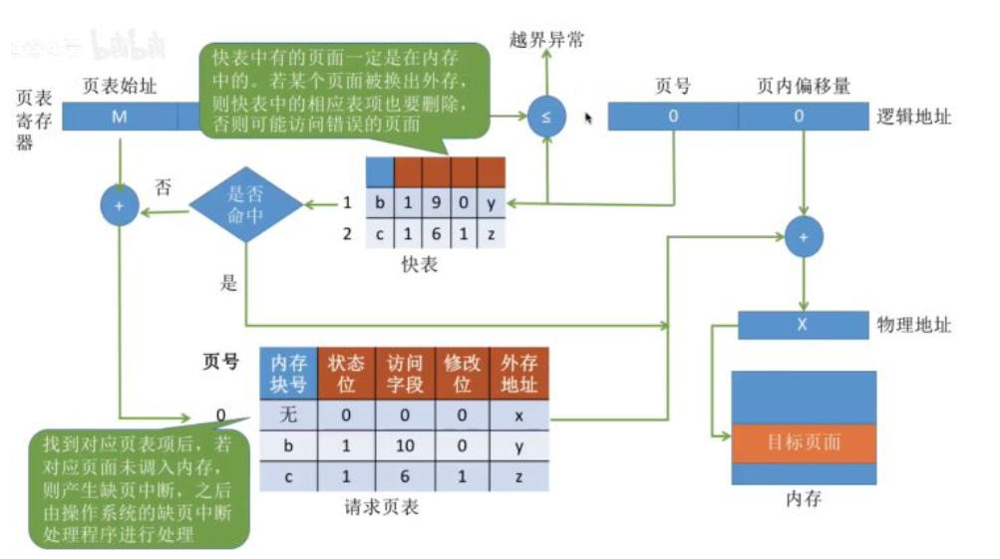

### 进程、线程、协程区别🐋🐋🌟🌟🌟🌟
1.  进程是CPU资源分配的基本单位，线程是独立运行和独立调度的基本单位（CPU上真正运行的是线程）。
2.  进程拥有自己的资源空间，一个进程包含若干个线程，线程与CPU资源分配无关，多个线程共享同一进程内的资源。
3.  线程的调度与切换比进程快很多。

线程有时被称为轻量级进程( Lightweight Process, LWP),是程序执行流的最小单元。一个标准的线程由线程ID、当前指令指针(PC)、寄存器集合和堆栈组成。

协程是一种用户态的轻量级线程。协程拥有自己的寄存器上下文和栈。

协程不是被操作系统内核所管理的，而是完全由程序所控制的，即在用户态执行。 这样带来的好处是：性能有大幅度的提升，因为不会像线程切换那样消耗资源。

虽然一个线程内的多个协程可以切换但是这多个协程是串行执行的，某个时刻只能有一个线程在运行，没法利用CPU的多核能力。

[参考](https://daimajiaoliu.com/daima/60b96a703431c09)

- 对资源的管理和保护要求高，不限制开销和效率时，使用多进程。
- 要求效率高，频繁切换时，资源的保护管理要求不是很高时，使用多线程。

### 堆和栈的区别
[参考](https://www.zhihu.com/question/19729973)
堆（heap）：用于动态分配内存，位于BSS和栈中间的地址区域，由程序员申请分配和释放。堆是从低地址位向高地址位增长，采用链式存储结构。频繁的malloc/free造成内存空间的不连续，会产生碎片。（经常问如何解决内存碎片？）当申请堆空间时库函数是按照一定的算法搜索可用的足够大的空间，因此堆的效率比栈要低的多。

栈(stack)： 由编译器自动释放，用来存放函数的参数值、局部变量等。每当一个函数被调用时，该函数的返回类型和一些调用的信息被存放到栈中，这个被调用的函数再为它的自动变量和临时变量在栈上分配空间。每调用一个函数一个新的栈就会被使用。栈区是从高地址位向低地址位增长的，是一块连续的内存区域，最大容量是由系统预先定义好的，申请的栈空间超过这个界限时会提示溢出。

### 进程切换与线程切换的区别？
每个进程都有自己的虚拟地址空间，进程内的所有线程共享进程的虚拟地址空间。

进程切换与线程切换的一个最主要区别就在于进程切换涉及到虚拟地址空间的切换而线程切换则不会。因为每个进程都有自己的虚拟地址空间，而线程是共享所在进程的虚拟地址空间的，因此同一个进程中的线程进行线程切换时不涉及虚拟地址空间的转换。

那么显然每个进程都有自己的页表，那么当进程切换后页表也要进行切换，页表切换后TLB就失效了，cache失效导致命中率降低，那么虚拟地址转换为物理地址就会变慢，表现出来的就是程序运行会变慢，而线程切换则不会导致TLB失效，因为线程线程无需切换地址空间，因此我们通常说线程切换要比较进程切换块，原因就在这里。

### 进程的状态转换

### 内存分段、分页

这两个技术都是**为了利用和管理好计算机的资源--内存**。在分段这个技术还没有出现之前，程序运行是需要从内存中分配出足够多的连续的内存，然后把整个程序装载进去。

问题：
1、地址空间不隔离
2、程序运行时候的地址不确定
3、内存使用率低下

分段：它把虚拟地址空间映射到了物理地址空间，并且你写的程序操作的是虚拟地址。

分页这个技术仍然是一种虚拟地址空间到物理地址空间映射的机制。但是，粒度更加的小了。单位不是整个程序，而是某个“页”，一段虚拟地址空间组成的某一页映射到一段物理地址空间组成的某一页。

分页这个技术，它的虚拟地址空间仍然是连续的，但是，每一页映射后的物理地址就不一定是连续的了。正是因为有了分页的概念，程序的换入换出就可以以页为单位了。

### 内存伙伴(Buddy)算法
是为了核心内存管理能够快速响应请求，尽可能地在提高内存利用率的同时减少内存碎片的一种算法。

在操作系统分配内存的过程中，一个内存块经常被分成两个大小相等的内存块，这两个大小相等的内存块就处于伙伴关系。它满足3个条件：两个块具有相同大小；物理地址是连续的；从同一个大块中拆分出来。

采用一位二进制数来表示它们的伙伴关系。当这个位为1，表示其中一块在使用；当这个位为0，表示两个页面块都空闲或者都在使用。

刚开始时，两个伙伴块都空闲，它们的伙伴位为0，如果其中一块被使用，异或后得1；如果另一块也被使用，异或后得0；如果前面一块回收了异或后得1；如果另一块也回收了异或后得0。

**缺点：**
一个系统中，对内存块的分配，大小是随机的，一片内存中仅一个小的内存块没有释放，旁边两个大的就不能合并。
如果所需内存大小不是2的幂次方，就会有部分页面浪费。比如原来是1024个块，申请了16个块，再申请600个块就申请不到了，因为已经被分割了。

### 用户态和内核态的区别🐋🌟🌟
[参考](https://blog.csdn.net/qq_27093465/article/details/106124309)
「当进程运行在内核空间时就处于内核态，而进程运行在用户空间时则处于用户态。」

在内核态下，进程运行在内核地址空间中，此时 CPU 可以执行任何指令。运行的代码也不受任何的限制，可以自由地访问任何有效地址，也可以直接进行端口的访问。

在用户态下，进程运行在用户地址空间中，被执行的代码要受到 CPU 的诸多检查，它们只能访问映射其地址空间的**页表项**中规定的在用户态下可访问页面的虚拟地址，且只能对任务状态段(TSS)中 I/O 许可位图(I/O Permission Bitmap)中规定的可访问端口进行直接访问。

用户态和内核态是操作系统的两种运行级别，两者最大的区别就是特权级不同。用户态拥有最低的特权级R3，内核态拥有较高的特权级R0。运行在用户态的程序不能直接访问操作系统内核数据结构和程序。

三种方式从用户态切换到内核态：系统调用、异常、外设(硬件)中断。
所有的系统资源管理都是在内核空间中完成的。比如读写磁盘文件，分配回收内存，从网络接口读写数据等等。

### 为什么要区分用户态和内核态？
操作系统将虚拟地址空间划分为两部分，一部分为内核空间，另一部分为用户空间。内核空间被所有进程共享。

在 CPU 的所有指令中，有些指令是非常危险的，如果错用，将导致系统崩溃，比如清内存、设置时钟等。如果允许所有的程序都可以使用这些指令，那么系统崩溃的概率将大大增加。

所以，CPU 将指令分为特权指令和非特权指令，对于那些危险的指令，只允许操作系统及其相关模块使用，普通应用程序只能使用那些不会造成灾难的指令。

### 从用户态是怎么切换到核心态的？
[参考](https://www.jianshu.com/p/b5142bba3224)
- 系统调用：用户态进程通过系统调用申请使用操作系统提供的服务程序完成工作，而系统调用的机制其核心还是使用了操作系统为用户特别开放的一个中断来实现，例如Linux的int 80h中断。
- 异常：当CPU在执行运行在用户态下的程序时，发生了某些事先不可知的异常，这时会触发由当前运行进程切换到处理此异常的内核相关程序中，也就转到了内核态，比如缺页异常。
- 外围设备的中断：当外围设备完成用户请求的操作后，会向CPU发出相应的中断信号，这时CPU会暂停执行下一条即将要执行的指令转而去执行与中断信号对应的处理程序。

### 系统调用是什么
[参考](https://bbs.huaweicloud.com/blogs/198164)

### 线程和线程池的理解

线程池解决的核心问题就是资源管理问题。

线程池是指提前创建若干个线程，当有任务需要处理时，线程池里的线程就会处理任务，处理完成后的线程并不会被销毁，而是继续等待下一个任务。由于创建和销毁线程都是消耗系统资源的，所以，当某个业务需要频繁进行线程的创建和销毁时，就可以考虑使用线程池来提高系统的性能。

线程池的作用：
- 降低资源消耗。通过重复利用已经创建的线程，能够降低线程创建和销毁造成的消耗。
- 提高响应速度。当任务到达时，任务可以不需要等待线程的创建就能立即执行。
- 提高线程的可管理性。线程是稀缺资源，如果无限制地创建，不仅会消耗系统资源，还会降低系统的稳定性，使用线程池可以进行统一的分配，调优和监控。

一方面避免了处理任务时创建销毁线程开销的代价，另一方面避免了线程数量膨胀导致的过分调度问题，保证了对内核的充分利用。

### 线程间通信🐋
- wait/notify机制
- 管道通信就是使用java.io.PipedInputStream 和 java.io.PipedOutputStream进行通信

### 进程间通信🐋🌟🌟🌟
每个进程的用户地址空间都是独立的，一般而言是不能互相访问的，但内核空间是每个进程都共享的，所以进程之间要通信必须通过内核。

- 管道：管道传输数据是单向的。管道这种通信方式效率低，不适合进程间频繁地交换数据。
- 消息队列：消息队列是保存在内核中的消息链表。消息队列不适合比较大数据的传输，消息队列通信过程中，存在用户态与内核态之间的数据拷贝开销。
- 共享内存：共享内存的机制，就是拿出一块虚拟地址空间来，映射到相同的物理内存中。
- 信号量：用了共享内存通信方式，带来新的问题，那就是如果多个进程同时修改同一个共享内存，很有可能就冲突了。为了防止多进程竞争共享资源，而造成的数据错乱，所以需要保护机制，使得共享的资源，在任意时刻只能被一个进程访问。
- 信号：对于异常情况下的工作模式，就需要用「信号」的方式来通知进程。信号事件的来源主要有硬件来源（如键盘 Cltr+C ）和软件来源（如 kill 命令）。信号是进程间通信机制中**唯一的异步通信机制**，因为可以在任何时候发送信号给某一进程。
- Socket：前面提到的管道、消息队列、共享内存、信号量和信号都是在同一台主机上进行进程间通信，那要想**跨网络与不同主机上的进程**之间通信，就需要 Socket 通信了。
***
1.  **管道/匿名管道(Pipes)** ：用于具有亲缘关系的父子进程间或者兄弟进程之间的通信。
2.  **有名管道(Names Pipes)** : 匿名管道由于没有名字，只能用于亲缘关系的进程间通信。为了克服这个缺点，提出了有名管道。有名管道严格遵循**先进先出(first in first out)**。有名管道以磁盘文件的方式存在，可以实现本机任意两个进程通信。
3.  **信号(Signal)** ：信号是一种比较复杂的通信方式，用于通知接收进程某个事件已经发生；
4.  **消息队列(Message Queuing)** ：消息队列是消息的链表,具有特定的格式,存放在内存中并由消息队列标识符标识。管道和消息队列的通信数据都是先进先出的原则。与管道（无名管道：只存在于内存中的文件；命名管道：存在于实际的磁盘介质或者文件系统）不同的是消息队列存放在内核中，只有在内核重启(即，操作系统重启)或者显式地删除一个消息队列时，该消息队列才会被真正的删除。消息队列可以实现消息的随机查询,消息不一定要以先进先出的次序读取,也可以按消息的类型读取.比 FIFO 更有优势。**消息队列克服了信号承载信息量少，管道只能承载无格式字节流以及缓冲区大小受限等缺点。**
5.  **信号量(Semaphores)** ：信号量是一个计数器，用于多进程对共享数据的访问，信号量的意图在于进程间同步。这种通信方式主要用于解决与同步相关的问题并避免竞争条件。
6.  **共享内存(Shared memory)** ：使得多个进程可以访问同一块内存空间，不同进程可以及时看到对方进程中对共享内存中数据的更新。这种方式需要依靠某种同步操作，如互斥锁和信号量等。可以说这是最有用的进程间通信方式。
7.  **套接字(Sockets)** : 此方法主要用于在客户端和服务器之间通过网络进行通信。套接字是支持 TCP/IP 的网络通信的基本操作单元，可以看做是不同主机之间的进程进行双向通信的端点，简单的说就是通信的两方的一种约定，用套接字中的相关函数来完成通信过程。

### 信号有哪些
[参考](https://blog.csdn.net/GangStudyIT/article/details/80551912)
输入`kill -l`

### 共享内存怎么实现？🌟
为了让不同进程之间进行通信，需要让不同进程共享相同的物理内存。

两个步骤：
1. 创建共享内存。通过函数shmget()从内存中获取一块共享内存区域，该函数返回值为共享内存的ID。
2. 映射共享内存。通过函数shmat()将上一步获取的共享内存映射到具体的内存空间。

**先创建共享内存，再将共享内存映射到每个进程的地址空间中。**

### mmap
[参考](https://www.cnblogs.com/huxiao-tee/p/4660352.html)
mmap是一种内存映射文件的方法，即将一个文件或者其它对象映射到进程的地址空间，实现文件磁盘地址和进程虚拟地址空间中一段虚拟地址的一一对映关系。
实现这样的映射关系后，进程就可以采用指针的方式读写操作这一段内存，而系统会自动回写脏页面到对应的文件磁盘上，即完成了对文件的操作而不必再调用read,write等系统调用函数。相反，内核空间对这段区域的修改也直接反映用户空间，从而可以实现不同进程间的文件共享。

### 操作系统怎么申请内存？
[参考](https://blog.csdn.net/weixin_36145588/article/details/78363836)
1. 每个进程都有独立的虚拟地址空间，进程访问的虚拟地址并不是真正的物理地址； 
2. 虚拟地址可通过每个进程上的页表(在每个进程的内核虚拟地址空间)与物理地址进行映射，获得真正物理地址； 
3. 如果虚拟地址对应物理地址不在物理内存中，则产生缺页中断，真正分配物理地址，同时更新进程的页表；如果此时物理内存已耗尽，则根据内存替换算法淘汰部分页面至物理磁盘中。 

当一个进程发生缺页中断的时候，进程会陷入内核态，执行以下操作： 
1. 检查要访问的虚拟地址是否合法 
2. 查找/分配一个物理页 
3. 填充物理页内容（读取磁盘，或者直接置0，或者啥也不干） 
4. 建立映射关系（虚拟地址到物理地址） 
重新执行发生缺页中断的那条指令 
如果第3步，需要读取磁盘，那么这次缺页中断就是majflt，否则就是minflt。 

从操作系统角度来看，进程分配内存有两种方式，分别由两个系统调用完成：brk和mmap（不考虑共享内存）。
1. malloc小于128k的内存，使用brk分配内存，将_edata往高地址推(只分配虚拟空间，不对应物理内存(因此没有初始化)，第一次读/写数据时，引起内核缺页中断，内核才分配对应的物理内存，然后虚拟地址空间建立映射关系)
2.  默认情况下，malloc函数分配内存，如果请求内存大于128K（可由M_MMAP_THRESHOLD选项调节），那就不是去推_edata指针了，而是利用mmap系统调用，从堆和栈的中间分配一块虚拟内存。
	**原因：** brk分配的内存需要等到高地址内存释放以后才能释放（例如，在B释放之前，A是不可能释放的，这就是内存碎片产生的原因），而mmap分配的内存可以单独释放。

### 缺页中断
硬性页缺失是指相关的页在页缺失发生时未被加载进内存的情况。这时操作系统需要：
1. 寻找到一个空闲的页。或者把另外一个使用中的页写到磁盘上（如果其在最后一次写入后发生了变化的话），并注销在MMU内的记录
2. 将数据读入被选定的页
3. 向MMU注册该页

### 内存空间

为了充分利用和管理系统内存资源，Linux采用虚拟内存管理技术，利用虚拟内存技术让每个进程都有4GB 互不干涉的虚拟地址空间。

进程初始化分配和操作的都是基于这个「虚拟地址」，只有当进程需要实际访问内存资源的时候才会建立虚拟地址和物理地址的映射，调入物理内存页。

不管是用户空间还是内核空间，使用的地址都是虚拟地址，当需进程要实际访问内存的时候，会由内核的「请求分页机制」产生「缺页异常」调入物理内存页。

一个程序的内存空间：
- 代码段： 只读，可共享;用来存放程序执行代码的一块内存区域。
- 数据段：储存已被初始化了的静态数据。
- BSS段：用来存放程序中未初始化的全局变量的一块内存区域。如果一个全局变量没有被初始化（或被初始化为0），那么他就存放在bss段；如果一个全局变量被初始化为非0，那么他就被存放在data段。
- 堆：用于存放进程运行中被动态分配的内存段，它的大小并不固定，可动态扩张或缩减。
- 栈：栈用于维护函数调用的上下文。

[虚拟内存参考，重点关注](https://zhuanlan.zhihu.com/p/367915663)

### 中断的处理和恢复
中断是一种使CPU中止正在执行的程序而转去处理特殊事件的操作，这些引起中断的事件称为中断源，它们可能是来自外设的输入输出请求，也可能是计算机的一些异常事故或其它内部原因。

[中断与中断处理过程](https://www.cnblogs.com/jdksummer/articles/2687265.html)
[中断及中断处理程序](https://blog.csdn.net/qq_28877125/article/details/72783433)

中断向量表每项的四个字节存放着该项对应中断的中断处理程序的入口地址。
软中断被响应后，CPU进入中断响应周期。CPU将中断类型号乘以4，得到中断向量表的入口地址，并执行一下动作：
（1）将标志寄存器压入堆栈。
（2）用清中断标志（IF）和单步标志（TF）禁止硬件中断，即关中断。
（3）将当前代码**段寄存器**的内容（CS）压栈。
（4）将当前**指令指针**（IP）压栈。
（5）转向中断服务程序入口并将控制交给中断服务程序。
在中断服务程序执行完后，即CPU接收到IRET指令时，它又将产生以下步骤：弹出IP和CS，恢复标志寄存器。

### 程序编译的过程
- 预处理阶段：编译器将C程序的头文件编译进来，还有宏的替换。
- 编译：这个阶段编译器主要做词法分析、语法分析、语义分析等，在检查无错误后后，把代码翻译成汇编语言。
- 汇编阶段得到机器语言
- 链接：printf函数存在于一个名为printf.o的单独预编译目标文件中。必须得将其并入到hello.o的程序中，链接器就是负责处理这两个的并入，结果得到hello文件，它就是一个可执行的目标文件。

### 逻辑地址和物理地址的转换
分页系统地址结构：前一部分为页号P，后一部分为偏移量W，即页内地址。

1. 根据逻辑地址计算出页号和页内偏移量
2. 判断页号是否越界
3. 查询页表，找到页号对应的页表项，确定页面
4. 用内存块号和页内偏移量得到物理地址
5. 访问目标内存单元

### 固态硬盘和机械硬盘的区别
机械硬盘内部有一个旋转的金属盘，上面有磁性涂层。数据就存储在这些盘片上，并通过安装在控制器上的磁头进行读取。这些磁头在相应的盘片上物理的寻找区域，这意味着，机械硬盘需要花费相当长的时间来保存和检索数据。

固态硬盘使用的是更简单的设计，它有一堆NAND闪存颗粒来存储数据。并且，与另一种流行的闪存存储技术即DRAM不同，NAND闪存颗粒是较为稳定的，这意味着NAND闪存即使在断电的情况下，也能保留电荷，从而保留数据。

### 匿名管道和命名管道如何生成？
[使用管道完成进程间通信](https://www.cnblogs.com/lfri/p/12696572.html)

### 线程同步有哪几种方式？
[参考](https://www.cnblogs.com/Terry-Wu/p/10788663.html)
- 有synchronized关键字修饰的方法
- 有synchronized关键字修饰的语句块
- 使用特殊域变量(volatile)实现线程同步
- ReentrantLock
- 使用ThreadLocal管理变量，则每一个使用该变量的线程都获得该变量的副本
- 使用LinkedBlockingQueue<\E>（阻塞队列）来实现线程的同步 

### 共享内存的原理
为了实现在多个进程间高效的数据通信，linux内核特地留下一块内存区，该内存区能够被需要的进程映射到自身的内存空间。因此，进程便能够直接对这块内存区进行读写操作。

1. 要使用共享内存，首先需要使用 shmget() 函数获取共享内存；
2. 需要调用 shmat() 函数把共享内存关联到某个虚拟内存地址上；

### 什么是死锁，死锁产生的条件🐋🌟🌟
死锁是指两个或多个进程在执行的过程中，因为竞争资源而造成互相等待的现象，若无外力作用，它们都无法推进下去。

1. 互斥：一个资源每次只能被一个进程使用。
2. 请求与保持：一个进程因请求资源而阻塞时，对已获得的资源保持不放。
3. 不剥夺：进程已获得的资源，在末使用完之前，不能强行剥夺。
4. 循环等待：若干进程之间形成一种头尾相接的循环等待资源关系。

### 解除死锁的方式🌟🌟🌟
[参考](https://zhuanlan.zhihu.com/p/61221667)
主要有三种方式：
-   死锁防止
-   死锁避免
-   死锁检测和恢复

**死锁防止：**
在程序运行之前防止发生死锁，死锁防止的策略就是至少破坏这四个条件其中一项。
破坏【请求与保持】：采用静态分配的方式，静态分配的方式是指进程必须在执行之前就申请需要的全部资源，且直至所要的资源全部得到满足后才开始执行。

破坏【不剥夺条件】：方法一：占有资源的进程若要申请新资源，必须主动释放已占有资源，若需要此资源，应该向系统重新申请。方法二：资源分配管理程序为进程分配新资源时，若有则分配；否则将剥夺此进程已占有的全部资源，并让进程进入等待资源状态，资源充足后再唤醒它重新申请所有所需资源。

破坏【循环等待条件】：给系统的所有资源编号，规定进程请求所需资源的顺序必须按照资源的编号依次进行。

**死锁避免：**
银行家算法：算法要做的是判断对请求的满足是否会进入不安全状态，如果是，就拒绝请求；否则予以分配。

**死锁检测和恢复：**
不试图阻止死锁，而是当检测到死锁发生时，采取措施进行恢复。
判断**资源分配图**是否可以简化，不可以说明产生死锁。

死锁恢复：
- 资源剥夺法：剥夺陷于死锁的进程所占用的资源，但并不撤销此进程，直至死锁解除。
- 进程回退法：根据系统保存的检查点让所有的进程回退，直到足以解除死锁，这种措施要求系统建立保存检查点、回退及重启机制。
- 进程撤销法  
	- 撤销陷入死锁的所有进程，解除死锁，继续运行。
	- 逐个撤销陷入死锁的进程，回收其资源并重新分配，直至死锁解除。
- 系统重启法：结束所有进程的执行并重新启动操作系统。这种方法很简单，但先前的工作全部作废，损失很大。

***
[参考](https://blog.csdn.net/qq_27068845/article/details/78818381)
**预防死锁**
- 资源一次性分配：破坏请求和保持条件。当某个资源只在进程结束时使用一小会，那么在进程运行期间，这个资源都被占用，资源利用率很低。比较好的方法是，进程开始时，只申请和使用进程启动的资源，在运行过程中不断申请新的资源，同时释放已经使用完的资源。
- 可剥夺资源：当进程新申请的资源不满足时，释放已经分配的资源。破坏不可剥夺条件。在使用某些资源，比如打印机时，当强制剥夺已分配资源的时候，会导致打印机资源打印的信息不连续的问题。
- 资源有序分配：系统给进程编号，按某一顺序申请资源，释放资源则反序释放。破坏循环等待条件。

**避免死锁**
银行家算法：分配资源前先评估风险，会不会在分配后导致死锁。即分配给一个进程资源的时候，该进程能否全部返还占用的资源。

**检测死锁**
建立资源分配表和进程等待表。

**解除死锁**
从其他进程强制剥夺资源给死锁进程。
可以直接撤销死锁进程，或撤销代价最小的进程。

### 银行家算法【死锁避免】具体实现
[参考例子](https://www.cnblogs.com/wkfvawl/p/11929508.html)
安全序列：序列中的每一个进程$P_i$到运行完成尚需的资源量不超过系统当前剩余的资源量与所有在序列中排在它前面的进程当前所占有的资源量之和。

银行家算法的实质就是要设法保证系统动态分配资源后不进入不安全状态，以避免可能产生的死锁。即没当进程提出资源请求且系统的资源能够满足该请求时，系统将判断满足此次资源请求后系统状态是否安全，如果判断结果为安全，则给该进程分配资源，否则不分配资源，申请资源的进程将阻塞。

1. 判断当前时刻是否是安全状态：

找出小于available的need进程先执行，执行完后释放资源，available += max，然后继续判断其他进程。
max【进程需要的资源】 = allocation + need

2. 资源分配时，要同时满足：request小于need，request小于available
3. 修改available，need，allocation的值，继续做安全性检查，不安全就撤销分配，阻塞提出申请的进程

### 操作系统是怎么保证缓存一致性的？

多个线程并发访问同一个共享变量的时候，这些线程的执行处理器上的高速缓存各自都会保留一份该共享变量的副本，这就带来一个问题一个处理器对其副本数据进行更新之后，其他处理器如何“察觉”到该更新并做出适当反应，以确保这些处理器后续读取该共享变量时能够读取到这个更新，这就是缓存一致性问题。

总线琐：当一个 CPU 核执行一个线程对其缓存中的数据进行操作的时候，它会向总线上发送一个 Lock 信号，此时其他的线程想要去请求主内存的时候，就会被阻塞，这样该处理器核心就可以独享这个共享内存。

缓存琐：如果某个内存区域数据，已经同时被两个或以上处理器核缓存，缓存锁就会通过缓存一致性机制阻止对其修改，以此来保证操作的原子性，当其他处理器核回写已经被锁定的缓存行的数据时会导致该缓存行无效。

**一致性协议MESI**
在 CPU 缓存中保存一个标记位，以此来标记四种状态：
1. Modified(更改过的，记为 M)：处于这一状态的数据，只在本 CPU 核中有缓存数据，而其他核中没有。同时其状态相对于内存中的值来说，是已经被修改的，只是没有更新到内存中。
2. Exclusive(独占的，记为 E)：处于这一状态的数据，只有在本 CPU 中有缓存，且其数据没有修改，即与内存中一致。
3. Shared(共享的，记为s)：处于这一状态的数据在多个 CPU 中都有缓存，且与内存一致。
4. Invalid(无效的，记为I)：本 CPU 中的这份缓存已经无效。

CPU的读取会遵循几个原则(其实就是上面说的嗅探)：
1.  一个处于 M 状态的缓存行，必须时刻监听所有试图读取该缓存行对应的主存地址的操作，如果监听到，则必须在此操作执行前把其缓存行中的数据写回 CPU。
2.  一个处于 S 状态的缓存行，必须时刻监听使该缓存行无效或者独享该缓存行的请求，如果监听到，则必须把其缓存行状态设置为 I。
3.  一个处于 E 状态的缓存行，必须时刻监听其他试图读取该缓存行对应的主存地址的操作，如果监听到，则必须把其缓存行状态设置为 S。  

当 CPU 需要读取数据时，如果其缓存行的状态是 I 的，则需要从内存中读取，并把自己状态变成 S，如果不是 I，则可以直接读取缓存中的值，但在此之前，必须要等待其他 CPU 的监听结果，如其他 CPU 也有该数据的缓存且状态是 M，则需要等待其把缓存更新到内存之后，再读取。

当 CPU 需要写数据时，只有在其缓存行是 M 或者 E 的时候才能执行，否则需要发出特殊的 RFO 指令(Read Or Ownership，这是一种总线事务)，通知其他 CPU 置缓存无效(I)，这种情况下性能开销是相对较大的。在写入完成后，修改其缓存状态为 M。

**简化思路：**
-   如果 CPU1 修改了某个共享变量的数据，需要广播给其他 CPU
-   缓存中没有这个数据的 CPU 直接丢弃这个广播消息，无需处理
-   缓存中有这个数据的 CPU 监听到广播后，将相应的 cache line 置为 invalid 状态
-   当这些 CPU 下次读取这个数据时发现缓存行失效就去内存读取

[缓存一致性问题和MESI协议](https://www.jianshu.com/p/26dc7a6ddd1f)
[缓存一致性协议硬核讲解](https://zhuanlan.zhihu.com/p/375706879)

### [Linux同步IO和异步IO，阻塞IO和非阻塞IO](https://cloud.tencent.com/developer/article/1684951)
-   同步IO：导致请求进程阻塞，直到I/O操作完成。
-   异步IO：不导致请求进程阻塞。

阻塞IO：进程发起IO系统调用后，进程被阻塞，转到内核空间处理，整个IO处理完毕后返回进程。操作成功则进程获取到数据。

非阻塞IO：进程发起IO系统调用后，如果内核缓冲区没有数据，需要到IO设备中读取，进程返回一个错误而不会被阻塞；进程发起IO系统调用后，如果内核缓冲区有数据，内核就会把数据返回进程。

同步IO在数据拷贝到应用缓冲区期间进程阻塞，前四个都是同步IO。

### [操作系统fork进程的具体流程](https://www.jianshu.com/p/484af1700176)
 一个进程调用fork（）函数后，系统先给新的进程分配资源，例如存储数据和代码的空间。然后把原来的进程的所有值都复制到新的新进程中，只有少数值与原来的进程的值不同。fork只拷贝下一个要执行的代码到新的进程。

在fork函数执行完毕后，如果创建新进程成功，则出现两个进程，一个是子进程，一个是父进程。在子进程中，fork函数返回0，在父进程中，fork返回新创建子进程的进程ID。我们可以通过fork返回的值来判断当前进程是子进程还是父进程。

### 父进程的文件描述符和子进程共享吗
通过fork（）创建子进程时，子进程继承父进程环境和上下文的大部分内容的拷贝，其中就包括文件描述符表。
（1）对于父进程在fork（）之前打开的文件来说，子进程都会继承，与父进程共享相同的文件偏移量。
（2）相反，如果父进程先进程fork，再打开my.dat，这时父子进程关于my.dat 的文件描述符表指向不同的系统文件表条目，也不再共享文件偏移量。

### 文件描述符具体是什么东西？
文件描述符在形式上是一个非负整数。实际上，它是一个索引值，指向内核为每一个进程所维护的该进程打开文件的记录表。当程序打开一个现有文件或者创建一个新文件时，内核向进程返回一个文件描述符。

### [讲一讲CPU](https://juejin.cn/post/6999663181291323423)
计算机的构成元件中，根据程序的指令来进行数据运算，并控制整个计算机的设备称作CPU。CPU的内部由寄存器、控制器、运算器和时钟四个部分组成，各个部分之间由电流信号相互连通。

- **寄存器**可用来暂存指令数据等处理对象，可以将其看作内存的一种。一个CPU内部会有20~100个寄存器。
- **控制器**负责把内存上的指令、数据等读入寄存器，并根据指令的执行结果来控制整个计算机。
- **运算器**负责运算从内存读入寄存器的数据。
- **时钟**负责发出CPU开始计时的时钟信号。

### [讲一讲 Cache 的结构，以及 L1、L2、L3 Cache](https://nieyong.github.io/wiki_cpu/CPU%E4%BD%93%E7%B3%BB%E6%9E%B6%E6%9E%84-Cache.html)
-   L1缓存分成两种，一种是指令缓存，一种是数据缓存。L2缓存和L3缓存不分指令和数据。在L1缓存中，有一个叫做Cache line的东西。 他表示cpu从一级缓存读取数据的最小单位。
-   L1和L2缓存在每一个CPU核中，L3则是所有CPU核心共享的内存。
-   L1、L2、L3的越离CPU近就越小，速度也就越快，越离CPU远，速度也越慢。

**cahce line是cache与主存之间进行数据交换的基本单位**。

**Cache映射方式**

直接映射：每个固定的cache line只能映射有共同特征的主存行，例如采用取模方式的映射方式。
全相联：
组相联：

1. 匹配组。蓝色的9bit选择某一个组（一共512个组，9bit表示完）；
2. 匹配路。匹配是上一步选定的组中的哪一路。在这里，有两种选择路的方式：index类型和hit类型。
3. 匹配tag头。将红色部分的虚拟地址（VA）转化成物理地址（PA），转化的物理地址和tag头中的匹配，那么就认为该地址处的值在Cache中存在，也就命中（hit）Cache。如果不匹配，那么就认为该指令在Cache中不存在，未命中（miss），此时就需要到内存中取指令。
4. 匹配指令位置。通过上面三步，已经找到Cache中的某一行了。但是一行中有16个字节，应该取那一个（或者连续几个）呢？黑色的4bit来确定。

### 知道 C、C++ 上 volatile 的实现吗？

### 内存屏障如何将缓存脏数据刷到主存的？
[volatile底层原理：从CPU架构到内存屏障之旅](https://juejin.cn/post/7070091066044579876)

1.  多个处理共用一个主内存，主内存访问速度太慢，于是引入高速缓存，以缓存行为单位。
2.  由于处理器在各自的高速缓存保存了一份共享变量的副本，产生了缓存一致性问题，于是在处理器层面引入了缓存一致性协议（Cache Coherence Protocol）。
3.  MESI 协议解决了缓存一致性问题，但自身存在性能缺陷：阻塞。
-   例如，如果 CPU0 发生 LW 时，首先会发 Invalidate 消息给到其他缓存了该数据的 CPU1，并且要等待 CPU1 的确认回执。CPU0 在这段时间内都会处于阻塞状态。
-   为了解决该问题，硬件设计者引入了写缓冲区Store Buffer 和失效队列 Invalidate Queue：
    -   **写缓冲区 Store Buffer**：每个处理器都有各自的写缓冲区。不用等待其他 CPU 的 Invalidate 确认回执，直接写入 Store Buffer，避免写阻塞。
    -   **失效队列 Invalidate Queue**：处理器收到 Invalidate 消息之后，并不立即 Invalidate Cache Line（这部操作相对较耗时），而是马上将消息入队，同时发送确认回执，之后再处理这些消息，和 Store Buffer 结合通过异步的方式减少了写操作的等待时间，解决了 CPU 阻塞的性能问题。
4.  写缓冲区和无效队列的引入又会带来新问题：内存重排序和可见性问题。
-   内存重排序：写缓冲区和失效队列都可能导致内存重排序。
    -   多线程场景下，内存重排序可能导致线程安全问题，造成线程间可见性问题。
5.  为了解决内存重排序和可见性问题，处理器引入内存屏障机制，提供内存屏障指令给软件层去调用
6.  以上是CPU 硬件层面，JVM 软件层面则是通过 lock 前缀指令来调用硬件层内存屏障指令
7.  在 Java 中可以通过对共享变量增加 volatile 修饰符来实现
-   JVM 会对 volatile 共享变量的读写操作添加 lock 前缀指令

### [CPU的原子操作](https://www.debugger.wiki/article/html/1607048280283786)
[参考](https://blog.csdn.net/qq_41184981/article/details/113832739)
586之前的CPU, 会通过LOCK锁总线的形式来实现原子操作。686开始则提供了存储一致性(Cache coherence),  这是多处理的基础, 也是原子操作的基础。

由于CPU对缓存的管理是以CacheLine为单位的, 所以在一个CacheLine内load/store实际上都是原子的。

“缓存锁定”指当发生共享内存的锁定，处理器不会在总线上声言LOCK#信号，而是修改内存地址，并通过缓存一致性机制保证原子性。

### [内存屏障分哪几种？](https://juejin.cn/post/7070091066044579876#heading-17)
1. LoadLoad屏障：对于这样的语句Load1; LoadLoad; Load2，在Load2及后续读取操作要读取的数据被访问前，保证Load1要读取的数据被读取完毕。【确保了 CPU1 在读该共享变量前先处理掉失效队列里的失效消息，及时将该共享变量置为失效（删除高速缓存中的副本），之后 CPU1才会重新去主内存读取最新的共享变量值，确保了可见性。】
2. StoreStore屏障：对于这样的语句Store1; StoreStore; Store2，在Store2及后续写入操作执行前，保证Store1的写入操作对其它处理器可见。【StoreStore 屏障会将写缓冲区中现有的 Entry 做标记，表示这些 Entry的写操作要先于屏障之后的写操作被提交。】
3. LoadStore屏障：对于这样的语句Load1; LoadStore; Store2，在Store2及后续写入操作被刷入主存前，保证Load1要读取的数据被读取完毕。
4. StoreLoad屏障：对于这样的语句Store1; StoreLoad; Load2，在Load2及后续所有读取操作执行前，保证Store1的写入对所有处理器可见。【实际作用就是墙左边的写操作会被立即刷入主存，墙之后的读操作会从主存读最新的值。从而保证了可见性。】

volatile 具体是通过以下内存屏障策略，防止指令重排：

-   在 **volatile 写操作之前**，插入 **StoreStore 屏障**，保证当前 volatile 变量的写操作不会和之前的写操作重排序。（之前的写操作会先刷入主内存，这样 volatile 变量的写操作自然不会和前面重排序了）
-   在 **volatile 写操作之后**，插入 **StoreLoad 屏障**，保证当前 volatile 变量的写操作不会和之后的读操作冲排序。（确保当前的 volatile 变量写操作会先于后面的读操作被强刷入主内存）

-   在 volatile 读操作之后，插入 **LoadLoad 屏障、 LoadStore 屏障，** 保证当前 volatile 变量的读操作不会和之后的读、写操作重排序。

在Java 中是通过对共享变量增加 volatile 修饰符来插入内存屏障的：有了这个关键字，JVM 会在汇编层面会生层增加一个 lock 前缀指令来调用 CPU 层的内存屏障指令。

### [多级页表](https://blog.51cto.com/u_15352922/3742181)
优点：如果地址空间中大部分地址都没有使用，你不必为每一个index准备一个条目。

假定页大小是4K，32位地址总线进程地址空间大小为(2^32)4G，这时候页表项有 4G / 4K = 1048576个，每个页表项为一个地址，占用4字节，1048576 * 4(B) /1024(M) = 4M，也就是说一个程序啥都不干，页表大小就得占用4M。如果每个页表项都存在对应的映射地址那也就算了，但是，绝大部分程序仅仅使用了几个页，也就是说，只需要几个页的映射就可以了，如下图，进程1的页表，只用到了0,1,1024三个页，剩下的1048573页表项是空的，这就造成了巨大的浪费，为了避免内存浪费，计算机系统开发人员想出了一个方案，多级页表。

**书上的解释**
32位的虚拟地址空间有超过100挽个页面，实际上只需要一个顶级页表，三个二级页表。

### 虚拟内存
当程序引用到一部分在物理内存中的地址空间时，由硬件执行必要的映射，当程序引用到一部分不在物理内存的地址空间时，由操作系统负责将缺失的部分装入物理内存并重新执行失败的指令。

在实际的硬件中，用一个“在/不在”记录页面【虚拟内存的页面】在内存【物理磁盘的页框】中的实际存在情况。

输入的16位虚拟地址被分为4位页号和12位偏移量。4位页号可以表示16个页面，12位偏移可以为一页内的全部4096个字节编址。最后形成的是单个物理地址。

### 进程的状态🌟
[参考](https://blog.csdn.net/pange1991/article/details/53860651)
1. **创建状态(new)** ：进程正在被创建，尚未到就绪状态。
2. 就绪状态(ready) ：进程已处于准备运行状态，即进程获得了除了处理器之外的一切所需资源，一旦得到处理器资源(处理器分配的时间片)即可运行。
3. 运行状态(running) ：进程正在处理器上上运行(单核CPU下任意时刻只有一个进程处于运行状态)。
4. **阻塞状态(waiting)** ：又称为等待状态，进程正在等待某一事件而暂停运行如等待某资源为可用或等待 IO 操作完成。即使处理器空闲，该进程也不能运行。
5. **结束状态(terminated)** ：进程正在从系统中消失。可能是进程正常结束或其他原因中断退出运行。

### 线程状态
1. 初始(NEW)：新创建了一个线程对象，但还没有调用start()方法。
2. 运行(RUNNABLE)：Java线程中将就绪（ready）和运行中（running）两种状态笼统的称为“运行”。
线程对象创建后，其他线程(比如main线程）调用了该对象的start()方法。该状态的线程位于可运行线程池中，等待被线程调度选中，获取CPU的使用权，此时处于就绪状态（ready）。就绪状态的线程在获得CPU时间片后变为运行中状态（running）。
3. 阻塞(BLOCKED)：表示线程阻塞于锁。
4. 等待(WAITING)：进入该状态的线程需要等待其他线程做出一些特定动作（通知或中断）。
5. 超时等待(TIMED_WAITING)：该状态不同于WAITING，它可以在指定的时间后自行返回。
6. 终止(TERMINATED)：表示该线程已经执行完毕。

### 进程调度算法
[参考](https://zhuanlan.zhihu.com/p/356089708)
- 先来先服务调度算法
- 最短作业优先调度算法
- 高响应比优先调度算法：(等待时间+要求服务时间)/要求服务时间
- 时间片轮转调度算法
- 最高优先级调度算法
- 多级反馈队列调度算法
***
[参考](https://blog.csdn.net/xy_cpp/article/details/79459237)
- 时间片轮转调度算法（RR）：给每个进程固定的执行时间，根据进程到达的先后顺序让进程在单位时间片内执行，执行完成后便调度下一个进程执行，时间片轮转调度不考虑进程等待时间和执行时间，属于抢占式调度。优点是兼顾长短作业；缺点是平均等待时间较长，上下文切换较费时。适用于分时系统。
- 先来先服务调度算法（FCFS）：根据进程到达的先后顺序执行进程，不考虑等待时间和执行时间，会产生饥饿现象。属于非抢占式调度，优点是公平，实现简单；缺点是不利于短作业。
- 优先级调度算法（HPF）：在进程等待队列中选择优先级最高的来执行。常被用于批处理系统中，还可用于实时系统中。
- 多级反馈队列调度算法：将时间片轮转与优先级调度相结合，把进程按优先级分成不同的队列，先按优先级调度，优先级相同的，按时间片轮转。优点是兼顾长短作业，有较好的响应时间，可行性强，适用于各种作业环境。
- 高响应比优先调度算法：根据“响应比=（进程执行时间+进程等待时间）/ 进程执行时间”这个公式得到的响应比来进行调度。高响应比优先算法在等待时间相同的情况下，作业执行的时间越短，响应比越高，满足段任务优先，同时响应比会随着等待时间增加而变大，优先级会提高，能够避免饥饿现象。优点是兼顾长短作业，缺点是计算响应比开销大，适用于批处理系统。

### 上下文切换的过程？🐋
[参考](https://cloud.tencent.com/developer/article/1710837)
进程上下文切换主要涉及到两部分主要过程：进程地址空间切换和处理器状态切换。

**进程地址空间切换：**
将即将执行的进程的页全局目录的物理地址设置到页表基址寄存器。地址空间切换过程中，还会清空tlb，防止当前进程虚拟地址转化过程中命中上一个进程的tlb表项。

**处理器状态（硬件上下文）切换：**
将前一个进程的sp,pc等寄存器的值保存到一块内存上，然后将即将执行的进程的sp,pc等寄存器的值从另一块内存中恢复到相应寄存器中，恢复sp完成了进程内核栈的切换，恢复pc完成了指令执行流的切换。

### 线程上下文切换
[参考](https://juejin.cn/post/6844903615367217165#heading-7)
上下文是指某一时间点 CPU 寄存器和程序计数器的内容。

- 保存进程A的状态（寄存器和操作系统数据）；
- 更新PCB中的信息，对进程A的“运行态”做出相应更改；
- 将进程A的PCB放入相关状态的队列；
- 将进程B的PCB信息改为“运行态”，并执行进程B；
- B执行完后，从队列中取出进程A的PCB，恢复进程A被切换时的上下文，继续执行A；

### PCB中有哪些信息
- 进程id。系统中每个进程有唯一的id，在c语言中用pid_t类型表示，其实就是一个非负整数。
- 进程的状态，有就绪，运行，挂起，停止等状态
- 进程切换时需要保存和恢复的一些CPU寄存器
- 描述虚拟地址空间的信息
- 描述控制终端的信息
- 当前工作目录（Current Working Directory）
- umask掩码
- 文件描述符表，包含很多指向结构体的指针
- 和信号相关的信息
- 用户id和组id。
- 会话（Session）和进程组
- 进程可以使用的资源上限（Resource Limit）

### 什么场景会导致线程的上下文切换？

这种垃圾回收机制的使用有可能会导致 stop-the-world 事件的发生，这其实就是一种线程暂停行为。