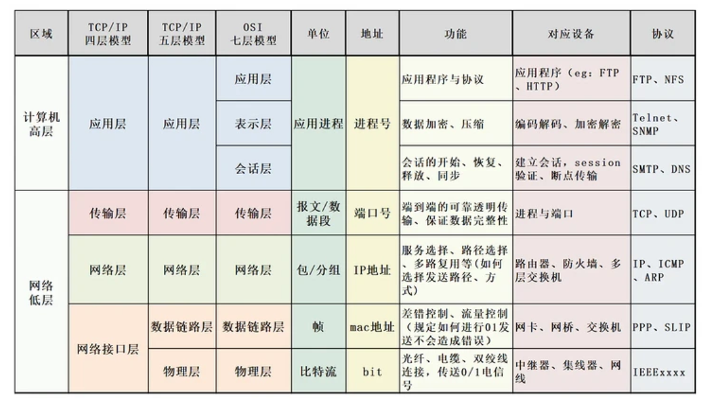
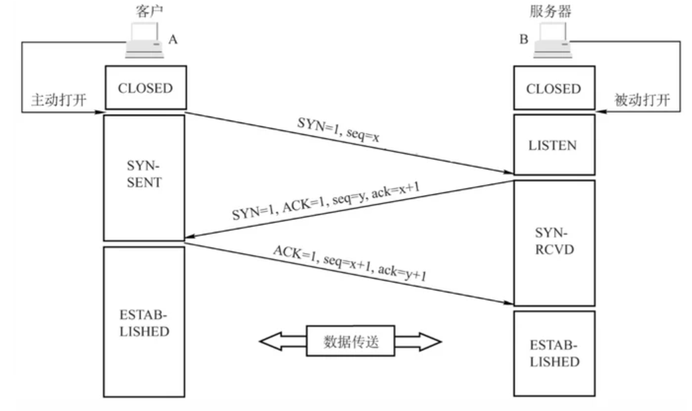
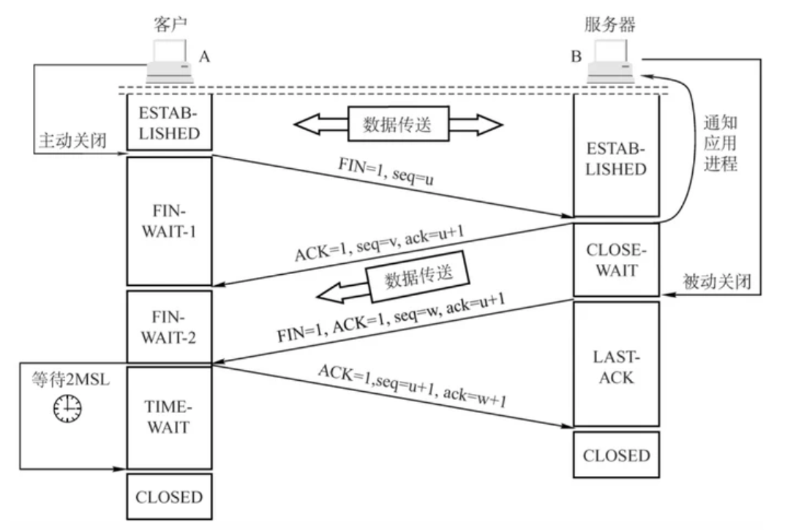
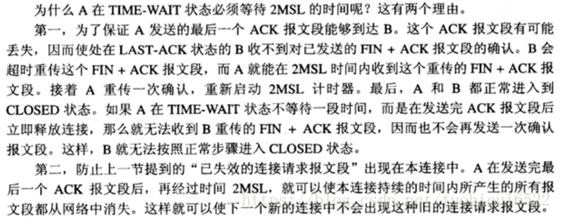
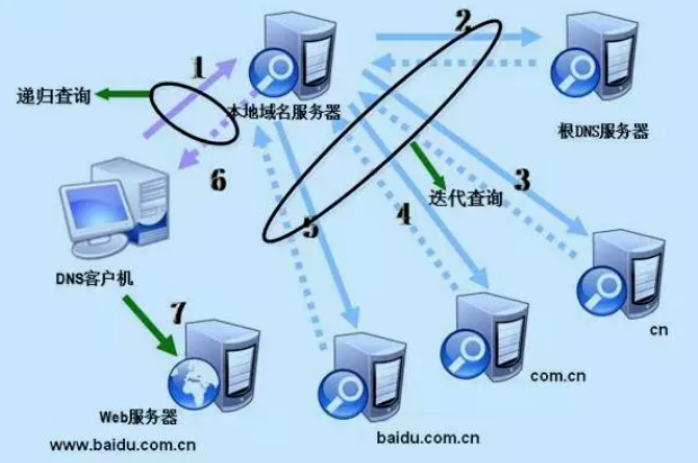
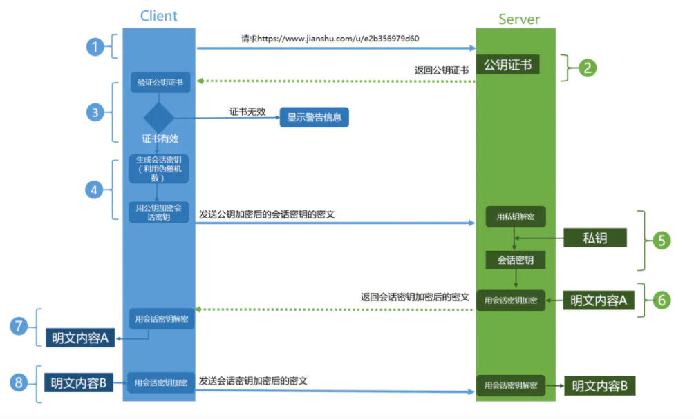

### 进程、线程、协程区别🐋🐋🌟🌟🌟🌟
1.  进程是CPU资源分配的基本单位，线程是独立运行和独立调度的基本单位（CPU上真正运行的是线程）。
2.  进程拥有自己的资源空间，一个进程包含若干个线程，线程与CPU资源分配无关，多个线程共享同一进程内的资源。
3.  线程的调度与切换比进程快很多。

线程有时被称为轻量级进程( Lightweight Process, LWP),是程序执行流的最小单元。一个标准的线程由线程ID、当前指令指针(PC)、寄存器集合和堆栈组成。

协程是一种用户态的轻量级线程。协程拥有自己的寄存器上下文和栈。

协程不是被操作系统内核所管理的，而是完全由程序所控制的，即在用户态执行。 这样带来的好处是：性能有大幅度的提升，因为不会像线程切换那样消耗资源。

虽然一个线程内的多个协程可以切换但是这多个协程是串行执行的，某个时刻只能有一个线程在运行，没法利用CPU的多核能力。

[参考](https://daimajiaoliu.com/daima/60b96a703431c09)

- 对资源的管理和保护要求高，不限制开销和效率时，使用多进程。
- 要求效率高，频繁切换时，资源的保护管理要求不是很高时，使用多线程。

### 用户态和内核态的区别🐋🌟🌟
[参考](https://blog.csdn.net/qq_27093465/article/details/106124309)
「当进程运行在内核空间时就处于内核态，而进程运行在用户空间时则处于用户态。」

在内核态下，进程运行在内核地址空间中，此时 CPU 可以执行任何指令。运行的代码也不受任何的限制，可以自由地访问任何有效地址，也可以直接进行端口的访问。

在用户态下，进程运行在用户地址空间中，被执行的代码要受到 CPU 的诸多检查，它们只能访问映射其地址空间的**页表项**中规定的在用户态下可访问页面的虚拟地址，且只能对任务状态段(TSS)中 I/O 许可位图(I/O Permission Bitmap)中规定的可访问端口进行直接访问。

用户态和内核态是操作系统的两种运行级别，两者最大的区别就是特权级不同。用户态拥有最低的特权级R3，内核态拥有较高的特权级R0。运行在用户态的程序不能直接访问操作系统内核数据结构和程序。

三种方式从用户态切换到内核态：系统调用、异常、外设(硬件)中断。
所有的系统资源管理都是在内核空间中完成的。比如读写磁盘文件，分配回收内存，从网络接口读写数据等等。

### 线程间通信🐋
- wait/notify机制
- 管道通信就是使用java.io.PipedInputStream 和 java.io.PipedOutputStream进行通信

### 进程间通信🐋🌟🌟🌟
每个进程的用户地址空间都是独立的，一般而言是不能互相访问的，但内核空间是每个进程都共享的，所以进程之间要通信必须通过内核。

- 管道：管道传输数据是单向的。管道这种通信方式效率低，不适合进程间频繁地交换数据。
- 消息队列：消息队列是保存在内核中的消息链表。消息队列不适合比较大数据的传输，消息队列通信过程中，存在用户态与内核态之间的数据拷贝开销。
- 共享内存：共享内存的机制，就是拿出一块虚拟地址空间来，映射到相同的物理内存中。
- 信号量：用了共享内存通信方式，带来新的问题，那就是如果多个进程同时修改同一个共享内存，很有可能就冲突了。为了防止多进程竞争共享资源，而造成的数据错乱，所以需要保护机制，使得共享的资源，在任意时刻只能被一个进程访问。
- 信号：对于异常情况下的工作模式，就需要用「信号」的方式来通知进程。信号事件的来源主要有硬件来源（如键盘 Cltr+C ）和软件来源（如 kill 命令）。信号是进程间通信机制中**唯一的异步通信机制**，因为可以在任何时候发送信号给某一进程。
- Socket：前面提到的管道、消息队列、共享内存、信号量和信号都是在同一台主机上进行进程间通信，那要想**跨网络与不同主机上的进程**之间通信，就需要 Socket 通信了。
***
1.  **管道/匿名管道(Pipes)** ：用于具有亲缘关系的父子进程间或者兄弟进程之间的通信。
2.  **有名管道(Names Pipes)** : 匿名管道由于没有名字，只能用于亲缘关系的进程间通信。为了克服这个缺点，提出了有名管道。有名管道严格遵循**先进先出(first in first out)**。有名管道以磁盘文件的方式存在，可以实现本机任意两个进程通信。
3.  **信号(Signal)** ：信号是一种比较复杂的通信方式，用于通知接收进程某个事件已经发生；
4.  **消息队列(Message Queuing)** ：消息队列是消息的链表,具有特定的格式,存放在内存中并由消息队列标识符标识。管道和消息队列的通信数据都是先进先出的原则。与管道（无名管道：只存在于内存中的文件；命名管道：存在于实际的磁盘介质或者文件系统）不同的是消息队列存放在内核中，只有在内核重启(即，操作系统重启)或者显式地删除一个消息队列时，该消息队列才会被真正的删除。消息队列可以实现消息的随机查询,消息不一定要以先进先出的次序读取,也可以按消息的类型读取.比 FIFO 更有优势。**消息队列克服了信号承载信息量少，管道只能承载无格式字节流以及缓冲区大小受限等缺点。**
5.  **信号量(Semaphores)** ：信号量是一个计数器，用于多进程对共享数据的访问，信号量的意图在于进程间同步。这种通信方式主要用于解决与同步相关的问题并避免竞争条件。
6.  **共享内存(Shared memory)** ：使得多个进程可以访问同一块内存空间，不同进程可以及时看到对方进程中对共享内存中数据的更新。这种方式需要依靠某种同步操作，如互斥锁和信号量等。可以说这是最有用的进程间通信方式。
7.  **套接字(Sockets)** : 此方法主要用于在客户端和服务器之间通过网络进行通信。套接字是支持 TCP/IP 的网络通信的基本操作单元，可以看做是不同主机之间的进程进行双向通信的端点，简单的说就是通信的两方的一种约定，用套接字中的相关函数来完成通信过程。

### 共享内存怎么实现？🌟
为了让不同进程之间进行通信，需要让不同进程共享相同的物理内存。

两个步骤：
1. 创建共享内存。通过函数shmget()从内存中获取一块共享内存区域，该函数返回值为共享内存的ID。
2. 映射共享内存。通过函数shmat()将上一步获取的共享内存映射到具体的内存空间。

**先创建共享内存，再将共享内存映射到每个进程的地址空间中。**

### 什么是死锁，死锁产生的条件🐋🌟🌟
死锁是指两个或多个进程在执行的过程中，因为竞争资源而造成互相等待的现象，若无外力作用，它们都无法推进下去。

1. 互斥：一个资源每次只能被一个进程使用。
2. 请求与保持：一个进程因请求资源而阻塞时，对已获得的资源保持不放。
3. 不剥夺：进程已获得的资源，在末使用完之前，不能强行剥夺。
4. 循环等待：若干进程之间形成一种头尾相接的循环等待资源关系。

### 解除死锁的方式🌟🌟🌟
[参考](https://zhuanlan.zhihu.com/p/61221667)
主要有三种方式：
-   死锁防止
-   死锁避免
-   死锁检测和恢复

**死锁防止：**
在程序运行之前防止发生死锁，死锁防止的策略就是至少破坏这四个条件其中一项。
破坏【请求与保持】：采用静态分配的方式，静态分配的方式是指进程必须在执行之前就申请需要的全部资源，且直至所要的资源全部得到满足后才开始执行。

破坏【不剥夺条件】：方法一：占有资源的进程若要申请新资源，必须主动释放已占有资源，若需要此资源，应该向系统重新申请。方法二：资源分配管理程序为进程分配新资源时，若有则分配；否则将剥夺此进程已占有的全部资源，并让进程进入等待资源状态，资源充足后再唤醒它重新申请所有所需资源。

破坏【循环等待条件】：给系统的所有资源编号，规定进程请求所需资源的顺序必须按照资源的编号依次进行。

**死锁避免：**
银行家算法：算法要做的是判断对请求的满足是否会进入不安全状态，如果是，就拒绝请求；否则予以分配。

**死锁检测和恢复：**
不试图阻止死锁，而是当检测到死锁发生时，采取措施进行恢复。
判断**资源分配图**是否可以简化，不可以说明产生死锁。

死锁恢复：
- 资源剥夺法：剥夺陷于死锁的进程所占用的资源，但并不撤销此进程，直至死锁解除。
- 进程回退法：根据系统保存的检查点让所有的进程回退，直到足以解除死锁，这种措施要求系统建立保存检查点、回退及重启机制。
- 进程撤销法  
	- 撤销陷入死锁的所有进程，解除死锁，继续运行。
	- 逐个撤销陷入死锁的进程，回收其资源并重新分配，直至死锁解除。
- 系统重启法：结束所有进程的执行并重新启动操作系统。这种方法很简单，但先前的工作全部作废，损失很大。

### 进程的状态🌟
[参考](https://blog.csdn.net/pange1991/article/details/53860651)

1. 初始(NEW)：新创建了一个线程对象，但还没有调用start()方法。
2. 运行(RUNNABLE)：Java线程中将就绪（ready）和运行中（running）两种状态笼统的称为“运行”。
线程对象创建后，其他线程(比如main线程）调用了该对象的start()方法。该状态的线程位于可运行线程池中，等待被线程调度选中，获取CPU的使用权，此时处于就绪状态（ready）。就绪状态的线程在获得CPU时间片后变为运行中状态（running）。
3. 阻塞(BLOCKED)：表示线程阻塞于锁。
4. 等待(WAITING)：进入该状态的线程需要等待其他线程做出一些特定动作（通知或中断）。
5. 超时等待(TIMED_WAITING)：该状态不同于WAITING，它可以在指定的时间后自行返回。
6. 终止(TERMINATED)：表示该线程已经执行完毕。

### 上下文切换的过程？🐋
[参考](https://cloud.tencent.com/developer/article/1710837)
进程上下文切换主要涉及到两部分主要过程：进程地址空间切换和处理器状态切换。

**进程地址空间切换：**
将即将执行的进程的页全局目录的物理地址设置到页表基址寄存器。地址空间切换过程中，还会清空tlb，防止当前进程虚拟地址转化过程中命中上一个进程的tlb表项。

**处理器状态（硬件上下文）切换：**
将前一个进程的sp,pc等寄存器的值保存到一块内存上，然后将即将执行的进程的sp,pc等寄存器的值从另一块内存中恢复到相应寄存器中，恢复sp完成了进程内核栈的切换，恢复pc完成了指令执行流的切换。

### epoll、select和poll的区别？🐋
[参考](https://segmentfault.com/a/1190000003063859)
在 select/poll中，进程只有在调用一定的方法后，内核才对所有监视的文件描述符进行扫描，而epoll事先通过epoll_ctl()来注册一个文件描述符，一旦基于某个文件描述符就绪时，内核会采用类似callback的回调机制，迅速激活这个文件描述符，当进程调用epoll_wait() 时便得到通知。

select的一个缺点在于单个进程能够监视的文件描述符的数量存在最大限制，在Linux上一般为1024，可以通过修改宏定义甚至重新编译内核的方式提升这一限制，但是这样也会造成效率的降低。

poll基于链表来存储的，没有最大连接数的限制。

epoll有EPOLLLT和EPOLLET两种触发模式，LT是默认的模式，ET是“高速”模式。LT模式下，只要这个fd还有数据可读，每次 epoll_wait都会返回它的事件，提醒用户程序去操作，而在ET（边缘触发）模式中，它只会提示一次，直到下次再有数据流入之前都不会再提示了，无论fd中是否还有数据可读。

### 计网五层模型🐋
物理层、数据链路层、网络层、传输层、应用层

**网络层作用，路由器位于那一层，网络层协议介绍几个**

[**网络层作用：**](https://blog.csdn.net/hanzhen7541/article/details/79030748)
1. 路由选择：对于每一个数据包给定最佳的路线，比如距离矢量算法和链路状态算法等等。
2. 存储、交换、转发：路由器中存在着路由表，路由表的作用是为路由器提供包的方向依据。路由器会根据每个到达包的目的地址来确定他应该向那个方向转发这个包。当路由器接收包的速度要小于它转发包的速度时候，他就会把暂时发送不了的包缓存在自己的缓冲区里面，直到前面的都发出去再将其发出去，这就是存储。
3. 拥塞控制
4. 呼叫准入
5. 包分类：据不同包确定优先级，优先转发高优先级的

[**网络层协议：**](https://leeyuxun.github.io/%E7%BD%91%E7%BB%9C%E5%B1%82%E3%80%81%E4%BC%A0%E8%BE%93%E5%B1%82%E3%80%81%E5%BA%94%E7%94%A8%E5%B1%82%E5%B8%B8%E7%94%A8%E5%8D%8F%E8%AE%AE.html)
1. IP协议：通过IP地址，保证了联网设备的唯一性，实现了网络通信的面向无连接和不可靠的传输功能。
2. ICMP协议：用于在IP主机、路由器之间传递控制消息。控制消息是指网络通不通、主机是否可达、路由是否可用等网络本身的消息。ICMP的主要作用是主机探测,路由维护,路由选择,流量控制。当遇到IP数据无法访问目标、IP路由器无法按当前的传输速率转发数据包等情况时，会自动发送ICMP消息。
3. IGMP协议：用来在ip主机和与其直接相邻的组播路由器之间建立、维护**组播组成员**关系。
4. ARP协议：把网络层32位的IP转换成数据链路层48位的MAC地址【ARP协议在TCP/IP模型中属于IP层（网络层），在OSI模型中属于链路层。】
5. RARP协议：和ARP协议做相反的工作，它是将48位的MAC地址转换为32位的IP地址

### OSI七层网络结构🌟
[一文读懂OSI七层模型与TCP/IP四层的区别/联系](https://blog.csdn.net/qq_39521554/article/details/79894501)
- 应用层：文件传输，电子邮件，文件服务，虚拟终端 TFTP，HTTP，SNMP，FTP，SMTP，DNS，Telnet
- 表示层：数据格式化，代码转换，数据加密 没有协议
- 会话层：解除或建立与别的接点的联系 没有协议
- 传输层：提供端对端的接口 TCP，UDP
- 网络层：为数据包选择路由 IP，ICMP，RIP，OSPF，BGP，IGMP
- 数据链路层：传输有地址的帧以及错误检测功能 SLIP，CSLIP，PPP，ARP，RARP，MTU
- 物理层：以二进制数据形式在物理媒体上传输数据 ISO2110，IEEE802，IEEE802.2

### TCP和UDP的区别🐋🐋🌟🌟🌟🌟
1. TCP面向连接（如打电话要先拨号建立连接）;UDP是无连接的，即发送数据之前不需要建立连接
2. TCP提供可靠的服务。也就是说，通过TCP连接传送的数据，无差错，不丢失，不重复，且按序到达;UDP尽最大努力交付，即不保证可靠交付
3. TCP面向字节流，实际上是TCP把数据看成一连串无结构的字节流。UDP是面向报文的
4. UDP没有流量控制和拥塞控制，因此网络出现拥塞不会使源主机的发送速率降低（对实时应用很有用，如IP电话，实时视频会议等）
5. 每一条TCP连接只能是点到点的;UDP支持一对一，一对多，多对一和多对多的交互通信
6. TCP首部开销20字节;UDP的首部开销小，只有8个字节  
7. TCP的逻辑通信信道是全双工的可靠信道，UDP则是不可靠信道

TCP适合对传输效率要求低，但**准确率要求高**的应用场景，比如万维网(HTTP)、文件传输(FTP)、电子邮件(SMTP)等。UDP适用于**对传输效率要求高**，但准确率要求低的应用场景，比如域名转换(DNS)、远程文件服务器(NFS)等。

### TCP如何做到可靠传输？🐋
[TCP如何做到可靠传输？](https://segmentfault.com/a/1190000022944999)
1. 应用数据被分割成 TCP 认为最适合发送的数据块。TCP 给发送的每一个包进行编号，接收方对数据包进行排序，把有序数据传送给应用层。
2. **校验和**：TCP 将保存它首部和数据的检验和。这是一个端到端的检验和，目的是检测数据在传输过程中的任何变化。如果收到段的检验和有差错，TCP 将丢弃这个报文段和不确认收到此报文段。
3. TCP 的接收端会丢弃重复的数据。
4. **流量控制**：TCP 连接的每一方都有固定大小的缓冲空间，TCP的接收端只允许发送端发送接收端缓冲区能接纳的数据。当接收方来不及处理发送方的数据，能提示发送方降低发送的速率，防止包丢失。TCP 使用的流量控制协议是可变大小的滑动窗口协议。 （TCP 利用滑动窗口实现流量控制）
5. **拥塞控制**：当网络拥塞时，减少数据的发送。
6. **ARQ协议**：也是为了实现可靠传输的，它的基本原理就是每发完一个分组就停止发送，等待对方确认。在收到确认后再发下一个分组。
7. **超时重传**：当 TCP 发出一个段后，它启动一个定时器，等待目的端确认收到这个报文段。如果不能及时收到一个确认，将重发这个报文段。

### TCP三次握手、四次挥手过程 🐋🌙

1. 第一次握手： Client将标志位SYN置为1，随机产生一个值seq=x，并将该数据包发送给Server，Client进入SYN_SENT状态，等待Server确认。
2. 第二次握手：Server收到数据包后由标志位SYN=1知道Client请求建立连接，Server将标志位SYN和ACK都置为1，ack=x+1，随机产生一个值seq=y，并将该数据包发送给Client以确认连接请求，Server进入SYN_RCVD状态。
3. 第三次握手：Client收到确认后，检查ack是否为x+1，ACK是否为1，如果正确则将标志位ACK置为1，ack=y+1，并将该数据包发送给Server，Server检查ack是否为y+1，ACK是否为1，如果正确则连接建立成功，Client和Server进入ESTABLISHED状态，完成三次握手，随后Client与Server之间可以开始传输数据了。

1. 第一次挥手： Client发送一个FIN，用来关闭Client到Server的数据传送，Client进入FIN_WAIT_1状态。
2. 第二次挥手：Server收到FIN后，发送一个ACK给Client，确认序号为收到序号+1（与SYN相同，一个FIN占用一个序号），Server进入CLOSE_WAIT状态。
3. 第三次挥手：Server发送一个FIN，用来关闭Server到Client的数据传送，Server进入LAST_ACK状态。
4. 第四次挥手：Client收到FIN后，Client进入TIME_WAIT状态，接着发送一个ACK给Server，确认序号为收到序号+1，Server进入CLOSED状态，完成四次挥手。

### 四次挥手Time-wait的作用🌟
Time-wait的的持续时间为2MSL。MSL是Maximum Segment Lifetime,译为“报文最大生存时间”，可为30s，1min或2min。

[TCP之已失效的连接请求报文段](https://www.cnblogs.com/vvull/articles/10597783.html)

### TCP滑动窗口和拥塞控制🌟🌟🌟🌟
**滑动窗口**
窗口是缓存的一部分，用来暂时存放字节流。发送方和接收方各有一个窗口，接收方通过 TCP 报文段中的窗口字段告诉发送方自己的窗口大小，发送方根据这个值和其它信息设置自己的窗口大小。

发送窗口内的字节都允许被发送，接收窗口内的字节都允许被接收。如果发送窗口左部的字节已经发送并且收到了确认，那么就将发送窗口向右滑动一定距离，直到左部第一个字节不是已发送并且已确认的状态；接收窗口的滑动类似，接收窗口左部字节已经发送确认并交付主机，就向右滑动接收窗口。

接收窗口只会对窗口内最后一个按序到达的字节进行确认。发送方得到一个字节的确认之后，就知道这个字节之前的所有字节都已经被接收。

**流量控制**
流量控制是为了控制发送方发送速率，保证接收方来得及接收。接收方发送的确认报文中的窗口字段可以用来控制发送方窗口大小，从而影响发送方的发送速率。将窗口字段设置为 0，则发送方不能发送数据。

**拥塞控制**
流量控制是为了让接收方能来得及接收，而拥塞控制是为了降低整个网络的拥塞程度。
TCP 主要通过四个算法来进行拥塞控制：慢开始、拥塞避免、快重传、快恢复。

发送方需要维护一个叫做拥塞窗口（cwnd）的状态变量，发送窗口取拥塞窗口和流量控制窗口的最小值。

1. 慢开始与拥塞避免
发送的最初执行慢开始，令 cwnd = 1，发送方只能发送 1 个报文段；当收到确认后，将 cwnd 加倍，因此之后发送方能够发送的报文段数量为：2、4、8 ...

注意到慢开始每个轮次都将 cwnd 加倍，这样会让 cwnd 增长速度非常快，从而使得发送方发送的速度增长速度过快，网络拥塞的可能性也就更高。设置一个慢开始门限 ssthresh，当 cwnd >= ssthresh 时，进入拥塞避免，每个轮次只将 cwnd 加 1。

如果出现了超时，则令 ssthresh = cwnd / 2，然后重新执行慢开始。

2. 快重传与快恢复
在接收方，要求每次接收到报文段都应该对最后一个已收到的有序报文段进行确认。例如已经接收到 M1 和 M2，此时收到 M4，应当发送对 M2 的确认。

在发送方，如果收到三个重复确认，那么可以知道下一个报文段丢失，此时执行快重传，立即重传下一个报文段。例如收到三个 M2，则 M3 丢失，立即重传 M3。

在这种情况下，只是丢失个别报文段，而不是网络拥塞。因此执行快恢复，令 ssthresh = cwnd / 2 ，cwnd = ssthresh，注意到此时直接进入拥塞避免。
***
[计算机网络 - 传输层](https://github.com/CyC2018/CS-Notes/blob/master/notes/%E8%AE%A1%E7%AE%97%E6%9C%BA%E7%BD%91%E7%BB%9C%20-%20%E4%BC%A0%E8%BE%93%E5%B1%82.md#tcp-%E6%BB%91%E5%8A%A8%E7%AA%97%E5%8F%A3)

流量控制是为了让接收方能来得及接收，而拥塞控制是为了降低整个网络的拥塞程度。

在接收方，要求每次接收到报文段都应该对最后一个已收到的有序报文段进行确认。例如已经接收到 M1 和 M2，此时收到 M4，应当发送对 M2 的确认。

在发送方，如果收到三个重复确认，那么可以知道下一个报文段丢失，此时执行快重传，立即重传下一个报文段。例如收到三个 M2，则 M3 丢失，立即重传 M3。

在这种情况下，**只是丢失个别报文段，而不是网络拥塞**。因此执行快恢复，令 ssthresh = cwnd / 2 ，cwnd = ssthresh，注意到此时直接进入拥塞避免。

**拥塞程度**
- 拥塞窗口cwnd
- 慢开始门限ssthresh

发送方需要维护一个叫做拥塞窗口cwnd的状态变量，其值取决于网络的拥塞程度并且会跟随网络的拥塞程度动态变化。拥塞窗口的维护原则:如果网络没有发生拥塞，拥塞窗口就会不断增大(具体如何增大与ssthresh有关)；但只要网络一发生拥塞，这个窗口就会减小。而判断网络发生的依据就是：超时报文(没有按时收到回复的报文，需要超时重传)。

### 从输入URL到显示页面的过程🌟🌟🌟🌟
1.  DNS解析：将域名解析为IP地址
2.  TCP连接
3.  发送HTTP请求
4.  服务器处理请求并返回HTTP报文
5.  浏览器解析渲染页面
6.  断开连接：TCP四次挥手

首先在**本地域名**服务器中查询IP地址，如果没有找到的情况下，本地域名服务器会向**根域名**服务器发送一个请求，如果根域名服务器也不存在该域名时，本地域名会向com**顶级域名**服务器发送一个请求，依次类推下去。直到最后本地域名服务器得到google的IP地址并把它缓存到本地，供下次查询使用。

浏览器拿到响应文本 HTML 后，浏览器解析渲染页面分为一下五个步骤：
-   根据 HTML 解析出 DOM 树
-   根据 CSS 解析生成 CSS 规则树
-   结合 DOM 树和 CSS 规则树，生成渲染树
-   根据渲染树计算每一个节点的信息
-   根据计算好的信息绘制页面

### Session和Cookie🌟
cookie实际上是一小段的文本信息。客户端请求服务器，如果服务器需要记录该用户的状态，就使用response向客户端浏览器颁发一个cookie。客户端浏览器会把cookie保存起来。当浏览器再次请求该网站时，浏览器就会把请求地址和cookie一同给服务器。服务器检查该cookie，从而判断用户的状态。服务器还可以根据需要修改cookie的内容。

session是另一种记录客户状态的机制。不同的是cookie保存在客户端浏览器中，而session保存在服务器上。客户端浏览器访问服务器的时候，服务器把客户端信息以某种形式记录在服务器上，这就是session。客户端浏览器再次访问时只需要从该session中查找该客户的状态就可以了。 如果说cookie机制是通过检查客户身上的“通信证”，那么session机制就是通过检查服务器上的“客户明细表”来确认客户身份。

### cookie和session的区别🐋🐋
1. Cookie在客户端（浏览器），Session在服务器端
2. Cookie的安全性一般，他人可通过分析存放在本地的Cookie并进行Cookie欺骗。
3. 单个Cookie保存的数据不能超过4k，很多浏览器限制一个站点最多保存20个Cookie
4. Session可以放在文件、数据库或内存中，由于一定时间内它是保存在服务器上的，当访问增多时，会较大地占用服务器的性能。
5. Session的运行依赖Session ID，而Session ID是存在Cookie中的，也就是说，如果浏览器禁用了Cookie，Session也会失效（但是可以通过其他方式实现，比如在URL中传递Session ID）

### HTTP, HTTPS理解，秘钥交换过程🐋🐋🌟
HTTP和HTTPS的区别：
1. HTTP是超文本传输协议，信息是明文传输，HTTPS则是具有安全性的SSL加密传输协议。
2. HTTP和HTTPS使用的是完全不同的连接方式，用的端口也不一样，前者是80，后者是443。
3. HTTP的连接很简单，是无状态的；HTTPS协议是由SSL+HTTP协议构建的可进行加密传输、身份认证的网络协议，比HTTP协议安全。
4. HTTPS协议需要到ca申请证书，一般免费证书较少，因而需要一定费用。

密钥交换过程：
-   客户端要访问一个网站，向支持HTTPS的服务器发起请求。
-   客户端向服务器发送自己支持的秘钥交换算法列表。
-   服务器选取一种秘钥交换算法加上CA证书返回给客户端。
-   客户端验证服务器是否合法，并生成一个随机数然后用协商好的加密算法加密生成随机秘钥，并用刚才从CA证书中拿到的公钥对其加密后发送给服务器。
-   服务器收到后用自己的私钥解密。
-   服务器私钥解密之后，拿到对称秘钥，并且用它再加密一个信息，返回给浏览器。

### Http存在什么问题？Https怎么解决了这个问题，工作流程说一下🌟🌟
**存在的问题：**
1. 窃听风险：Http采用明文传输数据，第三方可以获知通信内容  
2. 篡改风险：第三方可以修改通信内容  
3. 冒充风险：第三方可以冒充他人身份进行通信

-   通信内容明文传输，容易被第三方窃听
-   容易被第三方劫持、篡改从而无法保证内容的完整性与正确性
-   不验证通信方的身份，因此有可能遭遇伪装，无法保证信息的来源

**怎么解决的：**
1. 所有信息加密传输，避免三方窃听通信内容
2. 校验机制，内容一旦被篡改，通信双发立刻会发现
3. 配备CA证书，防止身份被冒充，CA的主要作用就是对公钥（和其他信息）进行数字签名后生成证书。
4. SSL/TSL协议：作用域传输层和应用层之间，为应用提供数据的加密传输。

### [HTTPS对称加密和非对称加密](https://zhuanlan.zhihu.com/p/43789231)🌟🌟
非对称加密算法非常耗时，而对称加密快很多。那我们能不能运用非对称加密的特性解决前面提到的对称加密的漏洞？

在双方都不会发现异常的情况下，中间人通过一套“狸猫换太子”的操作，掉包了服务器传来的公钥，进而得到了密钥X。根本原因是浏览器无法确认收到的公钥是不是网站自己的，因为公钥本身是明文传输的。

网站在使用HTTPS前，需要向CA机构申领一份数字证书，数字证书里含有证书持有者信息、公钥信息等。服务器把证书传输给浏览器，浏览器从证书里获取公钥就行了，证书就如身份证，证明“该公钥对应该网站”。

对称加密虽然性能好但有密钥泄漏的风险，非对称加密（2组公钥+2私钥双向传输）安全但性能低下，因此考虑用非对称加密来传输对称加密所需的密钥，然后进行对称加密，但是为了防止非对称过程产生的中间人攻击，需要对服务器公钥和服务器身份进行配对的数字认证，然后引入了CA数字签名+数字证书验证的方式。

### ARP🐋
[参考](https://www.cnblogs.com/cxuanBlog/p/14265315.html)
用于实现从 IP 地址到 MAC 地址的映射，即询问目标 IP 对应的 MAC 地址 的一种协议。

主机 A 想要获取主机 B 的 MAC 地址，通过主机 A 会通过广播 的方式向以太网上的所有主机发送一个 ARP 请求包，这个 ARP 请求包中包含了主机 A 想要知道的主机 B 的 IP 地址的 MAC 地址。

主机 A 发送的 ARP 请求包会被同一链路上的所有主机/路由器接收并进行解析。每个主机/路由器都会检查 ARP 请求包中的信息，如果 ARP 请求包中的目标 IP 地址 和自己的相同，就会将自己主机的 MAC 地址写入响应包返回主机 A。

### Ping命令🐋
ping属于一个通信协议，是TCP/IP协议的一部分。利用“ping”命令可以检查网络是否通畅或者网络连接速度，很好地分析和判定网络故障。PING是应用层直接使用网络层ICMP的一个例子。

### 哈希内部解决哈希冲突的方式有哪几种？🌟🌟

**开放定址法（再散列法）：**

当关键字key的哈希地址p = H（key）出现冲突时，以p为基础，产生另一个哈希地址p1，如果p1仍然冲突，再以p为基础，产生另一个哈希地址p2，…，直到找出一个不冲突的哈希地址pi ，将相应元素存入其中。

线性探测：冲突发生时，顺序查看表中下一单元，直到找出一个空单元或查遍全表。
平方探测：冲突发生时，在表的左右进行跳跃式探测(1，-1，4，-4，9，-9)，比较灵活。
伪随机探测再散列：应建立一个伪随机数发生器，（如i=(i+p) % m），并给定一个随机数做起点。i为H(key)，p的值可以是(1,2,3...)也可以是(1，-1，4，-4...)，也可以是个随机数序列(2,5,9...)

**再哈希法**
同时构造多个不同的哈希函数，当哈希地址发生冲突时，计算第二个哈希地址。这种方法不易产生聚集，但增加了计算时间。

**链地址法**

**建立公共溢出区**
将哈希表分为基本表和溢出表两部分，凡是和基本表发生冲突的元素，一律填入溢出表。

与开放定址法相比，链地址法有如下几个优点：
1. 链地址法处理冲突简单，且无堆积现象，即非同义词决不会发生冲突，因此平均查找长度较短；
2. 由于链地址法中各链表上的结点空间是动态申请的，故它更适合于造表前无法确定表长的情况；
3. 开放定址法为减少冲突，要求装填因子α较小，故当结点规模较大时会浪费很多空间。而链地址法中可取α≥1，且结点较大时，链地址法中增加的指针域可忽略不计，因此节省空间；
4. 用链地址法构造的散列表中，删除结点的操作易于实现。只要简单地删去链表上相应的结点即可。而对开放地址法构造的散列表，删除结点不能简单地将被删结点的空间置为空，否则将截断在它之后填入散列表的同义词结点的查找路径。这是因为各种开放地址法中，空地址单元(即开放地址)都是查找失败的条件。因此在用开放地址法处理冲突的散列表上执行删除操作，只能在被删结点上做删除标记，而不能真正删除结点。

链地址法的缺点是：指针需要额外的空间，故当结点规模较小时，开放定址法较为节省空间，而若将节省的指针空间用来扩大散列表的规模，可使装填因子变小，这又减少了开放定址法中的冲突，从而提高平均查找速度。

### HashMap插入流程🐋
- 第一次put时会触发resize()操作，初始化到默认的16容量
-  通过(n - 1) & hash获得数组下标，如果这个位置为null，则初始化一个node放在这里
- 如果数组该位置有数据， 首先，判断该位置的第一个数据和我们要插入的数据，key 是不是"相等"，如果是，取出这个节点
- 如果不相等且是红黑树的结点，调用红黑树的插入方法
- 最后是链表，如果没有找到相等的，在链表末尾插入结点
- 如果找到key相等的结点，用新值覆盖旧值，并返回旧值
- 如果容量大于阈值，扩容

### HashTable、Collections.SynchronizedMap、ConcurrentHashMap🌟🌟

Hashtable 和 Collections.synchronizedMap() 方法返回的 SynchronizedMap 都是通过锁住整个对象实例的方法确保线程安全的。

ConcurrentHashMap 在不发生哈希冲突的情况下尽可能使用 CAS 确保线程安全，在发生哈希冲突情况下采用 synchronized 同步代码块方法锁住当前 Node 结点（只锁当前数组下标的 Node，其余结点不受影响）

Hashtable 的数据结构是数组加链表

