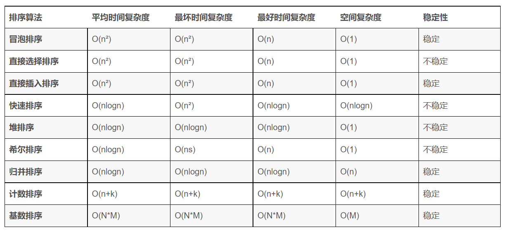

### 一致性哈希算法
[图解一致性哈希算法](https://segmentfault.com/a/1190000021199728)

将对象和服务器都放置到同一个哈希环后，在哈希环上顺时针查找距离这个对象的 hash 值最近的机器，即是这个对象所属的机器。

如果使用简单的取模方法，当新添加服务器时可能会导致大部分缓存失效，而使用一致性哈希算法后，这种情况得到了较大的改善，因为只有少部分对象需要重新分配。

新增的服务器 cs4 只分担了 cs1 服务器的负载，服务器 cs2 和 cs3 并没有因为 cs4 服务器的加入而减少负载压力。针对这个问题，我们可以通过引入虚拟节点来解决负载不均衡的问题。即将每台物理服务器虚拟为一组虚拟服务器，将虚拟服务器放置到哈希环上，如果要确定对象的服务器，需先确定对象的虚拟服务器，再由虚拟服务器确定物理服务器。

### 负载均衡算法的实现
1、轮询法
将请求按顺序轮流地分配到后端服务器上，它均衡地对待后端的每一台服务器，而不关心服务器实际的连接数和当前的系统负载；

2、随机法
通过系统的随机算法，根据后端服务器的列表大小值来随机选取其中的一台服务器进行访问。由概率统计理论可以得知，随着客户端调用服务端的次数增多， 其实际效果越来越接近于平均分配调用量到后端的每一台服务器，也就是轮询的结果；

3、源地址哈希法
源地址哈希的思想是根据获取客户端的IP地址，通过哈希函数计算得到的一个数值，用该数值对服务器列表的大小进行取模运算，得到的结果便是客服端要访问服务器的序号。采用源地址哈希法进行负载均衡，同一IP地址的客户端，当后端服务器列表不变时，它每次都会映射到同一台后端服务器进行访问；

4、加权轮询法
不同的后端服务器可能机器的配置和当前系统的负载并不相同，因此它们的抗压能力也不相同。给配置高、负载低的机器配置更高的权重，让其处理更多的请求；而配置低、负载高的机器，给其分配较低的权重，降低其系统负载，加权轮询能很好地处理这一问题，并将请求顺序且按照权重分配到后端；

5、加权随机法
与加权轮询法一样，加权随机法也根据后端机器的配置，系统的负载分配不同的权重。不同的是，它是按照权重随机请求后端服务器，而非顺序；

### [10w个数在硬盘，你怎么排序？](https://blog.csdn.net/FX677588/article/details/72471357)
[海量数据的其他面试题](https://blog.csdn.net/v_JULY_v/article/details/6279498)
面对海量数据，即数据不可能一次全部载入内存，需要用到外排序的方法。外排序采用分块的方法（分而治之），首先将数据分块，对块内数据按选择一种高效的内排序策略进行排序。然后采用归并排序的思想对于所有的块进行排序，得到所有数据的一个有序序列。

优化：本来是40路归并，可以先每8路归并一次，再5路归并

### [一亿个数字找最大的十个数](https://blog.csdn.net/super828/article/details/108890489)

### 快排的时间复杂度计算
[如何证明快速排序法的平均复杂度为 O(nlogn)？ - 知乎](https://www.zhihu.com/question/22393997/answer/406278523)

设对规模n的数组排序需要的**时间期望**为T(n)
空表的时候不用排, 所以初值条件就是T(0)=0
如果切分点左边有k个元素：T(k-1)+T(n-k)
k多少不确定：遍历1到n都有可能

### 排序算法的稳定性
[参考](https://zhuanlan.zhihu.com/p/116046849)
不稳定排序算法：
堆排序、快速排序、希尔排序、直接选择排序

稳定排序算法：
基数排序、冒泡排序、直接插入排序、折半插入排序、归并排序

### 排序算法的复杂度🐋

### 选择排序
- 遍历找出未排序中的元素中最小值下标
- 最小值下标与未排序中最左侧下标不一致则交换

### 插入排序
从后向前扫描过程中，需要反复把已排序元素逐步向后挪位，为最新元素提供插入空间。
### 希尔排序
[参考](https://www.cnblogs.com/chengxiao/p/6104371.html)
希尔排序在数组中采用跳跃式分组的策略，通过某个增量将数组元素划分为若干组，然后分组进行插入排序，随后逐步缩小增量，继续按组进行插入排序操作，直至增量为1。

### 动态规划算法和贪心算法的区别
动态规划具有两个性质：
- 重叠子问题
- 最优子结构

贪心算法：
- 贪心选择性质
- 最优子结构
