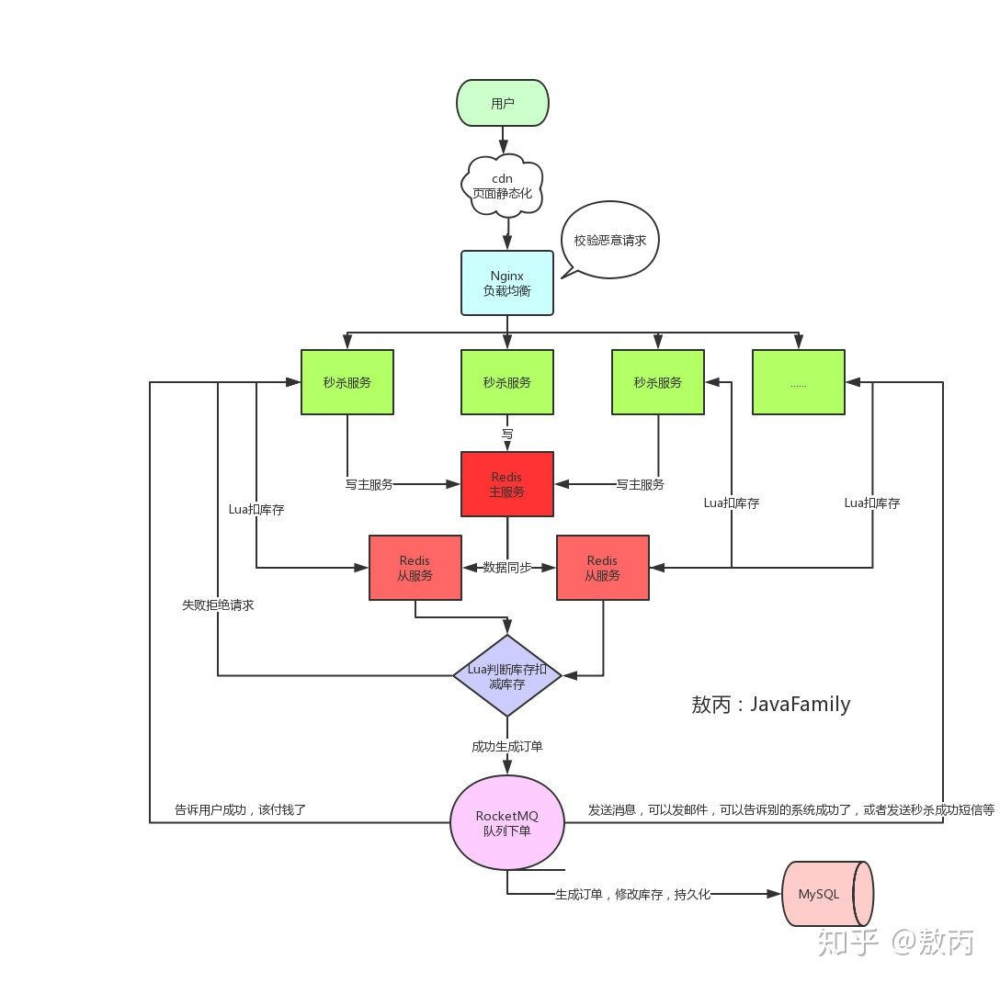

设计rpc框架考虑什么
设计一个日志系统，日志刷新速度特别高，里面包括运营要看的日志

### [怎么设计RPC协议？](https://cloud.tencent.com/developer/article/1185152)

### RPC
[实现简单的RPC框架](https://www.cnblogs.com/aspirant/p/8631359.html)
* Server: 暴露服务的服务提供方。 
* Client: 调用远程服务的服务消费方。 
* Registry: 服务注册与发现的注册中心。

### 设计线程池
[参考](https://juejin.cn/post/6968721240592744455)
线程池内需要定义两个成员变量，分别是阻塞队列和线程列表，然后自定义线程使它的任务就是不断的从阻塞队列中拿任务然后执行。

### 秒杀系统设计
秒杀的本质，就是对库存的抢夺，每个秒杀的用户来你都去数据库查询库存校验库存，然后扣减库存，撇开性能因数，你不觉得这样好繁琐，对业务开发人员都不友好，而且数据库顶不住啊。

我们要开始秒杀前你通过定时任务或者运维同学提前把商品的库存加载到Redis中去，让整个流程都在Redis里面去做，然后等秒杀介绍了，再异步的去修改库存就好了。

写一个脚本把判断库存扣减库存的操作都写在一个脚本丢给Redis去做，那到0了后面的都Return False了是吧，一个失败了你修改一个开关，直接挡住所有的请求，然后再做后面的事情嘛。

### 如何设计一个操作系统内核？
为进程管理、文件系统、用户程序、虚拟内存等几个部分。

### 如何设计一个本地缓存
[参考](https://juejin.cn/post/6844904003394863118)
- 数据结构：Map
- 对象上限/清除策略：常见的比如有LRU(最近最少使用)、FIFO(先进先出)、LFU(最近最不常用)、SOFT(软引用)、WEAK(弱引用)等策略；
- 过期时间：被动删除和主动删除；专门有一个job在后台定期去检查数据是否过期，如果过期则删除，这其实可以有效的处理冷数据；
- 线程安全：用线程安全的类去存储数据
- 是否持久化