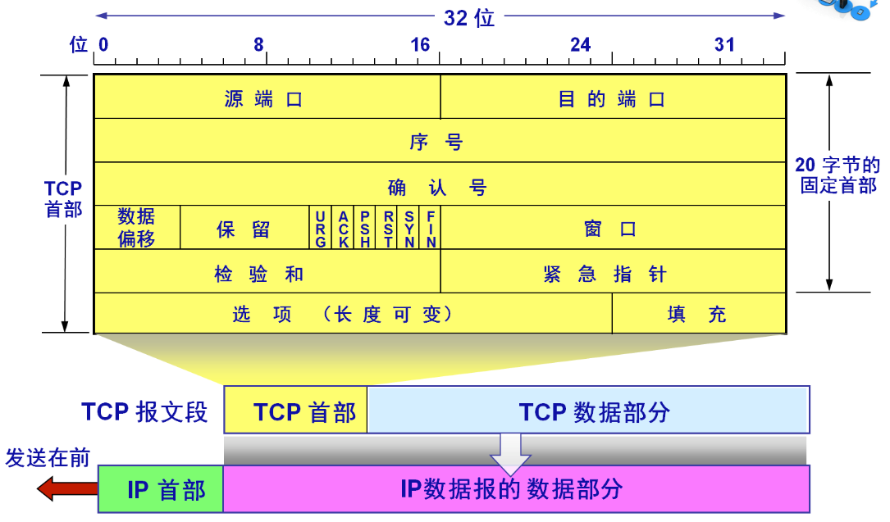
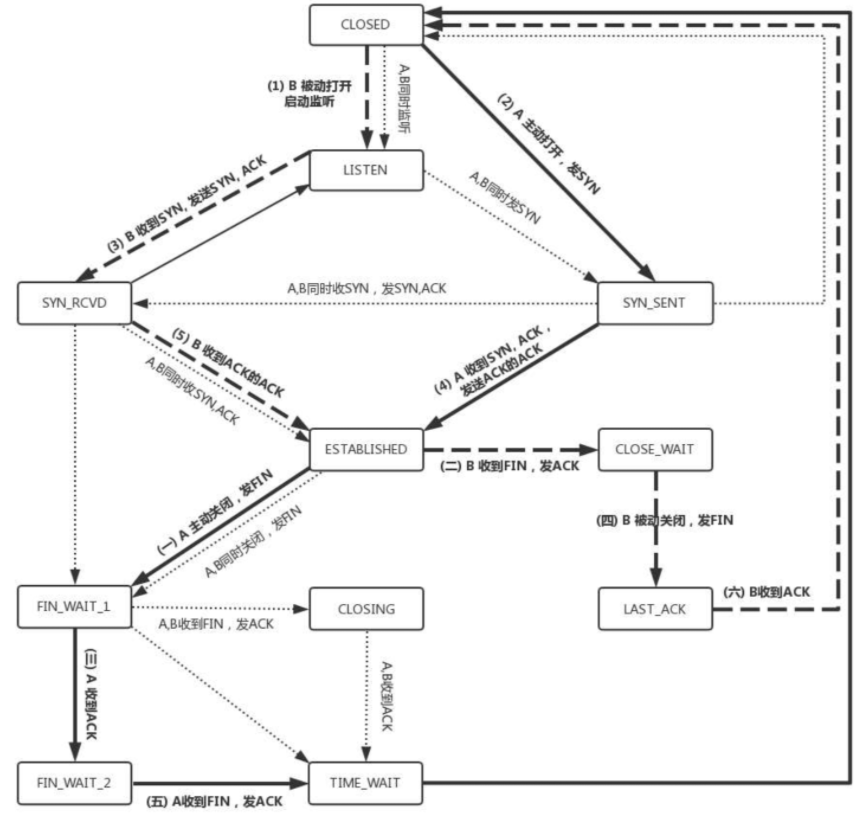

1.  Http的请求报文和响应报文各有哪几部分组成
2. 1.  Http 协议和TCP协议的关系是什么
3. 1.  Http TCP 都有保活 [keep](https://www.nowcoder.com/jump/super-jump/word?word=keep)-alive 机制 两者有什么区别
4. OSI网络7层模型
5. tcp和udp的区别
6. 知不知道tcp粘包？
7. 如果udp发送方一直发，接受不过来会怎么样？
8. 个MTU最大是1500字节，那么最多包含多少的数据
9. cp三次握手是否能够减少为两次？
10. tcp状态机的切换
11. tcp滑动窗口，拥塞控制
12. 从输入url到显示页面的过程(这里提了dns,tcp连接,http协议，然后开始追问，把这几个玩意都细讲了)
13. dns解析出错，怎么排查错误
14. http,https,https理解，秘钥交换过程
15. tcp三次握手，四次挥手的实现原理
16.  tcp数据包最大为什么是65495字节？
17. time_wait有什么用？
18. 知不知道tcp开源库
19. DNS的过程
20. http的缓存机制
21. http状态码
22. tcp怎么保证可靠性
23. tcp的拥塞控制
24.  http1.0 1.1 1.2区别
25. HTTP请求的过程，[keep](https://www.nowcoder.com/jump/super-jump/word?word=keep)-alive
26. https加密过程，为什么不是非对称加密
27. DNS过程，问的很细
28. 网关
29. http状态码，502,504？
30. http2.0 了解3.0吗
31. http报文格式
32. Get post还有什么方式
33. 登录的时候用什么保存状态 session和cookie
34. DNS是哪层的协议
35. tcp有个状态是Time_Wait，这个具体是在哪儿，作用是什么
36. get和post的区别，用get和post传输的时候有个编码，那个编码的作用是什么
(一开始没听懂问题，说的是Accept-Encoding，后来面试官说是想问http请求中特殊字符的转义)

http协议  
(http是哪一层的协议，其传输层协议是什么，三次握手和四次挥手的完整过程)
-   三次握手和四次挥手的过程
- UDP和TCP的区别  
2.     UDP为什么是面向报文的  
3.     TCP的三次握手协议

### HTTP的请求报文和响应报文各有哪几部分组成?
[HTTP请求报文和响应报文详解](https://juejin.cn/post/6931636106710482958)
[HTTP 报文及其结构](https://segmentfault.com/a/1190000019788537)

一个HTTP请求报文由请求行（request line） 、请求头部（header）、空行和请求数据4个部分组成。

- 请求行由三部分组成：请求方法、请求URL（不包括域名）、HTTP协议版本。请求方法比较多：GET、POST、HEAD、PUT、DELETE、OPTIONS、TRACE、CONNECT
- 请求头部由关键字/值对组成，每行一对。典型的请求头有：User-Agent、Accept、Cookie、Content-Type。

HTTP响应报文和请求报文的结构差不多，也是由四个部分组成：状态行、响应头、空行和响应体。
- 状态行由三部分组成：服务器HTTP协议版本，响应状态码，状态码的文本描述
- 响应首部（首部行）：位于响应报文状态行之后。

### HTTP协议和TCP协议的关系
TCP协议对应于传输层，而Http协议对应于应用层。

Http协议是建立在TCP协议基础之上的，当浏览器需要从服务器获取网页数据的时候，会发出一次Http请求。Http会通过TCP建立起一个到服务器的连接通道，当本次请求需要的数据完毕后，Http会立即将TCP连接断开，这个过程是很短的。所以Http连接是一种短连接，是一种无状态的连接。

### 计网五层模型🐋
物理层、数据链路层、网络层、传输层、应用层

**网络层作用，路由器位于那一层，网络层协议介绍几个**

[**网络层作用：**](https://blog.csdn.net/hanzhen7541/article/details/79030748)
1. 路由选择：对于每一个数据包给定最佳的路线，比如距离矢量算法和链路状态算法等等。
2. 存储、交换、转发：路由器中存在着路由表，路由表的作用是为路由器提供包的方向依据。路由器会根据每个到达包的目的地址来确定他应该向那个方向转发这个包。当路由器接收包的速度要小于它转发包的速度时候，他就会把暂时发送不了的包缓存在自己的缓冲区里面，直到前面的都发出去再将其发出去，这就是存储。
3. 拥塞控制
4. 呼叫准入
5. 包分类：据不同包确定优先级，优先转发高优先级的

[**网络层协议：**](https://leeyuxun.github.io/%E7%BD%91%E7%BB%9C%E5%B1%82%E3%80%81%E4%BC%A0%E8%BE%93%E5%B1%82%E3%80%81%E5%BA%94%E7%94%A8%E5%B1%82%E5%B8%B8%E7%94%A8%E5%8D%8F%E8%AE%AE.html)
1. IP协议：通过IP地址，保证了联网设备的唯一性，实现了网络通信的面向无连接和不可靠的传输功能。
2. ICMP协议：用于在IP主机、路由器之间传递控制消息。控制消息是指网络通不通、主机是否可达、路由是否可用等网络本身的消息。ICMP的主要作用是主机探测,路由维护,路由选择,流量控制。当遇到IP数据无法访问目标、IP路由器无法按当前的传输速率转发数据包等情况时，会自动发送ICMP消息。
3. IGMP协议：用来在ip主机和与其直接相邻的组播路由器之间建立、维护**组播组成员**关系。
4. ARP协议：把网络层32位的IP转换成数据链路层48位的MAC地址【ARP协议在TCP/IP模型中属于IP层（网络层），在OSI模型中属于链路层。】
5. RARP协议：和ARP协议做相反的工作，它是将48位的MAC地址转换为32位的IP地址

### OSI七层网络结构🌟
[一文读懂OSI七层模型与TCP/IP四层的区别/联系](https://blog.csdn.net/qq_39521554/article/details/79894501)
- 应用层：文件传输，电子邮件，文件服务，虚拟终端 TFTP，HTTP，SNMP，FTP，SMTP，DNS，Telnet
- 表示层：数据格式化，代码转换，数据加密 没有协议
- 会话层：解除或建立与别的接点的联系 没有协议
- 传输层：提供端对端的接口 TCP，UDP
- 网络层：为数据包选择路由 IP，ICMP，RIP，OSPF，BGP，IGMP
- 数据链路层：传输有地址的帧以及错误检测功能 SLIP，CSLIP，PPP，ARP，RARP，MTU
- 物理层：以二进制数据形式在物理媒体上传输数据 ISO2110，IEEE802，IEEE802.2

### TCP和UDP的区别🐋🐋🌟🌟🌟🌟
1. TCP面向连接（如打电话要先拨号建立连接）;UDP是无连接的，即发送数据之前不需要建立连接
2. TCP提供可靠的服务。也就是说，通过TCP连接传送的数据，无差错，不丢失，不重复，且按序到达;UDP尽最大努力交付，即不保证可靠交付
3. TCP面向字节流，实际上是TCP把数据看成一连串无结构的字节流。UDP是面向报文的
4. UDP没有流量控制和拥塞控制，因此网络出现拥塞不会使源主机的发送速率降低（对实时应用很有用，如IP电话，实时视频会议等）
5. 每一条TCP连接只能是点到点的;UDP支持一对一，一对多，多对一和多对多的交互通信
6. TCP首部开销20字节;UDP的首部开销小，只有8个字节  
7. TCP的逻辑通信信道是全双工的可靠信道，UDP则是不可靠信道

TCP适合对传输效率要求低，但**准确率要求高**的应用场景，比如万维网(HTTP)、文件传输(FTP)、电子邮件(SMTP)等。UDP适用于**对传输效率要求高**，但准确率要求低的应用场景，比如域名转换(DNS)、远程文件服务器(NFS)等。

### 为什么使用 TCP 不使用 UDP，使用 TCP 时可能遇到哪些问题？
TCP存在粘包的情况，就是就是我们收到的数据流，并且有可能是多个数据包合并的内容，而不是数据块，在后续处理的过程中一定要单独处理。

流量控制算法不能很好的适应高带宽高延迟的场景，因为ack确认因为传输延迟不能及时送达导致传输速度远低于理论的传输带宽。

拥塞控制算法也不能很好的适应网络不太稳定的场景（比如无线网络），TCP的拥塞控制认为丢包是因为网络传输饱和，所以一但出现丢包就采取指数级避让，而无线网络因为短暂的信号干扰导致的丢包并不是因为网络传输饱和，此时采取指数级避让是不合适的，会导致无线传输的速度骤降。

TCP的crc校验位只有16位， 当出现错误时，有1/65535的概率不能够被检测出来，不够可靠。

UDP较TCP被攻击者利用的漏洞就要少一些。

### 使用tcp和udp的协议有哪些？
[参考](https://blog.csdn.net/boyaaboy/article/details/102566522)

- 基于TCP的应用层协议有：HTTP、FTP(21)、SMTP、TELNET(23)、SSH、POP3
- 基于UDP的应用层协议：DNS、TFTP（简单文件传输协议）、SNMP
- HTTP/1.1 和 HTTP/2 都是基于 TCP 传输协议的，而 HTTP/3 是基于 UDP 传输协议的

### TCP首部字段有哪些
TCP报文段首部前20个字节是固定的，后面有4n个字节是根据需要而增加的选项(n是整数)。因此TCP首部的最小长度是20个字节。

### TCP粘包
[为什么 TCP 协议有粘包问题](https://draveness.me/whys-the-design-tcp-message-frame/)

粘包是如何发生的：
-   TCP 协议是面向字节流的协议，它可能会组合或者拆分应用层协议的数据；
-   应用层协议的没有定义消息的边界导致数据的接收方无法拼接数据；

如果用户开启了 Nagle 算法，那么 TCP 协议可能不会立刻发送写入的数据，它会等待缓冲区中数据超过最大数据段（MSS）或者上一个数据段被 ACK 时才会发送缓冲区中的数据。

解决方法：
1. 格式化数据：每条数据有固定的格式（开始符，结束符），这种方法简单易行，但是选择开始符和结束符时一定要确保每条数据的内部不包含开始符和结束符。  
2. 发送长度：发送每条数据时，将数据的长度一并发送，例如规定数据的前4位是数据的长度，应用层在处理时可以根据长度来判断每个分组的开始和结束位置。

### TCP如何做到可靠传输？🐋
[TCP如何做到可靠传输？](https://segmentfault.com/a/1190000022944999)
1. 应用数据被分割成 TCP 认为最适合发送的数据块。TCP 给发送的每一个包进行编号，接收方对数据包进行排序，把有序数据传送给应用层。
2. **校验和**：TCP 将保存它首部和数据的检验和。这是一个端到端的检验和，目的是检测数据在传输过程中的任何变化。如果收到段的检验和有差错，TCP 将丢弃这个报文段和不确认收到此报文段。
3. TCP 的接收端会丢弃重复的数据。
4. **流量控制**：TCP 连接的每一方都有固定大小的缓冲空间，TCP的接收端只允许发送端发送接收端缓冲区能接纳的数据。当接收方来不及处理发送方的数据，能提示发送方降低发送的速率，防止包丢失。TCP 使用的流量控制协议是可变大小的滑动窗口协议。 （TCP 利用滑动窗口实现流量控制）
5. **拥塞控制**：当网络拥塞时，减少数据的发送。
6. **ARQ协议**：也是为了实现可靠传输的，它的基本原理就是每发完一个分组就停止发送，等待对方确认。在收到确认后再发下一个分组。
7. **超时重传**：当 TCP 发出一个段后，它启动一个定时器，等待目的端确认收到这个报文段。如果不能及时收到一个确认，将重发这个报文段。

### TCP三次握手、四次挥手过程 🐋🌙

1. 第一次握手： Client将标志位SYN置为1，随机产生一个值seq=x，并将该数据包发送给Server，Client进入SYN_SENT状态，等待Server确认。
2. 第二次握手：Server收到数据包后由标志位SYN=1知道Client请求建立连接，Server将标志位SYN和ACK都置为1，ack=x+1，随机产生一个值seq=y，并将该数据包发送给Client以确认连接请求，Server进入SYN_RCVD状态。
3. 第三次握手：Client收到确认后，检查ack是否为x+1，ACK是否为1，如果正确则将标志位ACK置为1，ack=y+1，并将该数据包发送给Server，Server检查ack是否为y+1，ACK是否为1，如果正确则连接建立成功，Client和Server进入ESTABLISHED状态，完成三次握手，随后Client与Server之间可以开始传输数据了。

1. 第一次挥手： Client发送一个FIN，用来关闭Client到Server的数据传送，Client进入FIN_WAIT_1状态。
2. 第二次挥手：Server收到FIN后，发送一个ACK给Client，确认序号为收到序号+1（与SYN相同，一个FIN占用一个序号），Server进入CLOSE_WAIT状态。
3. 第三次挥手：Server发送一个FIN，用来关闭Server到Client的数据传送，Server进入LAST_ACK状态。
4. 第四次挥手：Client收到FIN后，Client进入TIME_WAIT状态，接着发送一个ACK给Server，确认序号为收到序号+1，Server进入CLOSED状态，完成四次挥手。

### TCP的冷启动
慢启动（Slow Start），是传输控制协议（TCP）使用的一种阻塞控制机制。

### 第三次ack丢了客户端什么状态，可以往服务器发数据吗？
客户端发出的 ACK 丢失了，发出的 下一个数据包 没有丢失，则服务端接收到下一个数据包（这个数据包里也会带上 ACK 信息），能够进入正常的 ESTABLISHED 状态

如果服务端和客户端都没有数据发送，或者服务端想发送数据（但是发不了，因为没有收到客户端的 ACK）

服务器收到SYN包后发出SYN+ACK数据包，服务器进入SYN_RECV状态。

而这个时候客户端发送ACK给服务器失败了，服务器没办法进入ESTABLISH状态，这个时候肯定不能传输数据的，不论客户端主动发送数据与否，服务器都会有定时器发送第二步SYN+ACK数据包，如果客户端再次发送ACK成功，建立连接。

如果一直不成功，服务器肯定会有超时设置，超时之后会给客户端发RTS报文，进入CLOSED状态，这个时候客户端应该也会关闭连接。

### TCP服务端accept发生在三次握手的哪一个阶段？
TCP服务端accept发生在三次握手之后。

### TCP是如何实现可靠连接的？
[参考](https://cloud.tencent.com/developer/article/1591989)
TCP 是通过下面几个特性保证数据传输的可靠性：
- 序列号和确认应答信号
- 超时重发控制
- 连接管理
- 滑动窗口控制
- 流量控制
- 拥塞控制

### accept队列满了会怎样？默认会怎样？
[参考](https://cloud.tencent.com/developer/article/1638042)

在 TCP 三次握手的时候，Linux 内核会维护两个队列，分别是：
-   半连接队列，也称 SYN 队列；
-   全连接队列，也称 accepet 队列；

服务端收到客户端发起的 SYN 请求后，内核会把该连接存储到半连接队列，并向客户端响应 SYN+ACK，接着客户端会返回 ACK，服务端收到第三次握手的 ACK 后，内核会把连接从半连接队列移除，然后创建新的完全的连接，并将其添加到 accept 队列，等待进程调用 accept 函数时把连接取出来。

**当超过了 TCP 最大全连接队列，服务端则会丢掉后续进来的 TCP 连接**，丢掉的 TCP 连接的个数会被统计起来。我们可以使用 netstat -s 命令来查看。

实际上，丢弃连接只是 Linux 的默认行为，我们还可以选择向客户端发送 RST 复位报文，告诉客户端连接已经建立失败。

### TCP的心跳机制
[参考](https://blog.51cto.com/lirixing/5205303)
TCP协议会向对方发一个带有ACK标志的空数据包（KeepAlive探针），对方在收到ACK包以后，如果连接一切正常，应该回复一个ACK；如果连接出现错误了（例如对方重启了，连接状态丢失），则应当回复一个RST；如果对方没有回复，服务器每隔多少时间再发ACK，如果连续多个包都被无视了，说明连接被断开了。

### 第二次握手为什么SYN要置为1
SYN是在建立连接时用到的同步信号。

接收方（服务器）在第二次握手的时候回传SYN是证明双方之间通信的通道没有问题，我收到的信息确实是你（客户端）发送的信号

### 四次挥手Time-wait的作用🌟
Time-wait的的持续时间为2MSL。MSL是Maximum Segment Lifetime,译为“报文最大生存时间”，可为30s，1min或2min。

[TCP之已失效的连接请求报文段](https://www.cnblogs.com/vvull/articles/10597783.html)

- 主动断开方需要最后回复被动断开方一个ACK，这个ACK可能会丢失，需要重传。被动断开方在没收到ACK又达到了RTO之后会重新发送FIN+ACK，如果此时主动断开方直接断开连接，那么被动断开方就收不到这个FIN+ACK的ACK了。
- 如果没有TIME_WAIT状态，那么主动断开方的端口会释放出来，就有可能会被立即提供给另一个连接使用，这个时候如果被动断开方之前发送的还在网络中的包到达的时候，如果sequence number恰好对上了，这个时候会对新的连接造成错乱。

### 服务器出现大量的TIME_WAIT状态怎么办？
[参考](https://zhuanlan.zhihu.com/p/45102654)
- 避免服务器频繁主动断开连接，建立http/1.1连接，使用keep-alive，当keepalive起用的时候，TCP发送keepalive消息的频度。缺省是2小时，改为20分钟。
- 通过linux内核进行一些网络调整比如，开启socket重用和快速回收
- 增加SYN队列的长度，可以容纳更多等待连接的网络连接数。
- 修改向外连接的端口范围。缺省情况下很小：32768到61000，改为1024到65000。

### 三次握手能否减少为两次？
client 发出的第一个连接请求报文段并没有丢失，而是在某个网络结点长时间的滞留了，以致延误到连接释放以后的某个时间才到达 server。本来这是一个早已失效的报文段。但 server 收到此失效的连接请求报文段后，就误认为是 client 再次发出的一个新的连接请求。于是就向 client 发出确认报文段，同意建立连接。

假设不采用 “三次握手”，那么只要 server 发出确认，新的连接就建立了。由于现在 client 并没有发出建立连接的请求，因此不会理睬 server 的确认，也不会向 server 发送数据。但 server 却以为新的运输连接已经建立，并一直等待 client 发来数据。这样，server 的很多资源就白白浪费掉了。采用 “三次握手” 的办法可以防止上述现象发生。例如刚才那种情况，client 不会向 server 的确认发出确认。server 由于收不到确认，就知道 client 并没有要求建立连接。

 ### TCP状态机的切换
 [TCP 三次握手和四次挥手图解（有限状态机）](https://www.cnblogs.com/huangjiangyong/p/13958456.html)

 
 
### TCP滑动窗口和拥塞控制🌟🌟🌟🌟
**滑动窗口**
窗口是缓存的一部分，用来暂时存放字节流。发送方和接收方各有一个窗口，接收方通过 TCP 报文段中的窗口字段告诉发送方自己的窗口大小，发送方根据这个值和其它信息设置自己的窗口大小。

发送窗口内的字节都允许被发送，接收窗口内的字节都允许被接收。如果发送窗口左部的字节已经发送并且收到了确认，那么就将发送窗口向右滑动一定距离，直到左部第一个字节不是已发送并且已确认的状态；接收窗口的滑动类似，接收窗口左部字节已经发送确认并交付主机，就向右滑动接收窗口。

接收窗口只会对窗口内最后一个按序到达的字节进行确认。发送方得到一个字节的确认之后，就知道这个字节之前的所有字节都已经被接收。

**流量控制**
流量控制是为了控制发送方发送速率，保证接收方来得及接收。接收方发送的确认报文中的窗口字段可以用来控制发送方窗口大小，从而影响发送方的发送速率。将窗口字段设置为 0，则发送方不能发送数据。

**拥塞控制**
流量控制是为了让接收方能来得及接收，而拥塞控制是为了降低整个网络的拥塞程度。
TCP 主要通过四个算法来进行拥塞控制：慢开始、拥塞避免、快重传、快恢复。

发送方需要维护一个叫做拥塞窗口（cwnd）的状态变量，发送窗口取拥塞窗口和流量控制窗口的最小值。

1. 慢开始与拥塞避免
发送的最初执行慢开始，令 cwnd = 1，发送方只能发送 1 个报文段；当收到确认后，将 cwnd 加倍，因此之后发送方能够发送的报文段数量为：2、4、8 ...

注意到慢开始每个轮次都将 cwnd 加倍，这样会让 cwnd 增长速度非常快，从而使得发送方发送的速度增长速度过快，网络拥塞的可能性也就更高。设置一个慢开始门限 ssthresh，当 cwnd >= ssthresh 时，进入拥塞避免，每个轮次只将 cwnd 加 1。

如果出现了超时，则令 ssthresh = cwnd / 2，然后重新执行慢开始。

2. 快重传与快恢复
在接收方，要求每次接收到报文段都应该对最后一个已收到的有序报文段进行确认。例如已经接收到 M1 和 M2，此时收到 M4，应当发送对 M2 的确认。

在发送方，如果收到三个重复确认，那么可以知道下一个报文段丢失，此时执行快重传，立即重传下一个报文段。例如收到三个 M2，则 M3 丢失，立即重传 M3。

在这种情况下，只是丢失个别报文段，而不是网络拥塞。因此执行快恢复，令 ssthresh = cwnd / 2 ，cwnd = ssthresh，注意到此时直接进入拥塞避免。
***
[计算机网络 - 传输层](https://github.com/CyC2018/CS-Notes/blob/master/notes/%E8%AE%A1%E7%AE%97%E6%9C%BA%E7%BD%91%E7%BB%9C%20-%20%E4%BC%A0%E8%BE%93%E5%B1%82.md#tcp-%E6%BB%91%E5%8A%A8%E7%AA%97%E5%8F%A3)

流量控制是为了让接收方能来得及接收，而拥塞控制是为了降低整个网络的拥塞程度。

在接收方，要求每次接收到报文段都应该对最后一个已收到的有序报文段进行确认。例如已经接收到 M1 和 M2，此时收到 M4，应当发送对 M2 的确认。

在发送方，如果收到三个重复确认，那么可以知道下一个报文段丢失，此时执行快重传，立即重传下一个报文段。例如收到三个 M2，则 M3 丢失，立即重传 M3。

在这种情况下，**只是丢失个别报文段，而不是网络拥塞**。因此执行快恢复，令 ssthresh = cwnd / 2 ，cwnd = ssthresh，注意到此时直接进入拥塞避免。

**拥塞程度**
- 拥塞窗口cwnd
- 慢开始门限ssthresh

发送方需要维护一个叫做拥塞窗口cwnd的状态变量，其值取决于网络的拥塞程度并且会跟随网络的拥塞程度动态变化。拥塞窗口的维护原则:如果网络没有发生拥塞，拥塞窗口就会不断增大(具体如何增大与ssthresh有关)；但只要网络一发生拥塞，这个窗口就会减小。而判断网络发生的依据就是：超时报文(没有按时收到回复的报文，需要超时重传)。

### 一个MTU最大1500个字节，最多包含多少数据？
MTU是**数据链路层**的概念。
如果以太网长度为1518，那有效传输效率=1460/1518=**96%**。如果以太网长度为1518，那有效传输效率=1460/1518=**96%**

链路层帧的大小1500(不包括帧头、帧尾)
UDP 包的大小就应该是 1500 - IP头(20) - UDP头(8) = 1472(Bytes)  
TCP 包的大小就应该是 1500 - IP头(20) - TCP头(20) = 1460 (Bytes)

### 从输入URL到显示页面的过程🌟🌟🌟🌟
[参考](https://cloud.tencent.com/developer/article/1879758)
1.  DNS解析：将域名解析为IP地址
2.  TCP连接
3.  发送HTTP请求
4.  服务器处理请求并返回HTTP报文
5.  浏览器解析渲染页面
6.  断开连接：TCP四次挥手

首先在**本地域名**服务器中查询IP地址，如果没有找到的情况下，本地域名服务器会向**根域名**服务器发送一个请求，如果根域名服务器也不存在该域名时，本地域名会向com**顶级域名**服务器发送一个请求，依次类推下去。直到最后本地域名服务器得到google的IP地址并把它缓存到本地，供下次查询使用。

浏览器拿到响应文本 HTML 后，浏览器解析渲染页面分为一下五个步骤：
-   根据 HTML 解析出 DOM 树
-   根据 CSS 解析生成 CSS 规则树
-   结合 DOM 树和 CSS 规则树，生成渲染树
-   根据渲染树计算每一个节点的信息
-   根据计算好的信息绘制页面

### DNS解析出错，怎么排查错误
[dns错误怎么解决？怎么排查及解决dns解析故障？](https://hsk.oray.com/news/7898.html)

### Session和Cookie🌟
cookie实际上是一小段的文本信息。客户端请求服务器，如果服务器需要记录该用户的状态，就使用response向客户端浏览器颁发一个cookie。客户端浏览器会把cookie保存起来。当浏览器再次请求该网站时，浏览器就会把请求地址和cookie一同给服务器。服务器检查该cookie，从而判断用户的状态。服务器还可以根据需要修改cookie的内容。

session是另一种记录客户状态的机制。不同的是cookie保存在客户端浏览器中，而session保存在服务器上。客户端浏览器访问服务器的时候，服务器把客户端信息以某种形式记录在服务器上，这就是session。客户端浏览器再次访问时只需要从该session中查找该客户的状态就可以了。 如果说cookie机制是通过检查客户身上的“通信证”，那么session机制就是通过检查服务器上的“客户明细表”来确认客户身份。

### cookie和session的区别🐋🐋
1. Cookie在客户端（浏览器），Session在服务器端
2. Cookie的安全性一般，他人可通过分析存放在本地的Cookie并进行Cookie欺骗。
3. 单个Cookie保存的数据不能超过4k，很多浏览器限制一个站点最多保存20个Cookie
4. Session可以放在文件、数据库或内存中，由于一定时间内它是保存在服务器上的，当访问增多时，会较大地占用服务器的性能。
5. Session的运行依赖Session ID，而Session ID是存在Cookie中的，也就是说，如果浏览器禁用了Cookie，Session也会失效（但是可以通过其他方式实现，比如在URL中传递Session ID）

### JWT
[参考，写的很好](https://blog.csdn.net/qq_45770253/article/details/121494183)

### HTTP协议请求头内部包含什么?
[参考](https://www.cnblogs.com/Hellorxh/p/10867892.html)

### HTTP缓存
 [参考](https://cloud.tencent.com/developer/news/588770)
缓存是一种保存资源副本并在下次请求时直接使用该副本的技术，当 web 缓存发现请求的资源已经被存储，它会拦截请求，返回该资源的拷贝，而不会去源服务器重新下载。

- HTTP缓存主要分强制缓存和对比缓存
- 强制缓存的 HTTP 相关头部 Cache-Control，Exipres（HTTP1.0），浏览器直接读本地缓存，不会再跟服务器端交互，状态码 200。
- 对比缓存的 HTTP 相关头部 Last-Modified / If-Modified-Since， Etag  /  If-None-Match (优先级比Last-Modified / If-Modified-Since高)，每次请求需要让服务器判断一下资源是否更新过，从而决定浏览器是否使用缓存，如果是，则返回304，否则重新完整响应。

### HTTP, HTTPS理解，秘钥交换过程🐋🐋🌟
HTTP和HTTPS的区别：
1. HTTP是超文本传输协议，信息是明文传输，HTTPS则是具有安全性的SSL加密传输协议。
2. HTTP和HTTPS使用的是完全不同的连接方式，用的端口也不一样，前者是80，后者是443。
3. HTTP的连接很简单，是无状态的；HTTPS协议是由SSL+HTTP协议构建的可进行加密传输、身份认证的网络协议，比HTTP协议安全。
4. HTTPS协议需要到ca申请证书，一般免费证书较少，因而需要一定费用。

密钥交换过程：
-   客户端要访问一个网站，向支持HTTPS的服务器发起请求。
-   客户端向服务器发送自己支持的秘钥交换算法列表。
-   服务器选取一种秘钥交换算法加上CA证书返回给客户端。
-   客户端验证服务器是否合法，并生成一个随机数然后用协商好的加密算法加密生成随机秘钥，并用刚才从CA证书中拿到的公钥对其加密后发送给服务器。
-   服务器收到后用自己的私钥解密。
-   服务器私钥解密之后，拿到对称秘钥，并且用它再加密一个信息，返回给浏览器。

### 非对称加密
非对称加密算法需要两个密钥：公钥和私钥。公钥与私钥是一对，如果用公钥对数据进行加密，只有用对应的私钥才能解密。

### Http存在什么问题？Https怎么解决了这个问题，工作流程说一下🌟🌟
**存在的问题：**
1. 窃听风险：Http采用明文传输数据，第三方可以获知通信内容  
2. 篡改风险：第三方可以修改通信内容  
3. 冒充风险：第三方可以冒充他人身份进行通信

-   通信内容明文传输，容易被第三方窃听
-   容易被第三方劫持、篡改从而无法保证内容的完整性与正确性
-   不验证通信方的身份，因此有可能遭遇伪装，无法保证信息的来源

**怎么解决的：**
1. 所有信息加密传输，避免三方窃听通信内容
2. 校验机制，内容一旦被篡改，通信双发立刻会发现
3. 配备CA证书，防止身份被冒充，CA的主要作用就是对公钥（和其他信息）进行数字签名后生成证书。
4. SSL/TSL协议：作用域传输层和应用层之间，为应用提供数据的加密传输。

###  [HTTPS证书怎么避免中间人攻击？](https://juejin.cn/post/6844904065227292685)

### [HTTPS对称加密和非对称加密](https://zhuanlan.zhihu.com/p/43789231)🌟🌟
非对称加密算法非常耗时，而对称加密快很多。那我们能不能运用非对称加密的特性解决前面提到的对称加密的漏洞？

在双方都不会发现异常的情况下，中间人通过一套“狸猫换太子”的操作，掉包了服务器传来的公钥，进而得到了密钥X。根本原因是浏览器无法确认收到的公钥是不是网站自己的，因为公钥本身是明文传输的。

网站在使用HTTPS前，需要向CA机构申领一份数字证书，数字证书里含有证书持有者信息、公钥信息等。服务器把证书传输给浏览器，浏览器从证书里获取公钥就行了，证书就如身份证，证明“该公钥对应该网站”。

对称加密虽然性能好但有密钥泄漏的风险，非对称加密（2组公钥+2私钥双向传输）安全但性能低下，因此考虑用非对称加密来传输对称加密所需的密钥，然后进行对称加密，但是为了防止非对称过程产生的中间人攻击，需要对服务器公钥和服务器身份进行配对的数字认证，然后引入了CA数字签名+数字证书验证的方式。

### HTTPS状态码
304（未修改） 自从上次请求后，请求的网页未被修改过。服务器返回此响应时，不会返回网页内容。
206（部分内容） 请求已成功处理，但仅返回了部分内容。【下载的时候用】
301：表示本网页永久性转移到另一个地址。
302：暂时重定向

### tcp连接可以发送多少个http连接
HTTP/1.0中Connection默认为close，即每次请求都会重新建立和断开TCP连接。缺点：建立和断开TCP连接，代价过大。

HTTP/1.1中Connection默认为keep-alive，即连接可以复用，不用每次都重新建立和断开TCP连接。超时之后没有连接则主动断开。可以通过声明Connection为close进行关闭。

如果Connection为close，则一个TCP连接只对应一个HTTP请求。

如果Connection为Keep-alive，则一个TCP连接可对应一个到多个HTTP请求。

### HTTP1.0、1.1、2.0协议的特性及区别
[参考](https://juejin.cn/post/6963931777962344455)
HTTP/1.0规定浏览器和服务器保持短暂的连接。浏览器的每次请求都需要与服务器建立一个TCP连接，服务器处理完成后立即断开TCP连接（无连接），服务器不跟踪每个客户端也不记录过去的请求（无状态）。
然而，无连接特性将会导致以下性能缺陷：
1. 无法复用连接。每次发送请求的时候，都需要进行一次TCP连接，而TCP的连接释放过程又是比较费事的。这种无连接的特性会导致网络的利用率非常低。
2. 队头堵塞(head of line blocking)。由于HTTP/1.0规定下一个请求必须在前一个请求响应到达之前才能发送。假设一个请求响应一直不到达，那么下一个请求就不发送，就到导致阻塞后面的请求。

HTTP/1.1
1. 长连接。HTTP/1.1增加了一个Connection字段，通过设置Keep-alive（默认已设置）可以保持连接不断开，避免了每次客户端与服务器请求都要重复建立释放TCP连接，提高了网络的利用率。如果客户端想关闭HTTP连接，可以在请求头中携带Connection:false来告知服务器关闭请求
2. 支持请求管道化（pipelining）。
3. HTTP/1.1还加入了缓存处理，新的字段如cache-control，支持断点传输，以及增加了Host字段（使得一个服务器能够用来创建多个Web站点），支持断点传输等。

HTTP/1.1还是无法解决队头阻塞（head of line blocking）的问题。

HTTP/2
1. 采用二进制格式传输数据。
2. 多路复用。同域名下的所有通信都在单个连接中完成。数据流以消息的形式发送，而消息又由一个或多个帧组成，多个帧之间可以乱序发送，因为根据帧首部的流标识可以重新组装 这一特性，使性能有了很大的提升。
3. 服务器推送。服务端可以在发送页面HTML时主动推送其它资源，而不用等到浏览器解析到相应位置，发起请求再响应。
4. 头部压缩。HTTP/2.0使用encoder来减少需要传输的header大小，通讯双方各自缓存一份header fields表，既避免了重复header的传输，又减小了需要传输的大小。

### [http1.0,1.1,2.0的区别](https://vue3js.cn/interview/http/1.0_1.1_2.0.html#%E4%B8%89%E3%80%81http2-0)
HTTP1.0：
浏览器与服务器只保持短暂的连接，浏览器的每次请求都需要与服务器建立一个TCP连接

HTTP1.1：
- 引入了持久连接，即TCP连接默认不关闭，可以被多个请求复用
- 在同一个TCP连接里面，客户端可以同时发送多个请求
- 虽然允许复用TCP连接，但是同一个TCP连接里面，所有的数据通信是按次序进行的，服务器只有处理完一个请求，才会接着处理下一个请求。如果前面的处理特别慢，后面就会有许多请求排队等着
- 新增了一些请求方法
- 新增了一些请求头和响应头

HTTP2.0：
- 采用二进制格式而非文本格式
- 完全多路复用，而非有序并阻塞的、只需一个连接即可实现并行
- 使用报头压缩，降低开销
- 服务器推送

### HTTP1、2、3区别
[参考](https://www.jianshu.com/p/88a4f41e4ba4)
[参考](https://zhuanlan.zhihu.com/p/266578819)

HTTP 1.0
无状态，无连接
短连接：每次发送请求都要重新建立tcp请求，即三次握手，非常浪费性能
无host头域，也就是http请求头里的host，
不允许断点续传，而且不能只传输对象的一部分，要求传输整个对象

HTTP 1.1
长连接，流水线，使用connection:keep-alive使用长连接
请求管道化
增加缓存处理（新的字段如cache-control）
增加Host字段，支持断点传输等
由于长连接会给服务器造成压力

HTTP 2.0
二进制分帧
头部压缩，双方各自维护一个header的索引表，使得不需要直接发送值，通过发送key缩减头部大小
多路复用（或连接共享），使用多个stream，每个stream又分帧传输，使得一个tcp连接能够处理多个http请求
服务器推送（Sever push）

HTTP 3.0
基于google的QUIC协议，而quic协议是使用udp实现的
减少了tcp三次握手时间，以及tls握手时间
解决了http 2.0中前一个stream丢包导致后一个stream被阻塞的问题
优化了重传策略，重传包和原包的编号不同，降低后续重传计算的消耗
连接迁移，不再用tcp四元组确定一个连接，而是用一个64位随机数来确定这个连接
更合适的流量控制
基于UDP实现
0RTT建连
基于UDP的多路复用
加密认证的报文
向前纠错机制

### POST和GET的区别
GET的语义是请求获取指定的资源。GET方法是安全、幂等、可缓存的（除非有 Cache-ControlHeader的约束）,GET方法的报文主体没有任何语义。
POST的语义是根据请求报文主体对指定的资源做出处理，具体的处理方式视资源类型而不同。POST不安全，不幂等，（大部分实现）不可缓存。

### 分包和粘包
1. 要发送的数据大于TCP发送缓冲区剩余空间大小，将会发生分包。
2. 待发送数据大于MSS（最大报文长度），TCP在传输前将进行分包。
3. 要发送的数据小于TCP发送缓冲区的大小，TCP将多次写入缓冲区的数据一次发送出 去，将会发生粘包。
4. 接收数据端的应用层没有及时读取接收缓冲区中的数据，将发生粘包。

### SYN攻击
[参考](https://zhuanlan.zhihu.com/p/29539671)
[解决方案](https://www.jianshu.com/p/c4fcecc2fd2e)
攻击者向目标服务器发送大量SYN数据包，通常会使用欺骗性的IP地址。

然后，服务器响应每个连接请求，并留下开放端口准备好接收响应。

当服务器等待从未到达的最终ACK数据包时，攻击者继续发送更多的SYN数据包。每个新的SYN数据包的到达导致服务器暂时维持新的开放端口连接一段时间，一旦所有可用端口被使用，服务器就无法正常工作。

怎么解决：
- 回收最早的半开TCP连接
- 延缓任务控制块（TCB）分配方法

### DDOS攻击
[参考](https://www.zhihu.com/question/22259175)
攻击者利用“肉鸡”对目标网站在较短的时间内发起大量请求，大规模消耗目标网站的主机资源，让它无法正常服务。

### ARP🐋
[参考](https://www.cnblogs.com/cxuanBlog/p/14265315.html)
用于实现从 IP 地址到 MAC 地址的映射，即询问目标 IP 对应的 MAC 地址 的一种协议。

主机 A 想要获取主机 B 的 MAC 地址，通过主机 A 会通过广播 的方式向以太网上的所有主机发送一个 ARP 请求包，这个 ARP 请求包中包含了主机 A 想要知道的主机 B 的 IP 地址的 MAC 地址。

主机 A 发送的 ARP 请求包会被同一链路上的所有主机/路由器接收并进行解析。每个主机/路由器都会检查 ARP 请求包中的信息，如果 ARP 请求包中的目标 IP 地址 和自己的相同，就会将自己主机的 MAC 地址写入响应包返回主机 A。

### MD5为什么不安全？
[参考](https://www.zhihu.com/question/263923713)
MD5是一种摘要算法，会发生碰撞。

有人专门生成了一个数据库 将常用的弱密码对应的md5值存储进入供大家查询。

他们对于密码的破解一般是使用撞库，即使用一个已经破解其他网站的密码，做完md5等算法后得到的hash值和新拖的库中的hash值进行匹配，如果两者相同，也代表这位老兄平常多个网站用一个密码，同时代表着黑客成功拿到了新拖库的这个用户的对应密码。

### 路由器转发原理
[参考](https://mengyx.com.cn/2021/11/16/simpread-%E4%BA%A4%E6%8D%A2%E6%9C%BA%E4%BA%8C%E4%B8%89%E5%B1%82%E8%BD%AC%E5%8F%91%E5%8E%9F%E7%90%86%E6%98%AF%E4%BB%80%E4%B9%88%EF%BC%9F/)
[参考二](https://codeantenna.com/a/gCLrhQzkiJ)

### 路由算法

### 交换机的作用是什么 ？
交换机有多个端口，每个端口都具有桥接功能，可以连接一个局域网或一台高性能服务器或工作站。实际上，交换机有时被称为多端口网桥。工作在数据链路层。

数据链路层：交换机(多端口网桥)
网络层：路由器
物理层：中继器用于放大信号

### SSM里面HTTP请求的流程🐋

### Ping命令🐋
ping属于一个通信协议，是TCP/IP协议的一部分。利用“ping”命令可以检查网络是否通畅或者网络连接速度，很好地分析和判定网络故障。PING是应用层直接使用网络层ICMP的一个例子。

### Ping的工作原理
[参考](https://toutiao.io/posts/vvvula/preview)
Ping 是 ICMP 的一个重要应用，主要用来测试两台主机之间的连通性。Ping 的原理是通过向目的主机发送 ICMP Echo 请求报文，目的主机收到之后会发送 Echo 回答报文。Ping 会根据时间和成功响应的次数估算出数据包往返时间以及丢包率。

### TCP 、UDP、IP包的最大长度
[参考](https://www.cnblogs.com/jiangzhaowei/p/9273854.html)
- 在链路层，由以太网的物理特性决定了数据帧的长度为(46＋18)－(1500＋18)，其中的18是数据帧的头和尾，也就是说数据帧的内容最大为1500(不包括帧头和帧尾)，即MTU(Maximum Transmission Unit)为1500；
- 在网络层，因为IP包的首部要占用20字节，所以这的MTU为1500－20＝1480；　
- 在传输层，对于UDP包的首部要占用8字节，所以这的MTU为1480－8＝1472；
- UDP 包的大小就应该是 1500 - IP头(20) - UDP头(8) = 1472(Bytes)
- TCP 包的大小就应该是 1500 - IP头(20) - TCP头(20) = 1460 (Bytes)
- 以太网帧数据域部分最小为46字节

### post和get请求方式的区别
- 参数位置：get请求的参数是放在url(query)里面的。而POST请求的参数是放置在请求体(content)里面的。当然post请求也是可以放置在url当中的。
- 浏览器缓存：get请求可以被浏览器缓存，而post请求不能被缓存。
- 参数长度：get请求参数由于是在url里面，所以会受到浏览器的长度限制，浏览器的不同长度的数值也不同，比如IE是2083字节。理论上讲，POST是没有大小限制的。因为HTTP协议规范没有进行大小限制。
- 参数安全性：同样是因为get的请求参数放置在url里，所以可见，再加上会被浏览器缓存，所以安全性比较差。post请求的参数是放置在请求体里，且不会被缓存，所以安全性相对就好一些。
- 浏览器访问：get请求可以通过浏览器直接访问，支持刷新和后退。post请求是不能被浏览器直接访问的，刷新后数据会重新传送。
- RESTful架构：在该架构中get扮演获取数据的角色，而post扮演的是添加数据的角色。所以get对数据是无害的，不会对数据资源造成影响。而post使用不当，有可能对原有数据资源造成伤害。

### CSRF
[参考](https://tech.meituan.com/2018/10/11/fe-security-csrf.html)
CSRF（Cross-site request forgery）跨站请求伪造：攻击者诱导受害者进入第三方网站，在第三方网站中，向被攻击网站发送跨站请求。利用受害者在被攻击网站已经获取的注册凭证，绕过后台的用户验证，达到冒充用户对被攻击的网站执行某项操作的目的。

### 沾包的解决方法
- 发送端给每个数据包添加包首部，首部中应该至少包含**数据包的长度**，这样接收端在接收到数据后，通过读取包首部的长度字段，便知道每一个数据包的实际长度了。
- 发送端将每个数据包封装为**固定长度**（不够的可以通过补0填充），这样接收端每次从接收缓冲区中读取固定长度的数据就自然而然的把每个数据包拆分开来。
- 可以在数据包之间**设置边界**，如添加特殊符号，这样，接收端通过这个边界就可以将不同的数据包拆分开。
