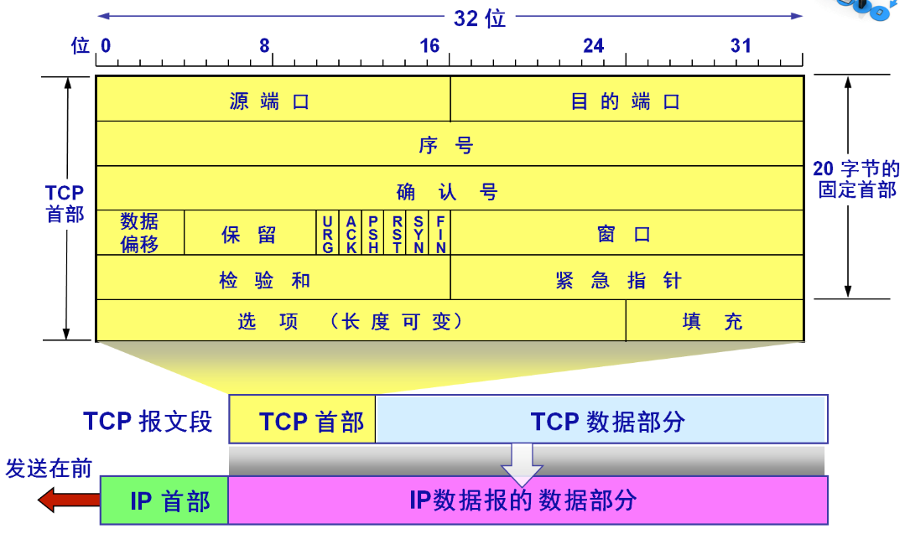
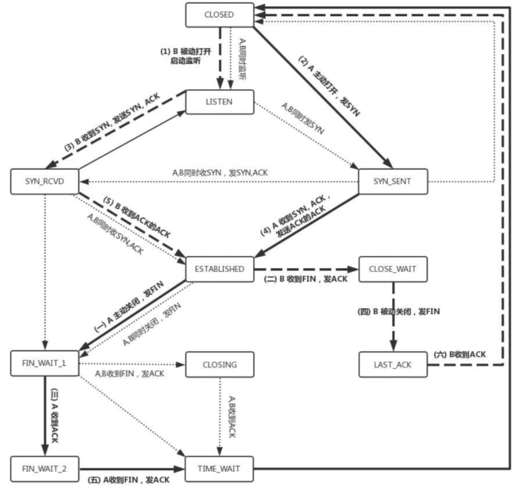

1.  Http的请求报文和响应报文各有哪几部分组成
2. 1.  Http 协议和TCP协议的关系是什么
3. 1.  Http TCP 都有保活 [keep](https://www.nowcoder.com/jump/super-jump/word?word=keep)-alive 机制 两者有什么区别
4. OSI网络7层模型
5. tcp和udp的区别
7. 如果udp发送方一直发，接受不过来会怎么样？
8. 个MTU最大是1500字节，那么最多包含多少的数据
9. cp三次握手是否能够减少为两次？
10. tcp状态机的切换
11. tcp滑动窗口，拥塞控制
12. 从输入url到显示页面的过程(这里提了dns,tcp连接,http协议，然后开始追问，把这几个玩意都细讲了)
13. dns解析出错，怎么排查错误
14. http,https,https理解，秘钥交换过程
15. tcp三次握手，四次挥手的实现原理
16.  tcp数据包最大为什么是65495字节？
17. time_wait有什么用？
18. 知不知道tcp开源库
19. DNS的过程
20. http的缓存机制
21. http状态码
22. tcp怎么保证可靠性
23. tcp的拥塞控制
24.  http1.0 1.1 1.2区别
25. HTTP请求的过程，[keep](https://www.nowcoder.com/jump/super-jump/word?word=keep)-alive
26. https加密过程，为什么不是非对称加密
27. DNS过程，问的很细
28. 网关
29. http状态码，502,504？
30. http2.0 了解3.0吗
31. http报文格式
32. Get post还有什么方式
33. 登录的时候用什么保存状态 session和cookie
34. DNS是哪层的协议
35. tcp有个状态是Time_Wait，这个具体是在哪儿，作用是什么
36. get和post的区别，用get和post传输的时候有个编码，那个编码的作用是什么
(一开始没听懂问题，说的是Accept-Encoding，后来面试官说是想问http请求中特殊字符的转义)

http协议  
(http是哪一层的协议，其传输层协议是什么，三次握手和四次挥手的完整过程)
-   三次握手和四次挥手的过程
- UDP和TCP的区别  
2.     UDP为什么是面向报文的  
3.     TCP的三次握手协议


### HTTP的请求报文和响应报文的组成🌟🌟🌟🌟
[参考](https://juejin.cn/post/6844904125998563342#heading-29)
[HTTP请求报文和响应报文详解](https://juejin.cn/post/6931636106710482958)
[HTTP 报文及其结构](https://segmentfault.com/a/1190000019788537)

一个HTTP请求报文由**请求行**（request line） 、**请求头部**（header）、**空行和请求数据**4个部分组成。

- 请求行由三部分组成：**请求方法、请求URL**（不包括域名）、**HTTP协议版本**。请求方法比较多：GET、POST、HEAD、PUT、DELETE、OPTIONS、TRACE、CONNECT
- 请求头部由关键字/值对组成，每行一对。典型的请求头有：User-Agent、Accept、Cookie、Content-Type。

HTTP响应报文和请求报文的结构差不多，也是由四个部分组成：**状态行、响应头、空行和响应体。**
- 状态行由三部分组成：服务器HTTP协议版本，响应状态码，状态码的文本描述
- 响应首部（首部行）：位于响应报文状态行之后。

### HTTP协议请求头内部包含什么?🌟🌟
[参考](https://www.cnblogs.com/Hellorxh/p/10867892.html)
[更全](https://juejin.cn/post/6844903859108249613)

### HTTP协议和TCP协议的关系
TCP协议对应于传输层，而Http协议对应于应用层。

Http协议是建立在TCP协议基础之上的，当浏览器需要从服务器获取网页数据的时候，会发出一次Http请求。Http会通过TCP建立起一个到服务器的连接通道，当本次请求需要的数据完毕后，Http会立即将TCP连接断开，这个过程是很短的。所以Http连接是一种短连接，是一种无状态的连接。

### 计网五层模型🐋
物理层、数据链路层、网络层、传输层、应用层

**网络层作用，路由器位于那一层，网络层协议介绍几个**

[**网络层作用：**](https://blog.csdn.net/hanzhen7541/article/details/79030748)
1. 路由选择：对于每一个数据包给定最佳的路线，比如距离矢量算法和链路状态算法等等。
2. 存储、交换、转发：路由器中存在着路由表，路由表的作用是为路由器提供包的方向依据。路由器会根据每个到达包的目的地址来确定他应该向那个方向转发这个包。当路由器接收包的速度要小于它转发包的速度时候，他就会把暂时发送不了的包缓存在自己的缓冲区里面，直到前面的都发出去再将其发出去，这就是存储。
3. 拥塞控制
4. 呼叫准入
5. 包分类：据不同包确定优先级，优先转发高优先级的

[**网络层协议：**](https://leeyuxun.github.io/%E7%BD%91%E7%BB%9C%E5%B1%82%E3%80%81%E4%BC%A0%E8%BE%93%E5%B1%82%E3%80%81%E5%BA%94%E7%94%A8%E5%B1%82%E5%B8%B8%E7%94%A8%E5%8D%8F%E8%AE%AE.html)
1. IP协议：通过IP地址，保证了联网设备的唯一性，实现了网络通信的面向无连接和不可靠的传输功能。
2. ICMP协议：用于在IP主机、路由器之间传递控制消息。控制消息是指网络通不通、主机是否可达、路由是否可用等网络本身的消息。ICMP的主要作用是主机探测,路由维护,路由选择,流量控制。当遇到IP数据无法访问目标、IP路由器无法按当前的传输速率转发数据包等情况时，会自动发送ICMP消息。
3. IGMP协议：用来在ip主机和与其直接相邻的组播路由器之间建立、维护**组播组成员**关系。
4. ARP协议：把网络层32位的IP转换成数据链路层48位的MAC地址【ARP协议在TCP/IP模型中属于IP层（网络层），在OSI模型中属于链路层。】
5. RARP协议：和ARP协议做相反的工作，它是将48位的MAC地址转换为32位的IP地址

### OSI七层网络结构🌟
[一文读懂OSI七层模型与TCP/IP四层的区别/联系](https://blog.csdn.net/qq_39521554/article/details/79894501)
- 应用层：文件传输，电子邮件，文件服务，虚拟终端 TFTP，HTTP，SNMP，FTP，SMTP，DNS，Telnet
- 表示层：数据格式化，代码转换，数据加密 没有协议
- 会话层：解除或建立与别的接点的联系 没有协议
- 传输层：提供端对端的接口 TCP，UDP
- 网络层：为数据包选择路由 IP，ICMP，RIP，OSPF，BGP，IGMP
- 数据链路层：传输有地址的帧以及错误检测功能 SLIP，CSLIP，PPP，ARP，RARP，MTU
- 物理层：以二进制数据形式在物理媒体上传输数据 ISO2110，IEEE802，IEEE802.2


### TCP和UDP的区别🐋🐋🧊🌟🌟🌟🌟
1. TCP**面向连接**（如打电话要先拨号建立连接）;UDP是**无连接**的，即发送数据之前不需要建立连接
2. TCP**提供可靠的服务**。也就是说，通过TCP连接传送的数据，无差错，不丢失，不重复，且按序到达;UDP尽最大努力交付，即不保证可靠交付
3. TCP面向字节流，实际上是TCP把数据看成一连串无结构的字节流。UDP是面向报文的
4. UDP没有流量控制和拥塞控制，因此网络出现拥塞不会使源主机的发送速率降低（对实时应用很有用，如IP电话，实时视频会议等）
5. 每一条TCP连接只能是点到点的;UDP支持一对一，一对多，多对一和多对多的交互通信
6. TCP首部开销20字节;UDP的首部开销小，只有8个字节  
7. TCP的逻辑通信信道是全双工的可靠信道，UDP则是不可靠信道

TCP适合对传输效率要求低，但**准确率要求高**的应用场景，比如万维网(HTTP)、文件传输(FTP)、电子邮件(SMTP)等。UDP适用于**对传输效率要求高**，但准确率要求低的应用场景，比如域名转换(DNS)、远程文件服务器(NFS)等。

### 为什么使用 TCP 不使用 UDP，使用 TCP 时可能遇到哪些问题？
TCP存在粘包的情况，就是就是我们收到的数据流，并且有可能是多个数据包合并的内容，而不是数据块，在后续处理的过程中一定要单独处理。

流量控制算法不能很好的适应高带宽高延迟的场景，因为ack确认因为传输延迟不能及时送达导致传输速度远低于理论的传输带宽。

拥塞控制算法也不能很好的适应网络不太稳定的场景（比如无线网络），TCP的拥塞控制认为丢包是因为网络传输饱和，所以一但出现丢包就采取指数级避让，而无线网络因为短暂的信号干扰导致的丢包并不是因为网络传输饱和，此时采取指数级避让是不合适的，会导致无线传输的速度骤降。

TCP的crc校验位只有16位， 当出现错误时，有1/65535的概率不能够被检测出来，不够可靠。

UDP较TCP被攻击者利用的漏洞就要少一些。

### 使用tcp和udp的协议有哪些？
[参考](https://blog.csdn.net/boyaaboy/article/details/102566522)

- 基于TCP的应用层协议有：HTTP、FTP(21)、SMTP、TELNET(23)、SSH、POP3
- 基于UDP的应用层协议：DNS、TFTP（简单文件传输协议）、SNMP
- HTTP/1.1 和 HTTP/2 都是基于 TCP 传输协议的，而 HTTP/3 是基于 UDP 传输协议的

### TCP首部字段有哪些🌟
TCP报文段首部前20个字节是固定的，后面有4n个字节是根据需要而增加的选项(n是整数)。因此TCP首部的最小长度是20个字节。


### TCP粘包
[为什么 TCP 协议有粘包问题](https://draveness.me/whys-the-design-tcp-message-frame/)

粘包是如何发生的：
-   TCP 协议是面向字节流的协议，它可能会组合或者拆分应用层协议的数据；
-   应用层协议的没有定义消息的边界导致数据的接收方无法拼接数据；

如果用户开启了 Nagle 算法，那么 TCP 协议可能不会立刻发送写入的数据，它会等待缓冲区中数据超过最大数据段（MSS）或者上一个数据段被 ACK 时才会发送缓冲区中的数据。

解决方法：
1. 格式化数据：每条数据有固定的格式（开始符，结束符），这种方法简单易行，但是选择开始符和结束符时一定要确保每条数据的内部不包含开始符和结束符。  
2. 发送长度：发送每条数据时，将数据的长度一并发送，例如规定数据的前4位是数据的长度，应用层在处理时可以根据长度来判断每个分组的开始和结束位置。

### TCP如何做到可靠传输？🐋
[TCP如何做到可靠传输？](https://segmentfault.com/a/1190000022944999)
1. 应用数据被分割成 TCP 认为最适合发送的数据块。TCP 给发送的每一个包进行编号，接收方对数据包进行排序，把有序数据传送给应用层。
2. **校验和**：TCP 将保存它首部和数据的检验和。这是一个端到端的检验和，目的是检测数据在传输过程中的任何变化。如果收到段的检验和有差错，TCP 将丢弃这个报文段和不确认收到此报文段。
3. TCP 的接收端会丢弃重复的数据。
4. **流量控制**：TCP 连接的每一方都有固定大小的缓冲空间，TCP的接收端只允许发送端发送接收端缓冲区能接纳的数据。当接收方来不及处理发送方的数据，能提示发送方降低发送的速率，防止包丢失。TCP 使用的流量控制协议是可变大小的滑动窗口协议。 （TCP 利用滑动窗口实现流量控制）
5. **拥塞控制**：当网络拥塞时，减少数据的发送。
6. **ARQ协议**：也是为了实现可靠传输的，它的基本原理就是每发完一个分组就停止发送，等待对方确认。在收到确认后再发下一个分组。
7. **超时重传**：当 TCP 发出一个段后，它启动一个定时器，等待目的端确认收到这个报文段。如果不能及时收到一个确认，将重发这个报文段。

### TCP三次握手、四次挥手过程 🐋🌙

1. 第一次握手： Client将标志位SYN置为1，随机产生一个值seq=x，并将该数据包发送给Server，Client进入SYN_SENT状态，等待Server确认。
2. 第二次握手：Server收到数据包后由标志位SYN=1知道Client请求建立连接，Server将标志位SYN和ACK都置为1，ack=x+1，随机产生一个值seq=y，并将该数据包发送给Client以确认连接请求，Server进入SYN_RCVD状态。
3. 第三次握手：Client收到确认后，检查ack是否为x+1，ACK是否为1，如果正确则将标志位ACK置为1，ack=y+1，并将该数据包发送给Server，Server检查ack是否为y+1，ACK是否为1，如果正确则连接建立成功，Client和Server进入ESTABLISHED状态，完成三次握手，随后Client与Server之间可以开始传输数据了。


1. 第一次挥手： Client发送一个FIN，用来关闭Client到Server的数据传送，Client进入FIN_WAIT_1状态。
2. 第二次挥手：Server收到FIN后，发送一个ACK给Client，确认序号为收到序号+1（与SYN相同，一个FIN占用一个序号），Server进入CLOSE_WAIT状态。
3. 第三次挥手：Server发送一个FIN，用来关闭Server到Client的数据传送，Server进入LAST_ACK状态。
4. 第四次挥手：Client收到FIN后，Client进入TIME_WAIT状态，接着发送一个ACK给Server，确认序号为收到序号+1，Server进入CLOSED状态，完成四次挥手。

***
- 从最开始双方都处于CLOSED状态。然后服务端开始监听某个端口，进入了LISTEN状态。
- 然后客户端主动发起连接，发送 SYN , 自己变成了SYN-SENT状态。
- 服务端接收到，返回SYN和ACK(对应客户端发来的SYN)，自己变成了SYN-REVD。
- 之后客户端再发送ACK给服务端，自己变成了ESTABLISHED状态；服务端收到ACK之后，也变成了ESTABLISHED状态。

### TCP的冷启动
慢启动（Slow Start），是传输控制协议（TCP）使用的一种阻塞控制机制。

### IP数据包如何判断是TCP还是UDP连接的？
根据端口区分；
看ip头中的协议标识字段，17是udp，6是tcp

### 第三次ack丢了客户端什么状态，可以往服务器发数据吗？
客户端发出的 ACK 丢失了，发出的 下一个数据包 没有丢失，则服务端接收到下一个数据包（这个数据包里也会带上 ACK 信息），能够进入正常的 ESTABLISHED 状态

如果服务端和客户端都没有数据发送，或者服务端想发送数据（但是发不了，因为没有收到客户端的 ACK）

服务器收到SYN包后发出SYN+ACK数据包，服务器进入SYN_RECV状态。

而这个时候客户端发送ACK给服务器失败了，服务器没办法进入ESTABLISH状态，这个时候肯定不能传输数据的，不论客户端主动发送数据与否，服务器都会有定时器发送第二步SYN+ACK数据包，如果客户端再次发送ACK成功，建立连接。

如果一直不成功，服务器肯定会有超时设置，超时之后会给客户端发RTS报文，进入CLOSED状态，这个时候客户端应该也会关闭连接。

### TCP服务端accept发生在三次握手的哪一个阶段？
TCP服务端accept发生在三次握手之后。


### TCP是如何实现可靠连接的？
[参考](https://cloud.tencent.com/developer/article/1591989)
TCP 是通过下面几个特性保证数据传输的可靠性：
- 序列号和确认应答信号
- 超时重发控制
- 连接管理
- 滑动窗口控制
- 流量控制
- 拥塞控制

### accept队列满了会怎样？默认会怎样？
[参考](https://cloud.tencent.com/developer/article/1638042)

在 TCP 三次握手的时候，Linux 内核会维护两个队列，分别是：
-   半连接队列，也称 SYN 队列；
-   全连接队列，也称 accepet 队列；

服务端收到客户端发起的 SYN 请求后，内核会把该连接存储到半连接队列，并向客户端响应 SYN+ACK，接着客户端会返回 ACK，服务端收到第三次握手的 ACK 后，内核会把连接从半连接队列移除，然后创建新的完全的连接，并将其添加到 accept 队列，等待进程调用 accept 函数时把连接取出来。

**当超过了 TCP 最大全连接队列，服务端则会丢掉后续进来的 TCP 连接**，丢掉的 TCP 连接的个数会被统计起来。我们可以使用 netstat -s 命令来查看。

实际上，丢弃连接只是 Linux 的默认行为，我们还可以选择向客户端发送 RST 复位报文，告诉客户端连接已经建立失败。

### TCP的心跳机制
[参考](https://blog.51cto.com/lirixing/5205303)
TCP协议会向对方发一个带有ACK标志的空数据包（KeepAlive探针），对方在收到ACK包以后，如果连接一切正常，应该回复一个ACK；如果连接出现错误了（例如对方重启了，连接状态丢失），则应当回复一个RST；如果对方没有回复，服务器每隔多少时间再发ACK，如果连续多个包都被无视了，说明连接被断开了。

### 第二次握手为什么SYN要置为1
SYN是在建立连接时用到的同步信号。

接收方（服务器）在第二次握手的时候回传SYN是证明双方之间通信的通道没有问题，我收到的信息确实是你（客户端）发送的信号

### 四次挥手Time-wait的作用🌟
Time-wait的的持续时间为2MSL。MSL是Maximum Segment Lifetime,译为“报文最大生存时间”，可为30s，1min或2min。


[TCP之已失效的连接请求报文段](https://www.cnblogs.com/vvull/articles/10597783.html)

- 主动断开方需要最后回复被动断开方一个ACK，这个ACK可能会丢失，需要重传。被动断开方在没收到ACK又达到了RTO之后会重新发送FIN+ACK，如果此时主动断开方直接断开连接，那么被动断开方就收不到这个FIN+ACK的ACK了。
- 如果没有TIME_WAIT状态，那么主动断开方的端口会释放出来，就有可能会被立即提供给另一个连接使用，这个时候如果被动断开方之前发送的还在网络中的包到达的时候，如果sequence number恰好对上了，这个时候会对新的连接造成错乱。

### 服务器出现大量的TIME_WAIT状态怎么办？
[参考](https://zhuanlan.zhihu.com/p/45102654)
- 避免服务器频繁主动断开连接，建立http/1.1连接，使用keep-alive，当keepalive起用的时候，TCP发送keepalive消息的频度。缺省是2小时，改为20分钟。
- 通过linux内核进行一些网络调整比如，开启socket重用和快速回收
- 增加SYN队列的长度，可以容纳更多等待连接的网络连接数。
- 修改向外连接的端口范围。缺省情况下很小：32768到61000，改为1024到65000。

### 出现大量的close_wait可能是什么原因
```shell
netstat -na | awk '/^tcp/ {++S[$NF]} END {for(a in S) print a, S[a]}'
```

主动关闭的一方发出 FIN 包（Client），被动关闭（Server）的一方响应 ACK 包，此时，被动关闭的一方就进入了 CLOSE_WAIT 状态。如果一切正常，稍后被动关闭的一方也会发出 FIN 包，然后迁移到 LAST_ACK 状态。

close_wait没有发生FIN，导致无法最终进入 CLOSED 状态。

服务器端的代码，没有写 **close 函数关闭 socket 连接**，也就不会发出 FIN 报文段；或者出现死循环，服务器端的代码永远执行不到 close。

### 三次握手能否减少为两次？
client 发出的第一个连接请求报文段并没有丢失，而是在某个网络结点长时间的滞留了，以致延误到连接释放以后的某个时间才到达 server。本来这是一个早已失效的报文段。但 server 收到此失效的连接请求报文段后，就误认为是 client 再次发出的一个新的连接请求。于是就向 client 发出确认报文段，同意建立连接。

假设不采用 “三次握手”，那么只要 server 发出确认，新的连接就建立了。由于现在 client 并没有发出建立连接的请求，因此不会理睬 server 的确认，也不会向 server 发送数据。但 server 却以为新的运输连接已经建立，并一直等待 client 发来数据。这样，server 的很多资源就白白浪费掉了。采用 “三次握手” 的办法可以防止上述现象发生。例如刚才那种情况，client 不会向 server 的确认发出确认。server 由于收不到确认，就知道 client 并没有要求建立连接。

 ### TCP状态机的切换
 [TCP 三次握手和四次挥手图解（有限状态机）](https://www.cnblogs.com/huangjiangyong/p/13958456.html)

 
 
### TCP滑动窗口和拥塞控制🌟🌟🌟🌟
**滑动窗口**
窗口是缓存的一部分，用来暂时存放字节流。发送方和接收方各有一个窗口，接收方通过 TCP 报文段中的窗口字段告诉发送方自己的窗口大小，发送方根据这个值和其它信息设置自己的窗口大小。

发送窗口内的字节都允许被发送，接收窗口内的字节都允许被接收。如果发送窗口左部的字节已经发送并且收到了确认，那么就将发送窗口向右滑动一定距离，直到左部第一个字节不是已发送并且已确认的状态；接收窗口的滑动类似，接收窗口左部字节已经发送确认并交付主机，就向右滑动接收窗口。

接收窗口只会对窗口内最后一个按序到达的字节进行确认。发送方得到一个字节的确认之后，就知道这个字节之前的所有字节都已经被接收。

**流量控制**
流量控制是为了控制发送方发送速率，保证接收方来得及接收。接收方发送的确认报文中的窗口字段可以用来控制发送方窗口大小，从而影响发送方的发送速率。将窗口字段设置为 0，则发送方不能发送数据。

**拥塞控制**
流量控制是为了让接收方能来得及接收，而拥塞控制是为了降低整个网络的拥塞程度。
TCP 主要通过四个算法来进行拥塞控制：慢开始、拥塞避免、快重传、快恢复。

发送方需要维护一个叫做拥塞窗口（cwnd）的状态变量，发送窗口取拥塞窗口和流量控制窗口的最小值。

1. 慢开始与拥塞避免
发送的最初执行慢开始，令 cwnd = 1，发送方只能发送 1 个报文段；当收到确认后，将 cwnd 加倍，因此之后发送方能够发送的报文段数量为：2、4、8 ...

注意到慢开始每个轮次都将 cwnd 加倍，这样会让 cwnd 增长速度非常快，从而使得发送方发送的速度增长速度过快，网络拥塞的可能性也就更高。设置一个慢开始门限 ssthresh，当 cwnd >= ssthresh 时，进入拥塞避免，每个轮次只将 cwnd 加 1。

如果出现了超时，则令 ssthresh = cwnd / 2，然后重新执行慢开始。

2. 快重传与快恢复
在接收方，要求每次接收到报文段都应该对最后一个已收到的有序报文段进行确认。例如已经接收到 M1 和 M2，此时收到 M4，应当发送对 M2 的确认。

在发送方，如果收到三个重复确认，那么可以知道下一个报文段丢失，此时执行快重传，立即重传下一个报文段。例如收到三个 M2，则 M3 丢失，立即重传 M3。

在这种情况下，只是丢失个别报文段，而不是网络拥塞。因此执行快恢复，令 ssthresh = cwnd / 2 ，cwnd = ssthresh，注意到此时直接进入拥塞避免。
***
[计算机网络 - 传输层](https://github.com/CyC2018/CS-Notes/blob/master/notes/%E8%AE%A1%E7%AE%97%E6%9C%BA%E7%BD%91%E7%BB%9C%20-%20%E4%BC%A0%E8%BE%93%E5%B1%82.md#tcp-%E6%BB%91%E5%8A%A8%E7%AA%97%E5%8F%A3)

流量控制是为了让接收方能来得及接收，而拥塞控制是为了降低整个网络的拥塞程度。

在接收方，要求每次接收到报文段都应该对最后一个已收到的有序报文段进行确认。例如已经接收到 M1 和 M2，此时收到 M4，应当发送对 M2 的确认。

在发送方，如果收到三个重复确认，那么可以知道下一个报文段丢失，此时执行快重传，立即重传下一个报文段。例如收到三个 M2，则 M3 丢失，立即重传 M3。

在这种情况下，**只是丢失个别报文段，而不是网络拥塞**。因此执行快恢复，令 ssthresh = cwnd / 2 ，cwnd = ssthresh，注意到此时直接进入拥塞避免。

**拥塞程度**
- 拥塞窗口cwnd
- 慢开始门限ssthresh

发送方需要维护一个叫做拥塞窗口cwnd的状态变量，其值取决于网络的拥塞程度并且会跟随网络的拥塞程度动态变化。拥塞窗口的维护原则:如果网络没有发生拥塞，拥塞窗口就会不断增大(具体如何增大与ssthresh有关)；但只要网络一发生拥塞，这个窗口就会减小。而判断网络发生的依据就是：超时报文(没有按时收到回复的报文，需要超时重传)。

### 一个MTU最大1500个字节，最多包含多少数据？
MTU是**数据链路层**的概念。
如果以太网长度为1518，那有效传输效率=1460/1518=**96%**。如果以太网长度为1518，那有效传输效率=1460/1518=**96%**

链路层帧的大小1500(不包括帧头、帧尾)
UDP 包的大小就应该是 1500 - IP头(20) - UDP头(8) = 1472(Bytes)  
TCP 包的大小就应该是 1500 - IP头(20) - TCP头(20) = 1460 (Bytes)

### DNS解析过程

根域名用 “ . ”（点）表示。

1. 在浏览器中输入域名，操作系统会先检查自己本地的**hosts文件**是否有这个网址映射关系，如果有，就先调用这个IP地址映射，完成域名解析。
2. 如果hosts里没有这个域名的映射，则查找**本地DNS解析器缓存**，是否有这个网址映射关系，如果有，直接返回，完成域名解析。
3. 如果hosts与本地DNS解析器缓存都没有相应的网址映射关系，首先会找TCP/ip参数中设置的首选DNS服务器，在此我们叫它本地DNS服务器，此服务器收到查询时，如果要查询的域名，包含在本地配置区域资源中，则返回解析结果给客户机，完成域名解析，此解析具有权威性。
4. 如果本地DNS服务器本地区域文件与缓存解析都失效，则根据本地DNS服务器的设置（是否设置转发器）进行查询，如果未用转发模式，本地DNS就把请求发至13台根DNS，根DNS服务器收到请求后会判断这个域名(.com)是谁来授权管理，并会返回一个负责该顶级域名服务器的一个IP。本地DNS服务器收到IP信息后，将会联系负责.com域的这台服务器。这台负责.com域的服务器收到请求后，如果自己无法解析，它就会找一个管理.com域的下一级DNS服务器地址给本地DNS服务器。当本地DNS服务器收到这个地址后，就会找http://qq.com域服务器，重复上面的动作，进行查询，直至找到www. qq.com主机。


### 从输入URL到显示页面的过程🌟🌟🌟🌟
- DNS解析域名到ip地址
- 建立TCP连接
- 浏览器发送HTTPS请求
- 密钥交换，非对称加密，对称加密
- 服务器接受到请求进行处理
- 服务器返回响应
- 浏览器针对响应进行解码，获取到html
- 浏览器渲染html、构建dom节点、加载css、运行脚本
- 断开TCP连接，四次挥手
***
[参考](https://cloud.tencent.com/developer/article/1879758)
1.  DNS解析：将域名解析为IP地址
2.  TCP连接
3.  发送HTTP请求
4.  服务器处理请求并返回HTTP报文
5.  浏览器解析渲染页面
6.  断开连接：TCP四次挥手

首先在**本地域名**服务器中查询IP地址，如果没有找到的情况下，本地域名服务器会向**根域名**服务器发送一个请求，如果根域名服务器也不存在该域名时，本地域名会向com**顶级域名**服务器发送一个请求，依次类推下去。直到最后本地域名服务器得到google的IP地址并把它缓存到本地，供下次查询使用。


浏览器拿到响应文本 HTML 后，浏览器解析渲染页面分为一下五个步骤：
-   根据 HTML 解析出 DOM 树
-   根据 CSS 解析生成 CSS 规则树
-   结合 DOM 树和 CSS 规则树，生成渲染树
-   根据渲染树计算每一个节点的信息
-   根据计算好的信息绘制页面

### DNS解析出错，怎么排查错误
[dns错误怎么解决？怎么排查及解决dns解析故障？](https://hsk.oray.com/news/7898.html)

### Session和Cookie🌟
cookie实际上是一小段的文本信息。客户端请求服务器，如果服务器需要记录该用户的状态，就使用response向客户端浏览器颁发一个cookie。客户端浏览器会把cookie保存起来。当浏览器再次请求该网站时，浏览器就会把请求地址和cookie一同给服务器。服务器检查该cookie，从而判断用户的状态。服务器还可以根据需要修改cookie的内容。

session是另一种记录客户状态的机制。不同的是cookie保存在客户端浏览器中，而session保存在服务器上。客户端浏览器访问服务器的时候，服务器把客户端信息以某种形式记录在服务器上，这就是session。客户端浏览器再次访问时只需要从该session中查找该客户的状态就可以了。 如果说cookie机制是通过检查客户身上的“通信证”，那么session机制就是通过检查服务器上的“客户明细表”来确认客户身份。

### cookie和session的区别🐋🐋🌟
1. Cookie在客户端（浏览器），Session在服务器端
2. Cookie的安全性一般，他人可通过分析存放在本地的Cookie并进行Cookie欺骗。
3. 单个Cookie保存的数据不能超过4k，很多浏览器限制一个站点最多保存20个Cookie
4. Session可以放在文件、数据库或内存中，由于一定时间内它是保存在服务器上的，当访问增多时，会较大地占用服务器的性能。
5. Session的运行依赖Session ID，而Session ID是存在Cookie中的，也就是说，如果浏览器禁用了Cookie，Session也会失效（但是可以通过其他方式实现，比如在URL中传递Session ID）

### Cookie Session Token
[参考](https://juejin.cn/post/6844904034181070861)
基于 token 的用户认证是一种服务端无状态的认证方式，服务端不用存放 token 数据。用解析 token 的计算时间换取 session 的存储空间，从而减轻服务器的压力，减少频繁的查询数据库。

### JWT
[参考，写的很好](https://blog.csdn.net/qq_45770253/article/details/121494183)

### HTTP缓存
 [参考](https://cloud.tencent.com/developer/news/588770)
缓存是一种保存资源副本并在下次请求时直接使用该副本的技术，当 web 缓存发现请求的资源已经被存储，它会拦截请求，返回该资源的拷贝，而不会去源服务器重新下载。

- HTTP缓存主要分强制缓存和对比缓存
- 强制缓存的 HTTP 相关头部 Cache-Control，Exipres（HTTP1.0），浏览器直接读本地缓存，不会再跟服务器端交互，状态码 200。
- 对比缓存的 HTTP 相关头部 Last-Modified / If-Modified-Since， Etag  /  If-None-Match (优先级比Last-Modified / If-Modified-Since高)，每次请求需要让服务器判断一下资源是否更新过，从而决定浏览器是否使用缓存，如果是，则返回304，否则重新完整响应。

### HTTP, HTTPS理解，秘钥交换过程🐋🐋🌟
HTTP和HTTPS的区别：
1. HTTP是超文本传输协议，信息是明文传输，HTTPS则是具有安全性的SSL加密传输协议。
2. HTTP和HTTPS使用的是完全不同的连接方式，用的端口也不一样，前者是80，后者是443。
3. HTTP的连接很简单，是无状态的；HTTPS协议是由SSL+HTTP协议构建的可进行加密传输、身份认证的网络协议，比HTTP协议安全。
4. HTTPS协议需要到ca申请证书，一般免费证书较少，因而需要一定费用。

密钥交换过程：
-   客户端要访问一个网站，向支持HTTPS的服务器发起请求。
-   客户端向服务器发送自己支持的秘钥交换算法列表。
-   服务器选取一种秘钥交换算法加上CA证书返回给客户端。
-   客户端验证服务器是否合法，并生成一个随机数然后用协商好的加密算法加密生成随机秘钥，并用刚才从CA证书中拿到的公钥对其加密后发送给服务器。
-   服务器收到后用自己的私钥解密。
-   服务器私钥解密之后，拿到对称秘钥，并且用它再加密一个信息，返回给浏览器。

### 非对称加密
非对称加密算法需要两个密钥：公钥和私钥。公钥与私钥是一对，如果用公钥对数据进行加密，只有用对应的私钥才能解密。

### Http存在什么问题？Https怎么解决了这个问题，工作流程说一下🌟🌟
**存在的问题：**
1. 窃听风险：Http采用明文传输数据，第三方可以获知通信内容  
2. 篡改风险：第三方可以修改通信内容  
3. 冒充风险：第三方可以冒充他人身份进行通信

-   通信内容明文传输，容易被第三方窃听
-   容易被第三方劫持、篡改从而无法保证内容的完整性与正确性
-   不验证通信方的身份，因此有可能遭遇伪装，无法保证信息的来源

**怎么解决的：**
1. 所有信息加密传输，避免三方窃听通信内容
2. 校验机制，内容一旦被篡改，通信双发立刻会发现
3. 配备CA证书，防止身份被冒充，CA的主要作用就是对公钥（和其他信息）进行数字签名后生成证书。
4. SSL/TSL协议：作用域传输层和应用层之间，为应用提供数据的加密传输。


###  [HTTPS证书怎么避免中间人攻击？](https://juejin.cn/post/6844904065227292685)

### [HTTPS对称加密和非对称加密](https://zhuanlan.zhihu.com/p/43789231)🌟🌟
非对称加密算法非常耗时，而对称加密快很多。那我们能不能运用非对称加密的特性解决前面提到的对称加密的漏洞？

在双方都不会发现异常的情况下，中间人通过一套“狸猫换太子”的操作，掉包了服务器传来的公钥，进而得到了密钥X。根本原因是浏览器无法确认收到的公钥是不是网站自己的，因为公钥本身是明文传输的。

网站在使用HTTPS前，需要向CA机构申领一份数字证书，数字证书里含有证书持有者信息、公钥信息等。服务器把证书传输给浏览器，浏览器从证书里获取公钥就行了，证书就如身份证，证明“该公钥对应该网站”。

对称加密虽然性能好但有密钥泄漏的风险，非对称加密（2组公钥+2私钥双向传输）安全但性能低下，因此考虑用非对称加密来传输对称加密所需的密钥，然后进行对称加密，但是为了防止非对称过程产生的中间人攻击，需要对服务器公钥和服务器身份进行配对的数字认证，然后引入了CA数字签名+数字证书验证的方式。

### HTTPS状态码
[参考](https://www.runoob.com/http/http-status-codes.html)
200 - 请求成功
301 - 资源（网页等）被永久转移到其它URL
404 - 请求的资源（网页等）不存在
500 - 内部服务器错误

304（未修改） 自从上次请求后，请求的网页未被修改过。服务器返回此响应时，不会返回网页内容。
206（部分内容） 请求已成功处理，但仅返回了部分内容。【下载的时候用】
301：表示本网页永久性转移到另一个地址。
302：暂时重定向

### tcp连接可以发送多少个http连接
HTTP/1.0中Connection默认为close，即每次请求都会重新建立和断开TCP连接。缺点：建立和断开TCP连接，代价过大。

HTTP/1.1中Connection默认为keep-alive，即连接可以复用，不用每次都重新建立和断开TCP连接。超时之后没有连接则主动断开。可以通过声明Connection为close进行关闭。

如果Connection为close，则一个TCP连接只对应一个HTTP请求。

如果Connection为Keep-alive，则一个TCP连接可对应一个到多个HTTP请求。

### HTTP1.0、1.1、2.0协议的特性及区别
[参考](https://juejin.cn/post/6963931777962344455)
HTTP/1.0规定浏览器和服务器保持短暂的连接。浏览器的每次请求都需要与服务器建立一个TCP连接，服务器处理完成后立即断开TCP连接（无连接），服务器不跟踪每个客户端也不记录过去的请求（无状态）。
然而，无连接特性将会导致以下性能缺陷：
1. **无法复用连接**。每次发送请求的时候，都需要进行一次TCP连接，而TCP的连接释放过程又是比较费事的。这种无连接的特性会导致网络的利用率非常低。
2. **队头堵塞**(head of line blocking)。由于HTTP/1.0规定下一个请求必须在前一个请求响应到达之前才能发送。假设一个请求响应一直不到达，那么下一个请求就不发送，就到导致阻塞后面的请求。

HTTP/1.1
1. **长连接**。HTTP/1.1增加了一个Connection字段，通过设置Keep-alive（默认已设置）可以保持连接不断开，避免了每次客户端与服务器请求都要重复建立释放TCP连接，提高了网络的利用率。如果客户端想关闭HTTP连接，可以在请求头中携带Connection:false来告知服务器关闭请求
2. **支持请求管道化**（pipelining）。
3. HTTP/1.1还加入了**缓存处理**，新的字段如cache-control，支持断点传输，以及增加了Host字段（使得一个服务器能够用来创建多个Web站点），支持断点传输等。

HTTP/1.1还是无法解决队头阻塞（head of line blocking）的问题。

HTTP/2
1. 采用**二进制格式**传输数据。
2. **多路复用**。同域名下的所有通信都在单个连接中完成。数据流以消息的形式发送，而消息又由一个或多个帧组成，**多个帧之间可以乱序发送**，因为根据帧首部的**流标识**可以重新组装这一特性，使性能有了很大的提升。
3. **服务器推送**。服务端可以在发送页面HTML时主动推送其它资源，而不用等到浏览器解析到相应位置，发起请求再响应。
4. **头部压缩**。HTTP/2.0使用encoder来减少需要传输的header大小，通讯双方各自缓存一份header fields表，既避免了重复header的传输，又减小了需要传输的大小。

### [http1.0,1.1,2.0的区别](https://vue3js.cn/interview/http/1.0_1.1_2.0.html#%E4%B8%89%E3%80%81http2-0)
HTTP1.0：
浏览器与服务器只保持短暂的连接，浏览器的每次请求都需要与服务器建立一个TCP连接

HTTP1.1：
- 引入了持久连接，即TCP连接默认不关闭，可以被多个请求复用
- 在同一个TCP连接里面，客户端可以同时发送多个请求
- 虽然允许复用TCP连接，但是同一个TCP连接里面，所有的数据通信是按次序进行的，服务器只有处理完一个请求，才会接着处理下一个请求。如果前面的处理特别慢，后面就会有许多请求排队等着
- 新增了一些请求方法
- 新增了一些请求头和响应头

HTTP2.0：
- 采用二进制格式而非文本格式
- 完全多路复用，而非有序并阻塞的、只需一个连接即可实现并行
- 使用报头压缩，降低开销
- 服务器推送

### HTTP1、2、3区别
[参考](https://www.jianshu.com/p/88a4f41e4ba4)
[参考](https://zhuanlan.zhihu.com/p/266578819)

HTTP 1.0
无状态，无连接
短连接：每次发送请求都要重新建立tcp请求，即三次握手，非常浪费性能
无host头域，也就是http请求头里的host，
不允许断点续传，而且不能只传输对象的一部分，要求传输整个对象


HTTP 1.1
长连接，流水线，使用connection:keep-alive使用长连接
请求管道化
增加缓存处理（新的字段如cache-control）
增加Host字段，支持断点传输等
由于长连接会给服务器造成压力


HTTP 2.0
二进制分帧
头部压缩，双方各自维护一个header的索引表，使得不需要直接发送值，通过发送key缩减头部大小
多路复用（或连接共享），使用多个stream，每个stream又分帧传输，使得一个tcp连接能够处理多个http请求
服务器推送（Sever push）


HTTP 3.0
基于google的QUIC协议，而quic协议是使用udp实现的
减少了tcp三次握手时间，以及tls握手时间
解决了http 2.0中前一个stream丢包导致后一个stream被阻塞的问题
优化了重传策略，重传包和原包的编号不同，降低后续重传计算的消耗
连接迁移，不再用tcp四元组确定一个连接，而是用一个64位随机数来确定这个连接
更合适的流量控制
基于UDP实现
0RTT建连
基于UDP的多路复用
加密认证的报文
向前纠错机制

### HTTP格式
请求类型：
请求行（request-line）:  请求类型+空格+url+\r\n。
请求头部（headers）：0-n个键值对的集合。
空行（blank line）：\\r\\n
请求体（body）：只有post请求的时候才有，否则没有

响应类型：
状态行（status-line）:  http协议版本号+状态号+空格+状态解释+\r\n。
响应头部（headers）：0-n个键值对的集合。
空行（blank line）：\\r\\n
响应体（body）：可能有也可能没有此部分，要根据响应头部中的 Contet-Type属性来决定。

### POST和GET的区别🌟🌟
GET的语义是**请求获取指定的资源**。GET方法是安全、幂等、可缓存的（除非有 Cache-ControlHeader的约束）,GET方法的报文主体没有任何语义。
POST的语义是根据请**求报文主体对指定的资源做出处理**，具体的处理方式视资源类型而不同。POST不安全，不幂等，（大部分实现）不可缓存。

GET产生一个TCP数据包，POST产生两个TCP数据包，尽管POST请求会分两次，但body 是紧随在 header 后面发送的，根本不存在『等待服务器响应』一说。

- 请求参数：GET请求参数是通过URL传递的，多个参数以&连接，POST请求放在request body中。
- 请求缓存：GET请求会被缓存，而POST请求不会，除非手动设置。
- 收藏为书签：GET请求支持，POST请求不支持。
- 安全性：POST比GET安全，GET请求在浏览器回退时是无害的，而POST会再次请求。
- 编码方式：GET请求只能进行url编码，而POST支持多种编码方式。
- 对参数的数据类型：GET只接受ASCII字符，而POST没有限制。

***
- 从缓存的角度，GET 请求会被浏览器主动缓存下来，留下历史记录，而 POST 默认不会。
- 从**编码**的角度，GET 只能进行 URL 编码，只能接收 ASCII 字符，而 POST 没有限制。
- 从**参数**的角度，GET 一般放在 URL的后面拼接上，因此不安全，POST 放在请求体中，更适合传输敏感信息。
- 从**安全**角度， POST的安全性要比GET的安全性高。
- 从长度限制的角度，GET请求有具体长度限制，一般不超过1024KB，而POST理论上没有，但是浏览器本身都有一个界限。
- 从**幂等性的角度，GET是幂等**的，而POST不是。(幂等表示执行相同的操作，结果也是相同的)
- 从**TCP**的角度，GET和POST都是TCP连接,并无实质的区别.但是由于HTTP/浏览器的限定,导致它们在应用过程中体现出了一些不同.GET产生一个数据包,POST产生两个数据包.对于GET请求,浏览器会把http header 和 data 一并发出去,服务器响应200(返回数据).而对于POST,浏览器先发送header,服务器响应100 continue,浏览器再发送data,服务器响应200 ok (火狐浏览器除外，它的 POST 请求只发一个 TCP 包

### 分包和粘包
1. 要发送的数据大于TCP发送缓冲区剩余空间大小，将会发生分包。
2. 待发送数据大于MSS（最大报文长度），TCP在传输前将进行分包。
3. 要发送的数据**小于TCP发送缓冲区**的大小，TCP将多次写入缓冲区的数据一次发送出去，将会发生粘包。
4. 接收数据端的应用层**没有及时读取接收缓冲区**中的数据，将发生粘包。

### SYN攻击
[参考](https://zhuanlan.zhihu.com/p/29539671)
[解决方案](https://www.jianshu.com/p/c4fcecc2fd2e)
攻击者向目标服务器发送大量SYN数据包，通常会使用欺骗性的IP地址。

然后，服务器响应每个连接请求，并留下开放端口准备好接收响应。

当服务器等待从未到达的最终ACK数据包时，攻击者继续发送更多的SYN数据包。每个新的SYN数据包的到达导致服务器暂时维持新的开放端口连接一段时间，一旦所有可用端口被使用，服务器就无法正常工作。

怎么解决：
- 回收最早的半开TCP连接
- 延缓任务控制块（TCB）分配方法
- 利用 SYN Cookie 技术，在服务端接收到SYN后不立即分配连接资源，而是根据这个SYN计算出一个Cookie，连同第二次握手回复给客户端，在客户端回复ACK的时候带上这个Cookie值，服务端验证 Cookie 合法之后才分配连接资源。

### DDOS攻击
[参考](https://www.zhihu.com/question/22259175)
攻击者利用“肉鸡”对目标网站在较短的时间内发起大量请求，大规模消耗目标网站的主机资源，让它无法正常服务。

### ARP🐋
[参考](https://www.cnblogs.com/cxuanBlog/p/14265315.html)
用于实现从 IP 地址到 MAC 地址的映射，即询问目标 IP 对应的 MAC 地址 的一种协议。

主机 A 想要获取主机 B 的 MAC 地址，通过主机 A 会通过广播 的方式向以太网上的所有主机发送一个 ARP 请求包，这个 ARP 请求包中包含了主机 A 想要知道的主机 B 的 IP 地址的 MAC 地址。

主机 A 发送的 ARP 请求包会被同一链路上的所有主机/路由器接收并进行解析。每个主机/路由器都会检查 ARP 请求包中的信息，如果 ARP 请求包中的目标 IP 地址 和自己的相同，就会将自己主机的 MAC 地址写入响应包返回主机 A。

### MD5为什么不安全？
[参考](https://www.zhihu.com/question/263923713)
MD5是一种摘要算法，会发生碰撞。

有人专门生成了一个数据库 将常用的弱密码对应的md5值存储进入供大家查询。

他们对于密码的破解一般是使用撞库，即使用一个已经破解其他网站的密码，做完md5等算法后得到的hash值和新拖的库中的hash值进行匹配，如果两者相同，也代表这位老兄平常多个网站用一个密码，同时代表着黑客成功拿到了新拖库的这个用户的对应密码。

### 路由器转发原理
[参考](https://mengyx.com.cn/2021/11/16/simpread-%E4%BA%A4%E6%8D%A2%E6%9C%BA%E4%BA%8C%E4%B8%89%E5%B1%82%E8%BD%AC%E5%8F%91%E5%8E%9F%E7%90%86%E6%98%AF%E4%BB%80%E4%B9%88%EF%BC%9F/)
[参考二](https://codeantenna.com/a/gCLrhQzkiJ)

### 路由算法


### 交换机的作用是什么 ？
交换机有多个端口，每个端口都具有桥接功能，可以连接一个局域网或一台高性能服务器或工作站。实际上，交换机有时被称为多端口网桥。工作在数据链路层。


数据链路层：交换机(多端口网桥)
网络层：路由器
物理层：中继器用于放大信号

### SSM里面HTTP请求的流程🐋

### Ping命令🐋
ping属于一个通信协议，是TCP/IP协议的一部分。利用“ping”命令可以检查网络是否通畅或者网络连接速度，很好地分析和判定网络故障。PING是应用层直接使用网络层ICMP的一个例子。

### Ping的工作原理
[参考](https://toutiao.io/posts/vvvula/preview)
Ping 是 ICMP 的一个重要应用，主要用来测试两台主机之间的连通性。Ping 的原理是通过**向目的主机发送 ICMP Echo 请求报文**，目的主机收到之后会发送 **Echo 回答报文**。Ping 会根据**时间和成功响应的次数**估算出数据包往返时间以及丢包率。

### TCP 、UDP、IP包的最大长度
[参考](https://www.cnblogs.com/jiangzhaowei/p/9273854.html)
- 在链路层，由以太网的物理特性决定了数据帧的长度为(46＋18)－(1500＋18)，其中的18是数据帧的头和尾，也就是说数据帧的内容最大为1500(不包括帧头和帧尾)，即MTU(Maximum Transmission Unit)为1500；
- 在网络层，因为IP包的首部要占用20字节，所以这的MTU为1500－20＝1480；　
- 在传输层，对于UDP包的首部要占用8字节，所以这的MTU为1480－8＝1472；
- UDP 包的大小就应该是 1500 - IP头(20) - UDP头(8) = 1472(Bytes)
- TCP 包的大小就应该是 1500 - IP头(20) - TCP头(20) = 1460 (Bytes)
- 以太网帧数据域部分最小为46字节

### post和get请求方式的区别
- 参数位置：get请求的参数是放在url(query)里面的。而POST请求的参数是放置在请求体(content)里面的。当然post请求也是可以放置在url当中的。
- 浏览器缓存：get请求可以被浏览器缓存，而post请求不能被缓存。
- 参数长度：get请求参数由于是在url里面，所以会受到浏览器的长度限制，浏览器的不同长度的数值也不同，比如IE是2083字节。理论上讲，POST是没有大小限制的。因为HTTP协议规范没有进行大小限制。
- 参数安全性：同样是因为get的请求参数放置在url里，所以可见，再加上会被浏览器缓存，所以安全性比较差。post请求的参数是放置在请求体里，且不会被缓存，所以安全性相对就好一些。
- 浏览器访问：get请求可以通过浏览器直接访问，支持刷新和后退。post请求是不能被浏览器直接访问的，刷新后数据会重新传送。
- RESTful架构：在该架构中get扮演获取数据的角色，而post扮演的是添加数据的角色。所以get对数据是无害的，不会对数据资源造成影响。而post使用不当，有可能对原有数据资源造成伤害。

### CSRF
[参考](https://tech.meituan.com/2018/10/11/fe-security-csrf.html)
CSRF（Cross-site request forgery）跨站请求伪造：攻击者诱导受害者进入第三方网站，在第三方网站中，向被攻击网站发送跨站请求。利用受害者在被攻击网站已经获取的注册凭证，绕过后台的用户验证，达到冒充用户对被攻击的网站执行某项操作的目的。

### XSS攻击
XSS 攻击是页面被注入了恶意的代码。如果开发者没有将用户输入的文本进行合适的过滤，就贸然插入到 HTML 中，这很容易造成注入漏洞。攻击者可以利用漏洞，构造出恶意的代码指令，进而利用恶意代码危害数据安全。

### 沾包的解决方法
- 发送端给每个数据包添加包首部，首部中应该至少包含**数据包的长度**，这样接收端在接收到数据后，通过读取包首部的长度字段，便知道每一个数据包的实际长度了。
- 发送端将每个数据包封装为**固定长度**（不够的可以通过补0填充），这样接收端每次从接收缓冲区中读取固定长度的数据就自然而然的把每个数据包拆分开来。
- 可以在数据包之间**设置边界**，如添加特殊符号，这样，接收端通过这个边界就可以将不同的数据包拆分开。

### DNS劫持
域名劫持又称DNS劫持，是指在劫持的网络范围内拦截域名解析的请求，分析请求的域名，把审查范围以外的请求放行，否则返回假的IP地址或者什么都不做使请求失去响应，其效果就是对特定的网络不能访问或访问的是假网址。

DNS劫持最直接的手段是通过入侵 DNS 服务器，获取攻击目标域名的解析记录控制权，之后修改攻击目标域名的解析结果，等到 TTL 时间生效之后，所有对该域名的访问由原 IP 地址指向修改后的恶意 IP。DNS 劫持的后果就是对被修改域名记录的网址不能访问， 甚至访问到虚假网址，导致用户数据被盗、被挂马的严重危害。

### RTT时间计算
[参考](https://segmentfault.com/a/1190000023565467)
第一步: 计算SRTT
$SRTT = (1 - α) * SRTT + α * RTT$

第二步: 计算RTTVAR(round-trip time variation)这个中间变量
$RTTVAR = (1 - β) * RTTVAR + β * (|RTT - SRTT|)$

计算最终的RTO
$RTO = µ * SRTT + ∂ * RTTVAR$

### Nagle算法
[参考](https://blog.csdn.net/wdscq1234/article/details/52432095)
Nagle算法主要是避免发送小的数据包，要求TCP连接上最多只能有一个未被确认的小分组，在该分组的确认到达之前不能发送其他的小分组。相反，TCP收集这些少量的小分组，并在确认到来时以一个分组的方式发出去。

### DNS解析过程
- ⾸先会在本地的hosts⽂件中查找是否有这个⽹址的映射关系，如果有则直接调⽤这个IP的映射进⾏访问；
- 如果没有则会去本地DNS解析缓存查找是否有这个⽹址的映射关系，如果有则返
回；

### 客户端如何验证证书
- 首先浏览器读取证书中的证书所有者、有效期等信息进行校验，校验证书的网站域名是否与证书颁发的域名一致，校验证书是否在有效期内
- 浏览器开始查找操作系统中已内置的受信任的证书发布机构CA，与服务器发来的证书中的颁发者CA比对，用于校验证书是否为合法机构颁发
- 如果找不到，浏览器就会报错，说明服务器发来的证书是不可信任的。
- 如果找到，那么浏览器就会从操作系统中取出颁发者CA 的公钥(多数浏览器开发商发布版本时，会事先在内部植入常用认证机关的公开密钥)，然后对服务器发来的证书里面的签名进行解密
- 浏览器使用相同的hash算法计算出服务器发来的证书的hash值，将这个计算的hash值与证书中签名做对比
- 对比结果一致，则证明服务器发来的证书合法，没有被冒充

### 数字签名和数字证书的区别
[参考](https://zhuanlan.zhihu.com/p/32754315)
数字签名：
数字签名在发送方，分两步：（1）从内容算**摘要**（哈希算法）（2）从摘要明文到摘要**密文**，也称数字签名（发送方**私钥+加密**算法）

数字签名验证在接收方，分两步：（1）从摘要密文（数字签名）到摘要明文（发送方公钥+解密算法）（2）从收到的内容当场计算摘要（哈希算法），与（1）的结果比对是否一致【或者说你收到的东西只要能用公钥解密，你才认为这个东西确实是对应私钥持有者完成的。这叫做当事人**不可抵赖**，同时别人**无法仿冒**。】

为了保证“公钥”是可信的，数字证书应运而生。
数字证书里有个重要概念，CA,发送方先把自己的公钥给CA，CA对其进行加密得到加密后的发送方公钥（用的是CA的私钥和CA加密算法），也就是CA的数字证书。
注意这里有两个不同的非对称算法（对应2个公钥私钥对），一个算法是发送方**加密摘要**的，用于生成数字签名；另一个算法是CA**加密发送方公钥**的，用于生成数字证书。

接收方拿到后，首先从数字证书中解密出发送方公钥（用的是CA的公钥和CA解密算法），这个公钥必然是可信的。然后就是和前面一样的流程，拿发送方公钥去解密数字证书，得到摘要；最后比对摘要是否一致。

【数字签名用来保证消息没有被篡改，数字证书保证服务器给的公钥是正确的，没有被第三方仿冒】

### HTTPS不能防⽌什么攻击？
- CC攻击：CC攻击的原理就是通过控制主机不停地发送大量数据包给服务器，从而造成服务器资源耗尽，一直到宕机崩溃。如模拟多个用户不停地进行访问那些需要大量数据操作的页面，造成服务器资源的浪费，造成CPU长时间处于100%占用，导致网络拥塞，从而导致正常的访问被中止，所以https是无法对CC攻击进行拦截的。
- DDoS攻击：DDoS攻击主要是针对IP进行攻击，是通过向目标服务器发送大量数据包，从而耗尽其带宽，所以https无法对DDoS攻击进行拦截。
- 中间人攻击

### arp协议的工作过程
ARP（Address Resolution Protocol），是根据IP地址获取物理地址的一个TCP/IP协议。主机发送信息时将**包含目标IP地址的ARP请求广播到网络上的所有主机**，并接收返回消息，以此确定目标的物理地址；收到返回消息后将该IP地址和物理地址存入本机 ARP缓存中并保留一定时间，下次请求时直接查询ARP缓存以节约资源。

- A主机在自己的本地ARP缓存中检查主机B的匹配MAC地址。
- 如果主机A在ARP缓存中没有找到映射，它将询问目标IP的硬件地址，从而将ARP请求帧广播到本地网络上的所有主机。源主机A的IP地址和MAC地址都包括在ARP请求中。本地网络上的每台主机都接收到ARP请求并且检查是否与自己的IP地址匹配。如果主机发现请求的IP地址与自己的IP地址不匹配，它将丢弃ARP请求。
- 机B确定ARP请求中的IP地址与自己的IP地址匹配，则将主机A的IP地址和MAC地址 映射添加到本地ARP缓存中。
- 主机B将包含其MAC地址的ARP回复消息直接发送回主机A。
- 当主机A收到从主机B发来的ARP回复消息时，会用主机B的IP和MAC地址映射更新ARP缓存。本机缓存是有 生存期的，生存期结束后，将再次重复上面的过程。主机B的MAC地址一旦确定，主机A就能向主机B发送IP通信了。

### ARP欺骗
[参考](https://segmentfault.com/a/1190000016166967)

Arp投毒的实现过程非常简单，我们只需要欺骗目标机器使其确信我们的攻击主机就是它的网关，再伪装成目标机器与网关欺骗网关，这样所有的流量都会通过我们的攻击主机，我们就能截获目标机器与网关的通信数据了。

### HTTP 状态码🌟🌟
-  200 OK：表示从客户端发来的请求在服务器端被正常处理了。
-  204 No Content：该状态码代表服务器接收的请求已成功处理，但在返回的响应报文中不含**实体的主体**部分。另外，也不允许返回任何实体的主体。
- 206 Partial Content：该状态码表示客户端进行了范围请求，而服务器成功执行了这部分的 GET 请求。响应报文中包含由 Content-Range 指定范围的实体内容。
- 301 Moved Permanently：永久性重定向。该状态码表示请求的资源已被分配了新的 URI，以后应使用资源现在所指的 URI。
- 302 Found：临时性重定向。该状态码表示请求的资源已被分配了新的 URI，希望用户（本次）能使用新的 URI 访问。
- 303 See Other：该状态码表示由于请求对应的资源存在着另一个 URI，应使用 GET方法定向获取请求的资源。303 状态码和 302 Found 状态码有着相同的功能，但 303 状态码明确表示客户端**应当采用 GET 方法**获取资源，这点与 302 状态码有区别。
- 304 Not Modified：该状态码表示客户端发送附带条件的请求时，服务器端允许请求访问资源，但**未满足条件**的情况。【附带条件的请求是指采用GET方法的请求报文中包含If-Match，If-Modified-Since，If-None-Match，If-Range，If-Unmodified-Since中任一首部。】
- 307 Temporary Redirect：状态码与 302 Found 有着相同的含义。尽管 302 标准禁止 POST 变换成 GET，但实际使用时大家并不遵守。307 会遵照浏览器标准，不会从 POST 变成 GET。
- 400 Bad Request：该状态码表示请求报文中存在**语法错误**。当错误发生时，需修改请求的内容后再次发送请求。
- 401 Unauthorized：该状态码表示发送的请求需要有通过 HTTP 认证（BASIC 认证、DIGEST 认证）的认证信息。另外若之前已进行过 1 次请求，则表示用户认证失败。
- 403 Forbidden：该状态码表明对请求**资源的访问被服务器拒绝**了。服务器端没有必要给出拒绝的详细理由。
- 404 Not Found：该状态码表明服务器上**无法找到请求的资源**。
- 500 Internal Server Error：该状态码表明服务器端在执行请求时发生了错误。也有可能是 Web应用存在的 bug 或某些临时的故障。
- 502 Bad Gateway：作为网关或者代理工作的服务器尝试执行请求时，从上游服务器接收到**无效**的响应。
- 503 Service Unavailable：该状态码表明服务器暂时处于超负载或正在进行停机维护，现在无法处理请求。
- 504 Gateway Timeout：作为网关或者代理工作的服务器尝试执行请求时，**未能及时**从上游服务器（URI标识出的服务器，例如HTTP、FTP、LDAP）或者辅助服务器（例如DNS）收到响应。
***
[维基百科，比较好](https://zh.m.wikipedia.org/zh-hans/HTTP%E7%8A%B6%E6%80%81%E7%A0%81)
- 100 Continue：服务器已经接收到请求头，并且客户端应继续发送请求主体。
- 200 OK：请求已成功，请求所希望的响应头或数据体将随此响应返回。
- 201 Created：请求已经被实现，而且有一个新的资源已经依据请求的需要而建立，且其URI已经随Location头信息返回。假如需要的资源无法及时建立的话，应当返回'202 Accepted'。
- 206 Partial Content：服务器已经成功处理了部分GET请求。类似于FlashGet或者迅雷这类的HTTP下载工具都是使用此类响应实现断点续传或者将一个大文档分解为多个下载段同时下载。
- 301 Moved Permanently：被请求的资源已永久移动到新位置，并且将来任何对此资源的引用都应该使用本响应返回的若干个URI之一。
- 302 Found：要求客户端执行临时重定向。
- 400 Bad Request：由于明显的客户端错误（例如，格式错误的请求语法，太大的大小，无效的请求消息或欺骗性路由请求），服务器不能或不会处理该请求。
- 401 Unauthorized：即“未认证”，即用户没有必要的凭据。
- 403 Forbidden：服务器已经理解请求，但是拒绝执行它。
- 404 Not Found：请求失败，请求所希望得到的资源未被在服务器上发现，但允许用户的后续请求。
- 500 Internal Server Error：通用错误消息，服务器遇到了一个未曾预料的状况，导致了它无法完成对请求的处理。
- 502 Bad Gateway：作为网关或者代理工作的服务器尝试执行请求时，从上游服务器接收到**无效**的响应。
- 503 Service Unavailable：由于临时的服务器维护或者过载，服务器当前无法处理请求。这个状况是暂时的，并且将在一段时间以后恢复。
- 504 Gateway Timeout：作为网关或者代理工作的服务器尝试执行请求时，**未能及时**从上游服务器（URI标识出的服务器，例如HTTP、FTP、LDAP）或者辅助服务器（例如DNS）收到响应。
***
[参考](https://github.com/febobo/web-interview/issues/144)
状态码第一位数字决定了**不同的响应状态**，有如下：
- 1 表示消息
- 2 表示成功
- 3 表示重定向
- 4 表示请求错误
- 5 表示服务器错误

- 100：客户端在发送POST数据给服务器前，征询服务器情况，看服务器是否处理POST的数据，如果不处理，客户端则不上传POST数据，如果处理，则POST上传数据。常用于POST大数据传输【100状态码的用途主要是，允许客户端发送带请求体的请求前，判断服务器是否愿意接收请求（通过请求头）。在某些情况下，如果服务器在不看请求体就拒绝请求时，客户端就发送请求体是不恰当的或低效的。】
- 200（成功）：请求已成功，请求所希望的响应头或数据体将随此响应返回
- 206（部分内容）：服务器成功处理了部分请求，一般用来做断点续传，或者是视频文件等大文件的加载
- 301（永久移动）：【永久重定向会缓存。新域名替换旧域名，旧的域名不再使用时，用户访问旧域名时用301就重定向到新的域名】
- 302（临时移动）： 服务器目前从不同位置的网页响应请求，但请求者应继续使用原有位置来进行以后的请求【临时重定向不会缓存，常用于未登陆的用户访问用户中心重定向到登录页面】
- 400（错误请求）： 服务器不理解请求的语法
- 401（未授权）： 请求要求身份验证。 对于需要登录的网页，服务器可能返回此响应。
- 403（禁止）： 服务器拒绝请求【告诉客户端禁止访问该站点或者资源，如在外网环境下，然后访问只有内网IP才能访问的时候则返回】
- 404（未找到）： 服务器找不到请求的网页
- 500（服务器内部错误）：服务器遇到错误，无法完成请求
- 502（错误网关）： 服务器作为网关或代理，从上游服务器收到无效响应
- 503（服务不可用）： 服务器目前无法使用（由于超载或停机维护）
- 504：网关超时

### HTTP的请求
HTTP/1.1协议中共定义了八种方法（有时也叫“动作”），来表明Request-URL指定的资源不同的操作方式
HTTP1.0定义了三种请求方法： GET, POST 和 HEAD方法。
HTTP1.1新增了五种请求方法：OPTIONS, PUT, DELETE, TRACE 和 CONNECT 方法

- OPTIONS：返回服务器针对特定资源所支持的HTTP请求方法，也可以利用向web服务器发送‘ * ’的请求来测试服务器的功能性
- HEAD：向服务器索与GET请求相一致的响应，只不过**响应体将不会被返回**。这一方法可以再不必传输整个响应内容的情况下，就可以获取包含在响应小消息头中的元信息。
- GET：向特定的资源发出请求。注意：GET方法不应当被用于产生“副作用”的操作中。
- POST：向指定资源提交数据进行处理请求（例如提交表单或者上传文件）。数据被包含在请求体中。POST请求可能会导致新的资源的建立和/或已有资源的修改。
- PUT：向指定资源位置上传其最新内容
- DELETE：请求服务器删除Request-URL所标识的资源
- TRACE：回显服务器收到的请求，主要用于测试或诊断
- ONNECT：HTTP/1.1协议中预留给能够将连接改为管道方式的代理服务器。

### 分布式session
- Nginx ip_hash 策略，服务端使用 Nginx 代理，每个请求按访问 IP 的 hash 分配，这样来自同一 IP 固定访问一个后台服务器，避免了在服务器 A 创建 Session，第二次分发到服务器 B 的现象。
- Session 复制，任何一个服务器上的 Session 发生改变（增删改），该节点会把这个 Session 的所有内容序列化，然后广播给所有其它节点。
- 共享 Session，服务端无状态话，将用户的 Session 等信息使用缓存中间件来统一管理，保障分发到每一个服务器的响应结果都一致。【建议采用第三种方案。】

### 糊涂窗口综合征
[参考](https://blog.csdn.net/hzhsan/article/details/46429749)
当发送端应用进程**产生数据很慢**、或接收端应用进程**处理接收缓冲区数据很慢**，或二者兼而有之；就会使应用进程间传送的**报文段很小**，特别是有效载荷很小。极端情况下，有效载荷可能只有1个字节；而传输开销有40字节(20字节的IP头+20字节的TCP头) 这种现象就叫糊涂窗口综合症。

接收端的优化
- Clark解决方法 Clark解决方法是只要有数据到达就发送确认，但宣布的窗口大小为零，直到或者缓存空间已能放入具有最大长度的报文段，或者缓存空间的一半已经空了。
- 延迟确认第二个解决方法是延迟一段时间后再发送确认。这表示当一个报文段到达时并不立即发送确认。接收端在确认收到的报文段之前一直等待，直到入缓存有足够的空间为止。
- 迟延的确认还有另一个优点：它减少了通信量。接收端不需要确认每一个报文段。但它也有一个缺点，就是迟延的确认有可能迫使发送端重传其未被确认的报文段。可以用协议来平衡这个优点和缺点，例如现在定义了确认的延迟不能超过500毫秒。

发送端
Nagle算法

### Nagle算法
Nagle找到了一个很好的解决方法，发明了Nagle算法。而他选择的等待时间是一个RTT,即下个ACK来到时。

Nagle算法的基本定义是任意时刻，最多只能有一个未被确认的小段。

规则：
- 如果包长度达到MSS，则允许发送；
- 如果该包含有FIN，则允许发送；
- 设置了TCP_NODELAY选项，则允许发送；
- 未设置TCP_CORK选项时，若所有发出去的小数据包（包长度小于MSS）均被确认，则允许发送； 
- 述条件都未满足，但发生了超时（一般为200ms），则立即发送。
***
[参考](https://blog.csdn.net/u010429831/article/details/119448046)
- 若发送应用进程把要发送的数据逐个字节地送到 TCP 的发送缓存，则发送方就把第一个数据字节发送出去，把后面到达的数据字节都先缓存起来。
- 当发送方接收到对第一个数据字符的确认后，再把发送缓存中的所有数据组装成一个报文段再发送出去，同时继续对随后到达的数据进行缓存。只有在收到对前一个报文段的确认后，才继续发送下一个报文段。
- 当**数据到达较快**而网络速率较慢时，用这样的方法可明显地减少所用的网络带宽。
- Nagle算法还规定：当到达的数据已达到**发送窗口大小的一半**或已经**达到报文段的最大长度**时，就立即发送一个报文段。

### 你能用UDP实现TCP的功能么
[参考](https://cloud.tencent.com/developer/article/2008237)

### HTTP的长连接
[参考](https://juejin.cn/post/6923887573861564423)
长连接，指在一个连接上可以连续发送多个数据包，在连接保持期间，如果没有数据包发送，需要双方发链路检测包。
Keep-Alive 协议头来指定一个最小的连接保持时间

保活机制的工作原理就是，通过在服务器端设置一个保活定时器，当定时器开始工作后就定时的向网络通信的另一端发出保活探测的TCP报文，如果接收到了ACK报文，那么就证明对方存活，可以继续保有连接；否则就证明网络存在故障。

### 计网分层模型中有哪些常用设备
- 集线器：工作在物理层，它会把自己收到的每一个字节都复制到其他端口上去。
- 交换机：数据链路层 
- 路由器：网络层

### TIME_WAIT和CLOSE_WAIT状态区别
TIME_WAIT 是主动关闭链接时形成的，等待2MSL时间，约4分钟。主要是防止最后一个ACK丢失。  由于TIME_WAIT 的时间会非常长，因此server端应尽量减少主动关闭连接

CLOSE_WAIT是被动关闭连接是形成的。根据TCP状态机，服务器端收到客户端发送的FIN，则按照TCP实现发送ACK，因此进入CLOSE_WAIT状态。但如果服务器端不执行close()，就不能由CLOSE_WAIT迁移到LAST_ACK，则系统中会存在很多CLOSE_WAIT状态的连接。此时，可能是系统忙于处理读、写操作，而未将已收到FIN的连接，进行close。此时，recv/read已收到FIN的连接socket，会返回0。

### 为什么需要 TIME_WAIT 状态？
假设最终的ACK丢失，server将重发FIN，client必须维护TCP状态信息以便可以重发最终的ACK，否则会发送RST，结果server认为发生错误。TCP实现必须可靠地终止连接的两个方向(全双工关闭)，client必须进入 TIME_WAIT 状态，因为client可能面临重发最终ACK的情形。

### 为什么 TIME_WAIT 状态需要保持 2MSL 这么长的时间？
[参考](https://blog.csdn.net/kobejayandy/article/details/17655739)
如果 TIME_WAIT 状态保持时间不足够长(比如小于2MSL)，第一个连接就正常终止了。第二个拥有相同相关五元组的连接出现，而第一个连接的重复报文到达，干扰了第二个连接。TCP实现必须防止某个连接的重复报文在连接终止后出现，所以让TIME_WAIT状态保持时间足够长(2MSL)，连接相应方向上的TCP报文要么完全响应完毕，要么被 丢弃。建立第二个连接的时候，不会混淆。

### TCP保活定时器
[参考](https://blog.csdn.net/houjixin/article/details/19153325)
socket选项字段SO_KEEPALIVE用于表示是否设置保活功能，可用函数getsocketopt获取socket的选项信息，用setsocketopt函数设置socket的选项信息，如果socket被设置了SO_KEEPALIVE，那么如果2小时内如果该socket没有传输任何数据时，tcp就自动给对端发送一个保活探测分节，该分节对方必须相应。

保活定时器一般配置的时间是2小时，即服务器每个2小时就会向客户端发送探查消息，如果收到客户端的反馈消息，则再等2个小时再发；如果等不到客户端的反馈，则再等75秒钟再发一次保活探查，这样连续发送10次，如果10次都没有收到反馈，就认为客户端已经异常断开了，此时，tcp层的程序就会向上层应用程序发送一条“连接超时”的错误反馈。

由于tcp的很多实现中，保活定时器的时间比较长（一般都大于2个小时），在实际的服务器程序开发过程中，很难利用该时间来判断客户端是否断开连接。因此，很多服务器程序都在上层自己提供保活功能，也就是服务器程序开发过程中经常提到的：心跳连接或ping/pong消息等功能。

### IP地址划分


### QUIC
[参考](https://cloud.tencent.com/developer/article/2008237)

待发送端超过一定时间没收到 Packet N 的确认报文后，会将需要重传的数据包放到待发送队列，重新编号比如数据包 Packet N+M 后重新发送给接收端，对重传数据包的处理跟发送新的数据包类似，这样就不会因为丢包重传将当前窗口阻塞在原地，从而解决了队头阻塞问题。

Packet Number 单调递增的两个好处：
- 可以更加精确计算 RTT，没有 TCP 重传的歧义性问题；
- 可以支持乱序确认，防止因为丢包重传将当前窗口阻塞在原地，而 TCP 必须是顺序确认的，丢包时会导致窗口不滑动；

既然重传数据包的 Packet N+M 与丢失数据包的 Packet N 编号并不一致，我们怎么确定这两个数据包的内容一样呢？
所以引入 Frame Header 这一层，通过 Stream ID + Offset 字段信息实现数据的有序性，通过比较两个数据包的 Stream ID 与 Stream Offset ，如果都是一致，就说明这两个数据包的内容一致。

***
[参考](taohui.tech/2021/02/04/网络协议/深入剖析HTTP3协议/)
HTTP3采用UDP作为传输层协议，重新实现了无序连接，并在此基础上通过有序的QUIC Stream提供了多路复用。


- Packet Header实现了可靠的连接。当UDP报文丢失后，通过Packet Header中的Packet Number实现报文重传。连接也是通过其中的Connection ID字段定义的；
- QUIC Frame Header在无序的Packet报文中，基于QUIC Stream概念实现了有序的字节流，这允许HTTP消息可以像在TCP连接上一样传输；
- HTTP3 Frame Header定义了HTTP Header、Body的格式，以及服务器推送、QPACK编解码流等功能。

### HTTPS加密过程
客户端收到请求后，将会做一下事情：
**验证证书：**
- 操作系统和浏览器中存有CA机构的公钥，客户端使用**CA机构的公钥**对签名进行解密，解密成功说明证书由CA机构颁发。
- 签名成功解密后得到证书摘要，客户端使用Hash签名算法对证书内容进行摘要，然后和签名解密后的摘要比较，相等说明证书没有被修改过，证书内容可信。
- 客户端验证证书内容的域名和当前网址是否一致，证书是否过期。
**生成随机数：**
- 验证通过后，客户端生成随机数 Pre-master，然后用证书中的公钥进行加密，发送给服务端。

**服务端：**
- 服务端使用CA机构给的私钥对加密后的随机数进行解密，获取随机数 Pre-master。

### 网络结构

- 物理层： CLOCK、IEEE802.2（中继器、集线器）
- 数据链路层： PPP、FR、HDLC、VLAN、MAC（网桥、交换机）
- 网络层： IP、ARP（地址解析协议）、NAT（网络地址转换协议）、RIP（路由信息协议）
- 传输层： TCP、UDP
- 应用层：
	- FTP（21 端口）：文件传输协议
	- SSH（22 端口）：远程登录
	- TELNET（23 端口）：远程登录
	- SMTP（25 端口）：发送邮件
	- POP3（110 端口）：接收邮件
	- HTTP（80 端口）：超文本传输协议
	- DNS（53 端口）：运行在 UDP 上，域名解析服务

### ARP协议
每一个主机都设有一个ARP高速缓存，里面有所在局域网上的各主机和路由器的IP地址到硬件地址的映射表。
- 每一个主机都设有一个ARP高速缓存，里面有所在局域网上的各主机和路由器的IP地址到硬件地址的映射表。如果有，就直接将数据包发送到这个MAC地址。如果没有，就向所在局域网发起一个ARP请求的广播包（在发送自己的ARP请求时，同样会带上自己的IP地址到硬件地址的映射）。
- 收到请求的主机检查自己的IP地址和目的主机IP地址是否一致，如果一致，则保存源主机的映射到自己的ARP缓存，然后给源主机发送一个ARP响应数据包。
- 源主机收到响应数据包之后，先添加目的主机的IP地址与MAC地址的映射，再进行数据传送。
- 如果源主机一直没有收到响应，表示ARP查询失败。
- 如果所要找的主机和源主机不在同一个局域网上，那么就要通过ARP找到一个位于本局域网上的某个路由器的硬件地址，然后把分组发给这个路由器，让这个路由器把分组转发给下一个网络，剩下的工作就由下一个网络来做。

### 请求转发（Forward）和重定向（Redirect）的区别
[参考](https://www.cnblogs.com/Qian123/p/5345527.html)
forward（转发）：
是服务器请求资源,服务器直接访问目标地址的URL,把那个URL的响应内容读取过来,然后把这些内容再发给浏览器.浏览器根本不知道服务器发送的内容从哪里来的,因为这个跳转过程实在服务器实现的，并不是在客户端实现的所以客户端并不知道这个跳转动作，所以它的地址栏还是原来的地址.

redirect（重定向）：
是服务端根据逻辑,发送一个状态码,告诉浏览器重新去请求那个地址.所以地址栏显示的是新的URL.

转发是服务器行为，重定向是客户端行为。

