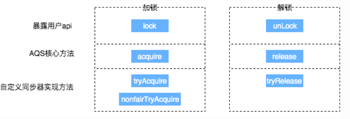
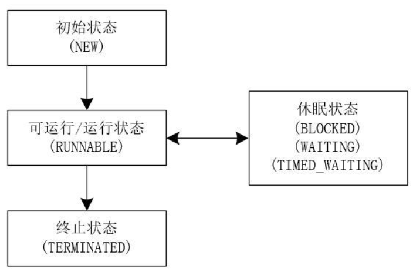
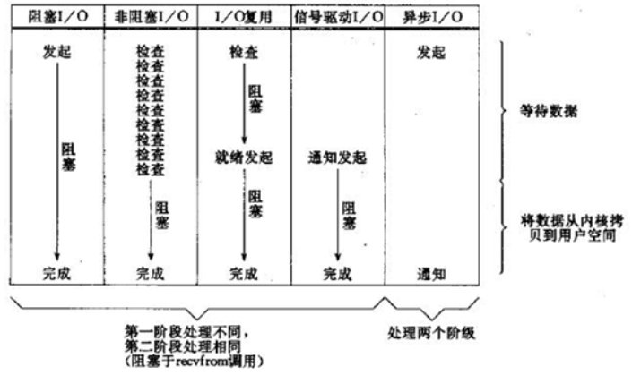
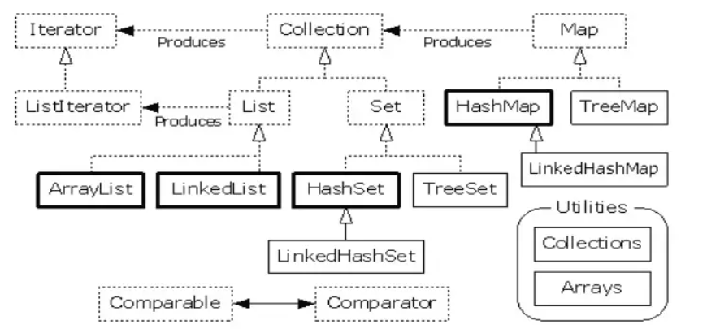
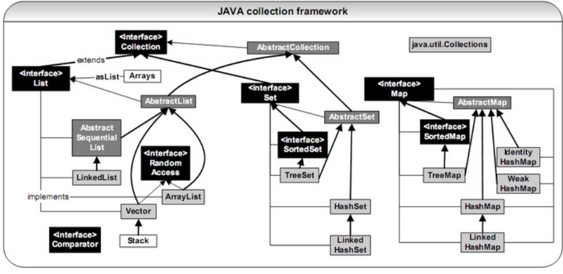
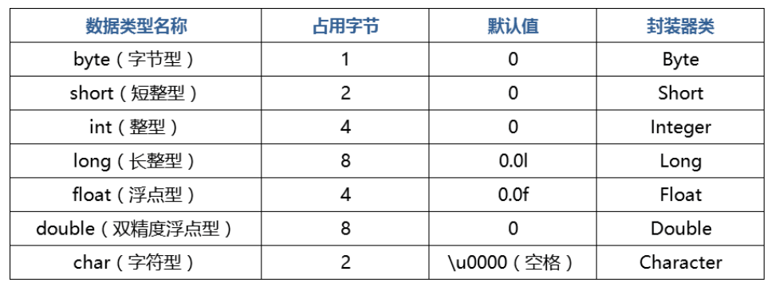

 concurrentHashMap 原 理 和ThreadPoolExcutor 原理
 ReentrantReadWriteLock源码
 java 反射原理
 hashmap 原理
 spring事务的实现原理
 手写生产者消费者

HashMap
**hashMap put get过程**
    
**hashp什么时候退回回[链表](/jump/super-jump/word?word=%E9%93%BE%E8%A1%A8)？为什么不是7**
    
**取模的时候为什么用&(length-1)**容量不是2的整数次幂 还用&(length-1) 影响会怎样？**
    
**容量不是2的整数次幂 还用&(length-1) 影响会怎样？：容量是2的整数次幂，n -1 后，高位为1后的0都变为1，如 16：10000, 16-1=15：1111, 1111 再与 hash 做 & 运算的时候，各个位置的取值取决于 hash；如果不是2的整数次幂，必然会有的0的位，0与任何数&肯定为0，会造成更多的哈希冲突**

[哈希表](https://www.nowcoder.com/jump/super-jump/word?word=%E5%93%88%E5%B8%8C%E8%A1%A8)的作用 [哈希表](https://www.nowcoder.com/jump/super-jump/word?word=%E5%93%88%E5%B8%8C%E8%A1%A8)使用的数据结构 哈希内部解决哈希冲突的方式有哪几种
hashmap原理,扩容,问了我hashmap怎么缩容
hashtable hashmap synchronizedmap concurrentmap
为什么负载因子是0.75
HashMap八股（数据结构，扩容，[链表](https://www.nowcoder.com/jump/super-jump/word?word=%E9%93%BE%E8%A1%A8)和[红黑树](https://www.nowcoder.com/jump/super-jump/word?word=%E7%BA%A2%E9%BB%91%E6%A0%91)转换）
有哪些线程安全的集合类，讲一讲原理（HashTable，ConcurrentHashMap，CopyOnWriteArrayList）

1.  ArrayList、Linkedlist
2. ArrayList和LinkedList区别
3.  HashMap、HashTable
4. 实现String的equals()
5.  [一致性哈希算法](https://www.nowcoder.com/jump/super-jump/word?word=%E4%B8%80%E8%87%B4%E6%80%A7%E5%93%88%E5%B8%8C%E7%AE%97%E6%B3%95)
Java里的Map有哪几种实现
(HashMap | TreeMap | HashTable | LinkedHashMap | ConcurrentHashMap)
 TreeMap的使用场景，底层数据结构，[红黑树](https://www.nowcoder.com/jump/super-jump/word?word=%E7%BA%A2%E9%BB%91%E6%A0%91)的存取复杂度
LinkedHashMap的使用场景

(用LinkedHashMap实现lru，按插入顺序(默认) accessOrder = false | 按访问顺序 accessOrder = true，HashMap+双向[链表](/jump/super-jump/word?word=%E9%93%BE%E8%A1%A8))

Java中常用的集合类  
(先说Collection和Map接口，再分别说子接口和实现类，以及大概的区别，没让细讲源码)
HashMap 多线程下，怎么个个不安全法，数据丢失问题。
 
多线程
1.  多线程环境下为什么要引入同步的机制
2. 1.  java内部有哪些同步的机制 回答 synchronized 和 retrenlock 问 这两种锁有哪些区别
3. 1.  多线程什么场景下会发生死锁
4. 1.  有什么具体的办法可以避免死锁
5. volatile的作用和原理  
什么是原子性  
volatile能不能保证原子性
 finally的实现原理
 1.  volatile的理解

乐观锁和悲观锁
  
Java中有个volatile关键字用过吗，用volatile修饰的变量来记录访问次数，需要其他同步操作吗

(场景：单例模式等，参考《深入理解Java虚拟机》第12章12.3.3“对于volatile型变量的特殊规则”，从Java内存模型JMM的角度讲volatile，说明指令中的lock前缀和将esp寄存器的值+0这个空操作)

Java有哪些同步方案，如果不加锁呢，加锁会不会太重了

(参考《深入理解Java虚拟机》第13章第2节，从“阻塞同步方案 | 非阻塞同步方案 | 无同步方案”三部分说明，面试官提到加锁会不会太重的时候，我提了一下synchronized锁升级)

CAS的ABA问题是什么，要怎么解决
(参考《深入理解Java虚拟机》P477)

 有没有用过工具，怎么查看Java堆的统计信息
(参考《深入理解Java虚拟机》第4章，没用过工具，只说了常用了JVM参数)

Java中线程同步的方案有哪些  
(参考《深入理解Java虚拟机》第13章第2节，从“阻塞同步方案 | 非阻塞同步方案 | 无同步方案”三部分说明)
  
Lock接口的实现类  
(参考《Java并发编程的艺术》第5章，Lock接口的实现基本都是通过聚合了一个同步器的子类来完成线程访问控制的，引出了队列同步器AQS，实现类讲了ReentrantLock和ReentrantReadWriteLock)
  
-   面向对象和面向过程的区别
-   接口和抽象类的区别
-   多态的分类
-   异常体系
-   finally 的作用
-   如果在 finally 块中有 return 语句，发生异常会执行吗？不发生呢？
-   ArrayList 的扩容过程
-   非线程安全的集合怎么改为线程安全

volatile关键字的作用（引出Java内存模型，保证可见性，防止指令重[排序](https://www.nowcoder.com/jump/super-jump/word?word=%E6%8E%92%E5%BA%8F)）  
mesi协议  
内存屏障

3.从可重入锁出发， 要求写出基于可重入锁的阻塞队列，怎么实现。
4.从volatile出发， 要求写出volatile解决可见性的代码。


 3. 1.  继承，接口，抽象类区别？
1.  数组[链表](https://www.nowcoder.com/jump/super-jump/word?word=%E9%93%BE%E8%A1%A8)区别
反射
虚继承

深拷贝和浅拷贝区别


## HashMap底层机制🌟🌟🌟
[参考](https://www.cnblogs.com/niumoo/p/12602849.html)
### HashMap get和put过程
put过程：
1. 先计算出key对应的hashCode
2. 对hash值进行处理：高16位与低16位异或
3. 根据hash值计算出index值，也就是所在链表的头节点：index=hash&(table.length-1)
4. 如果hash值在hashMap中不存在，则执行插入，否则：
	1. 如果hash值存在，且两者equals返回true，则更新键值对
	2. equals返回false，则插入链表的尾部或者红黑树中。
5. 将存储元素数量+1
6. 检验是否需要扩容

get过程：
1. 计算key的hash值，获得该键值所在链表的数组下标
2. 顺序遍历链表，equals方法查找链表中K值对应的V值

### HashMap什么时候退回链表?为什么不是7？
1.  扩容 **resize()** 时，红黑树拆分成的树的结点数小于等于临界值6个，则退化成链表。
2. 移除元素 **remove( )** 时，在removeTreeNode() 方法会检查红黑树是否满足退化条件，与结点数无关。如果红黑树根 root 为空，或者 root 的左子树/右子树为空，【root.left.left 】根的左子树的左子树为空，都会发生红黑树退化成链表。

至于7，是为了作为缓冲，可以有效防止链表和树频繁转换。

### 容量不是2的整数次幂，还用&(length-1) 影响会怎样？
- 假如不是按2的幂次方，随便假设为length = 15，hash= 17，则10进制取余运算为2，二进制位运算为10001&01110 =0，**不会等于10进制的运算结果**；
- 而实际上length-1 = 14 = 01110和任何的hash相与，**最后的一位的0都会被舍弃**，所以任何的hash值和01110相与的结果都不会出现1101（13），1001（9）等数据（相当于与运算结果最后一位不会是1），所以相当于table的数组中index =13或者9的位置**永远不会保存到数据**，造成空间浪费；
- 所以就不能用位运算计算key对应的value的值，就要用10进制计算，速度就比不上二进制算法；

### 哈希表的作用，使用的数据结构
哈希表通过把关键码值映射到表中一个位置来访问记录，以加快查找的速度。
数组、链表和红黑树。

### 哈希内部解决哈希冲突的方式有哪几种？🌟🌟
开放定址法、链地址法、再哈希法、建立公共溢区

**开放定址法（再散列法）：**

当关键字key的哈希地址p = H（key）出现冲突时，以p为基础，产生另一个哈希地址p1，如果p1仍然冲突，再以p为基础，产生另一个哈希地址p2，…，直到找出一个不冲突的哈希地址pi ，将相应元素存入其中。

线性探测：冲突发生时，顺序查看表中下一单元，直到找出一个空单元或查遍全表。
平方探测：冲突发生时，在表的左右进行跳跃式探测(1，-1，4，-4，9，-9)，比较灵活。
伪随机探测再散列：应建立一个伪随机数发生器，（如i=(i+p) % m），并给定一个随机数做起点。i为H(key)，p的值可以是(1,2,3...)也可以是(1，-1，4，-4...)，也可以是个随机数序列(2,5,9...)

**再哈希法**
同时构造多个不同的哈希函数，当哈希地址发生冲突时，计算第二个哈希地址。这种方法不易产生聚集，但增加了计算时间。

**链地址法**

**建立公共溢出区**
将哈希表分为基本表和溢出表两部分，凡是和基本表发生冲突的元素，一律填入溢出表。

与开放定址法相比，链地址法有如下几个优点：
1. 链地址法处理冲突简单，且无堆积现象，即非同义词决不会发生冲突，因此平均查找长度较短；
2. 由于链地址法中各链表上的结点空间是动态申请的，故它更适合于造表前无法确定表长的情况；
3. 开放定址法为减少冲突，要求装填因子α较小，故当结点规模较大时会浪费很多空间。而链地址法中可取α≥1，且结点较大时，链地址法中增加的指针域可忽略不计，因此节省空间；
4. 用链地址法构造的散列表中，删除结点的操作易于实现。只要简单地删去链表上相应的结点即可。而对开放地址法构造的散列表，删除结点不能简单地将被删结点的空间置为空，否则将截断在它之后填入散列表的同义词结点的查找路径。这是因为各种开放地址法中，空地址单元(即开放地址)都是查找失败的条件。因此在用开放地址法处理冲突的散列表上执行删除操作，只能在被删结点上做删除标记，而不能真正删除结点。

链地址法的缺点是：指针需要额外的空间，故当结点规模较小时，开放定址法较为节省空间，而若将节省的指针空间用来扩大散列表的规模，可使装填因子变小，这又减少了开放定址法中的冲突，从而提高平均查找速度。

### HashMap底层为什么要用红黑树呢？为什么不用平衡二叉树？
[参考](https://www.cnblogs.com/wq-9/articles/14202773.html)
红黑树是许多二叉查找树中的一种，它能保证在最坏的情况下，基本动态集合操作时间为O(lgn)。

红黑树是用**非严格的平衡**来换取增删节点时候旋转次数的降低，任何不平衡都会在三次旋转之内解决，而AVL是严格平衡树，因此在增加或者删除节点的时候，根据不同情况，旋转的次数比红黑树要多。

### HashMap初始化可以指定的参数
initialCapacity：初始化容量，默认是16
loadFactor：装载因子，默认是0.75

### HashMap插入流程🐋
[参考](https://javadoop.com/post/hashmap)
- 第一次put时会触发resize()操作，初始化到默认的16容量
-  通过(n - 1) & hash获得数组下标，如果这个位置为null，则初始化一个node放在这里
- 如果数组该位置有数据， 首先，判断该位置的第一个数据和我们要插入的数据，hash值和key 是不是"相等"，如果是，取出这个节点
- 如果不相等且是红黑树的结点，调用红黑树的插入方法
- 最后是链表，如果没有找到相等的，在链表末尾插入结点，插入后节点数量有8个了就将链表转化为红黑树
- 如果**找到key相等的结点，用新值覆盖旧值，并返回旧值**
- 如果新插入的值**导致容量大于阈值，扩容**

### HashMap扩容
- 用新的数组大小初始化新的数组（为原来的两倍，阈值也扩大一倍）
- 开始遍历原数组，进行数据迁移
- 如果该数组位置上只有单个元素，简单迁移这个元素就可以了
- 如果是链表，需要将此链表拆成两个链表，放到新的数组中，并且保留原来的先后顺序
- 用loHead、loTail 对应一条链表，hiHead、hiTail 对应另一条链表，用`if ((e.hash & oldCap) == 0)`判断结点，== 0表面留在原地，== 1表面要迁移。用多的那一个高位来判断是否要迁移。那一位在扩容前没有参与计算位置，扩容后就要参与计算了。

```java
for (int j = 0; j < oldCap; ++j) {
	// ...
	newTab[j] = loHead;
	newTab[j + oldCap] = hiHead;
}
```

put的时候判断
```java
if (binCount >= TREEIFY_THRESHOLD - 1) // -1 for 1st
	treeifyBin(tab, hash);

final void treeifyBin(Node<K,V>[] tab, int hash) {
	// 如果数组长度没有到64，就先扩容
	if (tab == null || (n = tab.length) < MIN_TREEIFY_CAPACITY)
		resize();
```
***
如果tab[i]没有结点，则新建头节点；
否则判断是头节点，或者在链表中找，或者在树中找，如果是链表，就插入一个新节点，并判断是否要树化；
如果key存在，则修改value；

### HashMap扩容和缩容
数组的容量是以2的幂次方扩容的，那么一个Entity在扩容时，新的位置要么在**原位置**，要么在**原长度+原位置**的位置。因此，在扩容时，不需要重新计算元素的hash了，只需要判断最高位是1还是0就好了。

### HashMap为什么线程不安全？
JDK1.7 中，多线程对HashMap进行扩容。某个线程执行过程中，被挂起，当其他线程已经完成数据迁移，由于是头插法，等CPU资源释放后被挂起的线程重新执行之前的逻辑，数据已经被改变，造成死循环、数据丢失。

JDK1.8 中，多线程对HashMap进行put操作。假设两个线程A、B都在进行put操作，并且**hash函数计算出的插入下标是相同**的，当线程A执行完判断是否发生哈希碰撞后后由于时间片耗尽导致被挂起，而线程B得到时间片后在该下标处插入了元素，完成了正常的插入，然后线程A获得时间片，由于之前已经进行了hash碰撞的判断，所有此时不会再进行判断，而是直接进行插入，这就导致了线程B插入的数据被线程A覆盖了，从而线程不安全。

### HashMap死循环的情况
1.7 头插法
[参考](https://blog.csdn.net/littlehaes/article/details/105241194)

### ConcurrentHashMap插入元素
- 如果数组"空"，进行数组初始化
- 找到hash 值对应的数组下标，得到第一个节点f。如果数组该位置为空，用一次 CAS 操作将这个新值放入其中即可。
- 如果不为空，则在f上用synchronized
- 遍历链表，判断是否要进行值覆盖
- 到了链表的最末端，将这个新值放到链表的最后面
- 如果f是红黑树类型，调用红黑树的插值方法插入新节点
- 判断是否要将链表转换为红黑树，当前数组的长度大于 64且链表元素8或以上

初始化：
- 初始化方法中的并发问题是通过对 sizeCtl 进行一个 CAS 操作来控制的。
- 将 sizeCtl 设置为 -1，代表抢到了锁
- 将sizeCtl = sc;

扩容tryPresize方法：
- c：size 的 1.5 倍，再加 1，再往上取最近的 2 的 n 次方。

### HashTable、Collections.SynchronizedMap、ConcurrentHashMap🌟🌟

Hashtable 和 Collections.synchronizedMap() 方法返回的 SynchronizedMap 都是通过锁住整个对象实例的方法确保线程安全的。

ConcurrentHashMap 在不发生哈希冲突的情况下尽可能使用 CAS 确保线程安全，在发生哈希冲突情况下采用 synchronized 同步代码块方法锁住当前 Node 结点（只锁当前数组下标的 Node，其余结点不受影响）

Hashtable 的数据结构是数组加链表

[面试必备：HashMap、Hashtable、ConcurrentHashMap的原理与区别](https://www.cnblogs.com/heyonggang/p/9112731.html)

### HashMap 和 HashTable 区别🐋
[参考](https://juejin.cn/post/6844903925460500487)
- HashTable是线程安全，HashMap是非线程安全。
- HashMap可以使用null作为key。HashMap以null作为key时，总是存储在table数组的第一个节点上。而 HashTable则不允许null作为key。
- HashMap继承了AbstractMap，HashTable继承Dictionary抽象类，两者均实现Map接口。
- HashMap的初始容量为16， HashTable初始容量为11，两者的填充因子默认都是0.75。HashMap扩容时是当前容量翻倍即:capacity * 2， HashTable扩容时是容量翻倍+1即:capacity * 2+1。`int newCapacity = (oldCapacity << 1) + 1;`
- HashMap和Hashtable的底层实现都是数组+链表结构实现。
- Hashtable计算hash是直接使用key的hashcode对table数组的长度直接进行取模；HashMap计算hash对key的hashcode进行了二次hash，以获得更好的散列值，然后对table数组长度取模。`int index = (e.hash & 0x7FFFFFFF) % newCapacity;`

### ConcurrentHashMap为什么是线程安全的？🌟
[参考](https://segmentfault.com/a/1190000041329741)
jdk1.7中ConcurrentHashMap是由一个Segment数组和多个HashEntry数组组成。Segment 本身是基于 ReentrantLock 实现的加锁和释放锁的操作，这样就能保证多个线程同时访问 ConcurrentHashMap 时，同一时间只有一个线程能操作相应的节点，这样就保证了 ConcurrentHashMap 的线程安全。

jdk1.8中ConcurrentHashMap是数组+链表，或者数组+红黑树结构。在 JDK 1.8 中，添加元素时首先会判断容器是否为空，如果为空则使用 volatile 加 CAS 来初始化。如果容器不为空则根据存储的元素计算该位置是否为空，如果为空则利用 CAS 设置该节点；如果不为空则使用 synchronize 加锁，遍历桶中的数据，替换或新增节点到桶中，最后再判断是否需要转为红黑树，这样就能保证并发访问时的线程安全了。

### ConcurrentHashMap底层原理

### 为什么负载因子是0.75
在理想情况下，使用随机哈希码，在扩容阈值（加载因子）为0.75的情况下，节点出现在频率在Hash桶（表）中遵循参数平均为0.5的泊松分布。

常数0.5是作为参数代入泊松分布来计算的，而加载因子0.75是作为一个条件，当HashMap长度为length/size ≥ 0.75时就扩容，正常情况下，链表个数出现 8 的概念不到千万分之一。

对于开放定址法，加载因子是特别重要因素，应严格限制在0.7-0.8以下。超过0.8，查表时的CPU缓存不命中（cache missing）按照指数曲线上升。

### Map集合中put与putIfAbsent的区别🐨
1. 使用put方法添加键值对，如果map集合中没有该key对应的值，则直接添加，并返回null，如果已经存在对应的值，则会覆盖旧值，value为新的值。
2. 使用putIfAbsent方法添加键值对，如果map集合中没有该key对应的值，则直接添加，并返回null，如果**已经存在对应的值，则依旧为原来的值**。

### 有哪些线程安全的集合类，讲一讲原理
- CopyOnWriteArrayList：写入时复制，读取时固定，写入时避免覆盖造成数据问题。（当我们往一个容器添加元素的时候，不直接往当前容器添加，而是先将当前容器进行Copy，复制出一个新的容器，然后新的容器里添加元素，添加完元素之后，再将原容器的引用指向新的容器）
- CopyOnWriteArraySet
- HashSet：底层使用了HashMap中的Key。
- ConcurrentHashMap：采用CAS+synchronized来保证并发安全性，且synchronized关键字不是用在方法上而是用在了具体的对象上，实现了更小粒度的锁。ConcurrentHashMap采用数组+链表+红黑树，当链表长度超过某一个值，则将链表转成红黑树，提高查询效率。
- Hashtable：采用对象锁(synchronized修饰对象方法)来保证线程安全，Hashtable采用的是数组+链表，当链表过长会影响查询效率。
- Callable接口

### 自定义对象作为hashmap的key需要注意什么
必须重写equals()和hashCode()方法。
因为重写了equals方法和hashcode方法后person对象变成了不可变对象,和String对象类似。 首先我们来都知道Object类的hashCode()方法返回这个对象存储的内存地址的编号,而equals()比较的是内存地址是否相等。每次new出来的对象的的地址都是不相等的。 所以使用新new对象去寻找是找不到的, 除非你重写了这2个方法, 这样找到的value。

### 集合类的顶级接口
java.until.Collection接口，所有集合的顶级接口，里面规定了集合所必须具备的相关功能

### List、Set、Map初始容量
ArrayList是10
Set是16
```java
map = new HashMap<>(Math.max((int) (c.size()/.75f) + 1, 16));
```

### ArrayList和LinkedList区别🐋🧊🌟🌟
[逼着面试官问了我ArrayList和LinkedList的区别，他对我彻底服了](https://cloud.tencent.com/developer/news/700913)

**ArrayList**
ArrayList **实现了List接口**，继承了**AbstractList抽象类**，底层是基于数组实现的，并且实现了动态扩容。

实现了 **RandomAccess 接口**，支持快速随机访问（不需要遍历，就可以通过下标（索引）直接访问）

ArrayList 还实现了 **Serializable 接口**，标记“实现了这个接口的类支持序列化”。Java 的序列化是指，将对象转换成以字节序列的形式来表示，这些字节序中包含了对象的字段和方法。序列化后的对象可以被写到数据库、写到文件，也可用于网络传输。

一旦在添加元素的时候，发现容量用满了 s == elementData.length，就按照原来数组的 1.5 倍（oldCapacity + oldCapacity >> 1）进行扩容。扩容之后，再将原有的数组复制到新分配的内存地址上 Arrays.copyOf(elementData, newCapacity)。

如果把整个数组都序列化的话，闲置的空间就非常大。它使用了 ArrayList 的实际大小 size 而不是数组的长度（elementData.length）来作为元素的上限进行序列化。

**LinkedList**
LinkedList 是一个继承自 **AbstractSequentialList 的双向链表**，因此它也可以被当作堆栈、队列或双端队列进行操作。

LinkedList 内部定义了一个 Node 节点，它包含 3 个部分：元素内容 item，前引用 prev 和后引用 next。

LinkedList 在序列化的时候只保留了元素的内容 item，并没有保留元素的前后引用。

遍历 LinkedList 的时候，千万不要使用 for 循环，要使用迭代器。

**区别**
```java
public class ArrayList<E> extends AbstractList<E>
        implements List<E>, RandomAccess, Cloneable, java.io.Serializable

public class LinkedList<E>
    extends AbstractSequentialList<E>
    implements List<E>, Deque<E>, Cloneable, java.io.Serializable
```
1. ArrayList 实现了List接口，继承了**AbstractList**抽象类，底层是基于数组实现的，并且实现了动态扩容。LinkedList 是一个继承自 **AbstractSequentialList** 类的双向链表，因此它也可以被当作堆栈、队列或双端队列进行操作。
2. 对于随机访问，ArrayList优于LinkedList，ArrayList实现了**RandomAccess 接口**，可以根据下标以O(1)时间复杂度对元素进行随机访问。而LinkedList的每一个元素都依靠地址指针和它后一个元素连接在一起，在这种情况下，查找某个元素的时间复杂度是O(n)
3. LinkedList 在删除比较靠前和比较靠后的元素时，非常高效，但如果删除的是中间位置的元素，效率就比较低了。ArrayList删除头部花费时间较多。
	1. 如果是从集合的尾部新增元素，ArrayList 花费的时间应该比 LinkedList 少，因为数组是**一段连续的内存空间**，也不需要复制数组；而链表需要创建新的对象，前后引用也要重新排列。
	2. ArrayList 在添加元素的时候如果不涉及到扩容，性能在两种情况下（中间位置新增元素、尾部新增元素）比 LinkedList 好很多，只有头部新增元素的时候比 LinkedList 差，因为数组复制的原因。

### ArrayList扩容过程🐨🌟
[参考](https://juejin.cn/post/6844903777544175623)
底层其实是调用了Arrays.copyOf方法来进行扩充数组容量的。

默认情况下，新的容量会是原容量的1.5倍，这里用了位运算提高效率。一般情况下，如果扩容1.5倍后就大于期望容量，那就返回这个1.5倍旧容量的值。而如果小于期望容量，那就返回期望容量。这里对默认容量10做了特殊处理。

使用1.5倍这个数值而不是直接使用期望容量，是为了防止频繁扩容影响性能。试想如果每次add操作都要扩容一次，那性能将会非常低下。

```java
// 设置新容量为旧容量的1.5倍
int newCapacity = oldCapacity + (oldCapacity >> 1); 
```

### 线程安全的集合类🌟
使用java.util.concurrent包提供的线程安全的并发集合可以大大简化多线程编程：


### LinkedBlockingQueue和ArrayBlockingQueue的区别
- ArrayBlockingQueue是有界的，而LinkedBlockingQueue默认是无界的
- ArrayBlockingQueue内部使用1个锁来控制队列项的插入、取出操作【一个lock和两个condition，not full，not empty】，而LinkedBlockingQueue则是使用了2个锁来控制，一个名为putLock，另一个是takeLock，但是锁的本质都是ReentrantLock。因为LinkedBlockingQueue使用了2个锁的情况下，所以在一定程度上LinkedBlockingQueue能更好支持高并发的场景操作。【putlock对应的是notFull，takeLock对应的是notEmpty】

### List线程安全
Vector集合的所有操作元素的方法都加了synchronized关键字，这就导致了操作Vector的效率会非常低，在开发中，往往读操作的使用频率会远高于其他操作，而CopyOnWriteArrayList 就是这样一种读操作效率远高于写操作效率的List。

CopyOnWriteArrayList 底层是也是有数组实现的。 本文我们只解读添加元素和读取元素的区别，删除修改元素原理和添加元素差不多，操作时都需要进行加锁，而读操作不会加锁。

Vector和CopyOnWriteArrayList都是线程安全的List，底层都是数组实现的，Vector的每个方法都进行了加锁，而CopyOnWriteArrayList的读操作是不加锁的，因此CopyOnWriteArrayList的读性能远高于Vector，Vector每次扩容的大小都是原来数组大小的2倍，而CopyOnWriteArrayList不需要扩容，通过COW思想就能使数组容量满足要求。

**CopyOnWriteArrayLis的缺点：**
- 因为CopyOnWrite的写时复制机制，所以在进行写操作的时候，内存里会同时驻扎两个对象的内存，旧的对象和新写入的对象。如果这些对象占用的内存比较大，比如说200M左右，那么再写入100M数据进去，内存就会占用300M，那么这个时候很有可能造成频繁的Yong GC和Full GC。

- CopyOnWrite容器只能保证数据的最终一致性，不能保证数据的实时一致性。所以如果你希望写入的的数据，马上能读到，请不要使用CopyOnWrite容器。

### ArrayList，LinkedList对应的线程安全类
[参考](https://blog.csdn.net/qq_32907195/article/details/111562232)
方法1： Collections.synchronizedList(new LinkedList\<String>())
方法2:    LinkedList和ArrayList换成线程安全的集合，如CopyOnWriteArrayList，ConcurrentLinkedQueue......
方法3：Vector(内部主要使用synchronized关键字实现同步)

### 实现String.equals()
先比较地址值是否相等，在比较字符串的长度是否相等，最后对每个字符做一一对应比较。

1. 判断**引用值**是否相等，相等即返回rue，不用往下走；
2. 判断**类型**是否匹配，类型相同，**长度**相等，逐个比较**字符**是否一样，完全符合，则返回ture，一旦不对，返回false；
3. 类型不匹配，返回false

### TreeMap的使用场景，底层数据结构，红黑树的存取复杂度
TreeMap 实现了 SortMap 接口，其能够根据键排序，默认是按键的升序排序，也可以指定排序的比较器。当用 Iterator 遍历 TreeMap 时得到的记录是排过序的，TreeMap 取出来的是排序后的键值。

TreeMap 基于红黑树实现。

Treemap 红黑树中一个节点对应一个kv对，没有冗余无效的Node节点。而HashMap 的数组中，可能存在较多的空位。

TreeMap 的查询时间复杂度为 O(logN), 而HashMap为 O(1)，所以Map的元素越多，TreeMap根据key查询的效率会更低；

TreeMap 每次新增or删除一个kv对，都可能导致红黑树的重排；HashMap 当新增一个kv对，使得Map中的个数大于阀值时，需要对数组进行重新扩容。

对Map中的kv对有排序需求时，选择 TreeMap, 这种场景下，尽量保证以下几点：
- Map 元素基本保持不变（即很少添加和删除）
- 主要用于遍历迭代获取数据
- 不存在碰撞的情况（即两个不同的key，根据比较器获取值不能为0）

### TreeSet原理
TreeSet其实底层是通过TreeMap实现的。TreeSet的作用是保存无重复的数据，不过还对这些数据进行了排序。TreeMap的底层是通过红黑树实现的，所以TreeSet底层也是通过红黑树实现的。TreeSet最主要的特点就是对元素进行了排序。

**为什么value使用object作为值？**
```java
//add方法其实就是Map的put方法
public boolean add(E e) {
    return m.put(e, PRESENT)==null;
}
//remove方法其实就是Map的remove方法
public boolean remove(Object o) {
    return m.remove(o)==PRESENT;
}
```
元素e重复，m.put(e, PRESENT)一看e这个key已经存在了，就会将PRESENT替换掉相应的value值。然后map返回这个value。value不等于null，于是返回false。很明显插入失败了。

### Comparable接口和Comparator接口的区别
Comparable接口实现在自身类中，代表默认排序，相当于内部比较器；
而Comparator接口则是为类外实现的一个比较器，相当于外部比较器。
```java
public class Student implements Comparable<Student> {
    @Override
    public int compareTo(Student o) {
        return this.getGrade() > o.getGrade() ? 1 : this.getGrade() < o.getGrade() ? -1 : this.getName().compareTo(o.getName());
    }
}

Collections.sort(arr);
```

```java
public class StuCompartor implements Comparator<Student> {
    @Override
    public int compare(Student o1, Student o2) {
        return o1.getGrade() > o2.getGrade() ? 1 : o1.getGrade() < o2.getGrade() ? -1 : o1.getName().compareTo(o2.getName());
    }
}

Collections.sort(arr, new StuCompartor());//外部比较器
```

### LinkedHashMap的使用场景
[java集合类之LinkedHashMap](https://zhuanlan.zhihu.com/p/267377210)

HashMap有一个问题，就是迭代HashMap的顺序并不是HashMap放置的顺序，也就是无序。

根据插入顺序排序，此外，LinkedHashMap还有一个参数决定是否在此基础上再根据访问顺序(get,put)排序，记住，是在**插入顺序的基础上再排序**。

例如，我们构建一个空间占用敏感的资源池，希望可以自动将最不常被访问的对象释放掉，这就可以利用 LinkedHashMap 提供的机制来实现。

LinkedHashMap的数据存储和HashMap的结构一样采用(数组+单向链表)的形式，只是在每次节点Entry中增加了用于维护顺序的before和after变量维护了一个双向链表来保存LinkedHashMap的存储顺序。

当我们开启**accessOrder**为true时，最新访问(get或者put(更新操作))的数据会被**丢到队列的尾巴**处，那么双向队列的头就是最不经常使用的数据了。

removeEldestEntry(Map.Entry<K,V> eldest) 方法。该方法可以提供在每次添加新条目时移除最旧条目的实现程序，默认返回 false。

### LinkedHashMap和HashMap有什么区别
LinkedHashMap继承了HashMap，Entry里还记载了Before和After，hashMap里的node只有next。
afterNodeAccess方法会把结点移到末尾，通过accessOrder=true来控制。

### [LinkedList 那种场景比 ArrayList 更好？](https://xie.infoq.cn/article/d9955e0d2657f6481a8c9b448)
- 从集合头部位置添加元素LinkedList快很多。
- 从集合尾部位置添加元素：在没有扩容的情况下，ArrayList 的效率要高于 LinkedList。
- 从集合中间位置位置添加元素：LinkedList 将元素添加到中间位置，是添加元素最低效率的，因为靠近中间位置，在添加元素之前的循环查找是遍历元素最多的操作。

ArrayList 和 LinkedList 删除元素操作测试的结果和添加元素操作测试的结果很接近！
如果需要在 List 的**头部进行大量的插入、删除操作**，那么直接选择 LinkedList。否则，ArrayList 即可。

### Java常用的集合类
List、Set、Map

### 能排序的set实现原理
TreeSet底层是TreeMap来实现的。底层基于红黑树实现。

和 HashSet 不同的是，TreeSet 中的元素不需要重写 hashCode() 和 equals() 方法，因为 TreeSet 是通过比较器去重的，所有元素都必须实现 Comparable 接口，然后重写 compareTo() 方法。

### HashMap为什么线程不安全
[面试官： HashMap 为什么线程不安全？](https://juejin.cn/post/6844904149616705543)
1.  在 jdk1.7 中，在多线程环境下，扩容时会造成环形链或数据丢失。 
2.  在 jdk1.8 中，在多线程环境下，会发生数据覆盖的情况。

### 讲讲 ConcurrentHashMap ？
HashMap是线程不安全的，目前主要用的ConcurrentHashMap来保证线程安全性。


一个 Segment里包含一个 HashEntry 数组，每个 HashEntry 是一个链表结构的元素， 每个 Segment守护着一个 HashEntry 数组里的元素，当对 HashEntry数组的数据进行修改时，必须首先获得它对应的 Segment 锁。

内部使用段(Segment)来表示这些不同的部分，每个段其实就是一个小的HashTable，只要多个修改操作发生在不同的段上，它们就可以并发进行。

用于存储键值对数据的HashEntry，在设计上它的成员变量value跟next都是volatile类型的，这样就保证别的线程对value值的修改，get方法可以马上看到。

>先通过hash值找segment的位置，再通过另一个hash值找在map里的位置

**JDK1.8相比JDK1.7：**
1. 取消了segment数组，直接用table保存数据，锁的粒度更小，减少并发冲突的概率。采用table数组元素作为锁，从而实现了对每一行数据进行加锁，进一步减少并发冲突的概率，并发控制使用Synchronized和CAS来操作。【concurrentHashMap内部使用sychronized + volatile + CAS 的实现降低锁的粒度，大家可以认为粒度就是HashEntry（首节点）】
2. 存储数据时采用了数组+ 链表+红黑树的形式。

### 介绍下自旋锁和互斥锁，可重入锁和不可重入锁，公平锁和非公平锁的区别🌟
[不可不说的Java“锁”事](https://tech.meituan.com/2018/11/15/java-lock.html)
公平锁是指多个线程按照申请锁的顺序来获取锁。
非公平锁是指多个线程获取锁的顺序并不是按照申请锁的顺序，有可能后申请的线程比先申请的线程优先获取锁。有可能，会造成优先级反转或者饥饿现象。

可重入锁：可重入锁指的是在一个线程中可以多次获取同一把锁，比如：**一个线程在执行一个带锁的方法，该方法中又调用了另一个需要相同锁的方法，则该线程可以直接执行调用的方法，而无需重新获得锁**；【一个线程中的多个流程能不能获取同一把锁】
不可重入锁：当前线程执行某个方法已经获取了该锁，那么在方法中尝试再次获取锁时，就会获取不到被阻塞。

互斥锁：用于保护临界区，确保同一时间只有一个线程访问数据。对共享资源的访问，先对互斥量进行加锁，如果互斥量已经上锁，调用线程会阻塞，直到互斥量被解锁。
自旋锁与互斥锁有点类似，只是自旋锁不会引起调用者睡眠，如果自旋锁已经被别的执行单元保持，调用者就一直循环在那里看是否该自旋锁的保持者已经释放了锁。
当加锁失败时，**互斥锁用「线程切换」来应对，自旋锁则用「忙等待」来应对。**

### 为什么公平锁要比非公平锁慢？🐨
**公平锁**
获取锁时，先将线程自己添加到等待队列的队尾并休眠，当某线程用完锁之后，会去唤醒等待队列中队首的线程尝试去获取锁，锁的使用顺序也就是队列中的先后顺序，在整个过程中，线程会从运行状态切换到休眠状态，再从休眠状态恢复成运行状态，但线程每次休眠和恢复都需要从用户态转换成内核态，而这个状态的转换是比较慢的，所以公平锁的执行速度会比较慢。

**非公平锁**
当线程获取锁时，会先通过 CAS 尝试获取锁，如果获取成功就直接拥有锁，如果获取锁失败才会进入等待队列，等待下次尝试获取锁。这样做的好处是，获取锁不用遵循先到先得的规则，从而避免了线程休眠和恢复的操作，这样就加速了程序的执行效率。

公平锁要维护一个队列，后来的线程要加锁，即使锁空闲，也要先检查有没有其他线程在 wait，如果有自己要挂起，加到队列后面，然后唤醒队列最前面的线程。这种情况下**相比较非公平锁多了一次挂起和唤醒。**
线程切换的开销，其实就是非公平锁效率高于公平锁的原因，因为非公平锁减少了线程挂起的几率，后来的线程有一定几率逃离被挂起的开销。

### Java对象中对象头有哪些内容？🐋
[参考](https://www.cnblogs.com/xiaofuge/p/13895226.html)

- mark-word：对象标记字段占4个字节，用于存储一些列的标记位，比如：哈希值、轻量级锁的标记位，偏向锁标记位、分代年龄等。
- Klass Pointer：Class对象的类型指针，Jdk1.8默认开启指针压缩后为4字节，关闭指针压缩（-XX:-UseCompressedOops）后，长度为8字节。其指向的位置是对象对应的Class对象（其对应的元数据对象）的内存地址。
- 对象实际数据：包括对象的所有成员变量，大小由各个成员变量决定，比如：byte占1个字节8比特位、int占4个字节32比特位。
- 对齐：最后这段空间补全并非必须，仅仅为了起到占位符的作用。由于HotSpot虚拟机的内存管理系统要求对象起始地址必须是8字节的整数倍，所以对象头正好是8字节的倍数。因此当对象实例数据部分没有对齐的话，就需要通过对齐填充来补全。


***
由 Mark Word、Class Pointer、数组长度三个字段组成。
- Mark Word：主要用于存储自身运行时数据
- Class Pointer：是指针，指向方法区中该 class 的对象，JVM 通过此字段来判断当前对象是哪个类的实例
- 数组长度：当且仅当对象是数组时才会有该字段


### Java的对象头mark word
[参考](https://juejin.cn/post/6978882583492821023)
mark word主要用来表示对象的线程**锁状态**，另外还可以用来**配合GC**、以及存放该对象的**hashCode**

- 在正常不加锁时，mark word 由lock、biased_lock、age、identity_hashcode组成，age是GC的年龄，最大15（4位），每从Survivor区复制一次，年龄增加1。identity_hashcode就是对象的哈希码，当对象处于加锁状态时，这个哈希码会移到monitor，（synchronized会在代码块前后插入monitor）。

- 在偏向锁时，mark word 由lock、biased_lock、age、epoch、thread组成。epoch：偏向锁在CAS锁操作过程中，偏向性标识，表示对象更偏向哪个锁。thread：持有偏向锁的线程ID，如果该线程再次访问这个锁的代码块，可以直接访问。

- 在轻量级锁时，mark word 由lock、ptr_to_lock_record组成。ptr_to_lock_record：指向栈中锁记录的指针。

- 在重量级锁时，mark word 由lock、ptr_to_heavyweight_monitor组成。ptr_to_heavyweight_monitor：指向对象监视器Monitor的指针。

### 锁升级🐋🌟🌟
[参考](https://blog.csdn.net/tongdanping/article/details/79647337)
[参考](https://tech.meituan.com/2018/11/15/java-lock.html)

**偏向锁的升级**
当一个线程访问同步代码块并获取锁时，会在Mark Word里存储锁偏向的线程ID。在线程进入和退出同步块时不再通过CAS操作来加锁和解锁，而是检测Mark Word里是否存储着指向当前线程的偏向锁。

偏向锁只有遇到其他线程尝试竞争偏向锁时，持有偏向锁的线程才会释放锁，线程不会主动释放偏向锁。偏向锁的撤销，需要等待全局安全点（在这个时间点上没有字节码正在执行），它会首先暂停拥有偏向锁的线程，判断锁对象是否处于被锁定状态。撤销偏向锁后恢复到无锁（标志位为“01”）或轻量级锁（标志位为“00”）的状态。

**轻量级锁**
是指当锁是偏向锁的时候，被另外的线程所访问，偏向锁就会升级为轻量级锁，其他线程会通过自旋的形式尝试获取锁，不会阻塞，从而提高性能。

在代码进入同步块的时候，如果同步对象锁状态为无锁状态（锁标志位为“01”状态，是否为偏向锁为“0”），虚拟机首先将在当前线程的**栈帧**中建立一个名为锁记录（Lock Record）的空间，用于存储锁对象目前的Mark Word的拷贝，然后拷贝对象头中的Mark Word复制到锁记录中。

拷贝成功后，虚拟机将使用CAS操作尝试将对象的Mark Word更新为指向Lock Record的指针，并将Lock Record里的owner指针指向对象的Mark Word。如果这个更新动作成功了，那么这个线程就拥有了该对象的锁，并且对象Mark Word的锁标志位设置为“00”，表示此对象处于轻量级锁定状态。如果轻量级锁的更新操作失败了，虚拟机首先会检查对象的Mark Word是否指向当前线程的栈帧，如果是就说明当前线程已经拥有了这个对象的锁，那就可以直接进入同步块继续执行，否则说明多个线程竞争锁。

若当前只有一个等待线程，则该线程通过自旋进行等待。但是当自旋超过一定的次数，或者一个线程在持有锁，一个在自旋，又有第三个来访时，轻量级锁升级为重量级锁。

**重量级锁**
升级为重量级锁时，锁标志的状态值变为“10”，此时Mark Word中存储的是指向重量级锁的指针，此时等待锁的线程都会进入阻塞状态。

***
[参考](https://blog.csdn.net/weixin_40910372/article/details/107726978)
偏向锁加锁过程：
1. 访问Mark Word中偏向锁的标识是否设置成1，锁标志位是否为01，确认为可偏向状态。
2. 如果为可偏向状态，则判断线程ID是否指向当前线程，如果是，进入步骤5，否则进入步骤3。
3. 如果线程ID并未指向当前线程，则通过CAS操作竞争锁。如果竞争成功，则将Mark Word中线程ID设置为当前线程ID，然后执行5；如果竞争失败，执行4。
4. 如果CAS获取偏向锁失败，则表示有竞争。当到达全局安全点（safepoint）时获得偏向锁的线程被挂起，偏向锁升级为轻量级锁，然后被阻塞在安全点的线程继续往下执行同步代码。【如果持有锁的线程在全局安全点检查时，不需要再使用该锁了则获取成功，程序继续执行，反之则获取锁失败，撤销偏向状态，升级为轻量级锁，即自旋锁。】
5. 执行同步代码。

轻量级锁的加锁过程：
1. 在代码进入同步块的时候，如果同步对象锁状态为无锁状态（锁标志位为“01”状态，是否为偏向锁为“0”），虚拟机首先将在当前线程的栈帧中建立一个名为锁记录（Lock Record）的空间，用于存储锁对象目前的Mark Word的拷贝，官方称之为 Displaced Mark Word。
2. 拷贝对象头中的Mark Word复制到锁记录中；
3. 拷贝成功后，虚拟机将使用CAS操作尝试将对象的Mark Word中的62位更新为指向Lock Record的指针，并将Lock record里的owner指针指向object mark word。如果更新成功，则执行步骤4，否则执行步骤5。
4. 如果这个更新动作成功了，那么这个线程就拥有了该对象的锁，并且对象Mark Word的锁标志位设置为“00”，即表示此对象处于轻量级锁定状态。
5. 如果这个更新操作失败了，虚拟机首先会检查对象的Mark Word是否指向当前线程的栈帧，如果是就说明当前线程已经拥有了这个对象的锁，那就可以直接进入同步块继续执行。此时为了提高获取锁的效率，线程会不断地循环去获取锁, 这个循环是有次数限制的, 如果在循环结束之前CAS操作成功, 那么线程就获取到锁, 如果循环结束依然获取不到锁, 则获取锁失败, 对象的MarkWord中的记录会被修改为指向互斥量（重量级锁）的指针，锁标志的状态值变为10，线程被挂起，后面来的线程也会直接被挂起。【在这个状态下，未抢到锁的线程都会进入 Monitor，之后会被阻塞在 _ WaitSet 队列中。】

重量级锁
在Java虚拟机(HotSpot)中，Monitor对象其实就是ObjectMonitor对象，这个对象是一个C++对象，定义在虚拟机源码中。
ObjectMonitor有比较多的属性，但是比较重要的属性有四个：
- _ count：计数器。用来记录获取锁的次数。该属性主要用来实现重入锁机制。
- _ owner：记录着当前锁对象的持有者线程。
- _ WaitSet：队列。当一个线程调用了wait方法后，它会释放锁资源，进入WaitSet队列等待被唤醒。
- _ EntryList：队列。里面存放着所有申请该锁对象的线程。【在wait set区域的线程获得Notify/notifyAll通知的时候，随机的一个Thread（Notify）或者是全部的Thread（NotifyALL）从Object Lock的wait set区域进入了entry set中。在当前拥有锁的线程释放掉锁的时候，处于该Object Lock的entryset区域的线程都会抢占该锁。】

所以一个线程获取锁对象的流程如下：
1. 判断锁对象的锁标志位是重量级锁，于是想要获取Monitor对象锁。
2. 如果Monitor中的_ count属性是0，说明当前锁可用，于是把 _ owner 属性设置为本线程，然后把 _ count 属性+1。这就成功地完成了锁的获取。
3. 如果Monitor中的_ count属性不为0，再检查 _ owner 属性，如果该属性指向了本线程，说明可以重入锁，于是把 _ count 属性再加上1，实现锁的冲入。
4. 如果 _ owner 属性指向了其他线程，那么该线程进入 _ EntryList 队列中等待锁资源的释放。
5. 如果线程**在持有锁的过程中调用了wait()方法**，那么线程释放锁对象，然后进入 _ WaitSet 队列中等待被唤醒。

synchronized的执行过程： 
1. 检测Mark Word里面是不是当前线程的ID，如果是，表示当前线程处于偏向锁 
2. 如果不是，则使用CAS将当前线程的ID替换Mard Word，如果成功则表示当前线程获得偏向锁，置偏向标志位1 
3. 如果失败，则说明发生竞争，撤销偏向锁，进而升级为轻量级锁。 
4. 当前线程使用CAS将对象头的Mark Word替换为锁记录指针，如果成功，当前线程获得锁 
5. 如果失败，表示其他线程竞争锁，当前线程便尝试使用自旋来获取锁。 
6. 如果自旋成功则依然处于轻量级状态。 
7. 如果自旋失败，则升级为重量级锁。

***
锁的状态总共有四种，级别由低到高依次为：无锁、偏向锁、轻量级锁、重量级锁，锁状态只能升级，不能降级。

锁竞争：如果多个线程轮流获取一个锁，但是每次获取锁的时候都很顺利，没有发生阻塞，那么就不存在锁竞争。只有当某线程尝试获取锁的时候，发现该锁已经被占用，只能等待其释放，这才发生了锁竞争。

[参考](https://tech.meituan.com/2018/11/15/java-lock.html)
无锁：
修改操作在循环内进行，线程会不断的尝试修改共享资源。如果没有冲突就修改成功并退出，否则就会继续循环尝试。**如果有多个线程修改同一个值，必定会有一个线程能修改成功，而其他修改失败的线程会不断重试直到修改成功。** CAS就是一种无锁的实现。

偏向锁：
**一段同步代码一直被一个线程所访问，那么该线程会自动获取锁，降低获取锁的代价。**
当一个线程访问同步代码块并获取锁时，会在Mark Word里存储锁偏向的线程ID。在线程进入和退出同步块时不再通过CAS操作来加锁和解锁，而是检测Mark Word里是否存储着指向当前线程的偏向锁。
轻量级锁的获取及释放依赖多次CAS原子指令，而偏向锁只需要在置换ThreadID的时候依赖一次CAS原子指令即可。

轻量级锁：
**一旦有第二个线程参与竞争，就会立即膨胀为轻量级锁。** 企图抢占的线程一开始会使用自旋的方式去尝试获取锁。如果循环几次，其他的线程释放了锁，就不需要进行用户态到内核态的切换。

重量级锁：
**试图抢占的线程自旋达到阈值，就会停止自旋，那么此时锁就会膨胀成重量级锁。** 当其膨胀成重量级锁后，其他竞争的线程进来就不会自旋了，而是直接阻塞等待，并且 Mark Word 中的内容会变成一个监视器（monitor）对象，用来统一管理排队的线程。

偏向锁通过对比Mark Word解决加锁问题，避免执行CAS操作。而轻量级锁是通过用CAS操作和自旋来解决加锁问题，避免线程阻塞和唤醒而影响性能。重量级锁是将除了拥有锁的线程以外的线程都阻塞。

### synchronized底层原理🌟🌟
[参考](https://blog.csdn.net/javazejian/article/details/72828483)
monitor对象存在于每个Java对象的对象头中。monitor是由ObjectMonitor实现的，_ owner指向持有ObjectMonitor对象的线程，当多个线程同时访问一段同步代码时，首先会进入 _ EntryList 集合，当线程获取到对象的monitor 后进入 _ Owner 区域并把monitor中的owner变量设置为当前线程，同时monitor中的计数器count加1，若线程调用 wait() 方法，将释放当前持有的monitor，owner变量恢复为null，count自减1，同时该线程进入 WaitSet集合中等待被唤醒。若当前线程执行完毕也将释放monitor(锁)并复位变量的值，以便其他线程进入获取monitor(锁)。

JVM可以从方法常量池中的方法表结构(method_info Structure) 中的 ACC_SYNCHRONIZED 访问标志区分一个方法是否同步方法。当方法调用时，调用指令将会检查方法的 ACC_SYNCHRONIZED 访问标志是否被设置，如果设置了，执行线程将**先持有monitor，然后再执行方法，最后再方法完成时释放monitor**。在方法执行期间，执行线程持有了monitor，其他任何线程都无法再获得同一个monitor。如果一个同步方法执行期间抛出了异常，并且在方法内部无法处理此异常，那这个同步方法所持有的monitor将在异常抛到同步方法之外时自动释放。

***
synchronized的对象锁，锁标识位为10，其中指针指向的是monitor对象。但当一个 monitor 被某个线程持有后，它便处于锁定状态。在Java虚拟机(HotSpot)中，monitor是由ObjectMonitor实现。

ObjectMonitor中有两个队列，_ WaitSet 和 _ EntryList，用来保存ObjectWaiter对象列表。_ owner指向持有ObjectMonitor对象的线程。

**同步语句块**的实现使用的是monitorenter 和 monitorexit 指令，当**执行monitorenter指令时，当前线程将试图获取 objectref(即对象锁) 所对应的 monitor 的持有权**，当 objectref 的 monitor 的进入计数器为 0，那线程可以成功取得 monitor，并将计数器值设置为 1，取锁成功。

**方法级**的同步是隐式，即无需通过字节码指令来控制的，它实现在方法**调用和返回**操作之中。JVM可以从方法常量池中的方法表结构(method_info Structure) 中的 **ACC_SYNCHRONIZED** 访问标志区分一个方法是否同步方法。

【就是说同步代码块执行monitorenter时，需要获取对象头中monitor的所有权。同步方法有ACC_SYNCHRONIZED标志，如果设置了，需要先获取对象头中monitor的所有权，再执行代码。】

### 多线程环境下为什么要引入同步的机制
不同的线程有自己的栈，栈中可能引用了多个对象，而多个线程可能引用到了堆中的同一个或多个对象，而线程的栈内存当中的数据只是临时数据，最终都是要刷新到堆中的对象内存。当多个线程对同一个对象中的同一个变量进行读写的时候，就会出现类似数据库中的并发问题。

### synchronized和ReenreantLock有什么区别🐋🐋🐋🧊🌟🌟🌟🌟🌟
相同点：
1. 都是可重入锁
2. 都保证了可见性和互斥性
3. 都可以用于控制多线程对共享对象的访问

不同点：
1. ReentrantLock等待可中断
2. synchronized中的锁是非公平的，ReentrantLock默认也是非公平的，但是可以通过修改参数来实现公平锁
3. ReentrantLock可以绑定多个条件
4. synchronized是Java中的关键字是JVM级别的锁，而ReentrantLock是一个Lock接口下的实现类，是API层面的锁
5. synchronized隐式获取锁和释放锁，ReentrantLock显示获取和释放锁，在使用时避免程序异常无法释放锁，需要在finally控制块中进行解锁操作
***
**深入理解Java虚拟机上的答案**
ReentrantLock与synchronized相比增加了一些高级功能，主要有以下三项：**等待可中断、可实现公平锁及锁可以绑定多个条件**。
1. 等待可中断：是指当持有锁的线程长期不释放锁的时候，正在等待的线程可以选择放弃等待，改为处理其他事情。可中断特性对处理执行时间非常长的同步块很有帮助。
2. 公平锁：是指多个线程在等待同一个锁时，必须按照申请锁的时间顺序来依次获得锁；而非公平锁则不保证这一点，在锁被释放时，任何一个等待锁的线程都有机会获得锁。synchronized中的锁是非公平的，ReentrantLock 在默认情况下也是非公平的，但可以通过带布尔值的构造函数要求使用公平锁。不过一旦使用了公平锁，将会导致 ReentrantLock 的性能急剧下降，会明显影响吞吐量。
3. 锁绑定多个条件：是指一个ReentrantLock对象可以同时绑定多个Condition对象。在synchronized中，锁对象的wait()跟它的notify()或者notifyAll()方法配合可以实现一个隐含的条件，如果要和多于一个的条件关联的时候，就不得不额外添加一个锁；而ReentrantLock则无须这样做，多次调用newCondition()方法即可。
4. synchronized是在Java语法层面的同步，足够清晰，也足够简单。
5. Lock应该确保在finally块中释放锁，否则一旦受同步保护的代码块中抛出异常，则有可能永远不会释放持有的锁。这一点必须由程序员自己来保证，而使用synchronized的话则可以由Java虚拟机来确保即使出现异常，锁也能被自动释放。
***
[synchronized和ReenreantLock有什么区别](https://segmentfault.com/a/1190000039091031)
[参考](https://blog.csdn.net/weixin_39309402/article/details/106428452)

Synchronized可以修饰实例方法，静态方法，代码块。自动释放锁。
ReentrantLock一般需要try catch finally语句，在try中获取锁，在finally释放锁。需要手动释放锁。

Synchronized是重量级锁。重量级锁需要将线程从内核态和用户态来回切换。如：A线程切换到B线程，A线程需要保存当前现场，B线程切换也需要保存现场。这样做的缺点是耗费系统资源。
ReentrantLock是轻量级锁。**采用cas+volatile管理线程**，不需要线程切换切换，获取锁线程觉得自己肯定能成功，这是一种**乐观的思想**（可能失败）。

Synchronized只有非公平锁。
ReentrantLock提供公平和非公平两种锁，默认是非公平的。公平锁通过构造函数传递true表示。

Synchronized和ReentrantLock都是可重入的，Synchronized是本地方法是C++实现，而ReentrantLock是JUC包用Java实现。

Synchronized是不可中断的。
ReentrantLock提供可中断和不可中断两种方式。其中lockInterruptibly方法表示可中断，lock方法表示不可中断。

Synchronized只有一个等待队列。
ReentrantLock中一把锁可以对应多个条件队列。通过newCondition表示。

可见Lock对象锁还提供了synchronized所不具备的其他同步特性，如可中断锁的获取(synchronized在等待获取锁时是不可中断的)，超时中断锁的获取，等待唤醒机制的多条件变量Condition等，这也使得Lock锁在使用上具有更大的灵活性。

### 实现Lock接口的类有什么？
ReentrantLock
ReentrantReadWriteLock：高16位为读状态的数量，低16位为写状态的数量

### ReentrantLock 底层原理
[参考](https://www.jianshu.com/p/0e4bad774cc5)
ReentrantLock主要利用CAS+AQS队列来实现。在Java中，CAS主要是由sun.misc.Unsafe这个类通过JNI调用CPU底层指令实现。

先通过CAS尝试获取锁。如果此时已经有线程占据了锁，那就加入AQS队列并且被挂起。当锁被释放之后，排在CLH队列队首的线程会被唤醒，然后CAS再次尝试获取锁。在这个时候，如果：
非公平锁：如果同时还有另一个线程进来尝试获取，那么有可能会让这个线程抢先获取；
公平锁：如果同时还有另一个线程进来尝试获取，当它发现自己不是在队首的话，就会排到队尾，由队首的线程获取到锁。

### AQS的理解🐋
AQS（AbstractQueuedSynchronizer，抽象队列同步器）是Java中重入锁ReentrantLock、读写锁、信号量的实现基础。

### AbstractQueuedSynchronizer
https://javadoop.com/post/AbstractQueuedSynchronizer
https://tech.meituan.com/2019/12/05/aqs-theory-and-apply.html
AbstractQueuedSynchronizer会把请求获取锁失败的线程放入一个队列的尾部：等待获取锁的线程全部处于阻塞状态。当前线程执行完毕（释放锁）后，会激活当前线程的后继节点。
ReentranLock公平锁会让最先进入队列的线程获得锁。
ReentranLock非公平锁则会让当前正在请求的线程插队获取锁，获取失败则放在队尾排队等待。

***
[参考](https://javadoop.com/post/AbstractQueuedSynchronizer)
Node 的数据结构包含 thread 、 waitStatus 、 pre 、 next 四个属性。

Sync内部类继承自AbstractQueuedSynchronizer【AQS】

**公平锁**：FairSync是ReentrantLock的内部类，继承了Sync

hasQueuedPredecessors：如果当前线程之前有一个排队线程，则为 true，如果当前线程位于队列的头部或队列为空，则为 false

加锁：
- ReentrantLock -> FairSync -> FairSync#lock -> AQS#acquire(1);
- acquire方法里先尝试FairSync#tryAcquire， 如果tryAcquire(arg)没有成功，这个时候需要把当前线程挂起，放到阻塞队列中。
	- tryAcquire成功【返回true】的情况有：没有线程在等待锁且CAS设置成功和重入锁，也就是线程本来就持有锁。
- addWaiter方法把线程包装成node，同时加入到队列中。
	- 如果队列不为空且CAS将自己设置成队尾成功，直接返回
	- 否则调用enq方法采用自旋的方式入队
- acquireQueued里先判断前置节点是否为head，是的话尝试获取锁，否则通过shouldParkAfterFailedAcquire方法判断是否需要挂起线程，如果前驱结点状态等于-1，说明当前结点需要挂起。如果前驱节点 waitStatus大于0，一直向前搜索找到waitStatus<=0的结点。如果前驱节点 waitStatus等于0，用CAS将前驱节点的waitStatus设置为Node.SIGNAL(也就是-1)。【表面当前这个结点需要被唤醒，所以把前面那个结点的状态改为-1】
- 修改完之后就挂起线程 `LockSupport.park(this);`

解锁：
ReentrantLock#unlock() -> Sync#release(1) -> AQS#release() -> ReentrantLock#tryRelease

- tryRelease方法判断是否是拥有锁的线程，不是则抛出异常
- 用当前state减去release的数量，等于0说明不持有锁了，释放掉锁
- 调用unparkSuccessor(head)方法
- 如果head节点当前waitStatus<0, 将其修改为0
- 唤醒后继节点，但是有可能后继节点取消了等待（waitStatus > 0），所以从队尾往前找，找到waitStatus<=0的所有节点中排在最前面的
- 唤醒后续线程 `LockSupport.unpark(s.thread);`

### Reentrantlock源码
[参考](https://tech.meituan.com/2019/12/05/aqs-theory-and-apply.html)
AQS使用一个Volatile的int类型的成员变量来表示同步状态，通过内置的FIFO队列来完成资源获取的排队工作，通过CAS完成对State值的修改。

加锁：
- 通过ReentrantLock的加锁方法Lock进行加锁操作。
- 会调用到内部类Sync的Lock方法，由于Sync#lock是抽象方法，根据ReentrantLock初始化选择的公平锁和非公平锁，执行相关内部类的Lock方法，本质上都会执行AQS的Acquire方法。
- AQS的Acquire方法会执行tryAcquire方法，但是由于tryAcquire需要自定义同步器实现，因此执行了ReentrantLock中的tryAcquire方法，由于ReentrantLock是通过公平锁和非公平锁内部类实现的tryAcquire方法，因此会根据锁类型不同，执行不同的tryAcquire。
- tryAcquire是获取锁逻辑，获取失败后，会执行框架AQS的后续逻辑，跟ReentrantLock自定义同步器无关。

解锁：
- 通过ReentrantLock的解锁方法Unlock进行解锁。
- Unlock会调用内部类Sync的Release方法，该方法继承于AQS。
- Release中会调用tryRelease方法，tryRelease需要自定义同步器实现，tryRelease只在ReentrantLock中的Sync实现，因此可以看出，释放锁的过程，并不区分是否为公平锁。
- 释放成功后，所有处理由AQS框架完成，与自定义同步器无关。



### 非公平和公平锁的区别
【hasQueuedPredecessors：如果当前线程之前有一个排队线程，则为 true，如果当前线程**位于队列的头部或队列为空**，则为 false】
公平锁就是在获取锁之前会先判断**等待队列是否为空**或者自己**是否位于队列头部**，该条件通过才能继续获取锁。

```java
// 非公平
if (compareAndSetState(0, acquires)) {
	setExclusiveOwnerThread(current);
	return true;
}

// 公平，区别在于是否先判断等待队列是否为空或者自己是否位于队列头部
 if (!hasQueuedPredecessors() &&
	compareAndSetState(0, acquires)) {
	setExclusiveOwnerThread(current);
	return true;
}
```

**非公平锁减少了线程挂起的几率。**

非公平锁有两次CAS的情况，首先进入ReentrantLock的内部类NonfairSync#lock方法，如果CAS设置状态成功，就把线程自己改成拥有锁的线程。否则进入AQS#acquire方法，调用NonfairSync#nonfairTryAcquire方法，再次尝试CAS获取锁。如果都获取失败的话就把自己加入等待队列。

公平锁首先进入ReentrantLock的内部类FairSync#lock方法，直接调用AQS继承来的acquire方法，再进入FairSync#tryAcquire方法，判断hasQueuedPredecessors的返回值，就是说明前面是否有线程在排队，没有线程在排队才尝试去获取锁。如果获取失败的话就把自己加入等待队列。

### 公平锁和非公平锁
[参考](https://zhuanlan.zhihu.com/p/45305463)

公平锁：
首先tryAcquire一下，通过hasQueuedPredecessors方法判断队列有没有等待的线程。没有的话就通过CAS把自己设为锁的持有者。或者看当前线程是否已经拥有锁，【重入的情况】，是的话修改一下state的值。否则就将线程封装成节点，加入到队列末尾。

***
[参考](https://zhuanlan.zhihu.com/p/45305463)
lock -> acquire -> tryAcquire -> hasQueuedPredecessors
公平锁的tryAcquire方法里有个!hasQueuedPredecessors()条件，意思是说当前同步队列没有前驱节点（也就是没有线程在等待）时才会去compareAndSetState(0, acquires)使用CAS修改同步状态变量。

lock -> compareAndSetState -> 失败了才去 -> acquire -> tryAcquire -> tryAcquire
非公平锁的实现在刚进入lock方法时会直接使用一次CAS去尝试获取锁，不成功才会到acquire方法中。而在nonfairTryAcquire方法中并没有判断是否有前驱节点在等待，直接CAS尝试获取锁。由此实现了非公平锁。

### synchronized和volatile的区别🌟🌟
1. volatile只能作用于变量，而synchronized可以作用于变量、方法和代码块【synchronized(成员变量)就等于synchronized(this)】
2. 多线程访问volatile不会发生阻塞，而synchronized关键字可能发生阻塞。
3. volatile能够保证数据的可见性，就是在多个线程之间是可见的，不能保证原子性，而synchronized关键字都可以保证。
4. volatile关键字主要解决的是多个线程之间的可见性，而synchronized关键字保证的是多个线程访问资源的同步性。

### volatile应用场景
使用volatile必须具备以下2个条件：
- 对变量的写操作不依赖于当前值；
- 该变量没有包含在具有其他变量的不变式中。

下面列举两个使用场景：
- 状态标记量（本文中代码的列子）
- 双重检查（单例模式）

### 在static代码块上可以加synchronized吗？跟在类上添加有什么区别？
synchronized 包括三种用法：
1. 修饰实例方法：所谓的实例对象锁就是用 synchronized 修饰实例对象中的实例方法，注意是实例方法不包括静态方法。
2. 修饰静态方法：当 synchronized 作用于静态方法时，其锁就是当前类的 class 对象锁。由于静态成员不专属于任何一个实例对象，是类成员，因此通过 class 对象锁可以**控制静态成员**的并发操作。
3. 修饰代码块：包含成员锁（锁的是变量）、实例对象锁（this）、当前类的 class 对象锁

### Synchronized锁住成员变量和静态变量的区别
当synchronized修饰一个static方法时，多线程下，获取的是类锁（即Class本身，注意：不是实例）；
当synchronized修饰一个非static方法时，多线程下，获取的是对象锁（即类的实例对象）
当synchronized修饰一个static方法时，创建线程不管是new JoinThread()还是new Thread(new JoinThread())，在run方法中执行inc()方法都是同步的；

对象锁：锁住实体里的**非静态变量**，锁住 **this 对象**【this 指的是当前对象实例本身】，直接锁非静态方法。使用对象锁的情况，只有**使用同一实例**的线程才会受锁的影响，**多个实例**调用同一方法也不会受影响。

类锁【类锁是加在类上的，而类信息是存在 JVM 方法区的，并且整个 JVM 只有一份，方法区又是所有线程共享的，所以类锁是所有线程共享的。】：锁住类中的静态变量，直接在**静态方法**上加 synchronized，锁住 xxx.class【类锁是所有线程共享的锁，所以同一时刻，只能有一个线程使用**加了锁的方法或方法体**，不管是不是同一个实例。】

### 静态语句块的执行时机
[静态语句块的执行时机](https://dzone.com/articles/the-hidden-synchronized-keyword-with-a-static-bloc)
每当发生以下事件之一时，ClassLoader 都需要加载 Class：
- 静态成员变量由应用程序设置（应用程序是指包含静态块的类之外的代码）
- 应用程序访问非最终静态成员变量
- 应用程序调用静态方法
- Class.forName(“..”)
- 使用 Class.newInstance() 或通过 new 关键字创建实例

由于静态块的使用是在类的初始化/加载中（应该只发生一次），因此该块被 JVM 视为“同步”块。只有当类状态为“未初始化”时，线程才能访问此代码块。由于有多个上述事件可以触发类加载，JVM 需要确保类加载/初始化只发生一次。为了确保这一点，每个类都有一个“初始化锁”，它由首先到达静态块的线程获取，并且只有在静态块代码执行完成后才会释放锁。

在此之前，其他线程在任何活动上都会被阻塞，例如尝试加载类或创建实例。一旦锁被释放，类的状态被设置为“完全初始化”，不需要任何其他线程进入静态块。

### 说说Java对象的四种引用方式🐋🌟
1. 强引用 StrongReference：StrongReference是Java的默认引用形式，使用时不需要显示定义。任何通过强引用所使用的对象不管系统资源有多紧张，Java GC都不会主动回收具有强引用的对象。
2. 弱引用 WeakReference：如果一个对象只具有弱引用，无论内存充足与否，Java GC后对象如果只有弱引用将会被自动回收。
3. 软引用 SoftReference：软引用和弱引用的特性基本一致， 主要的区别在于软引用在内存不足时才会被回收。如果一个对象只具有软引用，Java GC在内存充足的时候不会回收它，内存不足时才会被回收。【构建缓存的时候使用】
4. 虚引用 PhantomReference：它的get()方法无论何时返回的都只会是null。所以单独使用虚引用时，没有什么意义，需要和引用队列ReferenceQueue类联合使用。当执行Java GC时如果一个对象只有虚引用，就会把这个对象加入到与之关联的ReferenceQueue中。可用来在对象被回收时做额外的一些资源清理或事务回滚等处理。  【在 DirectByteBuffer 中，会创建一个 PhantomReference 的子类Cleaner的虚引用实例用来引用该 DirectByteBuffer 实例，Cleaner 创建时会添加一个 Runnable 实例，当被引用的 DirectByteBuffer 对象不可达被垃圾回收时，将会执行 Cleaner 实例内部的 Runnable 实例的 run 方法，用来回收堆外资源。】【**通常PhantomReference与引用队列ReferenceQueue结合使用，可以实现虚引用关联对象被垃圾回收时能够进行系统通知、资源清理等功能。**】

### Atomic原子类的原理🐨
Atomic 使用乐观策略，每次操作时都假设没有冲突发生，并采用 volatile 配合 CAS 去修改内存中的变量，如果失败则重试，直到成功为止。

### CAS原语的实现原理🌟
[参考](https://mp.weixin.qq.com/s?__biz=MjM5NjQ5MTI5OA==&mid=2651749434&idx=3&sn=5ffa63ad47fe166f2f1a9f604ed10091&chksm=bd12a5778a652c61509d9e718ab086ff27ad8768586ea9b38c3dcf9e017a8e49bcae3df9bcc8&scene=38#wechat_redirect)
Compare-And-Swap：它的功能是判**断内存某个位置的值是否为预期值，如果是则更改为新的值**，这个过程是原子的。

JAVA中的CAS操作都是通过sun包下Unsafe类实现，而Unsafe类中的方法都是native方法，由JVM本地实现。

调用了“Atomic::cmpxchg”方法，CAS底层实现根据不同的操作系统会有不同重载。

核心代码就是一条**带lock 前缀**的 cmpxchg 指令，即lock cmpxchg dword ptr [edx], ecx。

**指令操作的内存区域就会加锁，导致其他处理器不能同时访问它。**

JDK通过CPU的cmpxchg指令，去比较寄存器中的 A 和 内存中的值 V。如果相等，就把要写入的新值 B 存入内存中。如果不相等，就将内存值 V 赋值给寄存器中的值 A。然后通过Java代码中的while循环再次调用cmpxchg指令进行重试，直到设置成功为止。

[CAS存在的问题](https://www.infoq.cn/article/atomic-operation)
[原子操作是如何实现的](https://zhuanlan.zhihu.com/p/33445834)

### CAS有哪些问题？🐨
**ABA问题：** 如果变量V初次读取的时候值是A，后来变成了B，然后又变成了A，你本来期望的值是第一个A才会设置新值，第二个A跟期望不符合，但却也能设置新值。

java并发包中提供了一个带有标记的原子引用类AtomicStampedReference，它可以通过控制变量值的版本号来保证CAS的正确性，比较两个值的引用是否一致，如果一致，才会设置新值。

**无限循环问题：** Atomic类设置值的时候会进入一个无限循环，只要不成功，就会不停的循环再次尝试。在高并发时，如果大量线程频繁修改同一个值，可能会导致大量线程执行compareAndSet()方法时需要循环N次才能设置成功，即大量线程执行一个重复的空循环（自旋），造成大量开销。

可以使用java8中的LongAdder，分段CAS和自动分段迁移。
当LongAdder不存在并发访问的时候，会直接通过cas的方式更新base的值，存在并发访问时，会定位到某一个cell，修改cell的value。如果需要求和，则将base和所有的cell加起来即可。

**多变量原子问题：** 只能保证一个共享变量的原子操作。一般的Atomic类，只能保证一个变量的原子性，但如果是多个变量呢？

可以用AtomicReference，这个是封装自定义对象的，多个变量可以放一个自定义对象里，然后他会检查这个对象的引用是不是同一个。如果多个线程同时对一个对象变量的引用进行赋值，用AtomicReference的CAS操作可以解决并发冲突问题。

### volatile 的原理🐋🌟🌟🌟
[参考](https://zhuanlan.zhihu.com/p/151289085)
**定义**
Java编程语言允许线程访问共享变量，为了确保共享变量能被准确和一致的更新，线程应该确保通过排它锁单独获得这个变量。Java语言提供了volatile，在某些情况下比锁更加方便。如果一个字段被声明成volatile，Java线程内存模型确保所有线程看到这个变量的值是一致的。

**volatile的第一个特性--保证可见性**
- 当一个变量被声明为volatile时，线程在写入变量时不会把值缓存在寄存器或者其他地方，而是会把值刷新回主内存。
- 当其他线程读取该共享变量时，会从主内存重新获取最新值，而不是使用当前线程的工作内存中的值。

**volatile的第二个特性--保证有序性**【禁止重排序】
为了实现volatile的内存语义，编译器在生成字节码时，会在指令序列中插入内存屏障来禁止特定类型的处理器重排序。


volatile的底层是通过：store，load等内存屏障命令，解决JMM的可见性和重排序问题的。但是它无法解决竞争问题，要解决竞争问题需要加锁，或使用cas等无锁技术。

- 对于volatile的**写操作**，在其前后分别加上 StoreStore 和 StoreLoad指令
- 对于volatile的**读操作**，在其后加上 LoadLoad 和 LoadStore指令

### 讲讲 AtomicInteger 和 volatile 的原理，以及前者如何实现原子性的，二者的区别？🌟

volatile三大特性：保证可见性、不保证原子性、禁止指令重排
可见性：指当多个线程访问同一个变量时，一个线程修改了这个变量的值，其他线程能够立即看得到修改的值。

Java中的volatile关键字是通过调用C语言实现的，而在更底层的实现上，即汇编语言的层面上，用volatile关键字修饰后的变量在操作时，最终解析的汇编指令会在指令前加上**lock前缀**指令来保证工作内存中读取到的数据是**主内存中最新的数据**。
具体的实现原理是在硬件层面上通过：**MESI缓存一致性协议**：多个cpu从主内存读取数据到高速缓存中，如果其中一个cpu修改了数据，会通过总线立即回写到主内存中，其他cpu会通过总线嗅探机制感知到缓存中数据的变化并将工作内存中的数据失效，再去读取主内存中的数据。

AtomicInteger基于CAS实现。
-  Java中的CAS操作正是利用了处理器提供的CMPXCHG指令实现的。自旋CAS实现的基本思路就是循环进行CAS操作直到操作成功为止。
- 在CAS中有三个操作数：分别是内存地址（在Java中可以简单理解为变量的内存地址，用V表示）、旧的预期值（用A表示）和新值（用B表示）。CAS指令执行时，**当且仅当V符合旧的预期值A时，处理器才会用新值B更新V的值**，否则他就不执行更新，但无论是否更新了V的值，都会返回V的旧值。

### String能存储的最大字符长度是多少？
[String能存储的最大字符长度是多少？](https://www.cnblogs.com/54chensongxia/p/13640352.html)
String 的长度是有限制的。
-   编译期的限制：字符串的UTF8编码值的字节数不能超过65535，字符串的长度不能超过65534；
-   运行时限制：字符串的长度不能超过2^31-1，占用的内存数不能超过虚拟机能够提供的最大值。

### Java的static关键词
static方法就是没有this的方法。在static方法内部不能调用非静态方法，反过来是可以的。而且可以在没有创建任何对象的前提下，仅仅通过类本身来调用static方法。

1. static关键字修饰**类**：普通类是不允许声明为静态的，只有**内部类**才可以。如果没有用static修饰InterClass，则只能new 一个外部类实例。再通过外部实例创建内部类。
2. static关键字修饰**方法**：想在**不创建对象的情况下调用某个方法**，就可以将这个方法设置为static。
3. static关键字修饰**变量**：静态变量被**所有的对象所共享**，在内存中只有一个副本，它当且仅当在类初次加载时会被初始化。
4. static关键字修饰**代码块**：static块可以置于类中的任何地方，类中可以有多个static块。在**类初次被加载的时候，会按照static块的顺序来执行每个static块，并且只会执行一次**。（只会在类加载的时候执行一次）

静态变量存放在方法区中，并且是被所有线程所共享的。方法区是一个逻辑概念，其具体实现为jdk1.8的元空间与jdk1.8之前的永久代，他们之间最大的区别在于：元空间并不在JVM管理的内存中，而是使用本地内存。

### 静态内部类
即使没有外部类对象，也可以创建静态内部类对象，而外部类的**非static成员必须依赖于对象的调用，静态成员则可以直接使用类调用**，不必依赖于外部类的对象，所以**静态内部类只能访问静态的外部属性和方法**。

### Final关键字作用🐋🐋🌟🌟🌟
- 被 final 修饰的变量不可更改其引用地址，但是可以更改其内部属性。【对于基本类型，final使数值恒定不变；而对于对象引用，final使引用恒定不变。一旦引用被初始化指向一个对象，就无法再把它改为指向另一个对象。然而，对象其自身确实可以被修改的】
- final修饰的**方法**不能被子类覆盖，但是可以被子类使用和重载。
- final 修饰类表示该类不可被继承。

### finally的实现原理
[finally的实现原理](https://cloud.tencent.com/developer/article/1811362)
Java 采用方式是复制 finally 代码块的内容，分别放在 try catch 代码块所有正常 return 和 异常 throw 之前。所以finally 代码块始终会执行。

在try语句的return块中，return 返回的变量并不是直接返回 i 值，而是在执行finally块之前把i值**存储在临时区域**，当执行return时直接返回的临时区域中的值，即使在finally语句中把变量 i 的值修改了，也不会影响返回的值。


### finally块中return语句发生异常
只有finally块，执行完成之后，才会回来执行try或者catch块中的return或者throw语句，**如果finally中使用了return或者throw等终止方法的语句，则就不会跳回执行，直接停止。**

### finally
[参考](https://blog.csdn.net/qq_35732831/article/details/104789779)

### 面向对象和面向过程的区别
面向过程（Procedure Oriented）：看名字它是注重过程的。当解决一个问题的时候，面向过程会把事情拆分成： 一个个函数和数据（用于方法的参数）。然后按照一定的顺序，执行完这些方法（每个方法看作一个个过程），等方法执行完了，事情就搞定了。

面向对象（Object Oriented）：看名字它是注重对象的。当解决一个问题的时候，面向对象会把事物抽象成对象的概念，就是说这个问题里面有哪些对象，然后给对象赋一些属性和方法，然后让每个对象去执行自己的方法，问题得到解决。

### 接口和抽象类的区别🐋🐋🧊🌟🌟
（1）接口只有定义，不能有方法的实现，java 1.8中可以定义default方法体，而抽象类可以有定义与实现，方法可在抽象类中实现。【抽象方法不能有实现，但是抽象类里面可以有其他的非抽象方法，并且有方法体】
（2）实现接口的关键字为implements，继承抽象类的关键字为extends。一个类可以实现多个接口，但一个类只能继承一个抽象类。所以，使用接口可以间接地实现多重继承。
（3）接口强调特定功能的实现，而抽象类强调所属关系。
（4）接口成员**变量**默认为public static final，必须赋初值，不能被修改；其所有的成员**方法**都是public、abstract的。抽象类中成员变量默认default，可在子类中被重新定义，也可被重新赋值；抽象方法被abstract修饰，不能被private、static、synchronized和native等修饰，必须以分号结尾，不带花括号。

***
[Java 8 中的接口和抽象类到底有啥区别？](https://cloud.tencent.com/developer/article/1730781)
- 首先抽象类是一个“类”，而接口只是一个“接口”，两者的概念和应用场景不一样，这也是抽象类和接口的主要区别。
- 即使在 Java 8 中接口也能写实现方法了，但却不能写构造方法，而在**抽象类是可以写构造方法**的，意味着抽象类是参与类的实例化过程的，而接口则不是。
- 抽象类可以有自己的各种成员变量，并且可以通过自己的**非抽象方法**进行改变，而接口中的变量默认全是 public static final 修饰的，意味着都是**常量**，并且不能被自己和外部修改。
- 接口可以实现多继承，而抽象类只能单继承。

### 接口中能使用什么修饰符？🐨
方法默认的修饰符是 public abstract；不可以使用private或者protected修饰。
变量默认的修饰符是 public static final。

### 抽象类和接口可以实例化吗🐋？
[参考](https://blog.csdn.net/u011047968/article/details/104716060)
抽象类不是具体的类，无法通过new的方式实例化，但是可以通过子类的构造方法间接实例化，也可以通过生成匿名类的方式来实现。

### 重载和重写的区别？🌟
**重载**发生在本类，**方法名相同，参数列表不同**，与返回值无关，只和方法名，参数的类型相关。
方法的**重写**发生在继承类，实现类之中，重写后的方法与原方法有完全相同的返回值类型，方法名，参数个数以及参数类型，但是具体实现不同。

重写子类的访问修饰符可以扩大【比如父类protected，子类public】，返回值的类型需要是父类类型相同或者是父类返回值的子类【比如父类abstract Map，子类HashMap】。

### [多态的分类](https://zh.wikipedia.org/wiki/%E5%A4%9A%E6%80%81_(%E8%AE%A1%E7%AE%97%E6%9C%BA%E7%A7%91%E5%AD%A6))
依据实现时做出的选择，多态可分为：
- 动态多态（dynamic polymorphism）：生效于运行期。
- 静态多态（static polymorphism）：将不同的特殊行为和单个泛化记号相关联，由于这种关联处理于编译期而非运行期，因此被称为“静态”。可以用来实现类型安全、运行高效的同质对象集合操作。C++ STL不采用动态多态来实现就是个例子。

参数多态(泛型)和子类型

子类型多态可分为变量多态与函数多态：
- **变量多态**是指：基类型的变量（对于[C++](https://zh.wikipedia.org/wiki/C%2B%2B "C++")是引用或指针）可以被赋值基类型对象，也可以被赋值派生类型的对象。
- **函数多态**是指，相同的函数调用界面（函数名与实参表），传送给一个对象变量，可以有不同的行为，这视该对象变量所指向的对象类型而定。

### Java异常体系🐋🐋🐋
顶层是**throwable** ，然后是 error 和 exception;
`public class Throwable implements Serializable`
-   错误（error）：当资源不足、约束失败、或是其它程序无法继续运行的条件发生时，就产生错误。程序本身无法修复这些错误，都是一些比较严重的问题，大多数错误与代码编写者执行的操作无关，而表示代码运行时JVM出现的问题，**如OutOfMemoryError、StackOverFlowError**等，这些异常发生时，JVM一般会选择终止。error表明系统JVM已经处于不可恢复的崩溃状态。
-   Exception：是程序本身能够处理的异常，如空指针、下标越界、类型转换等。Exception是所有异常类的超类，其子类对应了各种可能出现的异常事件，通常可分为：
    -   运行时异常：RuntimeException：这类异常通常是由编程错误导致的，所以在编写程序时，并**不要求必须使用异常处理机制处理**这类异常，而是经常需要通过增加“逻辑处理来避免这些异常”，常见的运行时异常有：**数组下标越界、空指针、被0除**等。
    -   检查异常：CheckedException:所有不是RuntimeException的异常，统称为CheckedException，它强迫程序员处理异常，大大增强程序的可靠性。如**IOException、SQLException**等以及用户自定义的Exception异常，这类异常在编译时就必须做出处理，否则无法通过编译。

### Exception和Error的区别
[参考](https://zhuanlan.zhihu.com/p/55826813)
Error 是 Java 程序运行中不可预料的异常情况，这种异常发生以后，会直接导致 JVM 不可处理或者不可恢复的情况。所以这种异常不可能抓取到，比如 OutOfMemoryError、NoClassDefFoundError等。

Exception 是 Java 程序运行中可预料的异常情况，我们可以获取到这种异常，并且对这种异常进行业务外的处理。它分为检查性异常和非检查性（RuntimeException）异常。两个根本的区别在于，检查性异常必须在编写代码时，使用 try catch 捕获（比如：IOException异常）。非检查性异常在代码编写时，可以忽略捕获操作（比如：ArrayIndexOutOfBoundsException），这种异常是在代码编写或者使用过程中通过规范可以避免发生的。

### FileNotFoundException
- 当我们不小心对目录当做文件操作时候，系统会抛出异常。
- 当我们操作一个不存在的文件时候，也会报FileNotFoundException异常。

### 运行时异常的特点

### 多线程生产者消费者
[参考](https://blog.csdn.net/chengyuqiang/article/details/79182006)
[参考](https://blog.csdn.net/csdn2497242041/article/details/120246090)

### BlockingQueue
- BlockingQueue 主要有下面六个实现类，分别是 ArrayBlockingQueue、LinkedBlockingQueue、SynchronousQueue、DelayQueue、PriorityBlockingQueue、LinkedTransferQueue 。
- 非阻塞队列的典型例子如 ConcurrentLinkedQueue , 它不会阻塞线程，而是利用了 CAS 来保证线程的安全。

### [实现基于可重入锁的阻塞队列](https://cloud.tencent.com/developer/article/1837462)
阻塞队列：就是说当队列是空时，如果再继续从队列中获取数据，将会被阻塞，直到有新的数据入队列才停止阻塞；还有当队列已经满了（到达设置的最大容量），再往队列里添加元素的操作也会被阻塞，直到有数据从队列中被移除。

这里首先要有一个锁，保证同时只能有一个线程执行出队列、同时只能有一个线程执行入队列。而执行出队列和入队列的线程的阻塞和唤醒，是靠wait()方法和notifyAll()方法来实现的。

Condition：
-   **await()**：阻塞当前线程，并释放锁。
-   **signal()**：唤醒一个等待时间最长的线程。

```java
class BlockQueue {
    ReentrantLock lock = new ReentrantLock(fair); // fair是布尔条件
    Condition notEmpty = lock.newCondition(); // 非空条件
    Condition notFull = lock.newCondition(); // 非满条件

    public void put() {
        lock.lockInterruptibly();
        try {
            while (count == item.length) notFull.await();
            enqueue(e) // 入队
        } finally {
            lock.unlock();
        }
    }

    private void enqueue(E x) {
        notEmpty.signal(); // 入队的数组操作
    }

    public E take() {
        lock.lockInterruptibly();
        try {
            while (count == 0) notEmpty.await();
            return dequeue();
        } finally {
            lock.unlock();
        }
    }

    private E dequeue() {
        notFull.signal(); // 数组出队操作
        return x;
    }
}
```

### Java反射🌟
Java反射机制的核心是**在程序运行时动态加载类并获取类的详细信息**，从而操作类或对象的属性和方法。

-   反射让开发人员可以通过外部类的全路径名创建对象，并使用这些类，实现一些扩展的功能。
-   反射让开发人员可以枚举出类的全部成员，包括构造函数、属性、方法。以帮助开发者写出正确的代码。
-   测试时可以利用反射 API 访问类的私有成员，以保证测试代码覆盖率。

```java
// 1.通过字符串获取Class对象，这个字符串必须带上完整路径名
Class studentClass = Class.forName("com.test.reflection.Student");
// 2.获取声明的构造方法，传入所需参数的类名，如果有多个参数，用','连接即可
Constructor studentConstructor = studentClass.getDeclaredConstructor(String.class);
// 如果是私有的构造方法，需要调用下面这一行代码使其可使用，公有的构造方法则不需要下面这一行代码
studentConstructor.setAccessible(true);
// 使用构造方法的newInstance方法创建对象，传入构造方法所需参数，如果有多个参数，用','连接即可
Object student = studentConstructor.newInstance("NameA");
// 3.获取声明的字段，传入字段名
Field studentAgeField = studentClass.getDeclaredField("studentAge");
// 如果是私有的字段，需要调用下面这一行代码使其可使用，公有的字段则不需要下面这一行代码
// studentAgeField.setAccessible(true);
// 使用字段的set方法设置字段值，传入此对象以及参数值
studentAgeField.set(student,10);
// 4.获取声明的函数，传入所需参数的类名，如果有多个参数，用','连接即可
Method studentShowMethod = studentClass.getDeclaredMethod("show",String.class);
// 如果是私有的函数，需要调用下面这一行代码使其可使用，公有的函数则不需要下面这一行代码
studentShowMethod.setAccessible(true);
// 使用函数的invoke方法调用此函数，传入此对象以及函数所需参数，如果有多个参数，用','连接即可。函数会返回一个Object对象，使用强制类型转换转成实际类型即可
Object result = studentShowMethod.invoke(student,"message");
System.out.println("result: " + result);
```

### 反射原理
[参考](https://blog.csdn.net/qq9808/article/details/105872019)
进入 Method 的 invoke 方法我们可以看到，一开始是进行了一些权限的检查，最后是调用了 MethodAccessor 类的 invoke 方法进行进一步处理。

调用Method.invoke之后，会直接去调MethodAccessor.invoke。MethodAccessor就是上面提到的所有同名方法共享的一个实例，由ReflectionFactory创建。 4之后）：如果该方法的累积调用次数<= 15，会创建出NativeMethodAccessorImpl，它的实现就是直接调用nativeMethod实现反射；如果该方法的累计调用次数> 15，会由java代码创建出字节码（是否采用inflation和15个数字都可以在jvm参数中调整）


### 为什么重写equals以后还要重写hashcode？
对比两个对象相等，最快的方法是对比hashcode，因为不同的对象，hashcode大概率不同，当hashcode相等的时候，再用equals来再次判断一下。

不重写hashcode，可能会导致理论上应该相等的值，在map操作时需要进行覆盖的值，实际上因为hashcode不同，而导致重复。因为**hashcode未重写前，部分依据是地址**，而对于地址不同的，那么hashcode一定不同。

但是对于不太好的重写，那么存在这样一种可能：两个不同的对象，按照重写的hashcode，巧合性的相等，equals也相等，新值覆盖了旧值。

### 乐观锁和悲观锁
[乐观锁和悲观锁](https://www.cnblogs.com/kismetv/p/10787228.html)
[参考](https://mp.weixin.qq.com/s?__biz=MjM5NjQ5MTI5OA==&mid=2651749434&idx=3&sn=5ffa63ad47fe166f2f1a9f604ed10091&chksm=bd12a5778a652c61509d9e718ab086ff27ad8768586ea9b38c3dcf9e017a8e49bcae3df9bcc8&scene=38#wechat_redirect)
-   乐观锁：乐观锁在操作数据时非常乐观，认为别人不会同时修改数据。因此乐观锁不会上锁，只是在执行更新的时候判断一下在此期间别人是否修改了数据：如果别人修改了数据则放弃操作，否则执行操作。
-   悲观锁：悲观锁在操作数据时比较悲观，认为别人会同时修改数据。因此操作数据时直接把数据锁住，直到操作完成后才会释放锁；上锁期间其他人不能修改数据。

悲观锁的实现方式是加锁，加锁既可以是对代码块加锁（如Java的synchronized关键字），也可以是对数据加锁（如MySQL中的排它锁）。

乐观锁的实现方式主要有两种：CAS机制和版本号机制。

CAS操作逻辑如下：如果内存位置V的值等于预期的A值，则将该位置更新为新值B，否则不进行任何操作。许多CAS的操作是自旋的：如果操作不成功，会一直重试，直到操作成功为止。CAS是由CPU支持的原子操作，其原子性是在硬件层面进行保证的。

```java
// 注意变量要声明为volatile
for (;;) {
    int current = get();
    int next = current + 1;
    if (compareAndSet(current, next))
        return current;
}
```

版本号机制的基本思路是在数据中增加一个字段version，表示该数据的版本号，每当数据被修改，版本号加1。当某个线程查询数据时，将该数据的版本号一起查出来；当该线程更新数据时，判断当前版本号与之前读取的版本号是否一致，如果一致才进行操作。

CAS只能保证单个变量操作的原子性，当涉及到多个变量时，CAS是无能为力的，而synchronized则可以通过对整个代码块加锁来处理。再比如版本号机制，如果query的时候是针对表1，而update的时候是针对表2，也很难通过简单的版本号来实现乐观锁。

**ABA问题**
在某些场景下，ABA却会带来隐患，例如栈顶问题：一个栈的栈顶经过两次(或多次)变化又恢复了原值，但是栈可能已发生了变化。
对于ABA问题，比较有效的方案是引入版本号，内存中的值每发生一次变化，版本号都+1；在进行CAS操作时，不仅比较内存中的值，也会比较版本号，只有当二者都没有变化时，CAS才能执行成功。

**高竞争下的开销问题**
在并发冲突概率大的高竞争环境下，如果CAS一直失败，会一直重试，CPU开销较大。针对这个问题的一个思路是引入退出机制，如重试次数超过一定阈值后失败退出。

**功能限制**
(1)原子性不一定能保证线程安全，例如在Java中需要与volatile配合来保证线程安全；
(2)当涉及到多个变量(内存值)时，CAS也无能为力。

### Java多线程开发用过哪些？
[参考](https://www.cnblogs.com/wxd0108/p/5479442.html)
Synchronized、volatile
基本线程类：Thread类，Runnable接口，Callable接口
多线程包：java.util.concurrent
ThreadLocal类：ThreadLocal为每个使用该变量的线程提供独立的变量副本，所以每一个线程都可以独立地改变自己的副本，而不会影响其它线程所对应的副本。
原子类（AtomicInteger、AtomicBoolean……）
Lock类：比synchronized性能更高
容器类：BlockingQueue、ConcurrentHashMap
管理类：ThreadPoolExecutor和 JMX框架下的系统级管理类 ThreadMXBean

### StringBuilder和StringBuffer哪个是线程安全的？🐋
StringBuilder和StringBuffer都继承了AbstractStringBuilder.

AbstractStringBuilder的append方法：
```java
public AbstractStringBuilder append(String str) {  
    if (str == null)  
        return appendNull();  
	 int len = str.length();  
	 ensureCapacityInternal(count + len);  
	 str.getChars(0, len, value, count);  
	 count += len;  
	 return this;
 }
```

count += len不是一个原子操作。假设这个时候count值为10，len值为1，两个线程同时执行到了第七行，拿到的count值都是10，执行完加法运算后将结果赋值给count，所以两个线程执行完后count值为11，而不是12。

而StringBuffer的append方法前面多加了synchronized.

### 什么是线程安全？Java怎么保证线程安全？🌟🌟🌟
[什么是线程安全？Java怎么保证线程安全？](https://segmentfault.com/a/1190000038320670)
《深入Java虚拟机》的定义：
当多个线程访问一个对象时，如果不用考虑这些线程在运行时环境下的调度和交替执行，也不需要进行额外的同步，或者在调用方进行任何其他的协调操作，调用这个对象的行为都可以获得正确的结果，那这个对象就是线程安全的。

方法一：使用synchronized关键字
方法二：使用Lock接口下的实现类。常用的实现类就是ReentrantLock 类，它其实也是一种悲观锁。
方法三：使用线程本地存储ThreadLocal。
方法四：使用乐观锁机制。

###  Java内部有哪些同步的机制🐋🌟🌟
[JAVA内部用来实现同步的几种方式](https://my.oschina.net/st9/blog/680669)
1. synchronized修饰的同步方法，当方法是非静态的方法时候，内置锁为当前对象实例，为静态方法时候，是内置锁会锁住整个类。
2. synchronized修饰的同步代码块
3. 使用特殊域变量(volatile)实现线程同步
4. 使用重入锁(ReenreantLock)实现线程同步

Java平台提供的同步机制有锁、volatile关键字、final关键字、wait/notifyAll以及并发包下的工具类如：Semaphore、Condition等。

**深入理解Java虚拟机书上的答案：**

**互斥同步：**
	1. synchronized关键字
		synchronized关键字经过Javac编译之后，会在同步块的前后分别形成monitorenter monitorexit这两个字节码指令。这两个字节码指令都需要一个reference类型的参数来指明 要锁定和解锁的对象。如果Java源码中的synchronized明确指定了对象参数，那就以这 对象的引用作为reference；如果没有明确指定，那将根据synchronized修饰的方法类型（ 实例方法或类方法），来决定是取代码所在的**对象实例**还是取类型对应的**Class对象**来作为线程要持有的锁。
		在执行monitorenter指令时，首先要去尝试获取对象的锁。如果这个对象没被锁定，或者当前线程已经持有了那个对象的锁，就把锁的计数器的值增加一，而在执行monitorexit指令时会将锁计数器的值减一。一旦计数器的值为零，锁随即就被释放了。如果获取对象锁失败，那当前线程就应当被阻塞等待，直到请求锁定的对象被持有它的线程释放为止。
	2. Lock接口

**非阻塞同步：**
CAS操作：AtomicInteger
ABA问题：J.U.C包为了解决这个问题，提供了一个带有标记的原子引用AtomicStampedReference，它可以通过控制变量值的版本来保证CAS的正确性。

**无同步方案：**
可重入代码：可重入代码有一些共同的特征，例如，不依赖全局变量、存储在堆上的数据和公用的系统资源，用到的状态量都由参数中传入，不调用非可重入的方法等。

线程本地存储（Thread Local Storage）：如果一段代码中所需要的数据必须与其他代码共享，那就看看这些共享数据的代码是否能保证**在同一个线程中执行**。如果能保证，我们就可以把共享数据的可见范围限制在同一个线程之内，这样，无须同步也能保证线程之间不出现数据争用的问题。

可以通过java.lang.ThreadLocal类来实现线程本地存储的功能。每一个线程的Thread对象中都有一个ThreadLocalMap对象，这个对象存储了一组以ThreadLocal.threadLocalHashCode为键，以本地线程变量为值的K-V值对，ThreadLocal对象就是当前线程的ThreadLocalMap的访问入口，每一个ThreadLocal对象都包含了一个独一无二的threadLocalHashCode值，使用这个值就可以在线程K-V值对中找回对应的本地线程变量。

### threadLocal🌟
Thread内部有个ThreadLocal.ThreadLocalMap的变量，每次get的时候以threadLocal的this为key，获得value
***
[参考](https://juejin.cn/post/6959333602748268575)
ThreadLocal是一个关于创建线程局部变量的类。通常情况下，我们创建的变量是可以被任何一个线程访问并修改的。而使用ThreadLocal创建的变量只能被当前线程访问，其他线程则无法访问和修改。

由于ThreadLocal里设置的值，只有当前线程自己看得见，这意味着你不可能通过其他线程为它初始化值。
ThreadLocal.ThreadLocalMap是一个比较特殊的Map，它的每个Entry的key都是一个弱引用。这样设计的好处是，如果这个变量不再被其他对象使用时，【不存在外部强引用的时候】可以自动回收这个ThreadLocal对象，避免可能的内存泄露。

对于ThreadLocalMap，它使用的是简单的线性探测法，如果发生了元素冲突，那么就使用下一个槽位存放。

在实际开发过程中，我们可能会遇到这么一种场景。主线程开了一个子线程，但是我们希望在子线程中可以访问主线程中的ThreadLocal对象，也就是说有些数据需要进行父子线程间的传递。将上述代码中的threadLocal使用InheritableThreadLocal。

```java
public class ThreadLocalDemo {
    
    public static void main(String[] args) throws InterruptedException {

        final ThreadLocal<String> threadLocal = new ThreadLocal<>();
        threadLocal.set("main-thread : Hello");
        
        Thread thread = new Thread(() -> {
            // 获取不到主线程设置的值，所以为null
            System.out.println(threadLocal.get());
            threadLocal.set("sub-thread : World");
            System.out.println(threadLocal.get());
        });
        // 启动子线程
        thread.start();
        // 让子线程先执行完成，再继续执行主线
        thread.join();
        // 获取到的是主线程设置的值，而不是子线程设置的
        System.out.println(threadLocal.get());
        threadLocal.remove();
        System.out.println(threadLocal.get());
    }
```

```
null
sub-thread : World
main-thread : Hello
null
```

### ThreadLocal会有什么问题？🐋
ThreadLocal被ThreadLocalMap中的entry的key弱引用，如果出现GC的情况时，没有被其他对象引用，会被回收，但是ThreadLocal对应的value却不会回收，容易造成内存泄漏。

### 如果没有重写initialValue方法就直接get会怎样？
[参考](https://www.cnblogs.com/dolphin0520/p/3920407.html)
如果想在get之前不需要调用set就能正常访问的话，必须重写initialValue()方法。

如果没有先set的话，即在map中查找不到对应的存储，则会通过调用setInitialValue方法返回i，而在setInitialValue方法中，有一个语句是T value = initialValue()， 而默认情况下，initialValue方法返回的是null。

### Lock接口的实现类
[Lock接口与实现类](https://www.jianshu.com/p/3481a39c50f6)
[JUC并发核心AQS同步队列原理详解](https://blog.csdn.net/u012988901/article/details/112251913)

ReentrantLock：这些锁在同一时刻只允许一个线程进行访问，而读写锁在同一时刻可以允许多个读线程访问，但是在写线程访问时，所有的读线程和其他写线程均被阻塞。

ReentrantReadWriteLock：读写锁维护了一对锁，一个读锁和一个写锁，通过分离读锁和写锁，使得并发性相比一般的排他锁有了很大提升。

读写锁资源控制的一个整型变量使用了位运算进行“按位切割”，高16位表示读，低16位表示写。
假设当前同步状态值为S，写状态等于S&0x0000FFFF（将高16位全部抹去），读状态等于S>>>16（无符号补0右移16位）。当写状态增加1时，等于S+1，当读状态增加1时，等于S+(1<<16)，也就是S+0x00010000。

根据状态的划分能得出一个推论：S不等于0时，当写状态（S&0x0000FFFF）等于0时，则读状态（S>>>16）大于0，即读锁已被获取。

写锁是一个支持重进入的排它锁。如果当前线程已经获取了写锁，则增加写状态。如果当前线程在获取写锁时，读锁已经被获取（读状态不为0）或者该线程不是已经获取写锁的线程，则当前线程进入等待状态。

### 多线程的工具类
[参考链接](https://blog.csdn.net/qq_33753147/article/details/106123434)

CountDownLatch：是一组线程等待其他的线程完成工作以后在执行，加强版join。
**await用来等待，countDown负责计数器的减一**。countDownLatch设定的次数必须减少到0，await的方法才会被唤醒向下继续执行，否则当一直处于阻塞状态。

```java
static CountDownLatch countDownLatch = new CountDownLatch(5);
countDownLatch.countDown();
countDownLatch.await();
```

CyclicBarrier：

```java
// 让一组线程达到某个屏障，被阻塞，一直到组内最后一个线程达到屏障时，屏障开放，所有被阻塞的线程会继续运行
CyclicBarrier(int parties) 

// 屏障开放，barrierAction定义的任务会执行
CyclicBarrier(int parties, Runnable barrierAction)

static CyclicBarrier cyclicBarrier = new CyclicBarrier(5);
// 在每个线程的逻辑结束后加上
cyclicBarrier.await();
```

Semaphore：控制同一时刻方法资源的数量 【/ˈseməfɔː(r)/】
```java
// 表示同时获得资源数量
Semaphore(int permits)

// 从信号量容器中获取可用的信号量，信号量数量-1，如果没有可用信号量则阻塞
acquire()

// 归还信号量到信号量容器中，信号量数量+1
release()

private Semaphore = new Semaphore(10);
```

Exchange：只能两个线程间的数据交换

Callable, Future & FutureTask：

### 线程池的好处
[参考](https://tech.meituan.com/2020/04/02/java-pooling-pratice-in-meituan.html)
- 降低资源消耗：通过池化技术重复利用已创建的线程，降低线程创建和销毁造成的损耗。
- 提高响应速度：任务到达时，无需等待线程创建即可立即执行。
- 提高线程的可管理性：线程是稀缺资源，如果**无限制**创建，不仅会消耗系统资源，还会因为线程的不合理分布导致资源调度失衡，降低系统的稳定性。使用线程池可以进行统一的**分配、调优和监控**。
- 提供更多更强大的功能：线程池具备可拓展性，允许开发人员向其中增加更多的功能。比如延时定时线程池ScheduledThreadPoolExecutor，就允许任务延期执行或定期执行。

### 创建线程的方法🐋🐋🐋🌟🌟
[参考](https://segmentfault.com/a/1190000022878543)
1. 定义Thread类的子类，并重写该类的run方法，创建Thread子类的实例，调用线程对象的start()方法来启动该线程。
2. 定义Runnable接口的实现类，并重写该接口的run()方法，创建Runnable实现类的实例，并以此实例作为Thread的参数来创建Thread对象，该Thread对象才是真正的线程对象。调用线程对象的start()方法来启动该线程。
3. 创建Callable接口的实现类，并实现call()方法，创建Callable实现类的实例，使用FutureTask类来包装Callable对象，该FutureTask对象封装了该Callable对象的call()方法的返回值。使用**FutureTask对象**作为Thread对象的参数创建并启动新线程。调用FutureTask对象的get()方法来获得子线程执行结束后的返回值。
4. 使用线程池

Runnable接口和Callable接口的区别：
- 实现Callable接口的任务线程能返回执行结果，而实现Runnable接口的任务线程不能返回执行结果
- Callable接口实现类中run()方法允许将异常向上抛出，也可以直接在内部处理(try…catch); 而Runnable接口实现类中run()方法的异常必须在内部处理掉，不能向上抛出

前三种方法是调用`new Thread(xxx).start()`启动线程
线程池是
```java
ExecutorService executorService = Executors.newFixedThreadPool(10);
executorService.execute(new MyThread());
```

### CompletableFuture
[参考](https://juejin.cn/post/7008318996827078693#heading-3)
在使用FutureTask来完成异步任务，通过get()方法获取结果时，会让获取结果的线程进入阻塞等待，这种方式并不是最理想的状态。

在JDK8中引入了CompletableFuture，对Future进行了改进，可以在定义CompletableFuture传入回调对象，任务在完成或者异常时，自动回调。

```java
public class CompletableFutureDemo {
    public static void main(String[] args) throws InterruptedException {
        CompletableFuture<Integer> future = CompletableFuture.supplyAsync(() -> {
            try {
                // 任务睡眠3s
                TimeUnit.SECONDS.sleep(3);
            } catch (InterruptedException e) {
                e.printStackTrace();
            }
            return 3 + 2;
        });
        //执行成功时
        future.thenAccept((x) -> {
            System.out.println("执行结果" + x);
        });
        future.exceptionally((type) -> {
            System.out.println("执行异常" + type);
            return 0;
        });
        System.out.println("主线程继续执行");
        Thread.sleep(5000);
        System.out.println("主线程执行结束");
    }
}
```

### Java中有哪些线程池？🌟
[Java中有哪些线程池？](https://www.cnblogs.com/gaopengpy/p/12148971.html)
- newCachedThreadPool创建一个可缓存线程池，如果线程池长度超过处理需要，可灵活回收空闲线程，若无可回收，则新建线程。工作线程的创建数量几乎没有限制(其实也有限制的,数目为Interger. MAX_VALUE), 这样可灵活的往线程池中添加线程。【SynchronousQueue没有容量，是无缓冲等待队列，是一个不存储元素的阻塞队列。】
```java
// newCachedThreadPool
return new ThreadPoolExecutor(0, Integer.MAX_VALUE,
                                      60L, TimeUnit.SECONDS,
                                      new SynchronousQueue<Runnable>());
```

- newFixedThreadPool 创建一个定长线程池，可控制线程最大并发数，超出的线程会在队列中等待。【LinkedBlockingQueue】
```java
return new ThreadPoolExecutor(nThreads, nThreads,
                                      0L, TimeUnit.MILLISECONDS,
                                      new LinkedBlockingQueue<Runnable>());
```

- newScheduledThreadPool 创建一个定长线程池，支持定时及周期性任务执行。【DelayedWorkQueue】
```java
super(corePoolSize, Integer.MAX_VALUE, 0, NANOSECONDS,
              new DelayedWorkQueue());
```

- newSingleThreadExecutor 创建一个单线程化的线程池，它只会用唯一的工作线程来执行任务，保证所有任务按照指定顺序(FIFO, LIFO, 优先级)执行。【LinkedBlockingQueue】
- newSingleThreadScheduledExecutor：创建一个单线程执行程序，它可安排在给定延迟后运行命令或者定期地执行。线程池中最多执行1个线程，之后提交的线程活动将会排在队列中以此执行并且可定时或者延迟执行线程活动。【DelayedWorkQueue】

可以重写RejectedExecutionHandler的rejectedExecution方法

### 线程池的几个重要参数🐋🐋🌙🌟🌟
[Java线程池实现原理及其在美团业务中的实践](https://tech.meituan.com/2020/04/02/java-pooling-pratice-in-meituan.html)
[线程池的几个重要参数](https://blog.csdn.net/qq_35989077/article/details/87179720)
1. corePoolSize ：【线程池核心线程数量】保留在池中的线程数，即使它们是空闲的，除非设置了  allowCoreThreadTimeOut；
2. maximumPoolSize ：池中允许的最大线程数；
3. keepAliveTime ：当线程数大于核心时，这是多余的空闲线程在终止前等待新任务的最长时间；
4. unit ：keepAliveTime 参数的时间单位；
5. workQueue ：用于在执行任务之前保存任务的队列。此队列将仅保存由 execute 方法提交的 Runnable 任务。
6. threadFactory ：执行器创建新线程时使用的工厂；
7. handler：由于达到线程边界和队列容量而阻塞执行时使用的处理方法。
	四种拒绝策略：
	- CallerRunsPolicy：提交任务的线程自己去执行该任务。
　- AbortPolicy：默认的拒绝策略，会 throws RejectedExecutionException。
　- DiscardPolicy：直接丢弃任务，没有任何异常抛出。
　- DiscardOldestPolicy：丢弃最老的任务，其实就是把最早进入工作队列的任务丢弃，然后把新任务加入到工作队列。

如果是 CPU 密集型的，可以把核心线程数设置为核心数+1。
IO密集型设置为 2* CPU 核心数

美团的方案：
将线程池的参数从代码中迁移到分布式配置中心上，实现线程池参数可动态配置和即时生效。
任务监控：支持应用粒度、线程池粒度、任务粒度的Transaction监控；可以看到线程池的**任务执行情况、最大任务执行时间、平均任务执行时间**、95/99线等。 
负载告警：线程池队列任务积压到一定值的时候会通过大象（美团内部通讯工具）告知应用开发负责人；当**线程池负载数达到一定阈值**的时候会通过大象告知应用开发负责人。

JDK原生线程池ThreadPoolExecutor提供了如下几个public的setter方法。

### IO密集=Ncpu * 2是怎么计算出来
一个基准负载下，使用几种不同大小的线程池运行你的应用程序，并观察CPU利用率的水平。

- Ncpu = CPU的数量
- Ucpu = 目标CPU的使用率， 0 <= Ucpu <= 1
- W/C = 等待时间与计算时间的比率

$Nthreads = Ncpu * Ucpu * (1 + W/C)$

CPU数量是确定的，CPU使用率是目标值也是确定的，W/C也是可以通过基准程序测试得出的。

- 对于计算密集型应用，假定等待时间趋近于0，CPU利用率达到100%，那么线程数就是CPU核心数。 计算密集型的线程恰好在某时因为发生一个页错误或者因其他原因而暂停，刚好有一个“额外”的线程，可以确保在这种情况下CPU周期不会中断工作。
- 对于IO密集型应用，假定所有的操作时间几乎都是IO操作耗时，那么 W/C的值就为1，Ucpu 要达到100%利用率。

### 为什么不推荐通过Executors直接创建线程池？
new**Fixed**ThreadPool()、new**Single**ThreadExecutor() 底层代码 中 **LinkedBlockingQueue** 没有设置容量大小，默认是 Integer.MAX_VALUE， 可以认为是无界的。线程池中多余的线程会被缓存到 LinkedBlockingQueue中，最终内存撑爆。【当任务处理速度比较慢的时候,虽然新增任务越来越多,队列中堆积的任务就越来越多,最终会占用大量内存,并发生OOM,就会严重影响到程序运行。】

new**Cached**ThreadPool()、new**Scheduled**ThreadPool() 的底层代码中的**最大线程数**（maximumPoolSize） 是 Integer.MAX_VALUE，可以认为是无限大，如果线程池中，执行中的线程没有及时结束，并且不断地有线程加入并执行，最终会将内存撑爆。【那么任务特别多的时候,就会创建非常多的**线程**,进而导致系统**内存不足**。】

### 为什么先添加队列而不是先创建最大线程
**在创建新线程的时候，是要获取全局锁的，这时候其他线程会被阻塞，影响整体效率**。在核心线程已满时，如果任务继续增加那么放在队列中，等队列满了而任务还在增加那么就要创建临时线程了，这样代价低。

### 一个任务放入线程池的过程🌟
[一个任务放入线程池的过程](https://www.cnblogs.com/chiangchou/p/thread-pool.html)


- 提交任务后，如果线程数小于 corePoolSize，则创建新线程执行任务，无论当前线程池的线程是否空闲都会创建新的线程。
- 当创建的线程数等于 corePoolSize 时，提交的任务会被加入到设置的阻塞队列中。
- 当队列满了，则会创建非核心线程执行任务，直到线程池中的线程数量等于 maximumPoolSize。【如果队列满了，但是正在运行的线程数量少于maximumPoolSize，则创建非核心线程运行这个任务】
- 当线程数量已经等于 maximumPoolSize 时， 新提交的任务无法加入到等待队列，也无法创建非核心线程直接执行，如果没有为线程池设置拒绝策略，这时线程池就会抛出 RejectedExecutionException 异常，即默认拒绝接受任务。【可以重写RejectedExecutionHandler的rejectedExecution方法】

### 线程池的状态🌟
-   RUNNING：能接受新任务，并处理阻塞队列中的任务
-   SHUTDOWN：不接受新任务，但是可以**处理阻塞队列**中的任务
-   STOP：不接受新任务，并且不处理阻塞队列中的任务，并且还**打断正在运行任务的线程**，就是直接撂担子不干了！
-   TIDYING：所有任务都终止，并且**工作线程也为0**，处于关闭之前的状态
-   TERMINATED：已关闭。


[参考资料](https://juejin.cn/post/6844904000056197127)

### 建立一个线程池
[参考](https://cloud.tencent.com/developer/article/1638175)
```java
public class ExecutorsDemo {
    private static ExecutorService executor = Executors.newFixedThreadPool(15);
    public static void main(String[] args) {
        for (int i = 0; i < Integer.MAX_VALUE; i++) {
            executor.execute(new SubThread());
        }
    }
}

class SubThread implements Runnable {
    @Override
    public void run() {
        try {
            Thread.sleep(10000);
        } catch (InterruptedException e) {
            //do nothing
        }
    }
}
```

OOM的原因：
不设置的话，将是一个无边界的阻塞队列，最大长度为Integer.MAX_VALUE。也就是说，如果我们不设置LinkedBlockingQueue的容量的话，其默认容量将会是Integer.MAX_VALUE。

### execute和submit的区别
[参考](https://blog.csdn.net/Hellowenpan/article/details/119991280)
- execute只能提交Runnable类型的任务，而submit既能提交Runnable类型任务也能提交Callable类型任务。
- submit方法比execute方法多的只是将提交的任务（不管是runnable类型还是callable类型）包装成RunnableFuture，其核心逻辑还是调用的execute方法执行。
- submit方法可以获取到任务返回值或任务异常信息，execute方法不能获取任务返回值和异常信息。

```java
public Future<?> submit(Runnable task) {
        if (task == null) throw new NullPointerException();
        RunnableFuture<Void> ftask = newTaskFor(task, null);
        execute(ftask);
        return ftask;
    }
public <T> Future<T> submit(Runnable task, T result) {
        if (task == null) throw new NullPointerException();
        RunnableFuture<T> ftask = newTaskFor(task, result);
        execute(ftask);
        return ftask;
    }

void execute(Runnable command);
```

### Callable中call方法和Runnable中run方法的区别🌟
- call方法可以抛出异常(throws),有返回值
- run不能够抛出异常,并且没有返回值

```java
public abstract void run();

V call() throws Exception;
```

### 线程池的实现原理
[参考](https://juejin.cn/post/6844904000056197127)

### Java线程池的实现
[参考](https://juejin.cn/post/6968721240592744455)
在线程池中，使用了一个原子类AtomicInteger的变量来表示线程池状态和线程数量，该变量在内存中会占用4个字节，也就是32bit，其中高3位用来表示线程池的状态，低29位用来表示线程的数量。线程池的状态一共有5种状态，用3bit最多可以表示8种状态，因此采用高3位来表示线程池的状态完全能满足需求。

ctl 是一个涵盖了两个概念的原子整数类，它将工作线程数和线程池状态结合在一起维护，低 29 位存放 workerCount，高 3 位存放 runState。


### 如何监控 Java 线程池运行状态
```java
public class ThreadPoolExecutor extends AbstractExecutorService{}

public abstract class AbstractExecutorService implements ExecutorService{}

public interface ExecutorService extends Executor {}
```

线程池执行类 ThreadPoolExecutor 也给出了相关的 API, 能实时获取线程池的当前活动线程数、正在排队中的线程数、已经执行完成的线程数、总线程数等。

总线程数 = 排队线程数 + 活动线程数 + 执行完成的线程数。

```java
private static ExecutorService es = new ThreadPoolExecutor(50, 100, 0L, TimeUnit.MILLISECONDS,
            new LinkedBlockingQueue<Runnable>(100000));

ThreadPoolExecutor tpe = ((ThreadPoolExecutor) es);
// 排队线程数
int queueSize = tpe.getQueue().size();
// 当前活动线程数
int activeCount = tpe.getActiveCount();
// 执行完成线程数
long completedTaskCount = tpe.getCompletedTaskCount();
// 总线程数
long taskCount = tpe.getTaskCount();
```

### shutdown和shutdownNow的区别
[参考](http://www.codebaoku.com/it-java/it-java-223973.html)
shutdown()，它可以安全地关闭一个线程池，调用 shutdown() 方法之后线程池并不是立刻就被关闭，因为这时线程池中可能还有很多任务正在被执行，或是任务队列中有大量正在等待被执行的任务，调用 shutdown() 方法后线程池**会在执行完正在执行的任务和队列中等待的任务后才彻底关闭**。调用 shutdown() 方法后如果还有新的任务被提交，线程池则会根据拒绝策略**直接拒绝后续新提交**的任务。【设置状态为SHUTDOWN】

在执行 shutdownNow 方法之后，首先会给所有线程池中的线程发送 interrupt 中断信号，尝试**中断这些任务的执行**，然后会将**任务队列中正在等待**的所有任务转移到一个 List 中并返回。【我们可以再根据List做一些操作。】【设置状态为STOP】

### 线程池复用原理
在线程池中，同一个线程可以从 BlockingQueue 中不断提取新任务来执行，其核心原理在于线程池对 Thread 进行了封装，并不是每次执行任务都会调用 Thread.start() 来创建新线程，而是让**每个线程去执行一个“循环任务”**，在这个“循环任务”中，不停地检查是否还有任务等待被执行，如果有则直接去执行这个任务，也就是调用任务的 run 方法，把 run 方法当作和普通方法一样的地位去调用，相当于**把每个任务的 run() 方法串联了起来**，所以线程数量并不增加。

【worker刚add的时候调用worker内部线程的thread.start()方法，内部run方法调用runWorker()方法，runWorker()会在一个循环里**循环获取**任务，执行完一个后就把worker持有的task设置为null，如果获取不到任务就把自己给remove掉，然后再去interrupt一个线程。如果**线程数量小于核心线程数**，就再addWorker进去】

```java
private final class Worker
        extends AbstractQueuedSynchronizer
        implements Runnable

Worker(Runnable firstTask) {
            setState(-1); // inhibit interrupts until runWorker
            this.firstTask = firstTask;
            // 把worker本身是个runnable接口的实现类传递给内部的thread对象
            this.thread = getThreadFactory().newThread(this);
        }
```

### 如何停止线程
- 判断 `this.isInterrupted()`是否为true，编写相应的中断操作，抛出`throw new InterruptedException();`异常
- `thread.stop();`非常暴力，如果强制让线程停止有可能使一些清理性的工作得不到完成。另外一个情况就是对锁定的对象进行了解锁，导致数据得不到同步的处理，出现数据不一致的问题。
- 将方法interrupt()与return结合使用也能实现停止线程的效果；

### shutdown源码
ThreadPoolExecutor#shutdown
设置状态为shutdown，打断闲置的线程
interruptIdleWorkers() -> t.interrupt(); 【可能是通过w.tryLock()来判断是否是闲置】

ThreadPoolExecutor#shutdownNow
设置状态为stop

shutdownNow首先将线程池的状态设置成 STOP，然后尝试停止所有的正在执行或暂停任务的线程，并返回等待执行任务的列表，而 shutdown 只是将线程池的状态设置成SHUTDOWN状态，然后中断所有没有正在执行任务的线程。

### Java线程池的缺陷
1.  适用于生存周期较短的的任务，不适用于又长又大的任务。
2.  不能对于线程池中任务设置优先级。
3.  不能标识线程的各个状态，比如启动线程，终止线程。
4.  对于任意给定的应用程序域，只能允许一个线程池与之对应。
5.  线程池所有线程都处于多线程单元中，如果想把线程放到单线程单元中，线程池就废掉了。

### 多线程使用需要注意什么
[参考](https://blog.csdn.net/weixin_30965253/article/details/115088417)
- 线程之间的安全性
- 线程之间的死循环过程
- 线程太多了会将服务器资源耗尽形成死机宕机

### 阻塞队列的选型和长度
[参考](https://learn.lianglianglee.com/%E4%B8%93%E6%A0%8F/Java%20%E5%B9%B6%E5%8F%91%E7%BC%96%E7%A8%8B%2078%20%E8%AE%B2-%E5%AE%8C/38%20%E5%A6%82%E4%BD%95%E9%80%89%E6%8B%A9%E9%80%82%E5%90%88%E8%87%AA%E5%B7%B1%E7%9A%84%E9%98%BB%E5%A1%9E%E9%98%9F%E5%88%97%EF%BC%9F.md)


- 由于 FixedThreadPool 的**线程数是固定的**，在任务激增的时候，它无法增加更多的线程来帮忙处理 Task，所以需要像 LinkedBlockingQueue 这样没有容量上限的 Queue 来存储那些还没处理的 Task。
- 对于 CachedThreadPool 而言，为了避免新提交的任务被拒绝，它选择了**无限制的 maximumPoolSize**（在专栏中，maxPoolSize 等同于 maximumPoolSize），所以既然它的**线程的最大数量是无限的**，也就意味着它的**线程数不会受到限制**，那么它就**不需要一个额外的空间来存储那些 Task**，因为每个任务都可以通过新建线程来处理。
- 延迟队列的特点是：不是先进先出，而是会按照延迟时间的长短来排序，下一个即将执行的任务会排到队列的最前面。

### 池化技术
池化技术的优点主要有两个：提前准备和重复利用。
常见的池化技术的应用有：线程池、内存池、数据库连接池、HttpClient 连接池等。

### 如果CPU持续占满，从线程池角度排查一下原因
- 没有限定创建线程的数量，大量线程处于BLOCKED和WAITING状态。
- CPU使用率的飙升更多是由于上下文切换或过多的可运行状态线程。处于阻塞状态的线程不一定会导致CPU使用率上升。

### Java访问修饰符的作用范围
- 定义为public的class、interface可以被其他任何类访问
- 定义为private的field、method无法被其他类访问
- protected作用于继承关系。定义为protected的字段和方法可以被子类访问，以及子类的子类
- 包作用域是指一个类允许访问同一个package的没有public、private修饰的class，以及没有public、protected、private修饰的字段和方法。

若子类与父类不在同一包中，那么在子类中，子类实例可以访问其从父类继承而来的protected方法，而不能访问父类实例的protected方法。[参考](https://www.cnblogs.com/liuhailong0112/p/5470107.html)

### static和 abstract可以同时修饰一个方法吗？
abstract与static不能同时使用，static关键字修饰的成员是属于类的，而abstract一般是用来修饰普通方法目的是为了让**子类继承后重写**该方法，而static修饰的方法是**不存在继承重写**的。

### float f = 3.14;能通过编译吗？🐨
不正确，赋值运算符（=）左右两边的精度类型不匹配。在默认情况下，包括小数点的实数，如本题中的3.14，被存储为double类型（即双精度），而float类型定义的变量，如本题中的f，即是单精度的。如果想让上面的语句编译正确，应该对赋值运算符（=）右边的值做强制类型转换，即把常量3.14强制转换为单精度（即float类型）

```java
float f = (float)3.14;
float f = 3.14f;
float f = 3.14F;
```

### 接口中能使用什么修饰符？
接口中的变量：public static final
接口中的方法：public abstract

### Java是如何编译文件的?
[Java是如何编译文件的?](https://juejin.cn/post/6844903635789283342)
- 词法分析：从左到右一个字符一个字符地读入源程序，将字符序列转换为标记（token）序列。
- 语法分析：在词法分析的基础上将单词序列组合成各类语法短语，如“程序”，“语句”，“表达式”等等。语法分析程序判断源程序在结构上是否正确。
- 语义分析：对结构上正确的源程序进行上下文有关性质的审查，进行类型审查。语义分析是审查源程序有无语义错误，为代码生成阶段收集类型信息。语义分析的一个重要部分就是类型检查。

通过 javac 将程序源代码**编译**，转换成 Java 字节码，**JVM 通过解释字节码将其翻译成对应的机器指令**，逐条读入，逐条解释翻译。

经过解释执行，其执行速度必然会比可执行的二进制字节码程序慢很多。这就是传统的JVM的解释器（Interpreter）的功能。为了解决这种效率问题，引入了  JIT 技术。

JAVA程序还是通过解释器进行解释执行，当JVM发现某个方法或代码块运行特别频繁的时候，就会认为这是“热点代码”（Hot Spot Code)。然后JIT会把**部分“热点代码”翻译成本地机器相关的机器码**，并进行优化，然后再把翻译后的机器码缓存起来，以备下次使用。

基于计数器的热点探测（Counter Based Hot Spot Detection)。采用这种方法的虚拟机会为每个方法，甚至是代码块建立计数器，统计方法的执行次数，某个方法超过阀值就认为是热点方法，触发JIT编译。

### Objects中equals和hashcode
equals()比较的是两个对象的内存地址是否相等。
hashCode()是native方法，也就是非java语言写的外部方法。

重写后需要保证当equals(Object)方法两个对象相等时，两个对象的hashCode()产生相同的整数结果；当equals(Object)方法两个对象不相等时，尽量保证两个对象的hashCode()产生不相同的整数结果

### Objects中equals和hashcode
hashcode：

```java
public native int hashCode();
```

hashCode返回对象的内存地址经过处理后的结构，由于每个对象的内存地址都不一样，所以哈希码也不一样。

String类的hashcode：//s[0] * 31^(n-1) + s[1] * 31^(n-2) + ... + s[n-1]

```java
public boolean equals(Object obj) {
	return (this == obj);
}
```

在Object这个类里面提供的equals()方法默认的实现是比较当前对象的引用和你要比较的那个引用它们指向的是否是同一个对象。

String类比较：
1. 对象的指向比较，理解为两个对象的内存地址是否一样
2. anObject instanceof String
3. 依次比较长度和里面的值

一般我们在设计一个类时，需要重写父类的equals方法，在重写这个方法时，需要按照以下几个规则设计：
1. 自反性：对任意引用值x，x.equals(x)的返回值一定为true；
2. 对称性：对于任何引用值x，y，当且仅当y.equals(x)返回值为true时，x.equals(y)的返回值一定为true;
3. 传递性：如果x.equals(y)=true, y.equals(z)=true，则x.equals(z)=true；
4. 一致性：如果参与比较的对象没任何改变，则对象比较的结果也不应该有任何改变；
5. 非空性：任何非空的引用值x，x.equals(null)的返回值一定为false。

### String之“=\=”和“equals”的🐋区别
String的equals()方法比较的是字符串的内容，\==比较的是内存地址值。

### JDK有哪些包
java.lang----包含一些Java语言的核心类，如String、Math、Integer，System和Thread，提供常用功能。
java.net----包含执行与网络相关的操作的类和接口。
java.io   ----包含能提供多种输入/输出功能的类。
java.util----包含一些实用工具类，如定义系统特性、接口的集合框架类、 使用与日期日历相关的函数。
java.text----包含了一些java格式化相关的类。
java.sql----包含了java进行JDBC数据库编程的相关类/接口
java.awt----包含了构成抽象窗口工具集（abstract window toolkits）的 多个类，这些类被用来构建和管理应用程序的图形用户界面(GUI)。
java.applet----包含applet运行所需的一些类。

### 反射的作用和底层原理
[参考](https://cloud.tencent.com/developer/article/1614318)
Java的反射机制允许我们动态的调用某个对象的方法/构造函数、获取某个对象的属性等，而无需在编码时确定调用的对象。

类加载过程：
1. 通过**全限定名**来获取定义此类的**二进制字节流**.
2. 将二进制字节流的**静态存储结构**转化为方法区的**运行时数据结构**.
3. 在内存中生成这个类的**java.lang.Class**对象, 作为方法区这个类的数据访问入口.

比如创建一个Student类，那么，JVM就会创建一个Student对应Class类的Class对象，该Class对象保存了Student类相关的类型信息。

### 反射🐋
反射机制是在运行时，对于任意一个类，都能够知道这个类的所有属性和方法；对于任意个对象，都能够调用它的任意一个方法。在java中，只要给定类的名字，就可以通过反射机制来获得类的所有信息。

JDBC加载MySQL的驱动类时用到了反射。
开发各种通用框架（例如 Spring），许多框架都是配置化的，为了保证框架的通用性，**可能需要根据配置文件加载不同的类或者对象，调用不同的方法，这个时候就必须使用到反射了**，运行时动态加载需要的加载的对象。

使用场景：
Bean、代理模式、IDE自动提示功能，对象（提示：属性、方法）

***
Java的反射（reflection）机制是指在程序的运行状态中，可以构造任意一个类的对象，可以了解任意一个对象所属的类，可以了解任意一个类的成员变量和方法，可以调用任意一个对象的属性和方法。这种动态获取程序信息以及动态调用对象的功能称为Java语言的反射机制。

### 反射原理
[参考](https://segmentfault.com/a/1190000040206885)
Method 的 invoke 方法，其实是返回接口MethodAccessor的invoke方法。实际的MethodAccessor实现有两个版本,一个是Java版本,一个是native版本。为了尽可能地减少性能损耗：
- Java方法在被反射调用时,开头若干次使用native版
- 等反射调用次数超过阈值时则生成一个专用的MethodAccessor实现类,生成其中的invoke() 方法的字节码
- 以后对该Java方法的反射调用就会使用Java版本

### Java反射的三种实现方式🐋
Foo foo = new Foo();
**获取Class：**
1. 通过Object类的getClass方法  `Class cla = foo.getClass();`
2. 通过Class.forName方式 `Class cla = Class.forName( "xx.xx.Foo" );`

**利用反射创建对象：**
- 对于有空构造函数的类 可以直接用字节码文件获取实例：
	Object o = clazz.newInstance();
- 对于没有空的构造函数的类则需要先**获取到他的构造对象**，再通过该构造方法类获取实例：
```java
// 获取构造函数
Constroctor constroctor = clazz.getConstructor(String.class, int.class );
// 通过构造器对象的newInstance方法进行对象的初始化
Object obj = constroctor.newInstance( "jack" , 18 );
```


### Java为什么被称为平台无关性语言？
前端编译主要指与源语言有关但与目标机无关的部分。Java中，我们所熟知的javac的编译就是前端编译。除了这种以外，我们使用的很多IDE，如eclipse，idea等，都内置了前端编译器。主要功能就是把.java代码转换成.class代码。

后端编译主要是将中间代码再翻译成机器语言。Java中，这一步骤就是Java虚拟机来执行的。

因为**Java Class文件可以在任何平台创建，也可以被任何平台的Java虚拟机装载并执行，所以才有了Java的平台无关性。**

### Java里面的线程和操作系统的线程一样吗？
JDK1.2之前，程序员们为JVM开发了自己的一个线程调度内核，而到操作系统层面就是用户空间内的线程实现。而到了JDK1.2及以后，JVM选择了更加稳健且方便使用的**操作系统原生的线程模型**，通过系统调用，将程序的线程交给了操作系统内核进行调度。

现在的Java中线程的本质，其实就是操作系统中的线程，Linux下是基于pthread库实现的轻量级进程，Windows下是原生的系统Win32 API提供系统调用从而实现多线程。

### ThreadLocal
[参考](https://feigaoalibaba.github.io/2018/06/08/InheritableThreadLocal/)
[参考，写得更好](https://segmentfault.com/a/1190000041264583)

### System.gc()
通过System.gc()或者Runtime.getRuntime().gc()的调用，会显式触发Full GC，同时对老年代和新生代进行回收，尝试释放被丢弃对象占用的内存。

然而System.gc()调用附带一个免责声明，无法保证对垃圾收集器的调用(无法保证马上触发GC)。

当我们直接调用System.gc()只会把这次gc请求记录下来，等到runFinalization=true的时候才会先去执行GC，runFinalization=true之后会在允许一次system.gc()。

当调用runFinalization()的时候justRanFinalization变为true；

### Java异常处理中throw与throws的用法区别
当某个方法可能会抛出某种异常时用于throws 声明可能抛出的异常，然后交给上层调用它的方法程序处理。
如： public void function() throws Exception{......}

throw是语句抛出一个异常

### jar包和war包的区别
[参考](https://blog.51cto.com/u_13410146/3069363)
1. war包和项目的文件结构保持一致，jar包则不一样
2. jar包里没有静态资源的文件（index.jsp）

从部署项目上看：
部署普通的spring项目用war包就可以，部署springboot项目用jar包就可以，因为springboot内置tomcat。

### JUC(java.util.concurrent)的其他类🐨
[参考](https://zhuanlan.zhihu.com/p/268694726)
- ThreadPoolExecutor
- 阻塞队列：ArrayBlockingQueue
- ConcurrentHashMap
- locks.ReentrantLock
- Semaphore：信号量，用于控制同时访问某些资源的线程个数，具体做法为通过调用acquire()获取一个许可，如果没有许可，则等待，在许可使用完毕后通过release()释放该许可，以便其他线程使用。
- CountDownLatch：基于线程计数器来实现并发访问控制，主要用于主线程等待其他子线程都执行完毕后执行相关操作。

### Java中的堆和栈，成员变量、静态变量的存放位置🐋
- 本地内存-元空间-方法区的最新实现：**类信息，运行时常量池**
- 堆：**静态变量，字符串常量池**

### sleep( ) 和 wait( ) 的区别🐋
- sleep方法是Thread线程类的方法，而wait是Object顶级类的方法
- sleep可以在任何地方使用，而wait只能在同步方法和同步块中使用
- sleep睡眠的时间到了之后，会自动唤醒，wait需要通过notify或notifyAll方法来唤醒
- sleep不会释放锁而wait会释放锁
- 当线程调用wait()，线程都会进入到waiting状态，当线程调用sleep(time)，或者wait(time)时，进入timed waiting状态

### Java int 和Integer的区别🐋
[参考](https://juejin.cn/post/6844903987276169229)
- Integer是int的包装类；int是基本数据类型；
- Integer变量必须实例化后才能使用；int变量不需要；
- Integer实际是对象的引用，指向此new的Integer对象；int是直接存储数据值 
- Integer的默认值是null；int的默认值是0。
- 泛型不支持int，但是支持Integer
- int 存储在栈中，Integer 对象的引用存储在栈空间中，对象的数据存储在堆空间中。

相同值下的 int 和 Integer 的比较结果：
- 两个通过new生成的变量，结果为false
- int 和 Integer 的值比较，若两者的值相等，则为true
- new 生成的Integer变量 和 非new 生成的Integer变量比较，结果为false
- 对于两个非new生成的Integer对象，进行比较时，如果两个变量的值在区间-128到127之间，则比较结果为true，如果两个变量的值不在此区间，则比较结果为false。

### 说一下JAVA中的泛型?🐋
[参考](https://zhuanlan.zhihu.com/p/75893830)
泛型实现了了参数化类型的概念，使得代码可以应用于多种类型。

泛型的优点：
1. 类型安全：我们在使用泛型之后，可以指定输入的类型，输入其他的就会报错。
2. 消除强制类型转换：也就是说我们不需要进行类型转化，直接存储、直接输出。
3. 只在编译器有效：也就是说在运行时泛型是无效的。这避免了jvm花费时间在运行时做额外的操作。

泛型的使用主要是在三个方面，泛型类、泛型接口、泛型方法。

泛型使用时需要注意：
1. 指定的具体类型必须是类，不能是int,float等这些基础类型
2. 不能对泛型类使用instanceof。

### 线程的生命周期
[参考](https://developer.huawei.com/consumer/cn/forum/topic/0202779877806640557?fid=0101592429757310384)

通用的线程生命周期总体上可以分为五个状态：初始状态、可运行状态、运行状态、休眠状态和终止状态。

Java中的线程生命周期总共可以分为六种状态：初始化状态（NEW）、可运行/运行状态（RUNNABLE）、阻塞状态（BLOCKED）、无时限等待状态（WAITING）、有时限等待状态（TIMED_WAITING）、终止状态（TERMINATED）。


### 使用synchronized修饰静态方法和非静态方法有什么区别
[参考](https://www.cnblogs.com/jichi/p/12500695.html)

对象锁：
- 同一个对象在两个线程中分别访问该对象的两个同步方法：互斥
- 不同对象在两个线程中调用同一个同步方法：不互斥

类锁：
- 用类直接在两个线程中调用两个不同的同步方法：互斥
- 用一个类的静态对象在两个线程中都调用静态方法或都非静态方法：互斥
- 一个对象在两个线程中分别调用一个静态同步方法和一个非静态同步方法：不互斥
因为虽然是一个对象调用，但是两个方法的锁类型不同，调用的静态方法实际上是类对象在调用，即这两个方法产生的并不是同一个对象锁，因此不会互斥，会并发执行。

synchronized(XX.class)类锁
synchronized(this)对象锁

### Java中的有序性、可见性、原子性的理解？
[参考](https://www.cnblogs.com/shamo89/p/9069289.html)
Java内存模型具备一些先天的“有序性”，即不需要通过任何手段就能够得到保证的有序性，这个通常也称为happens-before 原则。如果两个操作的执行次序无法从happens-before原则推导出来，那么它们就不能保证它们的有序性，虚拟机可以随意地对它们进行重排序。

### IO模型🐋
[参考](https://cloud.tencent.com/developer/article/1684951)
阻塞IO模型、非阻塞IO模型、IO复用模型、信号驱动的IO模型、异步IO模型；前4种为同步IO操作，只有异步IO模型是异步IO操作。

- **阻塞IO模型**：进程发起IO系统调用后，进程被阻塞，转到内核空间处理，整个IO处理完毕后返回进程。操作成功则进程获取到数据。
- **非阻塞IO模型**：进程发起IO系统调用后，如果内核缓冲区没有数据，需要到IO设备中读取，进程返回一个错误而不会被阻塞；进程发起IO系统调用后，如果内核缓冲区有数据，内核就会把数据返回进程。
- **IO复用模型**：多个的进程的IO可以注册到一个复用器（select）上，然后用一个进程调用该select， select会监听所有注册进来的IO；如果select没有监听的IO在内核缓冲区都没有可读数据，select调用进程会被阻塞；而当任一IO在内核缓冲区中有可数据时，select调用就会返回；而后select调用进程可以自己或通知另外的进程（注册进程）来再次发起读取IO，读取内核中准备好的数据。
- **信号驱动IO模型**：当进程发起一个IO操作，会向内核注册一个信号处理函数，然后进程返回不阻塞；当内核数据就绪时会发送一个信号给进程，进程便在信号处理函数中调用IO读取数据。
- **异步IO模型**：当进程发起一个IO操作，进程返回（不阻塞），但也不能返回结果；内核把整个IO处理完后，会通知进程结果。如果IO操作成功则进程直接获取到数据。



### String.intern()
[参考](https://www.cnblogs.com/Qian123/p/5707154.html)
String的intern()方法就是**扩充常量池**的一个方法；当一个String实例str调用intern()方法时，Java查找常量池中是否有相同Unicode的字符串常量，如果有，则返回其的引用，如果没有，则在常量池中增加一个Unicode等于str的字符串并返回它的引用；

### sleep和wait的区别🧊🌟
[参考](https://www.jianshu.com/p/25e959037eed)
- wait方法是针对一个被同步代码块加锁的对象，而sleep是针对一个线程。
- wait方法在进入wait状态的时候会释放对象的锁，但是sleep方法不会。
- wait只能在同步（synchronize）环境中被调用，而sleep不需要。
- yield方法会临时暂停当前正在执行的线程，来让有**同样优先级**的正在等待的线程有机会执行。yield方法不保证当前的线程会暂停或者停止，但是可以保证当前线程在调用yield方法时会放弃CPU。
***
- sleep()方法是定义在Thread上的native方法, 在设定时间段内(精度取决于CPU)阻塞线程的执行, 但是并不更改线程的锁持有情况.
- wait()方法是定义在Object上的方法, 是java语言级的方法, 需要在同步块或者同步方法中进行调用, 会释放锁, 并进入锁对象的等待队列, 需要等到其他线程调用notify()方法释放锁后(实际上该线程同步块运行结束后才会释放锁), 重新竞争锁.

### 为什么在接口设计的时候推荐使用包装类型而不推荐使用基本数据类型？
包装类型的默认值都是null，而基本数据类型的默认值是一个固定值，如boolean是false，byte、short、int、long是0，float是0.0f等；通过异常来阻断程序的运行，进而可以被立马识别到这种线上问题。

学生的成绩：用包装类型的话，null的话证明没有考，0的话证明考了0分；但是如果我们用基本类型的话，这两种情况都是一个样的，没法区分的。

### Java集合体系/集合类
[参考](https://juejin.cn/post/6983299001298714632)


### 循环中的剔除掉Arraylist中的元素安全吗？
[参考](https://blog.csdn.net/mine_song/article/details/70045180)
“快速失败”也就是 fail-fast，它是 Java 集合的一种错误检测机制。当多个线程对集合进行结构上的改变的操作时，有可能会产生 fail-fast 机制。

fail-fast 产生的原因就在于程序在对 collection 进行迭代时，某个线程对该 collection 在结构上对其做了修改，这时迭代器就会抛出 ConcurrentModificationException 异常信息，从而产生 fail-fast。

ArrayList 中无论 add、remove、clear 方法只要是涉及了改变 ArrayList 元素的个数的方法都会导致 modCount 的改变。所以我们这里可以初步判断由于 expectedModCount 得值与 modCount 的改变不同步，导致两者之间不等从而产生 fail-fast 机制。

fail-fast 解决办法：
- 在遍历过程中所有涉及到改变 modCount 值得地方全部加上 synchronized 或者直接使用 Collections.synchronizedList，这样就可以解决。但是不推荐，因为增删造成的同步锁可能会阻塞遍历操作。
- 使用 CopyOnWriteArrayList 来替换 ArrayList。

### fail-fast和fail-safe
fail-fast 机制是Java集合(Collection)中的一种错误机制。 在用迭代器遍历一个集合对象时，如果遍历过程中对集合对象的结构进行了修改（增加、删除），则会抛出Concurrent Modification Exception（并发修改异常）。

当Iterator这个迭代器被创建后，除了迭代器本身的方法(remove)可以改变集合的结构外，其他的因素如若改变了集合的结构，都被抛出ConcurrentModificationException异常。

ArrayList使用fail-fast机制自然是因为它增强了数据的安全性。但在某些场景，我们可能想避免fail-fast机制抛出的异常，这时我们就要将ArrayList替换为使用fail-safe机制的CopyOnWriteArrayList。

当我们对集合结构上做出改变的时候，fail-fast机制就会抛出异常。但是，对于采用fail-safe机制来说，就不会抛出异常(大家估计看到safe两个字就知道了)。这是因为，当集合的结构被改变的时候，fail-safe机制会在复制原集合的一份数据出来，然后在复制的那份数据遍历。

### 集合类继承


### Happens-before原则
- 程序次序规则：在**一个线程内**，按照程序代码顺序，前面的操作 happends-before 后续的任意操作。
- 管程锁定规则：对于同一锁的**解锁** happens-before 后续对这个锁的**加锁**。
- **volatile** 变量规则：对于一个 volatile 变量的**写操作**，happens-before 后续对这个 volatile 变量的**读操作**。
- 线程**启动**规则：若线程 A 调用 B 的 start() 方法，那么 start() 操作 happens-before 线程 B 中的任意操作。
- 线程**终止**规则：若在线程 A 中，调用线程 B 的 join() 方法并成功返回，那么线程 B 中的任意操作 happens-before 该 join() 操作的返回。
***
x happens-before y，并不是说 x 操作一定要在 y 操作之前被执行，而是说 **x 的执行结果对于 y 是可见的**，只要满足可见性，发生了重排序也是可以的。
- 如果操作 x 和操作 y 是同一个线程的两个操作，并且在代码上操作 x 先于操作 y 出现，那么有 hb(x, y)
- 对象构造方法的最后一行指令 happens-before 于 finalize() 方法的第一行指令。
- hb(x, y) 和 hb(y, z)，那么可以推断出 hb(x, z)

### 匿名内部类
[参考](https://www.jianshu.com/p/6afc0a57a466)
常见的匿名内部类的应用场合为： 需要通过实现接口来创建匿名内部类。
通过继承抽象父类来创建匿名内部类。

### Java一般使用传值还是传引用
值传递，就算是对象，拷贝的是对象的地址，如果函数里重新new了一个，不影响原来的。

```java
public static void main( String[] args ) throws Exception{
	User oldUser = new User( "原始姓名", 8 );
	System.out.println( oldUser.toString() );
	wantChangeUser( oldUser );
	System.out.println( oldUser.toString() );
}

public static void wantChangeUser( User newUser ){
	newUser = new User( "新姓名", 18 );
}
```
结果依然是修改前的值，我们修改了 newUser ，并没有影响到原变量，显然不是引用传递。
[参考](https://www.cnblogs.com/fengzheng/p/12419054.html)

### this的用法与应用
[参考](https://blog.csdn.net/jingzi123456789/article/details/71514001)
- 在构造器（构造函数）中初始化成员变量
- 在方法内部表示对“调用方法的那个对象”的引用
- 作为返回值返回对当前对象的引用
- 将this作为当前对象的引用传递给其他方法
- 在构造器中调用构造器，必须将this构造器调用语句放置在构造器（构造函数）体的第一行，否则编译器会出错。

### Java基本类型占用的字节数🧊🌟


**boolean**在数组情况下为1个字节，单个boolean为4个字节。

### 基本类型和包装类型的区别🧊
- 包装类型可以为 null，而基本类型不可以【有默认值】
- 包装类型可用于泛型，而基本类型不可以
- 基本类型比包装类型更高效：基本类型在栈中直接存储的具体数值，而包装类型则存储的是堆中的引用。
- 两个包装类型在使用“ == ”进行判断的时候，判断的是其指向的地址是否相等。
- 把基本类型转换成包装类型的过程叫做装箱（boxing）。反之，把包装类型转换成基本类型的过程叫做拆箱（unboxing）。自动装箱是通过 Integer.valueOf() 完成的；自动拆箱是通过 Integer.intValue() 完成的。

### 一个对象包含一个int，有多大
一个Java对象在Heap的表示，可以分为三部分：
- Object Header
- Class Pointer
- Fields

在Java中，一切皆对象；每个类都有一个父类，Class Pointer就是当前对象父类的一个指针，在32位系统中，这个指针为4byte；在64位系统中，如果开启指针压缩(-XX:+UseCompressedOops)或者JVM堆的最大值小于32G，这个指针也是4byte，否则是8byte。
Object Header 和 Pointer 都是固定的，4+4=8byte；
一个int在java中占据4byte，所以Integer的大小为4+4+4=12byte；
在java，对象占用的heap大小是8位对齐的，上面的12byte没有对齐，所以需要补位4byte。结果是16byte；

int[] arr = new int[10];
这个对象有点特殊，它比其他对象多了一个属性：长度(length)。所以我们计算数组长度的时候，需要额外加上一个长度的字段，即一个int的大小。
4(object header)+4(pointer)+4(length)+4 * 10(10个int大小)=52byte 由于需要8位对齐，所以最终大小为56byte。

### Java内存模型
[参考](https://segmentfault.com/a/1190000037799975)
Java 内存模型（Java Memory Model 简称JMM）是一种抽象的概念，并不真实存在，它描述的一组规则或规范，通过这组规范定义了程序中各个变量（包括实例字段、静态字段和构成数组对象的元素）的访问方式。

JVM运行程序的实体是线程，而每个线程创建时 JVM 都会为其创建一个工作内存（有些地方称为栈空间），用于存储线程私有的数据，而Java 内存模型中规定所有变量都存储在主内存，其**主内存是**共享内存区域，所有线程都可以访问，但线程对变量的操作（读取赋值等）必须在**工作内存**中进行，首先要将变量从主内存拷贝到增加的工作内存空间，然后对变量进行操作，操作完成后再将变量写回主内存，不能直接操作主内存中的变量，工作内存中存储这主内存中的变量副本拷贝，工作内存是每个线程的私有数据区域，因此不同的线程间无法访问对方的工作内存，线程间的通信（传值）必须通过主内存来完成。

### HashCode的默认返回值
[参考](https://segmentfault.com/a/1190000040493992)
hashCode == 0，调用操作系统 OS 的 random() 方法返回随机数。
hashCode == 1，在 STW（stop-the-world）操作中，这种策略通常用于同步方案中。利用对象地址进行计算，使用不经常更新的随机数（GVars.stw_random）参与其中。
hashCode == 2，使用返回 1，用于某些情况下的测试。
hashCode == 3，从 0 开始计算哈希值，不是线程安全的，多个线程可能会得到相同的哈希值。
hashCode == 4，与创建对象的内存位置有关，原样输出。
hashCode == 5，默认值，支持多线程，使用了 Marsaglia 的 xor-shift 算法产生伪随机数。所谓的 xor-shift 算法，简单来说，看起来就是一个移位寄存器，每次移入的位由寄存器中若干位取异或生成。所谓的伪随机数，不是完全随机的，但是真随机生成比较困难，所以只要能通过一定的随机数统计检测，就可以当作真随机数来使用。

### Object有哪些方法🌟🌟
- hashCode
- equals
- clone
- toString
- notify
- notifyAll
- wait
- finalize

### 重写hashcode和equals方法
[参考](https://www.cnblogs.com/myseries/p/10977868.html)

```java
@Override
   public int hashCode() {
        int result = 17;
        result = 31 * result + mInt;
        result = 31 * result + (mBoolean ? 1 : 0);
        result = 31 * result + Float.floatToIntBits(mFloat);
        result = 31 * result + (int)(mLong ^ (mLong >>> 32));
        long mDoubleTemp = Double.doubleToLongBits(mDouble);
        result =31 * result + (int)(mDoubleTemp ^ (mDoubleTemp >>> 32));
        result = 31 * result + (mString == null ? 0 : mMsgContain.hashCode());
        result = 31 * result + (mObj == null ? 0 : mObj.hashCode());
        return result;
    }
```

### String常用方法
- length
- isEmpty
- charAt
- getChars
- equals
- compareTo
- startsWith
- endsWith
- indexOf
- toLowerCase
- trim
- toCharArray
- format

### 定义Integer x=20 Integer y=200 在内存里是个什么过程？
在 Java 5 中，为 Integer 的操作引入了一个新的特性，用来节省内存和提高性能。整型对象在内部实现中通过使用相同的对象引用实现了缓存和重用。

Integer a = 100; 这个语句，通过deBug可以发现，底层执行了Integer的valueOf()方法，该方法返回了一个Integer对象；

```java
public static Integer valueOf(int i) {
	if (i >= IntegerCache.low && i <= IntegerCache.high)
		return IntegerCache.cache[i + (-IntegerCache.low)];
	return new Integer(i);
}
private static class IntegerCache {
	static final int low = -128;
	static final int high;
	static final Integer cache[];
	static{
		cache = new Integer[(high - low) + 1];
		int j = low;
		for(int k = 0; k < cache.length; k++)
			cache[k] = new Integer(j++);
	}
}
```

### 父类子类静态变量，静态块，构造块执行顺序？🌟
Java中的静态变量和静态代码块是在**类加载**的时候就执行的，实例化对象时，先声明并实例化变量再执行构造函数。如果子类继承父类，则先执行父类的静态变量和静态代码块，再执行子类的静态变量和静态代码块。同样，接着再执行父类和子类非静态代码块和构造函数。

顺序：父类的静态，子类静态，父类非静态代码块，父类构造方法，子类非静态代码块，子类构造方法。

### String str1 = "abc"；创建过程
[参考](https://my.oschina.net/u/4366482/blog/3544386)
String str1 = "abc";     
- 栈中开辟一块空间存放引用 str1；
- String 池中开辟一块空间，存放 String 常量 "abc"； 
- 引用 str1 指向池中 String 常量 "abc"；

String str2 = new String("abc");    
- 栈中开辟一块空间存放引用 str2；
- 堆中开辟一块空间存放一个新建的 String 对象 "abc"；
- 引用 str2 指向堆中的新建的 String 对象 "abc"；

### 线程转换
[参考](https://funzzz.fun/2021/03/01/java%E7%BA%BF%E7%A8%8B%E6%A8%A1%E5%9E%8B/)


线程可以通过**wait,join,LockSupport.park**方式进入wating状态，进入wating状态的线程等待唤醒(notify或notifyAll)才有机会获取cpu的时间片段来继续执行。

线程的 blocked状态往往是无法进入同步方法/代码块来完成的。这是因为无法获取到与同步方法/代码块相关联的锁。

与wating状态相关联的是**等待队列**，与blocked状态相关的是**同步队列**，一个线程由等待队列迁移到同步队列时，线程状态将会由wating转化为blocked。可以这样说，blocked状态是处于wating状态的线程重新焕发生命力的必由之路。

### 线程的转换🌟
[参考](https://juejin.cn/post/7065856076737937438#heading-2)

- 当我们创建一个线程的时候，也就是 new Thread 的时候，此时线程是 NEW 状态。
- 调用了线程的 start 方法之后，线程的状态就从 NEW 变成了 RUNNABLE。
- 当线程中的代码排队执行 synchronized 时，线程就会从 RUNNABLE 状态变为 BLOCKED 阻塞状态，当线程获取到 synchronized 锁之后，就会从 BLOCKED 状态转变为 RUNNABLE 状态。
- 线程调用 wait() 方法之后，就会从 RUNNABLE 状态变为 WAITING 无时限等待状态。
- 当调用了 notify/notifyAll 方法之后，线程会从 WAITING 状态变成 RUNNABLE 状态。
- 当调用带超时时间的等待方法时，如 sleep(xxx)，线程会从 RUNNABLE 状态变成 TIMED_WAITING 有时限状态。
- 当超过了超时时间之后，线程就会从 TIMED_WAITING 状态变成 RUNNABLE 状态。
- 线程执行完之后，就会从 RUNNABLE 状态变成 TERMINATED 销毁状态。

### jion yield wait sleep 区别🌟
sleep()方法需要指定等待的时间，它可以让当前正在执行的线程在指定的时间内暂停执行，进入阻塞状态，该方法既可以让其他同优先级或者高优先级的线程得到执行的机会，也可以让**低优先级**的线程得到执行机会。但是sleep()方法不会释放“锁标志”，也就是说如果有synchronized同步块，其他线程仍然不能访问共享数据。【Thread类的静态方法】

wait()方法与sleep()方法的不同之处在于，wait()方法会**释放**对象的“锁标志”。当调用某一对象的wait()方法后，会使当前线程暂停执行，并将当前线程放入**对象等待池**中，直到调用了notify()方法后，将从对象等待池中移出任意一个线程并放入**锁标志等待池**中，只有锁标志等待池中的线程可以获取锁标志，它们随时准备争夺锁的拥有权。当调用了某个对象的notifyAll()方法，会将对象等待池中的所有线程都移动到该对象的锁标志等待池。【Object类的方法】

yield()方法和sleep()方法类似，也不会释放“锁标志”，区别在于，它没有参数，即yield()方法只是使当前线程重新回到可执行状态，所以执行yield()的线程有可能在进入到可执行状态后马上又被执行，另外yield()方法只能使**同优先级或者高优先级的线程**得到执行机会，这也和sleep()方法不同。【Thread类的静态方法】

join()方法会使当前线程等待调用join()方法的线程结束后才能继续执行【Thread类的静态方法】

```java
public static void main(String[] args) {
    Thread thread1 = new Thread(new JoinTester01("One"));
    Thread thread2 = new Thread(new JoinTester01("Two"));
    thread1.start();
    thread2.start();
    
    try {
        thread1.join();
        thread2.join();
    } catch (InterruptedException e) {
        // TODO Auto-generated catch block
        e.printStackTrace();
    }
}
```
### Integer、new Integer() 和 int 🌟
- 两个 new Integer() 变量比较 ，永远是 false 因为new生成的是两个对象，其内存地址不同
- Integer变量 和 new Integer() 变量比较 ，永远为 false。因为 Integer变量 指向的是 java 常量池 中的对象， 而 new Integer() 的变量指向 堆中 新建的对象，两者在内存中的地址不同
- 两个Integer 变量比较【自动装箱】，如果两个变量的值在区间-128到127 之间，则比较结果为true，如果两个变量的值不在此区间，则比较结果为 false 
- int 变量 与 Integer、 new Integer() 比较时【自动拆箱】，只要两个的值是相等，则为true 因为包装类Integer 和 基本数据类型int 比较时，java会自动拆包装为int ，然后进行比较，实际上就变为两个int变量的比较。

Integer i = 100 在编译时，会翻译成为 Integer i = Integer.valueOf(100)，而 java 对 Integer类型的 valueOf 的定义如下：
```java
public static Integer valueOf(int i){
    assert IntegerCache.high >= 127;
    if (i >= IntegerCache.low && i <= IntegerCache.high){
        return IntegerCache.cache[i + (-IntegerCache.low)];
    }
    return new Integer(i);
}
```

### List如何遍历删除
```java
Iterator<String> iterator = platformList.iterator();
while (iterator.hasNext()) {
	String platform = iterator.next();
	if (platform.equals("博客园")) {
		iterator.remove();
	}
}
// 简化写法
platformList.removeIf(platform -> "博客园".equals(platform));
```

还可以用for循环倒序遍历
```java
for (int i = platformList.size() - 1; i >= 0; i--) {
	String item = platformList.get(i);
	if (item.equals("掘金")) {
		platformList.remove(i);
	}
}
```

错误写法
```java
for (String platform : platformList) {
	if (platform.equals("博客园")) {
		platformList.remove(platform);
	}
}
```

### ThreadLocal线程泄露
[参考](https://ld246.com/article/1604753236492#4--%E4%B8%BA%E4%BB%80%E4%B9%88%E6%98%AF%E5%BC%B1%E5%BC%95%E7%94%A8)
在 ThreadLocal 的 set, get, remove 方法中检查了当前 thread 对象的 ThreadLocalMap 中是否有 key 为 null 的 entry 存在，如果有，则清理这些 entry。
要用 ThreadLocal 构造出一个内存泄露的场景其实挺难的，需要：
- 创建 ThreadLocal 对象，并 set 一个值；
- 直接清除这个 ThreadLocal 对象的引用，在这之前不调用 remove 方法；
- 确保线程**不被销毁**，因为销毁线程时，从线程出发引用的 ThreadLocalMap，entry 和 value 自然都会被 GC 回收；
- 确保后续不会再使用 ThreadLocal 对象，因为，如果使用的话，在 get，set 等方法内，会尝试检查**当前线程**的 ThreadLocalMap 里，key 为 null 的 entry，清理掉。

### ThreadLocal
每个线程都将自己维护一个 ThreadLocal.ThreadLocalMap 类在上下文中; 所以, ThreadLocal 的 set 方法其实是将 target value 放到当前线程的 ThreadLocalMap 中, 而 ThreadLocal 类自己仅仅作为该 target value 所对应的 key。

 如果没有 set 过 value, 此处 get() 将返回 null, 不过 initialValue() 方法是一个 protected 方法, 所以子类可以重写逻辑实现自定义的初始默认值。
 
如果某些 threadlocal 设置的 value 是大对象, 而所涉及的 thread 却没来得及在 threadlocal 被 gc 前作 remove, 再加上之后也没有什么其他 threadlocal 去作 get / set 操作, 那这些大对象是没机会被回收的, 这将造成严重的内存泄露甚至是 OOM。所以使用 ThreadLocal 要谨记一点: 用完主动 remove, 主动释放内存, 而且是放在 finally 块里面 remove, 以确保执行。

### ThreadLocal原理
[参考，写的很好](https://segmentfault.com/a/1190000022663697)
经过一轮探测式清理后，key过期的数据会被清理掉，没过期的数据经过rehash重定位后所处的桶位置理论上更接近i= key.hashCode & (tab.len - 1)的位置。这种优化会提高整个散列表查询性能。

一边删key为null的一边往后迭代检查，碰到正常数据，计算该数据位置是否偏移，如果被偏移，则重新计算slot位置，目的是让正常数据尽可能存放在正确位置或离正确位置更近的位置。在往后迭代的过程中碰到空的槽位，终止探测。

expungeStaleEntry()
```java
if (k == null)
    expungeStaleEntry(i);
```
- 首先是将tab[staleSlot]槽位的数据清空，然后设置size--
- 接着以staleSlot位置往后迭代，如果遇到k == null的过期数据，也是清空该槽位数据，然后size--
- 如果key没有过期，重新计算当前key的下标位置是不是当前槽位下标位置，如果不是，那么说明产生了hash冲突，此时以新计算出来正确的槽位位置往后迭代，找到最近一个可以存放entry的位置。
- 经过迭代后，有过Hash冲突数据的Entry位置会更靠近正确位置，这样的话，查询的时候 效率才会更高。
- 除了探测式还有启发式，`cleanSomeSlots(expungeStaleEntry(slotToExpunge), len);`

```java
// cleanSomeSlots(i, sz)
private boolean cleanSomeSlots(int i, int n) {
	boolean removed = false;
	Entry[] tab = table;
	int len = tab.length;
	do {
		i = nextIndex(i, len);
		Entry e = tab[i];
		if (e != null && e.get() == null) {
			n = len;
			removed = true;
			// i是一次expungeStaleEntry后元素为空的那个下标
			i = expungeStaleEntry(i);
		}
	} while ( (n >>>= 1) != 0);
	return removed;
}
```

在set的时候用启发式清除，remove和getEntryAfterMiss的时候用探测式。

**删除操作**
```java
e.value = null;
tab[i] = null;
```

**扩容**
这里首先是会进行探测式清理工作，从table的起始位置往后清理，清理完成之后，table中可能有一些key为null的Entry数据被清理掉，所以此时通过判断size >= threshold - threshold / 4 也就是size >= threshold* 3/4 来决定是否扩容。

扩容后的tab的大小为oldLen * 2，然后遍历老的散列表，重新计算hash位置，然后放到新的tab数组中，如果出现hash冲突则往后寻找最近的entry为null的槽位，遍历完成之后，oldTab中所有的entry数据都已经放入到新的tab中了。重新计算tab下次扩容的阈值。

InheritableThreadLocal
实现原理是子线程是通过在父线程中通过调用new Thread()方法来创建子线程，Thread#init方法在Thread的构造方法中被调用。在init方法中拷贝父线程数据到子线程中。
```java
if (inheritThreadLocals && parent.inheritableThreadLocals != null)
            this.inheritableThreadLocals =
                ThreadLocal.createInheritedMap(parent.inheritableThreadLocals);
```

### 内部类与外部类的互访使用
[参考](https://blog.csdn.net/jueblog/article/details/13434551)
内部类访问外部类
- 非静态内部类的非静态方法：直接访问
- 静态内部类的非静态方法：必须先new外部类 `new Outter().i`
- 静态内部类的静态方法：必须先new外部类 `new Outter().i`

外部类访问内部类
- 非静态方法访问非静态内部类的成员：new 内部类对象 `new Inner1().i`
- 静态方法访问非静态内部类的成员，需先new外部类；继续访问非静态成员i需先new 内部类；`new Outter().new Inner1().i`
- 非静态方法访问静态内部类的成员：`Outter.Inner2.i`
- 非静态方法访问非静态内部类的成：
```java
Outter.Inner1 inner2 = new Outter.Inner1();
System.out.println(inner2.i)
```

### 重写equals方法时，为什么一定要重写hashCode方法
如果只重写了 equals 方法，那么默认情况下，Set 进行去重操作时，会先判断两个对象的 hashCode 是否相同，此时因为没有重写 hashCode 方法，所以会直接执行 Object 中的 hashCode 方法，而 Object 中的 hashCode 方法对比的是两个不同引用地址的对象，所以结果是 false，那么 equals 方法就不用执行了，直接返回的结果就是 false：两个对象不是相等的，于是就在 Set 集合中插入了两个相同的对象。

但是，如果在重写 equals 方法时，也重写了 hashCode 方法，那么在执行判断时会去执行重写的 hashCode 方法，此时对比的是两个对象的所有属性的 hashCode 是否相同，于是调用 hashCode 返回的结果就是 true，再去调用 equals 方法，发现两个对象确实是相等的，于是就返回 true 了，因此 Set 集合就不会存储两个一模一样的数据了，于是整个程序的执行就正常了。

### notify的顺序
[参考](https://www.jianshu.com/p/99f73827c616)
DequeueWaiter()
notify函数在jdk中定义为随机唤醒，但是具体实现取决于不同的虚拟机，像主流的hotspot就是使用队列进行维护等待与唤醒的线程，是顺序唤醒的。


### Java 线程wait()之后一定要notify()才能唤醒吗？
[参考](https://juejin.cn/post/6844903961409880078#heading-4)
线程正常结束后，会使以这个线程对象运行的wait()等待，退出等待状态。

原码里的join()方法，实际上就是运行的 wait(). 需要运行join的线程运行join方法，实际上是在此线程上调用了需要加入的线程对象的wait()方法，加入的线程运行完后，自然从wait退出了。

### Java是如何实现多态的
多态允许具体访问时实现方法的动态绑定。Java对于动态绑定的实现主要依赖于方法表。
- 继承：在执行某个方法时，在方法区中找到该类的方法表，再确认该方法在方法表中的偏移量，找到该方法后如果被重写则直接调用，**否则认为没有重写父类该方法，这时会按照继承关系搜索父类的方法表中该偏移量对应的方法。**
- 接口：Java 允许一个类实现多个接口，从某种意义上来说相当于多继承，这样同一个接口的的方法在不同类方法表中的位置就可能不一样了。所以不能通过偏移量的方法，而是通过搜索完整的方法表。

### hashmap、treemap、concurrenthashmap
[concurrenthashmap源码，写的很好](https://ppting.me/2021/12/23/2021_12_23_concurrenthashmap/)
concurrenthashmap的Node定义
```java
static class Node<K,V> implements Map.Entry<K,V> {
	final int hash;
	final K key;
	volatile V val;
	volatile Node<K,V> next;
}
transient volatile Node<K,V>[] table;
```

ConcurrentHashMap在构造函数中只会初始化sizeCtl值，并不会直接初始化table，而是延缓到第一次put操作table初始化.但put是可以并发执行的,是如何保证 table 只初始化一次呢？
执行第一次put操作的线程会执行Unsafe.compareAndSwapInt方法修改sizeCtl为-1，有且只有一个线程能够修改成功，而其它线程只能通过Thread.yield()让出CPU时间片等待table初始化完成。

每次处理空桶的时候，会插入一个 forward 节点，告诉 putVal 的线程：“我正在扩容，快来帮忙”。但如果只有 16 个桶，只能有一个线程扩容。

- transferIndex 是个全局变量，通过 volatile 修饰，并通过 cas 的方式进行修改，用来表示当前线程应该**从哪个地方开始往前遍历**，如果 transferIndex <= 0 说明对数组的转移已经到头了，不需要再继续处理了
 - i 字段表示当前线程在迁移的桶的索引
- bound 字段表示当前线程的需要迁移的区间的上边界
- 即每个线程的迁移区间为 \[bound,transferIndex)，并通过 i 在该区间从后往前遍历桶进行迁移处理，遍历区间完成后，会继续竞争下一个区间。为了高效的进行迁移数据，这里允许多个线程进入，但是给每个线程分配了旧数组的一段区间进行迁移，避免多个线程同时迁移同个区间，代码中通过 cas 的方式，让多个线程通过 cas 的操作竞争 transferIndex 字段，并通过 transferIndex 字段和 stride 计算出每个线程的迁移区间，所以线程在处理完竞争到的某个区间后，会不停地往前竞争处理下一个区间，直到处理到数组最前面的区间，比如说\[0,16) 的区间后，transferIndex 等于 0，所以 i = -1。


treeMap
内部有一个Comparator变量。

### long和double读写操作原子性
long和double占用8个字节。
Java虚拟机规范定义的许多规则中的一条：所有对基本类型的操作除了某些对long类型和double类型的操作之外，都是原子级的；

要在线程间共享long与double字段时，必须在synchronized中操作，或是声明为volatile。

### Java8新特性
[参考](https://www.cnblogs.com/wmyskxz/p/13527583.html)
lambda表达式：


### 为什么Synchronized不可中断？
Synchronized不可中断的说法：只有**获取到锁之后**才能中断，等待锁时不可中断。

### 线程池源码
[写的不错](https://segmentfault.com/a/1190000039097003)
[参考](https://tech.meituan.com/2020/04/02/java-pooling-pratice-in-meituan.html)

调用runWorker()执行task

[参考](https://www.cnblogs.com/jajian/p/11442929.html)
Worker继承自AQS，获取不了锁说明线程正在执行任务，否则就是处于等待任务或者空闲状态，可以被中断；Worker具有不可重入特性，目的是为了防止worker在线程池控制类操作时获得锁。

线程池在执行shutdown方法或tryTerminate方法时会调用interruptIdleWorkers方法来中断空闲的线程，interruptIdleWorkers方法会使用tryLock方法来判断线程池中的线程是否是空闲状态；如果线程是空闲状态则可以安全回收。

worker获取不到任务时会消去自己在HashSet的引用，再调用tryTerminate()#interruptIdleWorkers(ONLY_ONE)去打断一个空闲线程。

### 防止序列化
```java
// 防止序列化创建多个对象,这个方法是关键
private Object readResolve() {
	return singleton;
}
```

在私有的构造函数里判断是否已经有实例了
```java
private Singleton() {
	if (singleton != null) {
		throw new RuntimeException("不允许创建多个实例");
	}
}
```

### Block和Wait的区别
[参考](https://www.cxyzjd.com/article/L__ear/106475862)
thread类里
```java
public enum State {
	NEW,
	RUNNABLE
}
```

**Block：**
线程阻塞等待监视器锁的线程状态。 处于阻塞状态的线程正在等待监视器锁进入同步块/方法或调用 Object.wait 后重新进入同步块/方法。【blocked 状态仅与 synchronized 关键字引起线程阻塞有关。】

**Waiting：**
等待线程的线程状态。 由于调用以下方法之一，线程处于等待状态：
- Object.wait with no timeout
- Thread.join with no timeout
- LockSupport.park

处于等待状态的线程正在等待另一个线程执行特定操作。 例如，在对象上调用 Object.wait() 的线程正在等待另一个线程在该对象上调用 Object.notify() 或 Object.notifyAll()。 已调用 Thread.join() 的线程正在等待指定线程终止。【AQS 内部就是依赖 LockSupport.park 阻塞线程，所以在 AQS 中被阻塞的线程处于 waiting 状态。】

**Time_Waiting：**
具有指定等待时间的等待线程的线程状态。 由于以指定的正等待时间调用以下方法之一，线程处于定时等待状态：
- Thread.sleep
- Object.wait with timeout
- Thread.join with timeout
- LockSupport.parkNanos
- LockSupport.parkUntil

### 为什么双重校验锁要用volatile
那如果不加 volatile 关键字可能导致的结果，就是第一个线程在初始化初始化对象，设置 instance 指向内存地址时。第二个线程进入时，有指令重排。在判断 if (instance == null) 时就会有出错的可能，因为这会可能 instance 可能还没有初始化成功。

### 锁升级
[参考](https://bbs.huaweicloud.com/blogs/363553)
无锁状态用于对象刚创建，且还未进入过同步代码块的时候。

偏向锁针对的是对象有同步方法调用，但是实际不存在竞争的场景。

对于偏向锁而言， 一旦在对象头中设置过hashcode， 那么进入同步块时就不会进入偏向锁状态，会直接跳到轻量级锁，毕竟偏向锁里没有存放hashcode的地方。

通过epoch，jvm可以知道这个对象的偏向锁是否过期了，过期的情况下允许直接试图抢占，而不进行撤销偏向锁的操作。

撤销偏向锁：
- 当线程B发现是偏向锁，且线程id不为自己时，开始撤销操作
- 首先，线程B会一直等待对象obj【线程】到达jvm安全点
- 到达安全点后， 线程B检查线程A是否正处在obj的同步代码块内【在执行同步代码块】
- 如果线程A正在同步代码块中， 则没得商量了，直接升级为轻量级锁
- 如果线程A不在同步代码块中， 那么线程B还有机会， 它先把偏向锁改成无锁状态，然后再用CAS的方式尝试重新竞争，如果能竞争到，那么就会偏向自己

为什么要先退化成无锁状态，再试图竞争成偏向锁？不能直接偏向吗？
【因为你无法预测A是否会卷土重来，置成无锁后， A和B可以公平竞争。】

- jvm会在**obj对象的类class对象**中， 定义了一个偏向撤销计数器以及epoch偏向版本
- 每当有一个对象被撤销偏向锁， 都会让偏向撤销计数器+1
- 一旦加到20， 则认为出现大规模的锁撤销动作。 于是class类对象中的epoch值+1（但是epoch一般只有2位即0~3）
- 接着， jvm会找到所有正处在同步代码块中的obj对象， 让他的epoch等于class类对象的epoch
- 其他不在同步代码块中的obj对象，则不修改epoch
- 当B线程来访问时，发现obj对象的epoch和class对象的epoch不相等，则不再做撤销动作，直接CAS抢占。 因为当epoch不等时，这说明该obj对象之前一直没被原主人使用， 但它的兄弟们之前纷纷投降倒戈了， 那我应该直接尝试占用就好，没必要那么谨慎了！

随着硬件发展，原子指令成本变化，导致轻量级自旋锁需要的原子指令次数变少(或者cas操作变少 个人理解)，所以自旋锁成本下降，故偏向锁的带来的优势就更小了。
于是jdk团队在Jdk15之后， 再次默认关闭了偏向锁。

在JDK 6中对自旋锁的优化，引入了**自适应的自旋**。
自适应意味着自旋的时间不再是固定的了，而是由前一次在同一个锁上的自旋时间及锁的拥有者的状态来决定的。如果在同一个锁对象上，自旋等待刚刚成功获得过锁，并且持有锁的线程正在运行中，那么虚拟机就会认为这次自旋也很有可能再次成功，进而允许自旋等待持续相对更长的时间，比如持续100次忙循环。
另一方面，如果对于某个锁，自旋很少成功获得过锁，那在以后要获取这个锁时将有可能直接省略掉自旋过程，以避免浪费处理器资源。有了自适应自旋，随着程序运行时间的增长及性能监控信息的不断完善，虚拟机对程序锁的状况预测就会越来越精准，虚拟机就会变得越来越“聪明”了

### 升级为重量级锁的条件
- 从轻量级锁升级为重量级锁的条件： 自旋超过10次 或者达到自适应自旋上限次数
- 从无锁/偏向锁直接升级为重量级锁的条件：调用了object.wait()方法，则会直接升级为重量级锁！

对象头中的markwod，和轻量级锁中的处理类似， 被存入了objectMonitor对象的header字段中了。

### 为什么synchronized不是公平锁
synchronized是非公平锁，没有浪费线程唤醒阶段的时间，执行新调用的方法，增加吞吐量，缺点是可能会造成饥饿锁。


### 字节码
[参考](https://tech.meituan.com/2019/09/05/java-bytecode-enhancement.html)


常量池中存储两类常量：字面量与符号引用。字面量为代码中声明为Final的常量值，符号引用如类和接口的全局限定名、字段的名称和描述符、方法的名称和描述符。常量池整体上分为两部分：常量池计数器以及常量池数据区。

ASM的应用场景有AOP（Cglib就是基于ASM）、热部署、修改其他jar包中的类等。

### LockSupport.park()方法
[参考](https://blog.csdn.net/weixin_43767015/article/details/107207643)
[参考2](https://blog.csdn.net/u013332124/article/details/84647915)
和Object.wait相比，LockSupport.park不需要先获得某个对象的锁，也不会抛出InterruptedException 异常。
和synchronized相比，LockSupport.park()阻塞的线程可以被中断阻塞，但是不会抛出异常，并且中断之后不会清除中断标志位。
被park阻塞的线程处于WAITING状态，超时park阻塞的线程则处于TIMED_WAITING状态。


### 线程池的keep alive是怎么实现？
[参考](https://blog.csdn.net/u010632868/article/details/76713972)
keepAliveTime 指的是当当前线程池中线程大于 corePoolSize 的时候，如果超过 keepAliveTime 还没有新的任务，则释放大于 corePoolSize 部分的线程。
```java
// runWorker()->getTask()
try {
    Runnable r = timed ?
        workQueue.poll(keepAliveTime, TimeUnit.NANOSECONDS) :
        workQueue.take();
    if (r != null)
        return r;
    timedOut = true;
} catch (InterruptedException retry) {
    timedOut = false;
}
```

通过阻塞队列 workQueue 的 poll 方法，当超过 keepAliveTime 的时候后还无法获取新的任务，则返回 null，最后在 runWorker 方法中结束线程整个生命。

completedAbruptly 用于指明线程 run 方法是否是正常结束，如果非正常结束，则进入 processWorkerExit 方法后，会重新将线程通过 addWorker 方法提交，只不过这次它不会再携带默认方法了而已。

### 线程池判断Worker是否要淘汰
```java
// Are workers subject to culling?
boolean timed = allowCoreThreadTimeOut || wc > corePoolSize;

if ((wc > maximumPoolSize || (timed && timedOut))
	&& (wc > 1 || workQueue.isEmpty())) {
	if (compareAndDecrementWorkerCount(c)) {
		return null;
	}
	continue;
}

try {
	Runnable r = timed ?
		workQueue.poll(keepAliveTime, TimeUnit.NANOSECONDS) :
		workQueue.take();
	if (r != null) {
		return r;
	}
	timedOut = true;
} catch (InterruptedException retry) {
	timedOut = false;
}
```

### ThreadLocal
[参考](https://segmentfault.com/a/1190000022663697)
nextHashCode()方法：AtomicInteger，每次递增0x61c88647

ThreadLocalMap：
```java
static class Entry extends WeakReference<ThreadLocal<?>> 
```

初始容量为16，扩容阈值为2/3

getEntry -> getEntryAfterMiss
```java
private Entry getEntry(ThreadLocal<?> key) {
	int i = key.threadLocalHashCode & (table.length - 1);
	Entry e = table[i];
	if (e != null && e.get() == key)
		return e;
	else
		return getEntryAfterMiss(key, i, e);
}

private Entry getEntryAfterMiss(ThreadLocal<?> key, int i, Entry e) {
	Entry[] tab = table;
	int len = tab.length;

	while (e != null) {
		ThreadLocal<?> k = e.get();
		if (k == key)
			return e;
		if (k == null)
			expungeStaleEntry(i);
		else
			i = nextIndex(i, len);
		e = tab[i];
	}
	return null;
}
```

如果e的key为null，调用expungeStaleEntry(i);
从i开始往后走，把路上的结点重新hash到它应该的位置，如果那个位置被占了，就下一个。

set() -> replaceStaleEntry()【用指定键的条目替换在设置操作期间遇到的陈旧条目。】 / cleanSomeSlots()

set的过程中：
- 通过hash计算后的槽位对应的Entry数据为空，接将数据放到该槽位即可。
- 槽位数据不为空，key值与当前ThreadLocal通过hash计算获取的key值一致，这里直接更新该槽位的数据。
- 槽位数据不为空，往后遍历过程中，在找到Entry为null的槽位之前，没有遇到key过期的Entry，遍历散列数组，线性往后查找，如果找到Entry为null的槽位，则将数据放入该槽位中，或者往后遍历过程中，遇到了key值相等的数据，直接更新即可。
- 槽位数据不为空，往后遍历过程中，在找到Entry为null的槽位之前，遇到key过期的Entry
	1. 向前迭代的操作是为了更新探测清理过期数据的起始下标slotToExpunge的值。【slotToExpunge 记录staleSlot左手边第一个空的entry 到staleSlot 之间key过期最小的index】
	2. 接着开始以staleSlot位置向后迭代，如果找到了相同key值的Entry数据：更新Entry的值并交换staleSlot元素的位置(staleSlot位置为过期元素)，更新Entry数据。
	3. 从当前节点staleSlot向后查找key值相等的Entry元素，直到Entry为null则停止寻找。创建新的Entry，替换table[stableSlot]位置。

cleanSomeSlots()
有个while循环，循环次数为`(n >>>= 1) != 0`
对于i做expungeStaleEntry(i)；遇到空了就找nextIndex；

先清理slotToExpunge，然后在这个范围内清理
`cleanSomeSlots(expungeStaleEntry(slotToExpunge), len);`

### 快速失败（fail-fast）
[参考](https://juejin.cn/post/7066816465835393032#heading-8)
在使用迭代器对集合对象进行遍历的时候，如果 A 线程正在对集合进行遍历，此时 B 线程对集合进行修改（增加、删除、修改），或者 A 线程在遍历过程中对集合进行修改，都会导致 A 线程抛出。ConcurrentModificationException 异常。

安全失败采用安全失败机制的集合容器，在遍历时不是直接在集合内容上访问的，而是先复制原有集合内容，在拷贝的集合上进行遍历。由于迭代时是对原集合的拷贝进行遍历，所以在遍历过程中对原集合所作的修改并不能被迭代器检测到，故不会抛 ConcurrentModificationException 异常。

iterator.remove()在list.remove()的基础上又进行了expectedModCount和cursor的修正，使其到当前删除后的状态，让下一次遍历执行到Iterator 的hasNext()和next()方法时都返回正常结果，不会抛出并发修改异常。

### Thread 中 start() 和 run() 的区别
[参考](http://jessehzx.top/2019/07/08/the-difference-between-start-and-run-in-thread/)
通过 run() 方法调用并不会创建新的线程，而是在主线程中直接运行 run() 方法，跟普通的方法调用没有任何区别。

线程创建的过程不会阻塞主线程的后续执行。

start() 方法调用了本地 native 的 start0()，而 run() 就是直接用重写了 Thread 实现的 Runnable 的 run()。

start：
它的作用是启动一个新线程。通过它启动的新线程，是处于就绪（可运行）状态的，此时还没有真正运行，等待 cpu 调度，一旦它得到 cpu 时间片，就会开始执行相应线程的 run() 方法了，这里 run() 方法称为线程体，它包含了要执行的这个线程的内容，run() 方法运行结束，此线程随即终止。

run：
就是一个普通的成员方法，没关系，你反复调用它都可以，反正它也不会帮你启动一个新线程。

### HashMap树化条件
[参考](https://blog.csdn.net/qq_39304851/article/details/118003498)
链表树化（treeifyBin）发生在，链表长度**大于8**
并且treeifyBin方法内会判断，只有在数组长度**大于等于64**才会真去树化，否则会先扩容

### 浮点数据类型使用要注意什么，精度丢失原因？🧊
[参考](https://blog.csdn.net/wangyanchang21/article/details/71036031)
使用float和double进行运算时可能会有进度丢失，因此实际开发中不建议直接使用float和都被进行运算，而是使用new BigDecimal(String str)来解决。【/ˈdesɪm(ə)l/】

浮点型的数据为什么会精度丢失, 或者说精度不精确呢? 其实是由于我们代码在程序里写的十进制小数，而计算机内部只能用二进制的小数, 所以无法精确的表达。


### 接口与抽象类有什么共同点和区别？🧊🧊
共同点：
- 都不能被实例化
- 都可以包含抽象方法
- 都可以有默认的实现方法

不同点
- 抽象类用来纵向扩展功能，强调所属关系。接口主要用来横向扩展功能。
- 接口中的成员变量只能是public static final类型的。而抽象类的成员变量默认为default，可以在子类中被重新定义，可以被重新赋值。
- 只能继承一个抽象类，可以实现多个接口。
- 抽象类可以有构造器，接口不能有构造器。

### 反射的作用
定义：在运行状态中，对于任意一个类都能够知道这**个类所有的属性和方法**；并且对于任意一个对象，都能够**调用它的任意一个方法**；这种**动态获取信息以及动态调用对象方法**的功能称为java语言的反射机制。

优点：
- 运行期类型的判断，动态加载
- 提高了程序的灵活性、扩展性、降低耦合性
- 提高自适应能力，无需提前硬编码目标类

缺点：
- 性能问题
- 安全限制
- 内部暴露

应用：
[参考](https://blog.51cto.com/u_15069438/3910259)
- 代码编辑器，用IDEA为例，当我们输入‘对象.’时，即会显示出对象的各个成员方法的提示框。
- Spring等框架的IoC容器：框架从xml文件中读取到类名字符串，然后**通过反射取到对应的类**，进而调用该类中的构造函数新建出实例对象保存起来。
- 注解的使用

获取字段：
- getDeclaredField是可以获取一个类本身的所有字段
- getField只能获取类及其父类的public 字段

### 自定义注解

### ArrayList默认容量🧊
[参考](https://segmentfault.com/a/1190000038822806)
10，扩容是1.5倍
```java
int newCapacity = oldCapacity + (oldCapacity >> 1);
```

```java
private void ensureExplicitCapacity(int minCapacity) {
	modCount++;
	if (minCapacity - elementData.length > 0)
		grow(minCapacity);
}

private void grow(int minCapacity) {
	int oldCapacity = elementData.length;
	int newCapacity = oldCapacity + (oldCapacity >> 1);
	elementData = Arrays.copyOf(elementData, newCapacity);
}
```

Java8 中使用了延迟初始化，使用无参构造方法，并不会马上创建长度为 10 的数组，而是在调用 add 方法添加第一个元素的时候才对 elementData 数组进行初始化。

add 方法向 ArrayList 中添加1个元素，为了确保 ArrayList 内部数组容量，add 方法内部首先调用 ensureCapacityInternal 方法，入参 minCapacity 为 ArrayList 包含的实际元素个数 size + 1。

addAll 方法可以一次向 ArrayList 中添加多个元素，新增加的元素个数可能大于 DEFAULT_CAPACITY ，为了减少扩容次数，应该取 DEFAULT_CAPACITY 和 minCapacity 的最大值。

当使用指定初始容量创建ArrayList 实例，调用 addAll 方法添加多个元素的时候，原容量的1.5倍也无法存放元素的时候，会创建一个更大（不会超过 Integer.MAX_VALUE）的数组来存放元素。

### 元空间
[参考](https://blog.nowcoder.net/n/af2cb134489b44a785c305e543263b49)
之前不管是不是需要，JVM都会吃掉那块空间……如果设置得太小，JVM会死掉；如果设置得太大，这块内存就被JVM浪费了。理论上说，现在你完全可以不关注这个，因为JVM会在运行时自动调校为“合适的大小”；

由于方法区主要存储类的相关信息，所以对于动态生成类的情况比较容易出现永久代的内存溢出。最典型的场景就是，在 jsp 页面比较多的情况，容易出现永久代内存溢出，会报出"java.lang.OutOfMemoryError: PermGen space "异常。

-XX:MetaspaceSize，初始空间大小，达到该值就会触发垃圾收集进行类型卸载，同时GC会对该值进行调整：如果**释放了大量的空间**，就适当降低该值；如果**释放了很少的空间**，那么在不超过MaxMetaspaceSize时，适当提高该值。

### G1的优点
[参考](https://blog.csdn.net/chengqiuming/article/details/119270228)
CMS：使用的是“标记-清除”算法、存在内存碎片、若干次 GC 后进行一次碎片整理。

G1 将内存划分为一个个的 region。内存的回收是以 region 作为基本单位的。Region之间是复制算法，但整体上实际可看作是标记-压缩（Mark-Compact）算法，两种算法都可以避免内存碎片。这种特性有利于程序长时间运行，分配大对象时不会因为无法找到连续内存空间而提前触发下一次 GC。尤其是当 Java 堆非常大的时候，G1 的优势更加明显。

由于分区的原因，G1 可以只选取部分区域进行内存回收，这样**缩小了回收的范围**，因此对于**全局停顿情况**的发生也能得到较好的控制。

G1 跟踪各个 Region 里面的垃圾堆积的价值大小（回收所获得的空间大小以及回收所需时间的经验值），在后台维护一个优先列表，每次根据允许的收集时间，优先回收价值最大的Region。保证了 G1 收集器**在有限的时间内可以获取尽可能高的收集效率**。

### HashMap的负载因子为什么是0.75
在理想情况下，使用随机哈希码，在扩容阈值（加载因子）为0.75的情况下，节点出现在频率在Hash桶（表）中遵循参数平均为0.5的泊松分布。

当一个bin中的链表长度达到8个元素的时候，概率为0.00000006，几乎是一个不可能事件。

超过0.8，查表时的CPU缓存不命中（cache missing）按照指数曲线上升。

### Arrays.sort()原理
[参考](https://cloud.tencent.com/developer/article/1690708)
首选判断数组排序的长度是否小于插入排序的阈值，这个值是47，小于这个值的时候，**插入排序**的效率要高于快排 。

双轴快排
然后选出5个点，分别是e1,e2,e3,e4,e5,将数组等分为6份。然后针对这个5个元素，进行插入排序 。

选取a[e2]，a[e4]分别作为pivot1，pivot2。 

如果数组长度大于286的时候，先对数组进行一个初步判断，看看是否适合使用归并排序。如果数组每个区块都**近似有序**，并且递增变递减的次数没有超MAX_RUN_COUNT次数，那就使用**归并排序**进行排序 ，反之，就使用快速排序。


### FutureTask是怎么接收结果的
[参考](https://www.cnblogs.com/yougewe/p/11666284.html)

### JUC下有哪些类
[参考](https://juejin.cn/post/7095673352307605511)
- 锁，如ReentratLock，ReadWriteLock。
- 原子类 基本类，数组类，引用类等。AtomicInteger比较常用。
- 线程同步，使得线程间的同步更加容易。如CountDownLatch计数器，CyclicBarrier可重置计数器，semaphore【ˈseməfɔː(r)】计数器信号量。
- 并发集合类，提供ConcurrentHashMap，ConcurrentLinkedQueue，CopyOnWriteArrayList等，方便并发场景下的集合类操作。
- Fork/Join框架 对于Fork/Join框架,Java提供了两个子类进行计算。
- 线程池相关
- 阻塞队列

### cyclicbarrier重复使用
[参考](https://www.cnblogs.com/yadongliang/p/12469162.html)
CycliBarrier对象可以重复使用，重用之前应当调用CyclicBarrier对象的reset方法。

### ArrayList＜Integer＞ 将一个字符串放入这个集合里
```java
class Solution {
    public static void main(String[] args) throws NoSuchMethodException, InvocationTargetException, IllegalAccessException {
        ArrayList<Integer> list = new ArrayList<>();
        Class<? extends ArrayList> clazz = list.getClass();
        Method add = clazz.getMethod("add", Object.class);
        add.invoke(list, "hello");
        add.invoke(list, 1);
        System.out.println(list);
    }
}
```

### lambda的底层实现
如果你的需求需要匿名类来实现，例如是一个只有一个方法的接口，那么匿名类的语法可能看起来比较笨拙和不清晰，尽管匿名类比命名类更简洁，但对于只有一个方法的类来说，即使是匿名类也显得有些麻烦。
在 java 语言中，lambda 表达式能够将功能视为方法参数，或将代码视为数据。【lambda 允许把函数作为一个方法的参数】

```java
(parameters) -> expression或 (parameters) ->{ statements; }
```


增加一个方法之后，上面就不是函数式接口了，可以看到 lambda 表达式就会报错。只有**单个方法是函数式接口**。虽然不能在函数式接口中定义多个方法，但可以定义默认方法、静态方法以及 java.lang.Object 里的 public 方法。

[参考](https://juejin.cn/post/7031368690624888869)
JVM通过执行LambdaMetafactory.metafactory完成Lambda表达式对应的函数式接口与具体实现中的代码的关联，默认的，在内存中，会生成一个新的类，并返回这个类的实例，所以可以这样调用函数式接口里的方法。

[参考](https://www.infoq.cn/article/rikkc9fxwavjtbfwtgph)
使用 lambda 表达式的地方，会在类编译的时候在本类中生成对应的私有静态方法和一个 INNERCLASS 的访问标识，该访问标识**会调用引导类加载器动态生成内部类**，该内部类实现了**函数式接口**，在实现接口的方法中，会调用编译器生成静态方法，在使用 lambda 表达式的地方，通过传递内部类实例，来调用函数式接口方法。

### 为什么 Lambda 表达式要用 final 关键字修饰变量
lambda 表达式只能引用标记了 final 的外层局部变量，这就是说不能在 lambda **内部修改定义在域外的局部变量**，否则会编译错误。

[参考](https://www.modb.pro/db/137379)
实例变量是储存在堆上面的，是线程共享的。而**局部变量则是保存在栈上**的，是线程不共享的。

java 访问局部变量的时候，实际上是去访问他的副本。**如果局部变量改变了，那访问的也是之前的值**。尤其是当 Lambda 是在一个线程中使用变量的，**造成的数据不同步**问题更加明显，因此 Lambda 有了 final 限制。

在 Java 中方法调用是值传递的，所以在 lambda 表达式中对变量的操作都是基于原变量的副本，不会影响到原变量的值。

综上，假定没有要求 lambda 表达式外部变量为 final 修饰，那么开发者会误以为外部变量的值能够在 lambda 表达式中被改变，而这实际是不可能的，所以要求外部变量为 final 是在编译期以强制手段确保用户不会在 lambda 表达式中做修改原变量值的操作。
***

- Lambda 对于实例变量、静态变量不限制。
- 对于局部变量限制，必须是final类型，即使没有声明为final类型，后续这个变量也不可以被改变，如果是引用类型的属性的值，或者是 list 这种的增删可以，但重新赋值整个对象也不行。

- 局部变量有一个特点，存在于局部变量表中，属于线程私有，不共享。随着作用域的结束，可能会被内存回收。
- Lambda 是**匿名内部类**，如果和主线程运行时**使用了不同的线程**，那么很有可能在主线程结束后，局部变量已经销毁，或者发生了更改，那么就会导致实际使用和真实的是不一致的。
- 实例变量或者静态变量存放在堆中，线程共享，因此不受这个限制。

### 通过反射修改String
[参考](https://zhuanlan.zhihu.com/p/87034198)
[参考](https://zhuanlan.zhihu.com/p/95911696)
### Java中多态的实现机制
【使用父类引用的方法调用会动态绑定到子类的方法。】
多态就是指一个引用变量倒底会指向哪个类的实例对象，该引用变量发出的方法调用到底是哪个类中实现的方法，必须在由程序运行期间才能决定。

不用修改源程序代码，就可以让引用变量绑定到各种不同的类实现上。

Java 里对象方法的调用是依靠**类信息里的方法表**实现的。总体而言，当调用对象某个方法时，JVM查找该对象类的方法表以确定该方法的直接引用地址，有了地址后才真正调用该方法。

### Java泛型的实现机制
[参考](https://www.cnblogs.com/robothy/p/13949788.html)
泛型本质是将数据类型参数化，它通过擦除的方式来实现。声明了泛型的 .java 源代码，**在编译生成 .class 文件之后，泛型相关的信息就消失了**。可以认为，源代码中泛型相关的信息，就是提供给编译器用的。泛型信息对 Java 编译器可以见，对 Java 虚拟机不可见。
- 用 Object 或者界定类型替代泛型，产生的字节码中只包含了原始的类，接口和方法；
- 在恰当的位置插入强制转换代码来确保类型安全；
- 在继承了泛型类或接口的类中插入桥接方法来保留多态性。

### execute和submit的区别与联系
- execute：1.只能提交Runnable接口的对象，我们知道Runnable接口的run方法是没有返回值的。2.execute方法提交的任务异常是直接抛出的
- submit: 1.可以提交Runnable也可以提交Callable对象，即可以有返回值，也可以没有。2.submit方法是是捕获了异常的，当调用FutureTask的get方法时，才会抛出异常。

怎么用submit出现异常，不通过future.get()的方式？
解决方式就是使用ThreadFactory，实现它的UncaughtExceptionHandler。
```java
ThreadFactory factory = r->{
    Thread thread = Executors.defaultThreadFactory().newThread(r);
    thread.setUncaughtExceptionHandler( (t,e) -> {
        System.out.println(t + "" + e);
        e.printStackTrace();//example
    });
    return thread ;
};
```

### JDK、JRE、JVM区别与联系
- JDK(Java Development Kit，Java开发工具包) ，是整个JAVA的核心，包括了Java运行环境JRE（Java Runtime Envirnment），一堆Java工具（javac/java/jdb等）和Java基础的类库。
- JRE(Java Runtime Environment Java运行环境) ，是 JDK 的子集，也就是包括 JRE 所有内容，以及开发应用程序所需的编译器和调试器等工具。
- JVM（Java Virtual Machine，Java虚拟机）, 是JRE的一部分。它是整个Java实现跨平台的最核心的部分，负责解释执行字节码文件，是可运行Java字节码文件的虚拟计算机。

***
JRE顾名思义是java运行时环境，包含了java虚拟机，java基础类库。是使用java语言编写的程序运行所需要的软件环境，是提供给想运行java程序的用户使用的。

JDK顾名思义是java开发工具包，是程序员使用java语言编写java程序所需的开发工具包，是提供给程序员使用的。JDK包含了JRE，同时还包含了编译java源码的编译器javac，还包含了很多java程序调试和分析的工具：jconsole，jvisualvm等工具软件，还包含了java程序编写所需的文档和demo例子程序。

如果你需要运行java程序，只需安装JRE就可以了。如果你需要编写java程序，需要安装JDK。

### finalize方法
JVM判定对象是否死亡，是通过可达性分析算法来发现对象是否还存在与GC Root相连的引用链，如果没有相连的引用链，则进行第一次标记并且判断对象是否有覆盖finalize()方法或者是否调用过finalize()方法，如果**没有覆盖**或者**调用过finalize()** 方法，那么JVM将判定对象已经死亡并进行回收。

如果对象覆盖了finalize()方法并且从来没有调用过，JVM会将该对象放入一个叫F-Queue队列中，并在稍后由一个由JVM自动创建的低优先级的Finalizer线程去执行它。JVM并不保证会等待finalize方法执行完毕。finalize()方法是对象逃脱GC的唯一一次机会，如果对象在该方法中重新与引用链上的任一对象建立了关联，那么JVM将会从待回收列表中移除该对象，否则该对象就没有机会逃脱被GC的命运了。

### 深克隆的方法
Object父类有个clone()的拷贝方法，不过它是protected类型的，我们需要重写它并修改为public类型。除此之外，子类还需要实现Cloneable接口来告诉JVM这个类是可以拷贝的。

[参考](https://codeantenna.com/a/QgaCfkgDHX)

```java
class Solution implements Cloneable{
    public static void main(String[] args) throws CloneNotSupportedException {
        Solution s1 = new Solution();
        Solution s2 = (Solution) s1.clone();
        // 返回false
        System.out.println(s1==s2);
    }
}
```

序列化成流，json

### CycliBarriar和CountdownLatch有什么区别
[参考](https://cloud.tencent.com/developer/article/1648906)


### Java集合类
[参考](https://www.cnblogs.com/bingyimeiling/p/10255037.html)


### Switch支持哪几种类型
switch表达式后面的数据类型只能是byte, short，char，int四种整形类型，枚举类型和java.lang.String类型（从java 7才允许），不能是boolean类型。

### String为什么设计成不可变的
[参考](https://blog.csdn.net/L13763338360/article/details/106500483)
1. 安全
- 因为字符串是final修饰的，是不可变的，所以是线程安全的，同一个字符串实例可以被多个线程共享，不需要同步。
- 如果字符串是可变的，那么会引起很严重的安全问题。比如用户名、密码用string类型的，如果string是不可变的，那么它的值是可改变的，造成安全漏洞。
2. 效率
- 因为是不可变的，所以是线程安全的，因为是线程安全的，所能不需要处理多线程间同步和竞争，所以效率高。
- 因为是不可变的，所以可以放常量池，可以在运行时节约很多heap空间，因为不同的字符串变量都指向池中的同一个字符串。
- 因为字符串是不可变的，所以在它创建的时候HashCode就被缓存了，不需要重新计算。这就使得字符串很适合作为Map中的键，字符串的处理速度要快过其它的键对象。
