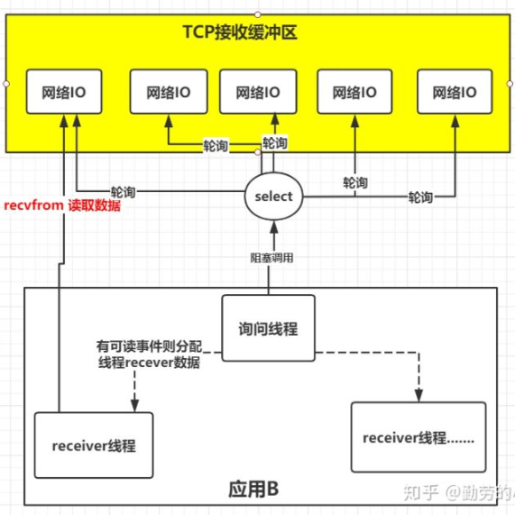
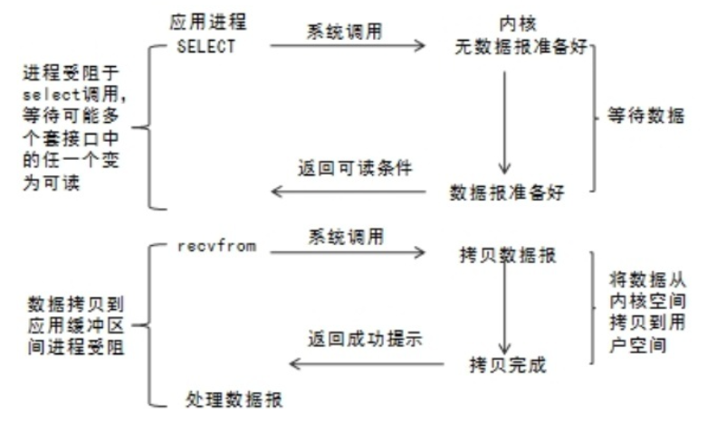
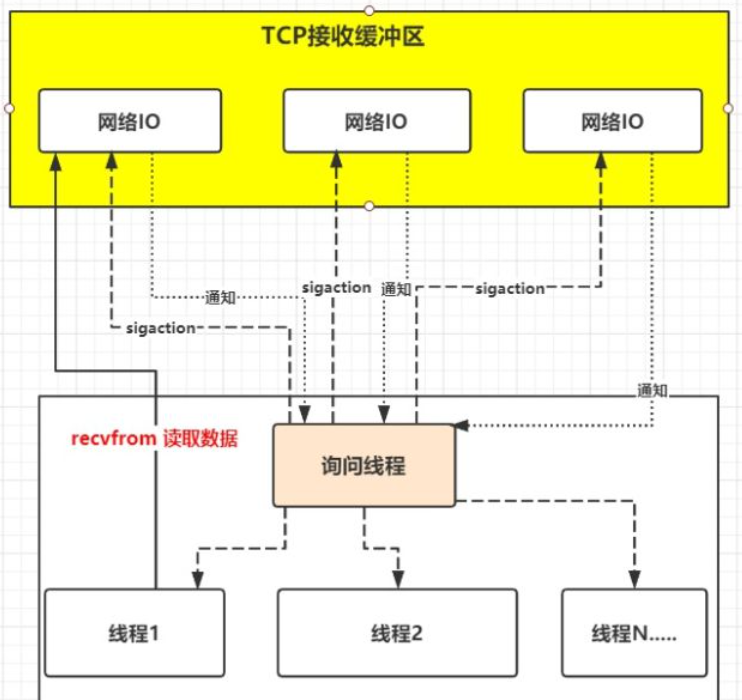
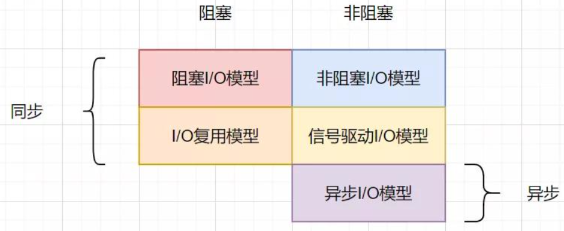

linux中线程的状态
Linux内核了解吗 
硬链接与软连接
常用的Linux指令
select, poll, epoll：IO多路复用
epoll算是同步模型么？


### Linux线程切换怎么实现？

### Linux基本命令（进程、日志、打包、解压等等）

### [Linux命令中的grep](https://segmentfault.com/a/1190000022722655)
grep 命令在所给文件中查找特定模式的字符串，可以提供多个文件名，在多个文件中查找。如果没有提供文件名，则读取标准输入。

“| grep”中的“|”是什么意思？

如果确实需要用 grep 命令来查找字符串，可以用管道操作符 | 来连接标准输入。例如用 echo 命令打印字符串的值，然后通过管道操作符把这个值传递到 grep 命令的标准输入。

```shell
echo "This is a test string." | grep string
```

### select, poll, epoll
[参考](https://www.jianshu.com/p/dfd940e7fca2)
I/O多路复用就是通过一种机制，一个进程可以监视多个描述符，一旦某个描述符就绪（一般是读就绪或者写就绪），能够通知程序进行相应的读写操作。但select，pselect，poll，epoll本质上都是同步I/O，因为他们都需要在读写事件就绪后自己负责进行读写，也就是说这个读写过程是阻塞的，而异步I/O则无需自己负责进行读写，异步I/O的实现会负责把数据从内核拷贝到用户空间。

select本质上是通过设置或者检查存放fd标志位的数据结构来进行下一步处理。这样所带来的缺点是：
1. select最大的缺陷就是单个进程所打开的FD是有一定限制的，它由FD_SETSIZE设置，默认值是1024。
2. 对socket进行扫描时是线性扫描，即采用轮询的方法，效率较低。
3. 需要维护一个用来存放大量fd的数据结构，这样会使得用户空间和内核空间在传递该结构时复制开销大。

poll本质上和select没有区别，它将用户传入的数组拷贝到内核空间，然后查询每个fd对应的设备状态，如果设备就绪则在设备等待队列中加入一项并继续遍历，如果遍历完所有fd后没有发现就绪设备，则挂起当前进程，直到设备就绪或者主动超时，被唤醒后它又要再次遍历fd。这个过程经历了多次无谓的遍历。

它没有最大连接数的限制，原因是它是基于链表来存储的，但是同样有一个缺点：
1. 大量的fd的数组被整体复制于用户态和内核地址空间之间，而不管这样的复制是不是有意义。
2. poll还有一个特点是“水平触发”，如果报告了fd后，没有被处理，那么下次poll时会再次报告该fd。

epoll使用一个文件描述符管理多个描述符，将用户关系的文件描述符的事件存放到内核的一个事件表中，这样在用户空间和内核空间的copy只需一次。

epoll支持水平触发和边缘触发，最大的特点在于边缘触发，它只告诉进程哪些fd刚刚变为就绪态，并且只会通知一次。还有一个特点是，epoll使用“事件”的就绪通知方式，通过epoll_ctl注册fd，一旦该fd就绪，内核就会采用类似callback的回调机制来激活该fd，epoll_wait便可以收到通知。

### Linux Socket
一个完整的Socket的组成应该是由【协议，本地地址，本地端口，远程地址，远程端口】组成的一个5维数组。

服务器首先启动，通过调用socket()建立一个套接字，然后调用bind()将该套接字和本地网络地址联系在一起，再调用listen()使套接字做好侦听的准备，并规定它的请求队列的长度，之后就调用accept()来接收连接。客户端在建立套接字后就可调用connect()和服务器建立连接。连接一旦建立，客户机和服务器之间就可以通过调用read()和write()来发送和接收数据。最后，待数据传送结束后，双方调用close()关闭套接字。

### LINUX查看进程的4种方法
- ps aux
- ps -elf
- top：以全屏交互式的界面显示进程排名，及时跟踪包括CPU、内存等系统资源占用情况，默认情况下每三秒刷新一次，其作用基本类似于Windows系统中的任务管理器。
- pstree -aup：以树状图的方式展现进程之间的派生关系，显示效果比较直观。

**两个具有相同名称不同路径的程序启动的进程，要kill一个，怎样知道要kill哪一个？**
查询指定路径下的进程：ps aux | grep 指定路径
根据进程 id 杀掉指定进程：kill -9 指定进程号

### 线程在Linux怎么实现？

### 项目部署在Linux服务器时有哪些常用命令？
```shell
# 到指定目录
cd 
# 源目录，目标目录
mv   /tmp/Test.jar  /opt/nspring
mkdir

# 将aaa目录及其子级的 读、写、执行 权限 开放给所有用户
chmod -R 777 aaa

# 查询进程信息
ps -ef | grep java 

# 杀进程
kill -9 20996
```

文件管理：ls、cd、touch创建普通文件、rm删除、mkdir新建目录、mv移动、cp拷贝、chmod修改权限；
进程管理：ps显示进程信息、kill杀死进程；
系统管理：top、free显示系统运行信息、vmstat输出各资源使用情况；
网络通讯：ping测试网络连通性、netstat显示网络相关信息；

### Linux命令怎么查看端口的占用情况🧊
[参考](https://www.runoob.com/w3cnote/linux-check-port-usage.html)
lsof(list open files)是一个列出当前系统打开文件的工具。
lsof -i:端口号

netstat -tunlp 用于显示 tcp，udp 的端口和进程等相关情况。
netstat -tunlp | grep 端口号

### linux通过什么命令查看日志
[参考](https://cloud.tencent.com/developer/article/1579977)
- tail  -n  10   test.log   查询日志尾部最后10行的日志;
- tail -fn 1000 test.log | grep '关键字'
- head -n  10  test.log   查询日志文件中的头10行日志;
- cat filename
- sed -n '5,10p' filename 这样你就可以只查看文件的第5行到第10行。

### 查看以某个后缀结尾的文件
[参考](https://blog.51cto.com/u_3069201/2053682)
 find /root/ -name "*.txt" 

### 查看cpu大小和内存大小的命令？
CPU配置信息：cat /proc/cpuinfo
查看内存大小：free  默认以字节为单位，如果需要以兆为单位，可以使用free -m

### Linux通过PID查看进程完整信息
[参考](https://blog.csdn.net/Great_Smile/article/details/50114133)
Linux在启动一个进程时，系统会在/proc下创建一个以PID命名的文件夹，在该文件夹下会有我们的进程的信息，其中包括一个名为exe的文件即记录了绝对路径，通过ll或ls –l命令即可查看。

ll /proc/PID

### Linux查找进程
pgrep str
ps -ef | grep python

找出占用内存资源最多的前 10 个进程
```shell
ps -auxf | sort -nr -k 4 | head -10
```

找出占用 CPU 资源最多的前 10 个进程
```shell
ps -auxf | sort -nr -k 3 | head -10
```

-n 数字排序
-r 倒序
-k 选取第几项

### 给一个文件有很多行，每个行都是ip地址，用Linux命令找出出现最多的三个ip地址
[参考](https://blog.csdn.net/jirryzhang/article/details/82467554)
```shell
awk '{a[$1] += 1;} END {for (i in a) printf("%d %s\n", a[i], i);}' 日志文件 | sort -n | tail -n 10 

#用tail显示最后10行
```

### git rebase用法
[参考](https://git-scm.com/book/zh/v2/Git-%E5%88%86%E6%94%AF-%E5%8F%98%E5%9F%BA)
使用 rebase 命令将提交到某一分支上的所有修改都移至另一分支上，就好像“重新播放”一样。
它的原理是首先找到这两个分支（即当前分支 experiment、变基操作的目标基底分支 master） 的最近共同祖先 C2，然后对比当前分支相对于该祖先的历次提交，提取相应的修改并存为临时文件， 然后将当前分支指向目标基底 C3, 最后以此将之前另存为临时文件的修改依序应用。

【找出dev分支和master分支的共同祖先，提取dev相对于祖先的变化，然后修改到master上】

### linux查看文件有多少行
wc -l filename

### IO模型
[参考](https://zhuanlan.zhihu.com/p/115912936)
**阻塞IO**就是当应用B发起读取数据申请时，在内核数据没有准备好之前，应用B会一直处于等待数据状态，直到内核把数据准备好了交给应用B才结束。【在应用调用recvfrom读取数据时，其系统调用直到数据包到达且被复制到应用缓冲区中或者发送错误时才返回，在此期间一直会等待，进程从调用到返回这段时间内都是被阻塞的称为阻塞IO；】


**非阻塞IO**是在应用调用recvfrom读取数据时，如果该缓冲区没有数据的话，就会直接返回一个EWOULDBLOCK错误，不会让应用一直等待中。在没有数据的时候会即刻返回错误标识，那也意味着如果应用要读取数据就需要不断的调用recvfrom请求，直到读取到它要的数据为止。



**IO复用模型**的思路就是系统提供了一种函数可以**同时监控多个fd文件描述符**的操作，这个函数就是我们常说到的select、poll、epoll函数，有了这个函数后，应用线程通过调用select函数就可以同时监控多个fd文件描述符，select函数监控的fd中只要有任何一个数据状态准备就绪了，select函数就会返回可读状态，这时询问线程再去通知处理数据的线程，对应线程此时再发起recvfrom请求去读取数据。


**信号驱动IO**不是用**循环请求询问**的方式去监控数据就绪状态，而是在调用sigaction时候建立一个SIGIO的信号联系，当内核数据准备好之后再通过SIGIO信号通知线程数据准备好后的可读状态，**当线程收到可读状态的信号后，此时再向内核发起recvfrom读取数据的请求**，因为信号驱动IO的模型下应用线程在发出信号监控后即可返回，不会阻塞，所以这样的方式下，一个应用线程也可以同时监控多个fd。


异步IO模型
应用只需要向内核发送一个read 请求,告诉内核它要读取数据后即刻返回；内核收到请求后会建立一个信号联系，当数据准备就绪，内核会主动把数据从内核复制到用户空间，等所有操作都完成之后，内核会发起一个通知告诉应用。



### 什么是IO多路复用？
- IO 多路复用是一种同步IO模型，实现一个线程可以监视多个文件句柄；
- 一旦某个文件句柄就绪，就能够通知应用程序进行相应的读写操作；
- 没有文件句柄就绪就会阻塞应用程序，交出CPU。

### epoll、select和poll的区别？🐋
[参考](https://developer.aliyun.com/article/297067)
select的缺点：
- 单个进程能够监视的文件描述符的数量存在最大限制，通常是1024，当然可以更改数量，但由于select采用轮询的方式扫描文件描述符，文件描述符数量越多，性能越差；
- 内核/用户空间内存拷贝问题，select需要复制大量的句柄数据结构，产生巨大的开销
- **select返回的是含有整个句柄的数组，应用程序【应该是询问的那个线程，而不是读取数据的线程】需要遍历整个数组才能发现哪些句柄发生了事件；**
- select的触发方式是水平触发，应用程序如果没有完成对一个已经就绪的文件描述符进行IO，那么之后再次select调用还是会将这些文件描述符通知进程。

相比于select模型，poll使用链表保存文件描述符，因此没有了监视文件数量的限制，但其他三个缺点依然存在。

在select/poll时代，服务器进程每次都把这100万个连接告诉操作系统（从用户态复制句柄数据结构到内核态），让操作系统内核去查询这些套接字上是否有事件发生，轮询完后，再将句柄数据复制到用户态，让服务器应用程序轮询处理已发生的网络事件，这一过程资源消耗较大，因此，select/poll一般只能处理几千的并发连接。

执行epoll_create时，创建了**红黑树和就绪链表**，执行epoll_ctl时，如果增加socket句柄，则检查在红黑树中是否存在，存在立即返回，不存在则添加到树干上，然后向内核注册回调函数，用于**当中断事件来临时向准备就绪链表中插入数据**。执行epoll_wait时立刻返回准备就绪链表里的数据即可。

[参考](https://juejin.cn/post/6882984260672847879#heading-34)
epoll 有水平触发（LT）与 边缘触发（ET）两种触发模式，LT 是默认的模式，ET 是 “高速” 模式。
- LT 模式下，**只要这个 fd 还有数据可读**，每次 **epoll_wait** 都会返回它的事件，提醒用户程序去操作；
- ET 模式下，它只会提示一次，直到**下次再有数据流入之前**都不会再提示了，无论 fd 中是否还有数据可读。所以在 ET 模式下，read 一个 fd 的时候一定要把它的 buffer 读完，或者遇到 EAGIN 错误。
***
[参考](https://segmentfault.com/a/1190000003063859)
在 select/poll中，进程只有在调用一定的方法后，内核才对所有监视的文件描述符进行扫描，而epoll事先通过epoll_ctl()来注册一个文件描述符，一旦基于某个文件描述符就绪时，内核会采用类似callback的回调机制，迅速激活这个文件描述符，当进程调用epoll_wait() 时便得到通知。

select的一个缺点在于单个进程能够监视的文件描述符的数量存在最大限制，在Linux上一般为1024，可以通过修改宏定义甚至重新编译内核的方式提升这一限制，但是这样也会造成效率的降低。

poll基于链表来存储的，没有最大连接数的限制。

epoll有EPOLLLT和EPOLLET两种触发模式，LT是默认的模式，ET是“高速”模式。LT模式下，只要这个fd还有数据可读，每次 epoll_wait都会返回它的事件，提醒用户程序去操作，而在ET（边缘触发）模式中，它只会提示一次，直到下次再有数据流入之前都不会再提示了，无论fd中是否还有数据可读。

### Linux nio怎么实现的？
同步非阻塞IO（Non-blocking IO）
NIO在Linux上使用了epoll这个系统调用，epoll能够做到已注册的连接在消息到来的时候主动通知调度器，将消息加入消息队列。非阻塞io最重要的其实就是解决了read函数的阻塞问题。

### Linux命令
如何查到a.txt文本中字符b出现的行
grep b a.txt

### git常用命令


- 通过git stash命令，把工作区的修改提交到栈区，目的是保存工作区的修改；
- 通过git pull命令，拉取远程分支上的代码并合并到本地分支，目的是消除冲突；
- 通过git stash pop命令，把保存在栈区的修改部分合并到最新的工作空间中；

### Linux shell命令 获得字符串所在行数及位置
```shell
cat test | grep -n exe
cat test | grep -n exe | awk -F ":" '{print $1}'
```

### awk用法
[参考](https://cloud.tencent.com/developer/article/1159061)
- print $1 就是输出第一列，print $1,$2 就是输出第1、2列，print $0 输出全部。
- awk怎么区分列呢，默认是以空格区分，但是你也可以通过 -F 参数指定，例如 -F; 指定分号为分隔符，-F[;,] 指定分号和逗号为分隔符。

### linux 查看SOCKET使用情况
ss -t -a
-a， --all 显示所有套接字（sockets）
-t， --tcp 仅显示 TCP套接字（sockets）

### IO多路复用
[参考](https://www.zhihu.com/question/28594409)
关于I/O多路复用(又被称为“事件驱动”)，首先要理解的是，操作系统为你提供了一个功能，当你的某个socket可读或者可写的时候，它可以给你一个通知。这样当配合非阻塞的socket使用时，只有当系统通知我哪个描述符可读了，我才去执行read操作，可以保证每次read都能读到有效数据而不做纯返回-1和EAGAIN的无用功。写操作类似。操作系统的这个功能通过select/poll/epoll/kqueue之类的系统调用函数来使用，这些函数都可以同时监视多个描述符的读写就绪状况，这样，多个描述符的I/O操作都能在一个线程内并发交替地顺序完成，这就叫I/O多路复用，这里的“复用”指的是复用同一个线程。

### chmod
[参考](https://blog.csdn.net/u013197629/article/details/73608613)

### 用shell将指定文件中含有某个字段的行输出到另一个文件里
grep -i "aaa" Home.log > new.log  
- -i 为忽略大小写功能
- 用"aaa"来指定需要搜索的字段
- “>”的右边是抽取出的文本要写入的目标文件

### 查看某一个进程所占用的内存
ps -ef | grep kafka 可以看到kafka这个程序的进程id
top -p 2913