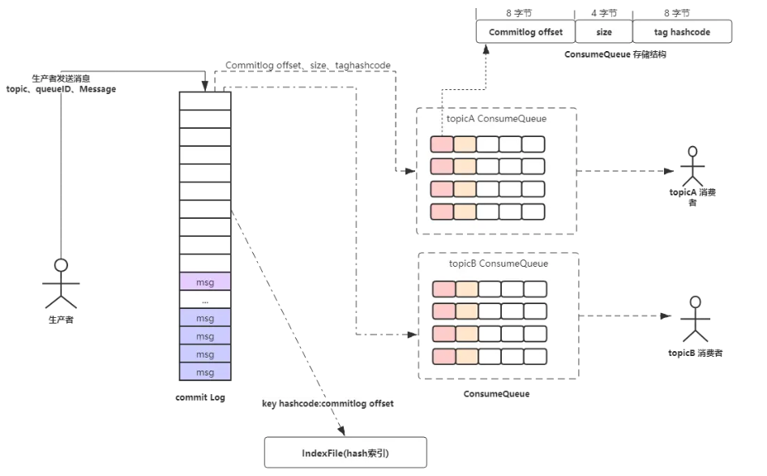

1.  RabbitMQ的原理
2. mq的作用（异步、削峰、解耦）
3. 从银行转账出发， 要求描述出两阶段提交基于（RocketMQ）

### 消息队列的应用场景🐋
1. 异步处理
2. 应用解耦：假如库存系统无法访问，则订单减库存将失败，从而导致订单失败，订单系统与库存系统耦合。订阅下单的消息，采用拉/推的方式，获取下单信息，库存系统根据下单信息，进行库存操作。
3. 流量削峰：用户的请求，服务器接收后，首先写入消息队列。假如消息队列长度超过最大数量，则直接抛弃用户请求或跳转到错误页面。秒杀业务根据消息队列中的请求信息，再做后续处理。
4. 日志处理：解决大量日志传输的问题。
5. 消息通讯

### [消息队列的延时如何实现？](https://zhuanlan.zhihu.com/p/266156267)
对于数据量比较少并且时效性要求不那么高的场景，一种比较简单的方式是轮询数据库，比如每秒轮询一下数据库中所有数据，处理所有到期的数据。

Redis ZSet：ZSet 中每个元素都有一个对应 Score，ZSet 中所有元素是按照其 Score 进行排序的。
我们将需要处理的任务，按其需要延迟处理时间作为 Score 加入到 ZSet 中。
起一个进程定时（比如每隔一秒）通过ZREANGEBYSCORE方法查询 ZSet 中 Score 最小的元素。
a. 查询出的分数小于等于当前时间戳，说明到这个任务需要执行的时间了，则去异步处理该任务；  
b. 查询出的分数大于当前时间戳，由于刚刚的查询操作取出来的是分数最小的元素，所以说明ZSet 中所有的任务都还没有到需要执行的时间，则休眠一秒后继续查询；

RabbitMQ 本身并不直接提供对延迟队列的支持，我们依靠 RabbitMQ 的**TTL**以及**死信队列**功能，来实现延迟队列的效果。

TimeWheel 时间轮算法，是一种实现延迟队列的巧妙且高效的算法，被应用在 Netty，Zookeeper，Kafka 等各种框架中。
多层时间轮：当任务的到期时间超过了当前时间轮所表示的时间范围时，就会尝试添加到上层时间轮中。

### 消息队列该建立在哪里，怎么去重？
在生产消息时，业务方在消息体中插入去重 key，消费时通过该去重 key 来识别重复消息。去重 key 可以是由 <生产者 IP + 线程 ID + 时间戳 + 时间内递增值> 组成的唯一值。

建立一个消息表，拿到这个消息做数据库的insert操作。给这个消息做一个唯一主键（primary key）或者唯一约束，那么就算出现重复消费的情况，就会导致主键冲突。

高并发下去重：采用Redis去重（key天然支持原子性并要求不可重复），但是由于不在一个事务，要求有适当的补偿策略，但是对于很重要的业务，不应该支持补偿。

### [如何保证全链路消息不丢失？](https://codeantenna.com/a/vnDPcoxnXo)
一个消息会经历四个节点，只有保证这四个节点的可靠性才能保证整个系统的可靠性。

-   生产者发出后保证到达了MQ。
	发送方确认机制，消息发送到MQ那端之后，MQ会回一个确认收到的消息给我们。
-   MQ收到消息保证分发到了消息对应的Exchange。
	- 消息找不到对应的Exchange。
	- 找到了Exchange但是找不到对应的Queue。
	这两种情况都可以用RabbitMQ提供的mandatory参数来解决，它会设置消息投递失败的策略，有两种策略：自动删除或返回到客户端。保证可靠性需要选择返回到客户端
-   Exchange分发消息入队之后保证消息的持久性。
	做队列的持久化和Exchange的持久化。【发送的消息默认就是持久化消息。】
-   消费者收到消息之后保证消息的正确消费。
	打开手动消息确认之后，只要我们这条消息没有成功消费，无论中间是出现消费者宕机还是代码异常，只要连接断开之后这条信息还没有被消费那么这条消息就会被重新放入队列再次被消费。

### 如何保证消息的可靠性传输？要是消息丢失了怎么办？
[参考](http://learn.lianglianglee.com/%E6%96%87%E7%AB%A0/RocketMQ%20%E9%9D%A2%E8%AF%95%E9%A2%98%E9%9B%86%E9%94%A6.md)
- Producer：生产者端默认采用同步阻塞式发送消息，如果状态返回 OK 表示消息一定发送到了 Broker，如果状态返回失败或者超时，会重试两次，重试次数用完后可能发送成功也可能继续失败。
- Broker：发送到 Broker 的消息会通过同步刷盘或者异步刷盘的方式持久化到 CommitLog 里面，即时 Broker 服务宕机，服务恢复后仍然可以找到消息，除非磁盘损坏才会导致消息丢失；另外在多主多从的 Broker 集群模式下，采用同步复制将 Master Broker 中的消息同步到 Slave Broker，就是 Master Broker 宕机甚至磁盘损坏也可以找到该消息。
- Consumer：消费端维护了一个 MessageQueue 的队列，不管消息消费成功或者失败都会将当前消息的消费进度 offset 持久化到 MessageQueue 里面；如果消息消费失败会把消息重新发回到 Broker，如果操作失败或者 Broker 挂掉了会定时重试，成功后更新本地的消费进度 offset；就算 Broker 和 Consumer 都挂掉了由于 Consumer 会定期持久化消费进度，等服务恢复后重新拉取 offset 之前的消息到消费端本地也可以保证消息不丢失；消费端消费失败后会把消息重新发回到 Broker 中的重试队列中，如果消费重试次数超过了最大消费重试次数的话 Broker 会把消息移到死信队列中，然后人工干预处理。

### [各种消息队列有什么特点？](https://blog.csdn.net/qq_38534524/article/details/110957518)


### 从银行转账出发， 要求描述出两阶段提交（基于RocketMQ）
[两阶段提交](https://blog.csdn.net/lengxiao1993/article/details/88290514)
[RocketMQ高级特性总结(事务消息、顺序消息、延迟消息)](https://www.i4k.xyz/article/hosaos/100053480)

RocketMq通过将本地事务与消息的发送放在一个本地事务中，来保证：
1. 本地事务执行成功时，消息一定被成功投递到消息服务器中
2. 利用消息中间件的高可靠性，保证消息一定会被下游业务所消费至少一次

RocketMQ基于两阶段提交协议做了如下改动：
1. 第一阶段：**生产者向MQ服务器发送事务消息(prepare消息)**，服务端确认后回调通知生产者执行本地事务(此时消息为Prepare消息，存储于RMQ_SYS_TRANS_HALF_TOPIC 队列中，不会被消费者消费)
2. 第二阶段：生产者执行完本地事务后(业务执行完成，同时将消息唯一标记，如transactionId与该业务执行记录同时入库，方便事务回查)，**根据本地事务执行结果，返回Commit/Rollback/Unknow状态码**
	- 服务端若收到Commit状态码，则将prepare消息变为提交(正常消息，可被消费者消费)
	- 收到Rollback则对消息进行回滚(丢弃消息)
	- 若状态为Unknow，则等待MQ服务端定时发起消息状态回查，超过一定重试次数或者超时，消息会被丢弃


设由于网络原因发送失败怎么办？本地事务已经提交/回滚了，但是Commit/Rollback状态码却没发出去，那么MQ服务器上这条prepare消息状态岂不是无法被投递/回滚。

因此，MQ服务端会定时扫描存储于RMQ_SYS_TRANS_HALF_TOPIC中的消息，若消息未被处理，则向消费发送者发起回调检查，检查消息对应本地事务执行状态。从而保证消息事务状态最终能和本地事务的状态一致。上图中的4、5、6就是MQ服务端定时回查步骤。

### 延迟消息发送
1. producer端设置消息delayLevel延迟级别，消息属性DELAY中存储了对应了延时级别
2. broker端收到消息后，判断延时消息延迟级别，如果大于0，则备份消息原始topic，queueId，并将消息topic改为延时消息队列特定topic(SCHEDULE_TOPIC)，queueId改为延时级别-1
3. mq服务端ScheduleMessageService中，为每一个延迟级别单独设置一个定时器，定时(每隔1秒)拉取对应延迟级别的消费队列
4. 根据消费偏移量offset从commitLog中解析出对应消息
5. 从消息tagsCode中解析出消息应当被投递的时间，与当前时间做比较，判断是否应该进行投递
6. 若到达了投递时间，则构建一个新的消息，并从消息属性中恢复出原始的topic，queueId，并清除消息延迟属性，从新进行消息投递

延迟队列由最小堆实现，插入任务的时间复杂度为Olog(n)，消息TPS较高时性能仍不够快，有没O(1)复杂度的方案呢？

TimeWheel时间轮，Netty、Kafka中使用TimeWheel来优化I/O超时的操作。

分区顺序：
如电商系统中的订单创建，以订单 ID 作为 Sharding Key，那么同一个订单相关的创建订单消息、订单支付消息、订单退款消息、订单物流消息都会按照发布的先后顺序来消费

### RabbitMQ消息模式
[参考](https://www.cnblogs.com/davidgu/p/14702449.html)

### RocketMQ相对于其他消息队列的优点🐋
[参考](https://cloud.tencent.com/developer/article/1921917)
- 单机吞吐量：十万级；
- topic 可以达到几百/几千的级别，吞吐量会有较小幅度的下降。
- 采用分布式架构，可用性非常高
- 经过参数优化配置，可以做到 0 丢失
- 支持10亿级别的消息堆积，不会因为堆积导致性能下降；
- 源码是java，我们可以自己阅读源码，定制自己公司的MQ，可以掌控。

### 消息队列需要注意什么
- 重复投递
- 消息丢失
- 局部有序
- 对事务的支持

### RocketMQ核心构件
NameServer、Broker、Producer、Consumer

一个Topic可以对应多个MessageQueue

Master和Slave使用相同的broker名称，brokerId 0表示master，大于0表示slave

同步刷盘情况下，消息真正写入磁盘后再返回成功状态，异步刷盘情况下，消息写入page_cache后就返回成功状态。

GroupName把多个Consumer组织到一起，配合消息模式一起使用。

- Clustering：同个组里的Consumer只消费所订阅信息的一部分内容，合起来才是Topic整体，达到负载均衡的目的。
- Broadcasting：每个Consumer会消费到Topic的全部消息。

Topic底下有tag，可以用来过滤消息。

### Push和Pull
push方式主动推送消息给客户端。缺点是增加了Server的工作量，影响Server性能。Client的处理能力不同，可能无法及时处理Server推送过来的消息。

pull方法客户端循环地从Server端拉取消息。消息超时时间可以配置，设置短则会轮训频率过快服务端会承担压力，甚至导致空转。设置长则导致消息接收不及时。

### 长轮询
[参考](https://blog.csdn.net/qq_33709508/article/details/107973371)
服务端接收到新消息请求后，如果队列里没有新消息，并不急于返回，通过一个循环不断查看状态，每次waitForRunning一段时间（默认是5秒），然后再Check。Broker默认最长阻塞时间为15秒，默认情况下当Broker一直没有新消息，第三次Check的时候，等待时间超过最长阻塞时间，就返回空结果。在等待的过程中，Broker收到了新的消息后会直接返回请求结果。
“长轮询”的核心是，Broker端hold住客户端过来的请求一小段时间。在这段时间内有新的消息到达，就利用现有的连接立即返回消息给Consumer。

- 果开启了长轮询，每5s尝试一次，利用checkHoldRequest方法来判断是否有新消息的产生。如果未开启长轮询，则默认1s再次尝试。
- checkHoldRequest方法中遍历pullRequestTable，从key名中可以得到主题名topic和队列名queueId,然后通过topic和queueID获取到该消息队列的最大偏移量，之后调用notifyMessageArriving方法。
- 在notifyMessageArriving方法中，首先会获取到当前该主题、队列中的所有的挂起拉取任务，如果该消息队列的最大偏移量大于待拉取偏移量，说明有新的消息传入。如果消息匹配后，则调用executeRequestWhenWakeup将消息返回给消息拉取客户端，否则等待下一次尝试。如果挂起超时时间超时，则不继续等待将直接返回客户消息未找到。

### 保证有序
全局顺序消息：
先把 Topic 的读写队列数设置为一，然后Producer 和 Consumer 的并发设置也要是一 。 消除所有的并发处理，各部分都设置成单线程处理 。 

局部顺序：
在发送端，要做到把同一业务 ID 的消息发送到同一个 Message Queue ；在消费过程中，要做到从同一个 Message Queue 读取的消息不被并发处理，这样才能达到部分有序。

发送端把同一类型的消息都发往相同的Message Queue，使用MessageQueueSelector

消费端通过使用 MessageListenerOrderly 类来解决单 Message Queue 的消息被并发处理的问题。

### 消息重复
解决消息重复有两种方法：第一种方法是保证消费逻辑的**幕等性**（多次调用和一次调用效果相同）；另一种方法是维护一个已消费消息的记录，消费前查询这个消息是否被消费过 。 这两种方法都需要使用者自己实现 。

到了redis存放消息key值（因为redis读取快），并且对于key值大存放时长可以设置，超过了时长就会被清除掉。先判断key是否在redis中存在，如果存在则抛弃不走下面的业务逻辑；如果，在redis中没有查到，则继续下面的业务逻辑处理。

### 事务
两阶段提交

### 持久化
每个Topic下的每个Message Queue都有一个对应的ConsumeQueue文件。存储的是指向物理存储的地址【CommitLog】。
每台Broker上的CommitLog被本机器所有ConsumeQueue共享。

异步刷盘，只保存到内存的pageCache
同步刷盘，保存到磁盘

通常情况下，异步刷盘，主从之间同步复制

 Topic 下的所有 Message Queue 分配到不同的Consumer 中。

### 保证数据不丢失
[参考](https://www.cnblogs.com/goodAndyxublog/p/12563813.html)

```
## master 节点配置
flushDiskType = SYNC_FLUSH
brokerRole=SYNC_MASTER

## slave 节点配置
brokerRole=slave
flushDiskType = SYNC_FLUSH
```

同时这个过程我们还需要生产者配合，判断返回状态是否是SendStatus.SEND_OK。若是其他状态，就需要考虑补偿重试。

消费者从 broker 拉取消息，然后执行相应的业务逻辑。一旦执行成功，将会返回 ConsumeConcurrentlyStatus.CONSUME_SUCCESS 状态给 Broker。
如果 Broker 未收到消费确认响应或收到其他状态，消费者下次还会再次拉取到该条消息，进行重试。这样的方式有效避免了消费者消费过程发生异常，或者消息在网络传输中丢失的情况。

### rocketmq消息不丢失
[参考](https://zhuanlan.zhihu.com/p/465112826)
[参考](https://blog.51cto.com/u_12132623/3065789)
同步发送会返回 4 个状态码，根据返回的状态码，可以做消息重试，这里设置的重试次数是 3。

异步发送，可以重写回调函数，回调函数捕获到 Exception 时表示发送失败，这时可以进行重试，这里设置的重试次数是 3。

同步刷盘。`flushDiskType=SYNC_FLUSH`
slave 节点同步复制消息，即等 slave 节点复制消息成功后再给 Producer 返回发送成功。`brokerRole=SYNC_MASTER`

如果 Consumer 消费成功，返回 CONSUME_SUCCESS，提交 offset 并从 Broker 拉取下一批消息。Consumer 消费失败，发送响应，Broker 收到这个响应后，会把这条消息放入重试队列，重新发送给 Consumer。

Broker 默认最多重试 16 次，如果重试 16 次都失败，就把这条消息放入死信队列，Consumer 可以订阅死信队列进行消费。

### Rocket MQ的持久化机制
RocketMQ 的消息持久化主要依靠以下文件完成：
1. CommitLog
	日志数据文件，存储消息内容，所有 queue 共享，不区分 topic ，顺序读写 ，1G 一个文件
2. ConsumeQueue
	- 逻辑 Queue，基于 topic 的 CommitLog 的索引文件
	- 消息先到达 commitLog，写之前加锁，保证顺序写入。然后异步转发到 consumeQueue，包含 queue 在 commitLog 中的物理偏移量 offset，消息实体内容大小和 Message Tag 的 hash 值，大于 600W 个字节，写满之后重新生成，顺序写
3. IndexFile
	基于 Key 或 时间区间的 CommitLog 的索引文件，文件名以创建的时间戳命名，固定的单个 indexFile 大小为 400M，可以保存 2000W 个索引


***
IndexFile 这个文件用来加快消息查询的速度，通过消息Key值查询消息真正的实体内容。

### 持久化策略
- 同步刷盘：消息持久化到磁盘才会给生产者返回 ACK，保证消息可靠，但是会影响性能
- 异步刷盘：消息写入 pageCache 就返回 ACK 给生产者，刷盘采用异步线程，降低读写延迟，提高性能和吞吐，但是消息有可能丢失

可以通过 Broker 配置文中中的 flushDiskType 参数来设置（SYNC_FLUSH、ASYNC_FLUSH）。


主从同步

### 删除策略
[参考](https://jaskey.github.io/blog/2017/02/16/rocketmq-clean-commitlog/)
但消息既然一直没有删除，那RocketMQ怎么知道应该投递过的消息就不再投递？——答案是客户端自身维护——客户端拉取完消息之后，在响应体中，broker会返回下一次应该拉取的位置，PushConsumer通过这一个位置，更新自己下一次的pull请求。这样就保证了正常情况下，消息只会被投递一次。

消息存储在CommitLog之后，的确是会被清理的，但是这个清理只会在以下任一条件成立才会批量删除消息文件（CommitLog）：
- 消息文件过期（默认72小时），且到达清理时点（默认是凌晨4点），删除过期文件。
- 消息文件过期（默认72小时），且磁盘空间达到了水位线（默认75%），删除过期文件。
- 磁盘已经达到必须释放的上限（85%水位线）的时候，则开始批量清理文件（无论是否过期），直到空间充足。

### 消费超时时间
[参考](https://blog.csdn.net/Saintmm/article/details/122656453)
一般我们模型训练几秒钟就结束了，不会出现超时。
```java
// 消息消费总耗时
long consumeRT = System.currentTimeMillis() - beginTimestamp;
// 根据是否出现异常等，判断处理结果
if (null == status) {
	if (hasException) {
		returnType = ConsumeReturnType.EXCEPTION;
	} else {
		returnType = ConsumeReturnType.RETURNNULL;
	}
	// 消费超时，默认15分钟
} else if (consumeRT >= defaultMQPushConsumer.getConsumeTimeout() * 60 * 1000) {
	returnType = ConsumeReturnType.TIME_OUT;
} else if (ConsumeConcurrentlyStatus.RECONSUME_LATER == status) {
	returnType = ConsumeReturnType.FAILED;
} else if (ConsumeConcurrentlyStatus.CONSUME_SUCCESS == status) {
	returnType = ConsumeReturnType.SUCCESS;
}
```

## RocketMQ面试合集
[参考](https://www.cnblogs.com/three-fighter/p/16114162.html)

### 保证消息不丢失
在**生产**阶段，主要通过请求确认机制，来保证消息的可靠传递。
- 同步发送的时候，要注意处理响应结果和异常。如果返回响应OK，表示消息成功发送到了Broker，如果响应失败，或者发生其它异常，都应该重试。
- 异步发送的时候，应该在**回调方法**里检查，如果发送失败或者异常，都应该进行重试。
- 如果发生超时的情况，也可以通过查询日志的API，来检查是否在Broker存储成功。

**存储**阶段，可以通过配置可靠性优先的 Broker 参数来避免因为宕机丢消息，简单说就是可靠性优先的场景都应该使用同步。
- 消息只要持久化到CommitLog（日志文件）中，即使Broker宕机，未消费的消息也能重新恢复再消费。
- Broker的刷盘机制：同步刷盘和异步刷盘，不管哪种刷盘都可以保证消息一定存储在pagecache中（内存中），但是同步刷盘更可靠，它是Producer发送消息后等数据持久化到磁盘之后再返回响应给Producer。
- Broker通过主从模式来保证高可用，Broker支持Master和Slave同步复制、Master和Slave异步复制模式，生产者的消息都是发送给Master，但是消费既可以从Master消费，也可以从Slave消费。同步复制模式可以保证即使Master宕机，消息肯定在Slave中有备份，保证了消息不会丢失。

从**Consumer角度**分析，如何保证消息被成功消费？
Consumer保证消息成功消费的关键在于**确认**的时机，不要在收到消息后就立即发送消费确认，而是应该在执行完所有消费业务逻辑之后，再发送消费确认。因为消息队列维护了消费的位置，逻辑执行失败了，没有确认，再去队列拉取消息，就还是之前的一条。

### 去重
RocketMQ择了确保一定投递，保证消息不丢失，但有可能造成消息重复。
**业务幂等**：第一种是保证消费逻辑的幂等性，也就是多次调用和一次调用的效果是一样的。这样一来，不管消息消费多少次，对业务都没有影响。
**消息去重**：第二种是业务端，对重复的消息就不再消费了。这种方法，需要保证每条消息都有一个惟一的编号，通常是业务相关的，比如订单号，消费的记录需要落库，而且需要保证和消息确认这一步的原子性。

具体做法是可以建立一个消费记录表，拿到这个消息做数据库的insert操作。给这个消息做一个**唯一主键**（primary key）或者唯一约束，那么就算出现重复消费的情况，就会导致主键冲突，那么就不再处理这条消息。

### 怎么处理消息积压？
- 消费者扩容：如果当前Topic的**Message Queue的数量大于消费者数量**，就可以对消费者进行扩容，增加消费者，来提高消费能力，尽快把积压的消息消费完。
- 消息迁移Queue扩容：如果当前Topic的Message Queue的数量小于或者等于消费者数量，这种情况，再扩容消费者就没什么用，就得考虑扩容Message Queue。可以**新建一个临时的Topic，临时的Topic多设置一些Message Queue**，然后先用一些消费者把消费的数据丢到临时的Topic，因为不用业务处理，只是**转发**一下消息，还是很快的。接下来用扩容的消费者**去消费新的Topic**里的数据，消费完了之后，恢复原状。

### 顺序消息
部分顺序消息相对比较好实现，生产端需要做到把同 ID 的消息发送到同一个 Message Queue ；在消费过程中，要做到从同一个Message Queue读取的消息顺序处理——消费端不能并发处理顺序消息，这样才能达到部分有序。

- 发送端使用 MessageQueueSelector 类来控制把消息发往哪个Message Queue。
- 消费端通过使用 MessageListenerOrderly 来解决单 Message Queue 的消息被并发处理的问题。

### RocketMQ怎么实现延时消息的？
简单，八个字：临时存储+定时任务。

Broker收到延时消息了，会先发送到主题（SCHEDULE_TOPIC_XXXX）的相应时间段的Message Queue中，然后通过一个定时任务轮询这些队列，到期后，把消息投递到目标Topic的队列中，然后消费者就可以正常消费这些消息。

### 怎么实现分布式消息事务的？
半消息：是指暂时还不能被 Consumer 消费的消息，Producer 成功发送到 Broker 端的消息，但是此消息被标记为 “暂不可投递” 状态，只有等 Producer 端执行完本地事务后经过二次确认了之后，Consumer 才能消费此条消息。


1. Producer 向 broker 发送半消息。
2. Producer 端收到响应，消息发送成功，此时消息是半消息，标记为 “不可投递” 状态，Consumer 消费不了。
3. Producer 端执行本地事务。
4. 正常情况本地事务执行完成，Producer 向 Broker 发送 Commit/Rollback，如果是 Commit，Broker 端将半消息标记为正常消息，Consumer 可以消费，如果是 Rollback，Broker 丢弃此消息。
5. 异常情况，Broker 端迟迟等不到二次确认。在一定时间后，会查询所有的半消息，然后到 Producer 端查询半消息的执行情况。
6. Producer 端查询本地事务的状态。
7. 根据事务的状态提交 commit/rollback 到 broker 端。（5，6，7 是消息回查）
8. 消费者段消费到消息之后，执行本地事务，执行本地事务。

### 死信队列
死信队列用于处理无法被正常消费的消息，即死信消息。

当一条消息初次消费失败，消息队列 RocketMQ 会自动进行消息重试；达到最大重试次数后，若消费依然失败，则表明消费者在正常情况下无法正确地消费该消息，此时，消息队列 RocketMQ 不会立刻将消息丢弃，而是将其发送到该消费者对应的特殊队列中，该特殊队列称为死信队列。

**死信消息的特点：**
- 不会再被消费者正常消费。
- 有效期与正常消息相同，均为 3 天，3 天后会被自动删除。因此，需要在死信消息产生后的 3 天内及时处理。

死信队列的特点：
- 一个死信队列对应一个 Group ID， 而不是对应单个消费者实例。
- 如果一个 Group ID 未产生死信消息，消息队列 RocketMQ 不会为其创建相应的死信队列。
- 一个死信队列包含了对应 Group ID 产生的所有死信消息，不论该消息属于哪个 Topic。

### 如何保证RocketMQ的高可用？
RocketMQ的高可用主要是在体现在Broker的读和写的高可用，Broker的高可用是通过集群和主从实现的。

Producer只能向Master角色的Broker写入消息，Cosumer可以从Master和Slave角色的Broker读取消息。

当 Master 不可用或者繁忙的时候， Consumer 的读请求会被自动切换到从 Slave。有了自动切换 Consumer 这种机制，当一个 Master 角色的机器出现故障后，Consumer 仍然可以从 Slave 读取消息，不影响 Consumer 读取消息，这就实现了读的高可用。

如何达到发送端写的高可用性呢？在创建 Topic 的时候，**把 Topic 的多个Message Queue 创建在多个 Broker 组上**（相同 Broker 名称，不同 brokerId机器组成 Broker 组），这样当 Broker 组的 Master 不可用后，其他组Master 仍然可用， Producer 仍然可以发送消息。

### 说一下RocketMQ的整体工作流程
RocketMQ由NameServer注册中心集群、Producer生产者集群、Consumer消费者集群和若干Broker（RocketMQ进程）组成：
1. Broker在启动的时候去向所有的NameServer注册，并保持长连接，每30s发送一次心跳
2. Producer在发送消息的时候从NameServer获取Broker服务器地址，根据负载均衡算法选择一台服务器来发送消息
3. Conusmer消费消息的时候同样从NameServer获取Broker地址，然后主动拉取消息来消费

### Broker是怎么保存数据的呢？
RocketMQ主要的存储文件包括CommitLog文件、ConsumeQueue文件、Indexfile文件。


- **CommitLog**：消息主体以及元数据的存储主体，存储Producer端写入的消息主体内容,消息内容不是定长的。消息主要是顺序写入日志文件，当文件满了，写入下一个文件。
- **ConsumeQueue**：消息消费队列，引入的目的主要是提高消息消费的性能，由于RocketMQ是基于主题topic的订阅模式，消息消费是针对主题进行的，如果要遍历commitlog文件中根据topic检索消息是非常低效的。Consumer即可根据ConsumeQueue来查找待消费的消息。其中，ConsumeQueue（逻辑消费队列）作为消费消息的索引，保存了指定Topic下的队列消息**在CommitLog中的起始物理偏移量offset，消息大小size和消息Tag的HashCode值。**
- **IndexFile**：IndexFile（索引文件）提供了一种可以**通过key或时间区间**来查询消息的方法。文件名fileName是以创建时的**时间戳**命名的，固定的单个IndexFile文件大小约为400M，一个IndexFile可以保存 2000W个索引，IndexFile的底层存储设计为在文件系统中实现HashMap结构，故RocketMQ的索引文件其底层实现为hash索引。

### 长轮询
服务端也支持长轮询模式，如果一个消息拉取请求未拉取到消息，Broker允许等待30s的时间，只要这段时间内有新消息到达，将直接返回给消费端。

RocketMQ的具体做法是，使用Broker端的后台服务线程—ReputMessageService不停地分发请求并异步构建ConsumeQueue（逻辑消费队列）和IndexFile（索引文件）数据。
***
所谓的长轮询，就是Consumer 拉取消息，如果对应的 Queue 如果没有数据，Broker 不会立即返回，而是把 PullReuqest hold起来，等待 queue 有了消息后，或者长轮询阻塞时间到了，再重新处理该 queue 上的所有 PullRequest。

### RocketMQ怎么对文件进行读写的？
RocketMQ对文件的读写巧妙地利用了操作系统的一些高效文件读写方式——PageCache、顺序读写、零拷贝。

在RocketMQ中，ConsumeQueue逻辑消费队列存储的数据较少，并且是顺序读取，在page cache机制的预读取作用下，Consume Queue文件的读性能几乎接近读内存，即使在有消息堆积情况下也不会影响性能。而对于CommitLog消息存储的日志数据文件来说，读取消息内容时候会产生较多的随机访问读取，严重影响性能。如果选择合适的系统IO调度算法，比如设置调度算法为“Deadline”（此时块存储采用SSD的话），随机读的性能也会有所提升。

RocketMQ主要通过MappedByteBuffer对文件进行读写操作。其中，利用了NIO中的FileChannel模型**将磁盘上的物理文件直接映射到用户态的内存地址**中（这种Mmap的方式减少了传统IO，将磁盘文件数据在操作系统内核地址空间的缓冲区，和用户应用程序地址空间的缓冲区之间来回进行拷贝的性能开销），将对文件的操作转化为直接对内存地址进行操作，从而极大地提高了文件的读写效率（正因为需要使用内存映射机制，故RocketMQ的文件存储都使用定长结构来存储，方便一次将整个文件映射至内存）。

### RocketMQ消息消费超时
[参考](https://blog.csdn.net/Saintmm/article/details/122656453)
ConsumeMessageService是一个接口，它有两个实现：ConsumeMessageConcurrentlyService、ConsumeMessageOrderlyService，分别表示**并发消费模式、顺序消费**模式；

ConsumeMessageConcurrentlyService采用线程池的机制对消息进行分批并发消费，默认一个消息是一批；