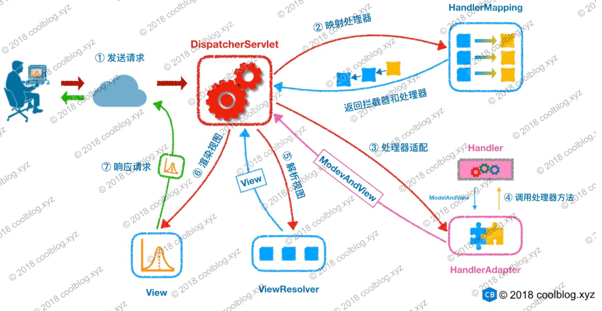
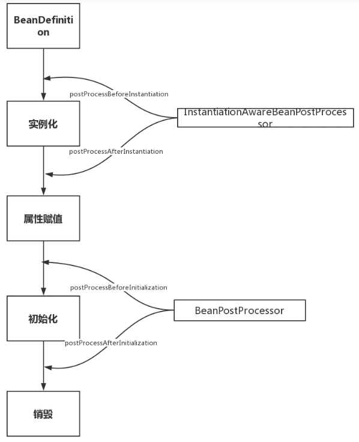
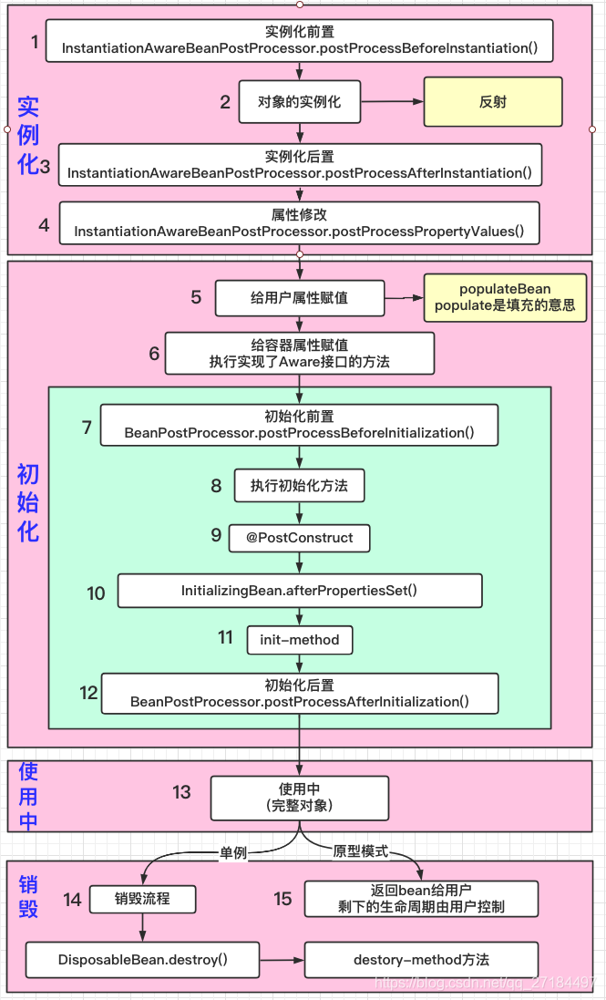
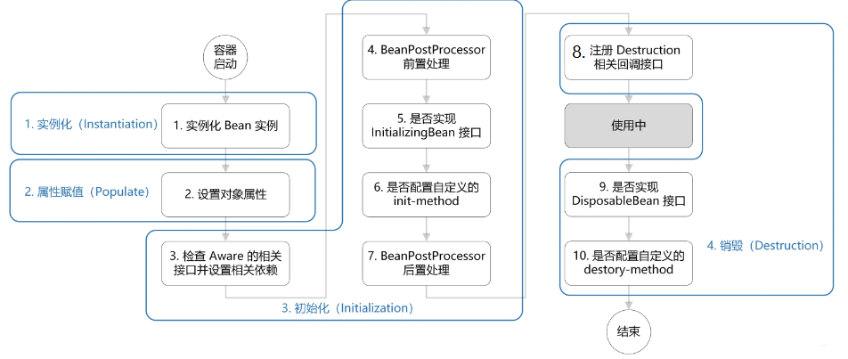
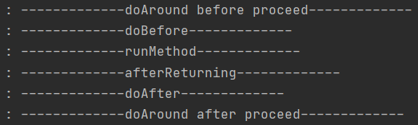
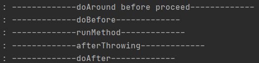
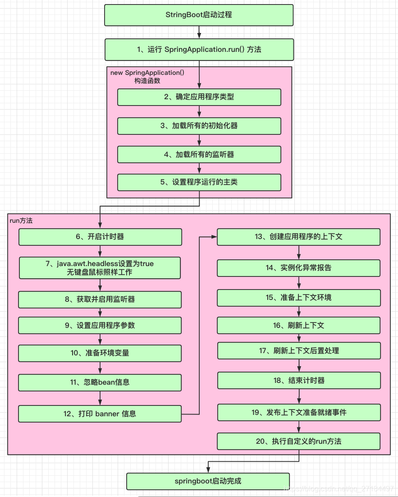

Spring和SpringBoot和SpringMVC的理解，启动流程，核心组件

AOP，IOC原理

Bean的创建过程，applicationContext和beanFactory的作用

SpringBootApplication注解做了什么事情

自动装配的原理分析，自动配置的原理分析

spring的容器类创建与实例化的过程

我把SpringIOC在源码层面从注册到生产bean，再到bean的生命周期讲了一遍
说AOP的时候，从解析切面，到创建动态代理说了下，这个没说那么细，面试官说可以了

用java语言，说一下SpringMVC中的C是怎么实现的
用java语言，说一下数据库的连接和使用（你脑子真的抽了，当时只记得sqlSession啥的，不清醒）

源码：
HashMap
ConcurrentMap
ThreadLocal
Lock
AQS
ThreadPoolExecutor
jdbctemplate

## Spring boot 相对 Spring有什么优势

## Spring哪些很好的特性：IOC AOP
为什么用springboot？有哪些特性？

 Spring 是如何解决循环依赖的？

## IOC
1.  如何使用IOC
-   怎么实现 IOC 的
- -   怎么管理 Bean 的
    
2.  通常如何获取bean
    
3.  bean 扫描路径
    
4.  除了autowire其他获取bean的注解的方法
    
5.  autowire是按照什么规则来获取bean的？
6. 1.  spring 装配bean的方式有哪几种
7. 1.  通过注解和xml 进行装配各有什么优缺点
8. 1.  一个项目中既有注解又有xml装配 怎么办
9. 1.  spring boot自动配置 怎样实现的
10. springboot自动装配原理
11. Spring如何在完成属性注入之后输出一条日志？


## AOP
1.  实际项目中有用到Spring AOP模块吗 主要用来做什么 答：记录日志 为什么用AOP记录日志
2. 1.  AOP底层通过什么机制来实现的
3. 1.  AOP的应用与底层

## 代理
1.  Spring 内部具体有哪几种代理的方式呢
spring,springmvc中代理模式用在哪些地方

1.  SpringCloud的具体组件
2. SpringCloud-   核心组件有哪些以及对应的功能
4.  Spring Gateway路由的应用详情


### Bean创建过程

### Spring特性
IOC和AOP

### Spring，SpringMVC，SpringBoot，SpringCloud 有什么区别和联系？
[参考](https://cloud.tencent.com/developer/article/1666935)
- Spring是一个一站式的轻量级的java开发框架，核心是控制反转（IOC）和面向切面（AOP），针对于开发的WEB层(springMvc)、业务层(Ioc)、持久层(jdbcTemplate)等都提供了多种配置解决方案；
- SpringMVC是Spring基础之上的一个MVC框架，涵盖面包括前端视图开发、文件配置、后台接口逻辑开发等，XML、config等配置相对比较繁琐复杂；
- SpringBoot使用了默认大于配置的理念，集成了快速开发的Spring多个插件，同时自动过滤不需要配置的多余的插件，简化了项目的开发配置流程，一定程度上取消xml配置，是一套快速配置开发的脚手架，能快速开发单个微服务；
- SpringCloud大部分的功能插件都是基于SpringBoot去实现的，SpringCloud关注于全局的微服务整合和管理，将多个SpringBoot单体微服务进行整合以及管理；SpringCloud依赖于SpringBoot开发，而SpringBoot可以独立开发；

### SpringBoot 相对 Spring有什么优势
[Spring boot 相对 Spring有什么优势](http://www.itcast.cn/news/20200918/15180354560.shtml)
1. 可快速构建独立的Spring应用
2. 直接嵌入Tomcat、Jetty和Undertow服务器(无需部署WAR文件)
3. 提供依赖启动器简化构建配置
4. 极大程度的自动化配置Spring和第三方库

### Spring 和 SpringBoot 之间到底有啥区别？🌟
Spring Boot中的一些特征：
1）创建独立的Spring应用。
2）嵌入式Tomcat、Jetty、 Undertow容器（无需部署war文件）。
3）提供的starters 简化构建配置。
4）尽可能自动配置spring应用。
5）提供生产指标,例如指标、健壮检查和外部化配置
6）完全没有代码生成和XML配置要求。

springboot是依赖于spring的，比起spring，除了拥有spring的全部功能以外，springboot无需繁琐的xml配置，这取决于它自身强大的自动装配功能；并且自身已嵌入Tomcat、Jetty等web容器，集成了springmvc，使得springboot可以直接运行，不需要额外的容器，提供了一些大型项目中常见的非功能性特性，如嵌入式服务器、安全、指标，健康检测、外部配置等。

### SpringBootApplication注解做了什么?
[参考](https://juejin.cn/post/6892044365942751239)
- @SpringBootConfiguration注解同@Configuration，表明这个类可提供Spring Boot应用配置，也就是在这个类中可定义@Bean注解修饰的方法，这些Bean会由Spring容器管理。
- @EnableAutoConfiguration开启自动配置功能
- @ComponentScan不带参数的@ComponentScan告诉Spring扫描当前包及其所有子包。所以@SpringBootApplication所修饰的主类理应放在最外层包，以保证其下的所有@Component都能被扫描到。当然也可以通过修改@ComponentScan的basePackages来指定扫描的包。

### Spring MVC🐋🐨🌟🌟
[参考](https://yexindong.blog.csdn.net/article/details/117233063)
1. 服务器收到请求后，servlet 会将所有的请求都交给前端控制器（DispatcherServlet）处理；
2. 前端控制器（DispatcherServlet）先调用HandlerMapping（处理器映射器），handlerMapping 根据请求url查找控制器（handler），返回一个 HandlerExecutionChain（处理器执行链） ，HandlerExecutionChain中除了控制器的信息之外，还有拦截器的信息；
3. 接着将HandlerExecutionChain（处理器执行链）返回给前端控制器（DispatcherServlet），调用适配器之前会先执行前置拦截器的代码，接着 DispatcherServlet 调用 HandlerAdapter（适配器）执行controller 层的代码内容，也就是带@Controller注解的类里面的代码，返回一个ModelAndView （逻辑视图）；注意，这里的逻辑视图还不是真正的jsp页面；因为它还没经过渲染；再一次执行后置拦截器；
4. 到这一步，DispatcherServlet就会调用ViewResolver（视图解析器）来解析ModelAndView 对象，得到一个View（视图），这个视图就是已经渲染好了的jsp页面了，然后把页面返回给前端之前在执行一次拦截器；
***
[参考](https://www.ldj.asia/articles/2021/11/17/1637154230873.html)

1. DispatcherServlet 表示前置控制器，是整个 SpringMVC 的控制中心。用户发出请求，DispatcherServlet 接收请求并拦截请求
2. HandlerMapping 为处理器映射。DispatcherServlet 调用 HandlerMapping, HandlerMapping 根据请求 url 查找 Handler
3. HandlerExecution 表示具体的 Handler,其主要作用是根据 url 查找控制器
4. HandlerExecution 将解析后的信息传递给 DispatcherServlet,如解析控制器映射等
5. HandlerAdapter 表示处理器适配器，其按照特定的规则去执行 Handler
6. Handler 让具体的 Controller 执行
7. Controller 将具体的执行信息返回给 HandlerAdapter,如 ModelAndView
8. HandlerAdapter 将视图逻辑名或模型传递给 DispatcherServlet
9. DispatcherServlet 调用视图解析器(ViewResolver)来解析 HandlerAdapter 传递的逻辑视图名
10. 视图解析器将解析的逻辑视图名传给 DispatcherServlet
11. DispatcherServlet 根据视图解析器解析的视图结果，调用具体的视图
12. 最终视图呈现给用户

***


***
[参考](https://segmentfault.com/a/1190000024416082)
- 用户向服务端发送一次请求，这个请求会先到前端控制器DispatcherServlet(也叫中央控制器)。
- DispatcherServlet接收到请求后会调用HandlerMapping处理器映射器。由此得知，该请求该由哪个Controller来处理（并未调用Controller，只是得知）
- DispatcherServlet调用HandlerAdapter处理器适配器，告诉处理器适配器应该要去执行哪个Controller
- HandlerAdapter处理器适配器去执行Controller并得到ModelAndView(数据和视图)，并层层返回给DispatcherServlet
- DispatcherServlet将ModelAndView交给ViewReslover视图解析器解析，然后返回真正的视图。
- DispatcherServlet将模型数据填充到视图中
- DispatcherServlet将结果响应给用户

### Spring有哪些特性？
1. IOC ：控制反转：将创建对象的权利交给Spring来进行处理。
2. DI ：依赖注入：减低程序间的耦合。
3. AOP ：面向切面编程：将程序重复的代码抽取出来，在需要执行的时候，使用动态代理的技术，在不修改源码的基础上，对自己的已有方法进行增强。

### Spring 是如何解决循环依赖的？🧊
[参考](https://segmentfault.com/a/1190000023647227)
[参考2](https://blog.csdn.net/jy02268879/article/details/106842821)
[写的挺好](https://juejin.cn/post/6986554802842894367)
Spring 在实例化对象之后，就会为其创建一个 Bean 工厂，并将此工厂加入到三级缓存中。因此，Spring 一开始提前暴露的并不是实例化的 Bean，而是将 Bean 包装起来的ObjectFactory。
Spring 的做法就是：在 ObjectFactory 中去提前创建代理对象。它会执行 getObject() 方法来获取到 Bean。

```java
// DefaultSingletonBeanRegistry#getSingleton
if (earlySingletonExposure) {
        //添加到第3级缓存
        addSingletonFactory(beanName, () -> getEarlyBeanReference(beanName, mbd, bean));
    }
```
如果需要代理，这里会返回代理对象；否则，返回原始对象。

创建bean
AbstractAutowireCapableBeanFactory.java#doCreateBean

Spring就是在对象外面包一层ObjectFactory，**提前曝光的是ObjectFactory对象**，在被注入时才在ObjectFactory.getObject方式内实时生成代理对象，并将生成好的代理对象放入到第二级缓存Map<String, Object> earlySingletonObjects。

创建bean的流程[参考](https://blog.nowcoder.net/n/c82cc953a96848e39705e74af3ffd36a)
- 先创建BeanA,先实例化BeanA并包装为BeanFactory并放入三级缓存中.
- 给BeanA进行属性填充时检查依赖,发现BeanB未加载过,则先去加载BeanB
- BeanB创建过程首先也要包装成BeanFactory放到三级缓存,填充属性时则是从三级缓存获取Bean将BeanA填充进去
- BeanB填充BeanA从三级缓存中的BeanAFacotry获取BeanA
- 获取主要通过ObjectFactory.getObject方法,该方法调用getEarlyBeanReference方法,他会创建Bean/Bean的代理并删除BeanA的三级缓存,加入二级缓存
- BeanB初始化完毕加入一级缓存,BeanA继续执行初始化,初始化完毕比较BeanA二级缓存和一级缓存是否一致,一致则加入一级缓存删除二级缓存

***
[参考](https://juejin.cn/post/6985337310472568839#heading-2)
- singletonObjects：一级缓存，用于存放完整的 bean，从该缓存中取出的 bean 可以直接使用；
- earlySingletonObjects：二级缓存，存放提前暴露的 bean，bean 是不完整的，未完成属性注入和执行 init 方法，用于解决循环依赖；
- singletonFactories：三级缓存，对初始化后的 bean 完成 AOP 代理操作，bean 初始化完成之后才生成代理，而不是实例化之后就生成代理，保证了bean的生命周期。


***
我们的Spring是通过三级缓存来解决的。

三级缓存呢，其实就是有三个缓存：

singletonObjects（一级缓存）
earlySingletonObjects（二级缓存）
singletonFactories（三级缓存）

我们以上面A依赖于B，B依赖于A的样例来分析一下setter是如何通过三级缓存解决循环依赖问题。

首先我们在实例化A的时候，通过beanDifinition定义拿到A class的无参构造方法，通过反射创建了这个实例对象。这个A的实例对象是一个尚未进行依赖注入和init-method方法调用等等逻辑处理的早期实例，是我们业务无法使用的。然后在进行后续的包装处理前，我们会将它封装成一个ObjectFactory对象然后存入到我们的三级缓存中（key是beanName，value是ObjectFactory对象），相当于一个早期工厂提前曝光。

然后呢我们的会继续实例化A，在实例过程中因为A依赖于B，我们通过Setter注入依赖的时候，通过getBean(B)去获取依赖对象B，但是这个B还没有实例化，所以我们就需要去创建B的实例。

然后我们就开始创建B的实例，同上A的过程。在实例B的过程中，因为B依赖于A，所以也会调用getBean(A)去获得A的实例，首先就会去一级缓存访问，如果没有就去二级缓存，再没有就去三级缓存。然后在三级缓存中发现我们的早期实例A，不过也拿来用了。然后完成B的依赖，再完成后面B实例化过程的一系列阶段，最后并且存放到Spring的一级缓存中。并将二三级缓存清理掉。

完成B的实例后，我们就会回到A的实例阶段，我们的A在有了B的依赖后，也继续完成了后续的实例化过程，把一个早期的对象变成一个完整的对象。并将A存进到一级缓存中，清除二三级缓存。

**为什么要有三级缓存？二级缓存不够用吗？**

B在拿到A的早期实例后就会进行缓存升级，将A从从三级缓存移到二级缓存中。之所以需要有三级缓存呢，是因为在这一步，我们的bean可能还需要一些其他的操作，可能会被bean后置处理器进行一些增强之类的啥，或者做一些AOP的判断。如果只有二级缓存的话，那么返回的就是早期实例而不是我们增强的后的实例！

[参考](https://www.zhihu.com/question/445446018)
尾部对象依赖前面对象，所以在尾部对象初始化时，就调用三级缓存中对象工厂的接口方法，即AbstractAutowireCapableBeanFactory#getEarlyBeanReference方法根据前面的空对象创建代理类，并设值给尾部对象。前面的对象在装配和初始化完成之后，spring通过这段代码，将二级缓存中的代理类取出返回，最后会设置到一级缓存中，从而保证尾部对象依赖的，和容器中的前面对象，是一个对象。

解决循环依赖只需要保证创建完成的bean和创建中与设置到其他相互引用的bean里的bean是同一个就行。

### [怎么使用IOC？](https://segmentfault.com/a/1190000021547858)
在Spring Boot中通过注解来装配Bean到Spring IoC容器。
- @Configuration：代表这是一个Java的配置文件，Spring的容器会根据它来生成IoC容器去装配Bean
- @Bean：代表将方法返回的POJO装配到IoC容器中，属性name定义这个Bean的名称，如果没有配置则将方法名称作为Bean的名称保存到IoC容器
- @Value: 指定具体的值，使得Spring IoC给对应的属性注入对应的值
- @Component：标明该类会被Spring IoC容器扫描装配，指定的名称是该Bean 的名称，如果不指定该类第一个字母小写作为该Bean的名称
- @ComponentScan：如果不指定包名，则只会扫描@Configuration所在的包下的Bean。如果指定报名，则扫描指定包名下的所有Bean。（具体请看接下来实例中AppConfig的注释）
- @Autowired：自动注入。根据属性的类型找到对应的Bean进行注入。如果对应类型的Bean不是唯一的会根据属性名称和Bean的名称进行匹配。设置@Autowired的属性required为false时如果找不到匹配的Bean，允许设置为null而不抛出异常

### Spring的依赖自动注入方式🐨
[Spring的自动注入方式](https://blog.csdn.net/weixin_40584152/article/details/106466990)

自动注入模式和前面提到的**依赖注入方式**【setter和构造方法】是两回事，简单说：依赖注入是一个过程，主要通过setter和构造方法以及一些变体的方式完成把对象依赖、或者填充上的这个过程叫做**依赖注入，不管手动装配还是自动装配都有这个过程。**

而自动装配模式是一种完成自动装配依赖的手段体现，每一种模型都使用了不同的技术去查找和填充bean。

手动注入：
通过在XML中追加`<property>`属性来为类加上其所需要的类。
后面出现了@Autowire注解来进行注入

**自动注入的四种方式：**
1. no：就是不要自动装配，@Autowired属于这一类【org.springframework.beans.factory.support.AbstractAutowireCapableBeanFactory#populateBean】[参考](https://blog.51cto.com/u_12393361/5021497)
2. byName：从配置文件中查找跟被注入属性名称相同的bean
3. byType：按照被注入属性的类型从配置文件中查找跟被注入属性相同的类型
4. constructor：按照构造函数参数的方法去查找

在Spring中，自动注入的方式就**只有两种，通过set()方法和构造函数**。所以 byName和 byType 都是通过 set()进行装配的。

通过byType方式进行自动注入：【自动注入就是不需要写property了，会根据java代码里的set方法传入的参数自动注入，也不需要写@Autowired】
```xml
<?xml version="1.0" encoding="UTF-8"?>
<beans xmlns="" 
    xmlns:xsi="" 
    xmlns:aop="" 
    xsi:schemaLocation="" 
    default-autowire="byType">
    <bean id="defaultAutowireService" class="com.spring.autowiringModes.DefaultAutowireService"></bean>
</beans>
```

```java
public class DefaultAutowireService {
    ByTypeDemo byTypeDemo;

    public ByTypeDemo getByTypeDemo() {
        return byTypeDemo;
    }

    public void setByTypeDemo(ByTypeDemo byTypeDemo) {
        this.byTypeDemo = byTypeDemo;
    }
}
```

### Bean的依赖注入🌟
- 解析beanDefination并注册
- 实例化bean
- populateBean设置属性，通过Java的反射机制根据set 方法把属性注入到bean里。

如果是使用非xml方式来配置Spring，那么就无法设置这个自动装配的模式，这样就**默认是no模式**，于是Spring提供了注解的方式协助自动装配，在no模式下只要加上例如@Autowired、@Resource注解也可以完成装配。

### Autowired原理🧊
[参考](https://blog.csdn.net/zxd1435513775/article/details/121632872)
- 自动装配【by_name，by_type】在AbstractAutowireCapableBeanFactory#populateBean里
- Autowired在AutowiredAnnotationBeanPostProcessor#postProcessPropertyValues -> metadata.inject(bean, beanName, pvs);【InstantiationAwareBeanPostProcessor是**实例化后置**】
- 构造器注入在AbstractAutowireCapableBeanFactory#autowireConstructor

### 怎么管理Bean
- 基于XML配置
- 基于注解配置

**bean容器的启动阶段：**

- 读取bean的xml配置文件,将bean元素分别转换成一个BeanDefinition对象。
- 然后通过BeanDefinitionRegistry将这些bean注册到beanFactory中，保存在它的一个ConcurrentHashMap中。
- 将BeanDefinition注册到了beanFactory之后，在这里Spring为我们提供了一个扩展的切口，允许我们通过实现接口BeanFactoryPostProcessor 在此处来插入我们定义的代码。典型的例子就是：PropertyPlaceholderConfigurer，我们一般在配置数据库的dataSource时使用到的占位符的值，就是它注入进去的。

**容器中bean的实例化阶段：**

实例化阶段主要是通过反射或者CGLIB对bean进行实例化，在这个阶段Spring又给我们暴露了很多的扩展点：
- **各种的Aware接口** ，比如 BeanFactoryAware，对于实现了这些Aware接口的bean，在实例化bean时Spring会帮我们注入对应的BeanFactory的实例。
- **BeanPostProcessor接口** ，实现了BeanPostProcessor接口的bean，在实例化bean时Spring会帮我们调用接口中的方法。
- **InitializingBean接口** ，实现了InitializingBean接口的bean，在实例化bean时Spring会帮我们调用接口中的方法。
- **DisposableBean接口** ，实现了DisposableBean接口的bean，在该bean死亡时Spring会帮我们调用接口中的方法。

***
首先实例化Bean，并设置Bean的属性，根据其实现的Aware接口（主要是BeanFactoryAware接口，BeanFactoryAware，ApplicationContextAware）设置依赖信息， 接下来调用BeanPostProcess的postProcessBeforeInitialization方法，完成initial前的自定义逻辑；afterPropertiesSet方法做一些属性被设定后的自定义的事情;调用Bean自身定义的init方法，去做一些初始化相关的工作;然后再调用postProcessAfterInitialization去做一些bean初始化之后的自定义工作。这四个方法的调用有点类似AOP。 此时，Bean初始化完成，可以使用这个Bean了。 销毁过程：如果实现了DisposableBean的destroy方法，则调用它，如果实现了自定义的销毁方法，则调用之。

### Applicationcontext与Beanfactory的区别🐋🌟
[参考](https://blog.csdn.net/qq_31459039/article/details/104647097)
在 Spring 中，最基础的容器接口方法是由 BeanFactory 定义的，而 BeanFactory 的实现类采用的是**延迟加载**，也就是说，容器启动时，只会进行第一个阶段的操作， 当需要某个类的实例时，才会进行第二个阶段的操作。而 ApplicationContext（另一个容器的实现类）**在启动容器时就完成了所有初始化**，这就需要更多的系统资源，我们需要根据不同的场景选择不同的容器实现类。

***
ApplicationContext：
- 提供**文本信息解析**，支持I18N
- 提供**载入文件资源**的通用方法
- 向注册为**监听器**的Bean发送事件
- ApplicationContext接口扩展BeanFactory接口
- ApplicationContext提供附加功能

***
原始的BeanFactory无法支持spring的许多插件，如AOP功能、Web应用等。ApplicationContext接口,它由BeanFactory接口派生而来， ApplicationContext包含BeanFactory的所有功能，通常建议比BeanFactory优先 。

ApplicationContext以一种更向面向框架的方式工作以及对上下文进行分层和实现继承，ApplicationContext包还提供了以下的功能： 
- MessageSource, 提供国际化的消息访问 
- 资源访问，如URL和文件 
- 事件传播 
- 载入多个（有继承关系）上下文 ，使得每一个上下文都专注于一个特定的层次，比如应用的web层; 

### Spring中BeanFactory和FactoryBean的区别
一般情况下，Spring通过反射机制利用\<bean\>的class属性指定实现类实例化Bean，在某些情况下，实例化Bean过程比较复杂，如果按照传统的方式，则需要在\<bean\>中提供大量的配置信息。配置方式的灵活性是受限的，这时采用编码的方式可能会得到一个简单的方案。Spring为此提供了一个org.springframework.bean.factory.FactoryBean的工厂类接口，用户可以通过实现该接口定制实例化Bean的逻辑。

### IOC的原理🐨🐋🌟🌟
Spring IOC的启动时会读取应用程序提供的Bean的配置信息，并在Spring容器中生成一份相应的Bean配置注册表，然后根据注册表加载、实例化bean、建立bean与bean之间的依赖关系。然后将这些准备就绪的bean放到bean缓存池中，等待应用程序调用。

总结一下，我们可以把IOC的启动流程分为一下两个重要的阶段：
1. 容器的启动阶段
2. Bean的实例化阶段


### IOC源码
[参考](https://www.itzhai.com/articles/spring-ioc-theory-analyse.html)

IOC容器的**初始化过程**，主要就体现在AbstractApplicationContext的**refresh()** 方法中。
- prepareRefresh(); 设置启动日期，记录容器标识位，初始化容器变量。
- obtainFreshBeanFactory(); 这一步是Bean定义信息载入的环节。这一步的主要的方法是：loadBeanDefinitions()。
	- 最开始会创建一个DefaultListableBeanFactory，保存在ApplicationContext的beanFactory中。
	- loadBeanDefinitions()方法中创建了一个**XmlBeanDefinitionReader来读取xml的配置并解析为bean definitions。**
	- 其中loadBeanDefinitions最终会调用到DefaultListableBeanFactory.registerBeanDefinition()方法**注册bean definitions。**
	- **所谓的注册，就是把解析到的BeanDefinition放入到DefaultListableBeanFactory中定义的一个beanDefinitionMap中。**
- prepareBeanFactory(); 在使用ApplicationContext时需要做一些准备工作，这些准备工作是在这一步处理的，包括：为容器配置ClassLoader、PropertyEditor和BeanPostProcessor等，从而为容器的启动做好必要的准备。
- postProcessBeanFactory(); 该方法是在所有的beanDenifition加载完成之后，bean实例化之前执行。为了能够修改bean definitions，或者对BeanFactory做一些其他配置，可以使用这个方法。
- invokeBeanFactoryPostProcessors(); 调用BeanFactory的后置处理器。拿到当前应用上下文 beanFactoryPostProcessors 变量中的值，实例化并调用所有已注册的 BeanFactoryPostProcessor。
- registerBeanPostProcessors(); 注册BEAN的后置处理器，这些处理器在 BEAN创建的过程中被调用。
- initMessageSource(); 初始化消息源，支持消息的参数化和国际化。
- initApplicationEventMulticaster(); 初始化应用事件广播器，这里使用了事件驱动机制。如果自定义了广播器，就用自对应的，否则用默认的。然后把该广播器设置到context的applicationEventMulticaster属性中。
- onRefresh(); 特殊的context子类中初始化其他特殊的bean，使得子类在实例化单例之前，调用初始化bean，默认是空实现。
- registerListeners(); 注册监听器，在发布事件的时候会从这里注册的监听器中获取。
- finishBeanFactoryInitialization(beanFactory); 实例化剩下的所有的非懒加载的单例。这里会调用getBean(beanName)触发bean的实例化。
- finishRefresh(); 完成容器刷新，调用LifecycleProcessor的onRefresh方法，发布ContextRefreshedEvent事件。

**IoC容器的依赖注入**
在没有配置lazy-init=false的情况下，依赖注入的过程是用户第一次向IoC容器索要Bean的时候触发的。`BeanFactory.getBean(String name)`

最终是由createBean方法执行。createBean方法生成需要的bean，并且对Bean初始化进行了处理(init-method或者Bean后置处理器等)。

AbstractAutowireCapableBeanFactory.java的createBean方法。

- **Bean实例化**

createBean->doCreateBean->createBeanInstance->instantiateBean->getInstantiationStrategy().instantiate    【/ɪnstænʃɪ'eɪʃən/ 实例化】

在SimpleInstantiationStrategy.java的instantiate方法中如果是接口的实现，【没有方法被重写】那么就会使用CGLIB来实例化Bean，否则使用BeanUtils中的JVM反射来实例化Bean。生成的实例最终会被封装为BeanWrapper。

- **BEAN的初始化**

**doCreateBean中调用了populateBean方法，该方法进行了依赖注入处理**，主要通过bean definition中的属性值填充BeanWrapper中的bean实例。其中最后一个方法调用applyPropertyValues是属性注入的处理方法。

[参考，各种bean的扩展点](https://www.cnblogs.com/xrq730/p/5721366.html)
针对我们的Bean的实例化，具体一点的话可以分为以下阶段：
- Spring对bean进行实例化，默认bean是单例；
- Spring对bean进行依赖注入，比如有没有配置当前depends-on的依赖，有的话就去实例依赖的bean；

***
- 如果bean实现了BeanNameAware接口，spring将bean的id传给setBeanName()方法；【doCreateBean->initializeBean->invokeAwareMethods】
- 如果bean实现了BeanFactoryAware接口，spring将调用setBeanFactory方法，将BeanFactory实例传进来；
- 如果bean实现了ApplicationContextAware接口，它的setApplicationContext()方法将被调用，将应用上下文的引用传入到bean中；
***

- 如果bean实现了BeanPostProcessor接口，它的postProcessBeforeInitialization方法将被调用；【doCreateBean->initializeBean->applyBeanPostProcessorsBeforeInitialization】
- 如果bean实现了InitializingBean接口，spring将调用它的afterPropertiesSet接口方法，类似的如果bean使用了init-method属性声明了初始化方法，则再调用该方法；【initializeBean->invokeInitMethods->afterPropertiesSet】
- 如果bean实现了BeanPostProcessor接口，它的postProcessAfterInitialization接口方法将被调用；
- 此时bean已经准备就绪，可以被应用程序使用了，他们将一直驻留在应用上下文中，直到该应用上下文被销毁；
- 若bean实现了DisposableBean接口，spring将调用它的distroy()接口方法。如果bean使用了destroy-method属性声明了销毁方法，则再调用该方法；


### IOC怎么实现
[IOC怎么实现](https://zhangxike.top/archives/%E8%B0%88%E8%B0%88springioc%E7%9A%84%E7%90%86%E8%A7%A3%E5%8E%9F%E7%90%86%E4%B8%8E%E5%AE%9E%E7%8E%B0)
Spring IoC 的底层实现是基于反射技术。


### IOC原理
[参考](https://yexindong.blog.csdn.net/article/details/117173285?spm=1001.2014.3001.5502)
SpringApplication.run(DemoApplication.class, args);
AbstractApplicationContext.class的refresh()方法

[参考](https://www.jianshu.com/p/ad53b9111b61)

**IOC（Inverse of Control:控制反转）是一种设计思想，就是将原本在程序中手动创建对象的控制权，交由Spring框架来管理。**

**IOC容器是Spring用来实现IOC的载体， IOC容器实际上就是个Map（key value）,Map 中存放的是各种对象。**

Martin Fowler提出了DI(dependency injection)来替代IOC，即让调用类对某一接口实现类的依赖关系由第三方(容器或协作类)注入，以移除调用类对某一接口实现类的依赖。

IOC的主要实现方式有两种：依赖查找、依赖注入

**IOC 容器就像是一个工厂一样，当我们需要创建一个对象的时候，只需要配置好配置文件/注解即可，完全不用考虑对象是如何被创建出来的。**

[参考](https://jishuin.proginn.com/p/763bfbd2a478)
IOC的启动流程分为以下两个重要的阶段：
- 容器的启动阶段
- Bean的实例化阶段

**IOC容器的启动阶段**
- 加载配置信息
	ApplicationContext 继承自 BeanFactory，其内部持有一个实例化的 BeanFactory（DefaultListableBeanFactory）。以后所有的 BeanFactory 相关的操作其实是委托给这个实例来处理的。加载配置文件有ClassPathXmlApplicationContext 类路径加载和FileSystemXmlApplicationContext 文件系统加载。
	**IOC 容器读取配置文件的接口为 BeanDefinitionReader，它会根据配置文件格式的不同给出不同的实现类，将配置文件中的内容读取并映射到 BeanDefinition 中。**
- 解析配置信息
	解析配置信息就是要将读取的配置信息里面的信息转换成一个dom树，然后解析里面的配置信息装配到BeanDefinition。在processBeanDefinition中先将解析后的信息封装到一个BeanDefinitionHolder，一个BeanDefinitionHolder其实就是一个 BeanDefinition 的实例和它的 beanName、aliases （别名）这三个信息。
- 装配BeanDefinition
	装配BeanDefinition，就是将这些BeanDefinition注册到BeanDefinitionRegistry（说到底核心是一个 beanName-> beanDefinition 的 map）中。我们在获取的BeanDefinition的时候需要通过key（beanName）获取别名，然后通过别名再一次重定向获取我们的BeanDefinition。
- 后处理
	在后续操作中，容器扫描BeanDefinitionRegistry中的BeanDefinition，使用Java的反射机制自动识别出Bean工厂后处理器（实现BeanFactoryPostProcessor接口）的Bean，然后调用这些Bean工厂后处理器对BeanDefinitionRegistry中的BeanDefinition进行加工处理。

**Bean的实例化阶段**
在ApplicationContext中，所有的BeanDefinition的Scope默认是Singleton，针对Singleton我们Spring容器采用是预先实例化的策略。这样我们在获取实例的时候就会直接从缓存里面拉取出来，提升了运行效率。


Bean实例化中会调用的方法
- Bean自身的方法：配置文件中的init-method和destroy-method配置的方法、Bean对象自己调用的方法
- Bean级生命周期接口方法：BeanNameAware、BeanFactoryAware、InitializingBean、DiposableBean等接口中的方法
- 容器级生命周期接口方法：InstantiationAwareBeanPostProcessor、BeanPostProcessor等后置处理器实现类中重写的方法


### 怎么获取bean
[参考](https://blog.csdn.net/u011047968/article/details/104139691)
1. 使用BeanFactory直接获取（不推荐）
2. 在初始化时保存ApplicationContext对象
3. 继承自抽象类ApplicationObjectSupport
4. 继承自抽象类WebApplicationObjectSupport
5. 使用Spring提供的工具类WebApplicationContextUtils
6. 实现ApplicationContextAware接口
7. 使用ContextLoader提供的getCurrentWebApplicationContext方法

### bean的生命周期🐨


调用时机：BeanFactoryPostProcessor在**BeanFactory标准初始化之后**调用，这时所有的bean定义已经保存加载到beanFactory，但是bean的实例还未创建


[参考](https://www.jianshu.com/p/1dec08d290c1)
- 实例化 Instantiation ： createBeanInstance() 
- 属性赋值 Populate ： populateBean()
- 初始化 Initialization ： initializeBean()
- 销毁 Destruction



所有的Aware方法都是在**初始化**阶段之前调用的。
BeanNameAware
BeanClassLoaderAware
BeanFactoryAware

***
[参考](https://yexindong.blog.csdn.net/article/details/117173285?spm=1001.2014.3001.5502)

1. 实例化/前置：对在对象实例化之前对bean对象的class信息进行修改或者扩展；
2. 调用doCreateBean方法创建实例；
3. 在目标对象实例化之后调用postProcessAfterInstantiation
4. 对属性值进行修改，修改范围包括添加、修改、删除操作
5. 用populateBean方法给用户属性赋值
6. 给容器属性赋值，它们都是 Aware 接口的实现类：
	1. setBeanName()
	2. setBeanClassLoader() 
	3. setBeanFactory()
	4. setEnvironment()：在工程启动时可以获得application.properties 、xml、yml 的配置文件配置的属性值；
	5. setEmbeddedValueResolver()：获取properties 和 yml 文件中的值；
	6. setResourceLoader()：用来加载外部资源；
	7. setApplicationEventPublisher()
	8. setMessageSource()：国际化消息通知操作；
	9. setApplicationContext()：用来全局获取 ApplicationContext 上下文；
	10. setServletContext()
	11. setLoadTimeWeaver()
	12. setImportMetadata() 
7. 初始化/前置：在每一个 Bean 初始化之前执行的方法
8. 执行初始化方法：初始化方法有三个，分别是 添加了@PostConstruct 注解的方法、实现InitializingBean接口、在@bean注解上添加 initMethod属性；
9. 初始化/后置：在每一个 Bean 初始化之后执行的方法
10. 到这一步，bean对象就已经完全创建好了，是一个完整对象了，并且正在被其他对象使用了；
11. 实现DisposableBean接口destroy()方法

***
[参考](https://juejin.cn/post/6844904065457979405)
- 首先是实例化、属性赋值、初始化、销毁这 4 个大阶段；
- 再是初始化的具体操作，有 Aware 接口的依赖注入、BeanPostProcessor 在初始化前后的处理以及 InitializingBean 和 init-method 的初始化操作；
- 销毁的具体操作，有注册相关销毁回调接口，最后通过DisposableBean 和 destory-method 进行销毁。



### bean加载的过程
[参考](https://blog.csdn.net/a745233700/article/details/113840727)
Bean的加载流程总体上来说可以分为两个阶段：
- 容器启动阶段
- Bean创建阶段

容器启动阶段：
1. 配置元信息：xml或者@Component之类的注解
2. 配置元信息被加载到内存之后是以BeanDefination的形存在
3. **BeanDefinationReader**的作用就是加载配置元信息，并将其转化为内存形式的BeanDefination
4. Spring通过BeanDefinationReader将配置元信息加载到内存生成相应的BeanDefination之后，就将其注册到**BeanDefinationRegistry**中，BeanDefinationRegistry就是一种键值对的形式，通过特定的Bean定义的id，映射到相应的BeanDefination。
5. BeanFactoryPostProcessor是容器启动阶段Spring提供的一个扩展点，主要负责对注册到BeanDefinationRegistry中的一个个的BeanDefination进行一定程度上的修改与替换。【例如：替换$占位符为配置文件中的真实的数据】

Bean的获取阶段：


### JDK动态代理原理
[参考](https://blog.csdn.net/jiankunking/article/details/52143504)
1. 创建一个实现接口InvocationHandler的类，重写invoke方法
2. 创建被代理的类以及接口
3. 通过Proxy的静态方法newProxyInstance(ClassLoaderloader, Class[] interfaces, InvocationHandler h)创建一个代理
4. 通过代理调用方法

当代理对象调用真实对象的方法时，其会自动的跳转到代理对象关联的handler对象的invoke方法来进行调用。
```java
//生成字节码
byte[] proxyClassFile = ProxyGenerator.generateProxyClass(proxyName, interfaces, accessFlags);
```

```java
//代理的真实对象
Subject realSubject = new RealSubject();
InvocationHandler handler = new InvocationHandlerImpl(realSubject);
ClassLoader loader = realSubject.getClass().getClassLoader();
Class[] interfaces = realSubject.getClass().getInterfaces();
Subject subject = (Subject) Proxy.newProxyInstance(loader, interfaces, handler);
```

JDK生成的最终真正的代理类，它继承自Proxy并实现了我们定义的Subject接口，
在实现Subject接口方法的内部，通过反射调用了InvocationHandlerImpl的invoke方法。

### AOP底层通过什么机制来实现的？🐨🐋🧊🌟🌟🌟
[AOP底层通过什么机制来实现的](https://www.cnblogs.com/swordfall/p/12880809.html)
[参考链接](https://blog.csdn.net/yaomingyang/article/details/80981004)
[参考](https://www.cnblogs.com/tuyang1129/p/12878549.html)
[最新的参考，含代码实现](https://developer.huawei.com/consumer/cn/forum/topic/0203738458284230710?fid=0101592429757310384)
Spring AOP使用**动态代理**技术在运行期间织入增强的代码，主要有两种代理机制：基于JDK的动态代理【基于接口】；基于cglib的动态代理【基于继承】。JDK本身只提供接口的代理，而不支持类的代理。

1. 如果目标对象实现了接口，默认情况下会采用JDK的动态代理
2. 如果目标对象实现了接口，也可以强制使用CGLIB
3. 如果目标对象没有实现了接口，必须采用CGLIB库，spring会自动在JDK动态代理和CGLIB之间转换
如果需要强制使用CGLIB来实现AOP，需要配置spring.aop.proxy-target-class=true或@EnableAspectJAutoProxy(proxyTargetClass = true)

（一）JDK动态代理

Spring默认使用JDK的动态代理实现AOP，类如果实现了接口，Spring就会使用这种方式实现动态代理。熟悉Java语言的应该会对JDK动态代理有所了解。JDK实现动态代理需要两个组件，首先第一个就是InvocationHandler接口。我们在使用JDK的动态代理时，需要编写一个类，去实现这个接口，然后重写invoke方法，这个方法其实就是我们提供的代理方法。然后JDK动态代理需要使用的第二个组件就是Proxy这个类，我们可以通过这个类的newProxyInstance方法，返回一个代理对象。生成的代理类实现了原来那个类的所有接口，并对接口的方法进行了代理，我们通过代理对象调用这些方法时，底层将通过反射，调用我们实现的invoke方法。

***
使用JDK动态代理的五大步骤：
1）通过实现InvocationHandler接口来自定义自己的InvocationHandler；
2）通过Proxy.newProxyInstance获得动态代理类；
3）通过反射机制获得代理类的构造方法；
4）通过**构造函数**获得代理对象并将自定义的InvocationHandler实例对象传为参数传入；
5）通过代理对象调用目标方法；

***
- 写一个Proxy代理类，实现InvocationHandler接口重写invoke方法
- 把被代理的对象，也就是接口实现类的对象作为Proxy对象的参数
- 通过反射获得被代理的对象【也就是接口实现类的对象】的getClassLoader和getInterfaces
- 把这些以及Proxy对象作为参数传给Proxy.newProxyInstance方法

（二）CGLib动态代理

JDK的动态代理存在限制，那就是被代理的类必须是一个实现了接口的类，代理类需要实现相同的接口，代理接口中声明的方法。若需要代理的类没有实现接口，此时JDK的动态代理将没有办法使用，于是Spring会使用CGLib的动态代理来生成代理对象。CGLib直接操作字节码，生成类的子类，重写类的方法完成代理。

CGLib实现动态代理的原理是，底层采用了ASM字节码生成框架，直接对需要代理的类的字节码进行操作，生成这个类的一个子类，并重写了类的所有可以重写的方法，在重写的过程中，将我们定义的额外的逻辑（简单理解为Spring中的切面）织入到方法中，对方法进行了增强。

***
CGlib需要导入Jar包
使用CGlib动态代理的步骤：
1. 通过实现MethodInterceptor 接口的来自定义自己的CGlib代理；
2. 重写intercept方法
3. 通过getProxyInstance()获取代理对象

强制使用cglib
当我们需要强制使用CGLIB来实现AOP的时候，需要配置spring.aop.proxy-target-class=true或@EnableAspectJAutoProxy(proxyTargetClass = true)

### AOP使用场景
场景一： 记录日志
场景二： 监控方法运行时间 （监控性能）
场景三： 权限控制
场景四： 缓存优化 （第一次调用查询数据库，将查询结果放入内存对象， 第二次调用， 直接从内存对象返回，不需要查询数据库 ）
场景五： 事务管理 （调用方法前开启事务， 调用方法后提交关闭事务 ）

1.  Authentication 权限
2.  Caching 缓存
3.  Context passing 内容传递
4.  Error handling 错误处理
5.  Lazy loading 懒加载
6.  Debugging 调试
7.  logging，tracing，profiling and monitoring 记录跟踪 优化 校准
8.  Performance optimization 性能优化
9.  Persistence 持久化
10.  Resource pooling 资源池
11.  Synchronization 同步
12.  Transactions 事务
13.  Logging 日志

[切面导致业务出错](https://blog.csdn.net/oarsman/article/details/54861147)
环绕增强中的异常【织入的代码】的确会影响业务。于是考虑换用后置增强，即使用afterreturning增强，这种增强会在原有的业务返回后执行，也就是说这时候事物应该已经结束并被提交了。

由于Spring的AOP框架基于代理的特性，受保护的方法根据定义不会被拦截，既不用于JDK代理（这不适用），也不用于CGLIB代理（这在技术上可行，但不建议用于AOP）。因此，任何给定的切入点都只能与公共方法匹配！如果您的拦截需要包括受保护/私有方法甚至构造函数，请考虑使用Spring驱动的本机AspectJ编织而不是Spring的基于代理的AOP框架。

如果想要实现拦截private方法的 可以使用 原生 AspectJ 编译期/运行期织入。

[Spring @Aspect切面无法使用@Autowired注入](https://blog.csdn.net/zlp1992/article/details/81037529)
[参考方案二](https://juejin.cn/post/6844903460605788168)
切面bean是在Spring容器之外创建的且是单例，因此无法使用Spring的注入。

解决方法：在resources文件夹下加一个xml文件并配置beans
```xml
<bean id="SaveEditHistoryAspect"
	  class="edu.ecnu.yjsy.common.SaveEditHistoryAspect"
	  factory-method="aspectOf" autowire="byType">
</bean>
```

### AOP的通知类型
-   **前置通知**Before advice：在连接点前面执行，前置通知不会影响连接点的执行，除非此处抛出异常。
-   **正常返回通知**After returning advice：在连接点正常执行完成后执行，如果连接点抛出异常，则不会执行。
-   **异常返回通知**After throwing advice：在连接点抛出异常后执行。
-   **后置通知**After (finally) advice：在连接点执行完成后执行，不管是正常执行完成，还是抛出异常，都会执行返回通知中的内容。
-   **环绕通知**Around advice：环绕通知围绕在连接点前后，比如一个方法调用的前后。这是最强大的通知类型，能在方法调用前后自定义一些操作。环绕通知还需要负责决定是继续处理join point(调用ProceedingJoinPoint的proceed方法)还是中断执行。

**发生异常后afterReturning是否还会调用？** 不会

### AspectJ和Spring AOP的区别？
Spring AOP
1. 基于动态代理来实现，默认如果使用接口的，用JDK提供的动态代理实现，如果是方法则使用CGLIB实现
2. Spring AOP需要依赖IOC容器来管理，并且只能作用于Spring容器，使用纯Java代码实现
3. 在性能上，由于Spring AOP是基于动态代理来实现的，在容器启动时需要生成代理实例，在方法调用上也会增加栈的深度，使得Spring AOP的性能不如AspectJ的那么好

AspectJ
AspectJ属于静态织入，通过修改代码来实现，有如下几个织入的时机：
1. 编译期织入（Compile-time weaving）： 如类 A 使用 AspectJ 添加了一个属性，类 B 引用了它，这个场景就需要编译期的时候就进行织入，否则没法编译类 B。
2. 编译后织入（Post-compile weaving）： 也就是已经生成了 .class 文件，或已经打成 jar 包了，这种情况我们需要增强处理的话，就要用到编译后织入。
3. 类加载后织入（Load-time weaving）： 指的是在加载类的时候进行织入，要实现这个时期的织入，有几种常见的方法。1、自定义类加载器来干这个，这个应该是最容易想到的办法，在被织入类加载到 JVM 前去对它进行加载，这样就可以在加载的时候定义行为了。2、在 JVM 启动的时候指定 AspectJ 提供的 agent：-javaagent:xxx/xxx/aspectjweaver.jar。

因为AspectJ在实际运行之前就完成了织入，所以说它生成的类是没有额外运行时开销的。
Spring AOP仅支持方法执行切入点，AspectJ支持所有切入点。

Spring AOP是属于运行时增强，而AspectJ是编译时增强。Spring AOP基于代理 （Proxying），而AspectJ基于字节码操作（Bytecode Manipulation）。当切面太多的话，最好选择 AspectJ，它比SpringAOP快很多。


### JDK Proxy 和 CGLib 有什么区别？
[参考](https://blog.csdn.net/xiewenfeng520/article/details/107554411)
JDK Proxy 和 CGLib 的区别主要体现在以下几个方面：

- JDK Proxy 是 Java 语言自带的功能，无需通过加载第三方类实现；
- JDK Proxy 是通过拦截器加反射的方式实现的；
- JDK Proxy 只能代理继承接口的类；
- JDK Proxy 实现和调用起来比较简单；
- CGLib 是第三方提供的工具，基于 ASM （一个 Java 字节码操作框架）实现的，性能比较高；
- CGLib 无需通过接口来实现，它是通过实现子类的方式来完成调用的。

### AOP切面执行顺序🐨
SpringBoot2.7.0版本：


发生异常的情况


### Java AOP和AspectJ的区别
[参考](https://cloud.tencent.com/developer/article/1366257)
Spring AOP也是对目标类增强，生成代理类。但是与AspectJ的最大区别在于Spring AOP的**运行时**增强，而AspectJ是**编译时**增强。

Spring AOP使用了AspectJ的Annotation。使用了Aspect来定义切面,使用Pointcut来定义切入点，使用Advice来定义增强处理。虽然使用了Aspect的Annotation，但是**并没有使用它的编译器和织入器。其实现原理是JDK 动态代理，在运行时生成代理类。**

[参考](https://segmentfault.com/a/1190000022019122)
**Spring AOP**
1. 基于动态代理来实现，默认如果使用接口的，用JDK提供的动态代理实现，如果是方法则使用CGLIB实现
2. Spring AOP需要依赖IOC容器来管理，并且只能作用于Spring容器，使用纯Java代码实现
3. 在性能上，由于Spring AOP是基于动态代理来实现的，在容器启动时需要生成代理实例，在方法调用上也会增加栈的深度，使得Spring AOP的性能不如AspectJ的那么好

**AspectJ**
AspectJ来自于Eclipse基金会，AspectJ属于静态织入，通过修改代码来实现，有如下几个织入的时机：
1. 编译期织入（Compile-time weaving）： 如类 A 使用 AspectJ 添加了一个属性，类 B 引用了它，这个场景就需要编译期的时候就进行织入，否则没法编译类 B。
2. 编译后织入（Post-compile weaving）： 也就是已经生成了 .class 文件，或已经打成 jar 包了，这种情况我们需要增强处理的话，就要用到编译后织入。
3. 类加载后织入（Load-time weaving）： 指的是在加载类的时候进行织入，要实现这个时期的织入，有几种常见的方法。
	1. 自定义类加载器来干这个，这个应该是最容易想到的办法，在被织入类加载到 JVM 前去对它进行加载，这样就可以在加载的时候定义行为了。
	2. 在 JVM 启动的时候指定 AspectJ 提供的 agent：javaagent:xxx/xxx/aspectjweaver.jar。

AspectJ可以做Spring AOP干不了的事情，它是AOP编程的完全解决方案，Spring AOP则致力于解决企业级开发中最普遍的AOP（方法织入）。而不是成为像AspectJ一样的AOP方案
因为AspectJ在实际运行之前就完成了织入，所以说它生成的类是没有额外运行时开销的。

### 登录机制

### [@Transactional注解的失效场景](https://juejin.cn/post/6844904096747503629)

### Spring中有哪些设计模式？🐋🌟
[Spring 中经典的 9 种设计模式，打死也要记住啊！](https://zhuanlan.zhihu.com/p/114244039)
[面试官:“谈谈Spring中都用到了那些设计模式?”](https://juejin.cn/post/6844903849849962509#heading-16)

- 工厂模式：Spring使用工厂模式可以通过 BeanFactory 或 ApplicationContext 创建 bean 对象。
- 单例模式：Spring依赖注入时，使用了**双重判断加锁**的单例模式
- 适配器模式：SpringMVC中的适配器HandlerAdatper，根据Handler规则执行不同的Handler。
- 装饰器模式：Spring中用到的包装器模式在类名上有两种表现：一种是类名中含有Wrapper，另一种是类名中含有Decorator。
- 代理模式：AOP底层，就是动态代理模式的实现。
- 观察者模式：监听器
- 策略模式：针对不同的**底层资源**，Spring 将会提供不同的 Resource 实现类，不同的实现类负责不同的资源访问逻辑。【线程池的**拒绝策略**】
- 模版方法模式：Spring 中 jdbcTemplate、hibernateTemplate 等以 Template 结尾的对数据库操作的类，它们就使用到了模板模式。

### SpringBoot的自动装配原理🐨🌟
启动类的 **@SpringBootApplication** 
-> **@EnableAutoConfiguration** 
-> **@Import(AutoConfigurationImportSelector.class)** 
-> selectImports方法里调用getAutoConfigurationEntry 
-> **getCandidateConfigurations方法调用SpringFactoriesLoader.loadFactoryNames** 
-> loadSpringFactories
-> classLoader.getResources(FACTORIES_RESOURCE_LOCATION);
-> FACTORIES_RESOURCE_LOCATION = **"META-INF/spring.factories"**; 【加载key为EnableAutoConfiguration的类】
-> 调用**filter.match过滤掉一些类**

[参考](https://segmentfault.com/a/1190000030685746)
**Bean自动配置**
Spring Boot的启动类上有一个@SpringBootApplication注解，它上面定义了另外一个注解：@EnableAutoConfiguration。

该注解的关键功能由@Import提供，其导入的AutoConfigurationImportSelector的selectImports()方法通过SpringFactoriesLoader.loadFactoryNames()扫描所有具有META-INF/spring.factories的jar包下面key是**EnableAutoConfiguration**全名的所有自动配置类。然后将所有自动配置类加载到Spring容器中。

**属性自动配置**
属性的自动配置是通过ConfigurationPropertiesBindingPostProcessor类的postProcessBeforeInitialization方法完成，它会解析@ConfigurationProperties注解上的属性，将配置文件中对应key的值绑定到属性上。

***
自动装配可以简单理解为：通过注解或者一些简单的配置就能在 Spring Boot 的帮助下实现某块功能。
Spring Boot 通过 **@EnableAutoConfiguration** 开启自动装配，通过 SpringFactoriesLoader 最终加载META-INF/spring.factories中的自动配置类实现自动装配，自动配置类其实就是通过**@Conditional按需加载的配置类**，想要其生效必须引入spring-boot-starter-xxx包实现起步依赖。
每导入一个第三方的依赖，除了本身的jar包以外，还会有一个 xxx-spring-boot-autoConfigure，这个就是第三方依赖自己编写的自动配置类。

### Spring 自动装配原理
[参考](https://www.cnblogs.com/javaguide/p/springboot-auto-config.html)
[参考二](https://blog.csdn.net/qq_38526573/article/details/107084943)
[参考三，写的较好](https://www.cnblogs.com/javaguide/p/springboot-auto-config.html)
EnableAutoConfiguration会帮助springboot应用把所有符合@Configuration配置都加载到当前SpringBoot创建的IoC容器，而这里面借助了Spring框架提供的一个工具类SpringFactoriesLoader的支持。以及用到了Spring提供的条件注解@Conditional，选择性的针对需要加载的bean进行条件过滤。

### [日志增强怎么做？](https://juejin.cn/post/6920562165782937614#heading-15)

### [SpringBoot中集成Redis，在Configuration 中是怎么配置的？](https://juejin.cn/post/6844903962504609805)

### Spring如何在完成属性注入之后输出一条日志？
[参考链接](https://blog.csdn.net/zhaoyue007101/article/details/82468281)
如果一个类A中有个成员变量p被@Autowired注解，那么@Autowired注入是发生在A的构造方法执行完之后的。

如果想在生成对象时候完成某些初始化操作，而偏偏这些初始化操作又依赖于依赖注入，那么就无法在构造函数中实现。为此，可以使用@PostConstruct注解一个方法来完成初始化，@PostConstruct注解的方法将会在依赖注入完成后被自动调用。

### @Autowired注解原理分析
[spring BeanPostProcessor 生命周期](https://www.jianshu.com/p/642b21489555)
1. postProcessBeforeInstantiation【实例化】被调用
2. 构造方法被调用，name：小小
3. postProcessAfterInstantiation被调用
4. postProcessProperties被调用
5. BeanNameAware被调用, 获取到的beanName：lifeCycleBean
6. BeanFactoryAware被调用，获取到beanFactory：org.springframework.beans.factory.support.DefaultListableBeanFactory@117e949d: defining beans [lifeCycleBean,lifeCycleBeanPostProcessor]; root of factory hierarchy
7. ApplicationContextAware被调用，获取到ApplicationContextAware：org.springframework.context.support.ClassPathXmlApplicationContext@71e9ddb4, started on Sat Feb 22 20:30:35 CST 2020
8. postProcessBeforeInitialization被调用，把name改成中中
9. afterPropertiesSet被调用
10. myInit自定义初始化方法被调用，name：中中
11. postProcessAfterInitialization被调用，把name改成大大
12. bean创建完成 name： 大大
13. DisposableBean被调用
14. destroy-method自定义销毁方法被调用

[@Autowired实现原理](https://www.jianshu.com/p/1002f5a704ea)


**Autowired使用**
```java
// 构造函数注入（可能和设计模式相关，可以根据new来注入不同的类）
public Class Outer {
    private Inner inner;
    @Autowired
    public Outer(Inner inner) {
        this.inner = inner;
    }
}

// 属性注入
public Class Outer {
    @Autowired
    private Inner inner;
}

// set方法注入
public Class Outer {
    @Autowired
    private Inner inner;
}
```

目前绝大部分的代码都使用第2、第3种。第1种**在bean实例化**时完成，而第2、第3种的实现原理都是一样的，在**属性填充**时完成。

1. 通过反射查找bean的class下所有注解了@Autowired的字段和方法
2. 获取到字段，通过getBean(字段)获取到对应bean，然后再通过反射调用field的set将bean注入

### Spring装配bean有几种方式？
[参考](https://www.cnblogs.com/summerday152/p/12655615.html)
1. 通过xml显式装配（构造器注入或者setter注入，然后在xml写上具体的bean id）
	用< property >配置的是手动注入，用byType之类的是自动注入

2. 基于Java的显示装配：@Bean 和 @Configuration

@Configuration类允许通过简单地调用同一类中的其他@Bean方法来定义bean之间的依赖关系。简单的理解就是一个配置类，自此之后，你可以在该配置类中完成在xml中完成的事，但形式会有所不同。

```java
@Configuration
public class AppConfig {
    @Bean
    public TransferService transferService(AccountRepository accountRepository) {
        return new TransferServiceImpl(accountRepository);
    }
}

```

3. 基于注解的装配：组件扫描和@Autowired，@Component


### 一个项目中既有注解又有xml装配
当两种方式并存的时候Spring是优先使用XML配置的方式，忽略注解。
另外，项目中使用注解声明的时候有错误，但因为xml也配置了，所以错误被掩盖。

### 通过注解和xml进行装配各有什么优缺点?

注解优点：
1. 简化配置
2. 使用起来直观且容易，提升开发的效率
3. 类型安全，容易检测出问题

注解缺点：
1. 修改起来比xml麻烦
2. 如果不项目不了解，可能给开发和维护带来麻烦

xml优点：
1. 把类与类之间松解偶；修改方便；容易扩展
2. 容易和其他系统进行数据交互
3. 对象之间的关系一目了然

xml缺点：
1. 配置冗长，需要额外维护；影响开发效率
2. 类型不安全，校验不出来，出错不好排查

注解简单概括：写起来比较简单、方便，看起来也简洁，但是修改麻烦
Xml配置概括：写起来比较灵活、修改方便，但是写和维护麻烦

### Autowired是按照什么规则来获取bean的
-   首先，根据类型找到对应的Bean
-   如果对应的类型的Bean不是唯一的，那么它会根据其属性名称和Bean的名称进行匹配
-   如果匹配的上，就会使用该Bean，匹配不上就会抛出异常

### SpringBoot bean扫描路径
1. 默认扫描启动类所在路径下所有的bean
2. 可以在启动类中添加注解,手动指定扫描路径：
```java
@ComponentScan(basePackages = {"com.xxx.service1.*","com.xxx.service2.**"})
```

### 如何自己写一个注解
```java
@Length(min = 11, max = 11, message = "长度有误")
private string phone;
```

```java
@Target({ElementType.FIELD})
@Retention(RetentionPolicy.RUNTIME)
public @interface Length {
    
    int min();          // 允许字符串长度的最小值
    
    int max();          // 允许字符串长度的最大值
    
    String errorMsg();  // 自定义的错误提示信息
}
```

```java
public static String validate( Object object ) throws IllegalAccessException {

    // 首先通过反射获取object对象的类有哪些字段
    // 对本文来说就可以获取到Student类的id、name、mobile三个字段
    Field[] fields = object.getClass().getDeclaredFields();

    // for循环逐个字段校验，看哪个字段上标了注解
    for( Field field : fields ) {
        // if判断：检查该字段上有没有标注了@Length注解
        if( field.isAnnotationPresent(Length.class) ) {
            // 通过反射获取到该字段上标注的@Length注解的详细信息
            Length length = field.getAnnotation( Length.class );
            field.setAccessible( true ); // 让我们在反射时能访问到私有变量
            // 用过反射获取字段的实际值
            int value =( (String)field.get(object) ).length();
            // 将字段的实际值和注解上做标示的值进行比对
            if( value<length.min() || value>length.max() ) {
                return length.errorMsg();
            }
        }
    }
    return null;
}
```

### 定时任务Quartz使用原理

### SpringBoot启动流程🐨🌟
[参考](https://cloud.tencent.com/developer/article/1874814)
[好像新一点(看这个)](https://blog.csdn.net/qq_27184497/article/details/117886379)


1. springboot的应用程序从run方法开始，进入run方法后，会 new 一个SpringApplication 对象，创建这个对象的构造函数做了一些准备工作。
2. 在SpringApplication的构造方法内，首先会通过 WebApplicationType.deduceFromClasspath()方法判断当前应用程序的容器，默认使用的是Servlet 容器，除了servlet之外，还有NONE  和 REACTIVE （响应式编程）；
3. 然后从 META-INF/spring.factories 配置文件中加载springboot自带的**初始化器**，开头是  org.springframework.context.ApplicationContextInitializer ；
4. **加载监听器**也是从 META-INF/spring.factories 配置文件中加载的，与初始化不同的是，监听器加载的是实现了 ApplicationListener 接口的类；
5. 用deduceMainApplicationClass()方法仅仅是找到main方法所在的类；
6. 然后进入run方法的主体，进来后首先会开启计时器，计算springboot启动花了多长时间；
7. 然后将java.awt.headless设置为true，表示即使没有检测到显示器,也允许其启动；
8. 获取并**启用监听器**；
9. 将执行run方法时传入的参数封装成一个对象；
10. 准备环境变量，包含系统属性和用户配置的属性；
11. 通过configureIgnoreBeanInfo() 方法跳过beanInfo的搜索；
12. 打印 banner 信息；
13. 调用 createApplicationContext() 方法创建应用程序的上下文；
14. 实例化异常报告器；
15. 准备上下文环境 ：实例化单例的beanName生成器；执行初始化方法；将启动参数注册到容器中；
16. 刷新上下文，**自动装配**和启动 tomcat就是在这个方法里面完成；
17. 刷新上下文后置处理；
18. 到这一步，springboot其实就已经完成了，计时器会打印启动springboot的时长；
19. 发布上下文准备就绪事件；
20. 执行自定义的run方法；

***
[参考](https://yexindong.blog.csdn.net/article/details/117233063?spm=1001.2014.3001.5502)
- 服务器收到请求后，servlet 会将所有的请求都交给前端控制器（DispatcherServlet）处理；
- 前端控制器（DispatcherServlet）先调用HandlerMapping（处理器映射器），handlerMapping 根据请求url查找控制器（handler），返回一个 HandlerExecutionChain（处理器执行链） ，HandlerExecutionChain中除了控制器的信息之外，还有拦截器的信息；
- 接着将HandlerExecutionChain（处理器执行链）返回给 前端控制器（DispatcherServlet），调用适配器之前会先执行前置拦截器的代码，接着 DispatcherServlet 调用 HandlerAdapter（适配器）执行controller 层的代码内容，也就是带@Controller注解的类里面的代码，返回一个ModelAndView （逻辑视图）；注意，这里的逻辑视图还不是真正的jsp页面；因为它还没经过渲染；再一次执行后置拦截器；
- 到这一步，DispatcherServlet就会调用ViewResolver（视图解析器）来解析ModelAndView 对象，得到一个View（视图），这个视图就是已经渲染好了的jsp页面了，然后把页面返回给前端之前在执行一次拦截器；

**通过构造函数初始化SpringApplication**
1. 确定应用程序类型
2. 加载所有的初始化器
3. 加载所有的监听器
4. 设置程序运行的主类

**执行SpringApplication.run()方法**
1. 开启计时器
2. java.awt.headless设置为true，表示无键盘鼠标也能工作
3. 获取并启用监听器
4. 设置应用程序参数
5. 准备环境变量
6. 忽略bean信息
7. 打印banner信息
8. 创建应用程序的上下文
9. 实例化异常报告
10. 准备上下文环境
11. 刷新上下文
12. 刷新上下文后处理器
13. 结束计时器
14. 发布上下文准备就绪事件
15. 执行自定义的run方法

### SpringBoot关闭流程🐨
[参考](https://juejin.cn/post/7071582041099206692)
ApplicationContext 的关闭过程简单来说分为以下几个步骤（对应源码 AbstractApplicationContext 的 doClose 方法）：

1. 取消当前 ApplicationContext 在 LivBeanView 的注册（目前其实只包含从 JMX 上取消注册）
2. 发布 ContextClosedEvent 事件，同步处理所有这个事件的 Listener
3. 处理所有实现 Lifecycle 接口的 Bean，解析他们的关闭顺序，并调用他们的 stop 方法
4. Destroy 所有 ApplicationContext 中的 Bean
5. 关闭 BeanFactory

***
[参考](https://zhuanlan.zhihu.com/p/131505604)
SpringBoot应用程序的关闭目前总结起来有4种方式：

- Rest接口：使用spring-boot-starter-actuator模块里的ShutdownEndpoint，这个ShutdownEndpoint底层其实就是调用了Spring容器的close方法；
- SpringApplication的exit静态方法：直接调用该静态方法即可
- JMX：使用SpringBoot内部提供的MXBean
- 使用第三方进程管理工具
***
[参考](https://spring-source-code-learning.gitbook.teaho.net/boot/spring-boot-app-close.html)
使用SpringApplication的exit方法，总的来说就是，获取ExitCodeGenerator的Bean并用ExitCodeGenerators管理。

### Autowired和Resource的区别🧊🌟🌟
- @Resource是JDK原生的注解，@Autowired是Spring2.5 引入的注解
- @Resource有两个属性name和type。Spring将@Resource注解的name属性解析为bean的名字，而type属性则解析为bean的类型。所以如果使用name属性，则使用byName的自动注入策略，而使用type属性时则使用byType自动注入策略。如果既不指定name也不指定type属性，这时将通过反射机制使用byName自动注入策略。
- @Autowired只根据type进行注入，不会去匹配name。如果涉及到type无法辨别注入对象时，那需要依赖@Qualifier或@Primary注解一起来修饰。

### Bean名称
[参考](https://segmentfault.com/a/1190000040232071)
通过扫描bean注解注入IOC时，如果不指定bean名称的默认规则是**类名的首字母小写**，如果**类名前两个或以上个字母都是大写**，那么bean名称与类名一样。

如果name的开头两个及两个以上字符为大写，则不作处理并直接返回原来的名字，否则将名称的首字母小写后返回。

### @Autowried和 @Resource的区别
@Autowired默认按byType装配Bean，如果发现多个类型相同的Bean，再根据byName装配Bean，如果找到了则装配成功，找不到则装配失败。

@Resource默认按byName装配Bean，如果byName没有找到对应的Bean，再根据byType装配Bean，如果找到了则装配成功，找不到则装配失败。

当 @Resource 没有提供 name 和 type 属性的时候，如果 byName 没有找到对应的 Bean 时，则会根据依赖属性的类型去 Spring 容器中查找是否有提供了其他类型相同的 Bean，如果有则自动注入，如果没有则报错。
***
- @Autowired默认是根据byType来实现自动装配，如果byType找到多个，再会根据byName去找，而不是直接报错。
- @Resource首先会通过byName的方式进行注入，如果失败了则进行byType的方式进行注入

### 微服务怎么划分？
[参考](https://xie.infoq.cn/article/8b8cbe87fae37bc7b5f151812)
- 接口分离：让不同类型的客户端只能看到自己所对应的接口
- 可部署性：在微服务的应用中，强调的是每一个服务可独立部署，独立拓展，在应用上是隔离的。
- 事件驱动：HTTP，RPC，消息中间件
- 可用性高于一致性：
- 松耦合
- 单一责任：1、根据业务边界划分服务职责；2、根据性能问题划分服务

### Spring事务传播🌟
[有具体的代码](https://zhuanlan.zhihu.com/p/148504094)
[定义解释的更详细](https://segmentfault.com/a/1190000020386113)

- Propagation.REQUIRED【默认】：如果当前没有事务，则自己**新建一个事务**，如果当前存在事务，则加入这个事务。
- Propagation.SUPPORTS：当前存在事务，则加入当前事务，如果当前没有事务，就以**非事务方法**执行。
- Propagation.MANDATORY【/ˈmændətəri/ 强制性的】：当前存在事务，则加入当前事务，如果当前事务不存在，则**抛出异常**。
- Propagation.REQUIRES_NEW：创建一个新事务，如果存在当前事务，则**挂起该事务**。
- Propagation.NOT_SUPPORTED：始终以**非事务**方式执行,如果当前存在事务，则**挂起**当前事务。
- Propagation.NEVER：不使用事务，如果当前事务存在，则**抛出异常**。
- Propagation.NESTED：如果当前事务存在，则在嵌套事务中执行，否则开启一个事务。
	- REQUIRED情况下，调用方存在事务时，则被调用方和调用方使用同一事务，那么被调用方出现异常时，由于共用一个事务，所以无论调用方是否catch其异常，事务都会回滚。而在NESTED情况下，被调用方发生异常时，调用方可以catch其异常，这样只有子事务回滚，父事务不受影响。

### JDBC连接数据库基本流程
[参考](https://blog.csdn.net/qq_45528306/article/details/110291969)
1. 加载驱动
2. 建立Connection连接
3. 创建数据库操作对象Statement
4. 编写并执行SQL语句
5. 对获取到的ResultSet结果集对象进行处理
6. 关闭数据库连接

### Spring JdbcTemplate使用
[参考](https://www.jianshu.com/p/f0cbed671897)

### Spring多例模式
[参考](https://www.daimajiaoliu.com/daima/479cff8cc9003e0)
有私有变量的时候需要使用多例 @scope("prototype")

由无状态变成了有状态Bean.还是应该尽量使用无状态Bean.如果在程序中出现私有变量，尽量替换为参数。对于每个访问私有变量的方法增加变量传入或者通过ThreadLocal来获取也是不错的方法。

### spring xml读取Properties文件中的加密字段
[参考](https://blog.csdn.net/aitangyong/article/details/50601484)
继承PropertyPlaceholderConfigurer来实现解密
重写convertProperty方法

### springBoot怎么创建父子模块
父模块打包方式改成`<packaging>pom</packaging>`
在父工程右键创建子模块

### Spring如何保证线程安全的？🐋
使用 threadLocal 进行处理，ThreadLocal 是线程本地变量，每个线程拥有变量的一个独立副本，所以各个线程之间互不影响，保证了线程安全。

另一种方式是在spring配置文件Controller中声明 scope="prototype"，每次都创建新的controller

### inverse和cascade的区别
[参考](https://juejin.cn/post/7069069430839312421)
[参考](https://www.cnblogs.com/dengM/p/8421392.html)
Cascade代表是否执行级联操作，Inverse代表是否由己方维护关系。

### 为什么默认是单例？
- 减少了新生成实例的消耗
- 减少JVM垃圾回收
- 可以快速获取到bean,因为单例的获取bean操作除了第一次生成之外其余的都是从缓存里获取的所以很快。

缺点：有状态的bean在并发环境下线程不安全；

### Spring中bean的作用域有哪些？🌟
- Singleton （缺省作用域、单例类型）：容器中只存在一个共享的Bean
- Prototype （原型类型）：容器启动时并没有实例化Bean，只有获取Bean时才会被创建，并且每一次都是新建一个对象。
- request（web的Spring ApplicationContext下）：每个HTTP 都会有自己的Bean，当处理结束时，Bean销毁。
- session（web的Spring ApplicationContext下）：每一个Http session有自己的Bean，Session结束后就销毁bean。
- global session（web的Spring ApplicationContext下）

### Bean扩展点
[写的很好](https://blog.csdn.net/qq_38826019/article/details/117389466)
- BeanDefinitionRegistryPostProcessor#postProcessBeanDefinitionRegistry：运行在普通的BeanFactoryPostProcessor检测之前注册更多的BeanPostProcessor。
- BeanFactoryPostProcessor#postProcessBeanFactory：在**BeanFactory生成之后**，通过该接口自定义修改应用程序上下文的BeanDefinition，调整上下文的BeanFactory的bean属性值。
- BeanPostProcessor#postProcessBeforeInitialization
- BeanPostProcessor#postProcessAfterInitialization

Spring将在初始化bean前后对BeanPostProcessor实现类进行回调，与InitializingBean和DisposableBean接口不同的是BeanPostProcessor接口将**对所有的bean**都起作用，即所有的bean初始化前后都会回调BeanPostProcessor实现类，而InitializingBean和DisposableBean接口是针对单个bean的，即只有在对应的bean实现了InitializingBean或DisposableBean接口才会对其进行回调。

因触发时机不同导致二者处理的对象不同。BeanFactoryPostProcessor处理的是解析完配置文件后注册在容器中的BeanDefinition，而BeanPostProcessor处理的是通过反射生成的实例Bean；

Spring容器能够自动检测任何实现了BeanPostProcessor接口的Bean。容器会自动将这些bean注册成后置处理器以便后续调用。另外我们可以定义多个BeanPostProcessor，他们执行的顺序可以通过实现PriorityOrdered、Ordered接口来控制。

我们定义一个类实现了BeanPostProcessor，默认会对整个Spring容器中所有的bean进行处理。

```java
// AOP的实现
return Proxy.newProxyInstance(bean.getClass().getClassLoader(), bean.getClass().getInterfaces(), new InvocationHandler() {
            @Override
            public Object invoke(Object proxy, Method method, Object[] args) throws Throwable {
                System.out.println("BeanPostProcessor织入，Spring AOP实现原理");
                return method.invoke(bean, args);
            }
        });
```

- BeanDefinitionRegistryPostProcessor的postProcessBeanDefinitionRegistry方法在Bean被定义但还没被创建的时候执行.
- BeanFactoryPostProcessor的postProcessBeanFactory方法在Bean被创建但还没被初始化的时候执行


FactoryBean是Spring容器实例化bean的扩展点。可以通过实现该接口定制实例化bean的逻辑。

我们定义一个事件, 在实现了ApplicationContextAware的Bean中触发事件, 在实现了ApplicationListener的类中对事件做出反应。

### JVM怎么运行SpringBoot jar文件的
[参考](https://my.oschina.net/funcy/blog/3142868)
[参考](https://segmentfault.com/a/1190000039852668)
jar中需要一个META-INF/**MAINFEST.MF**文件，且文件中标明Main-Class。
java -jar xxx-executable.jar时，程序会进入org.springframework.boot.loader.**JarLauncher执行main方法**。

- LoadMainClass - 加载main class
- 获取LauncherHelper的实例
- 验证和加载main方法：类似反射的方法来获取main方法
- 调用LauncherHelper.main方法

### 过滤器和监听器的区别
[参考](https://segmentfault.com/a/1190000021823564)
[参考二](https://zhuanlan.zhihu.com/p/69060111)
- Filter过滤器是Servlet容器层面的，在实现上基于**函数回调**，可以对几乎所有请求进行过滤。
- Listener监听器也是Servlet层面的，可以用于监听Web应用中某些对象、信息的创建、销毁和修改等动作发生，然后做出相应的响应处理。
- Interceptor拦截器和Filter和Listener有本质上的不同，前面二者都是依赖于Servlet容器，而Interceptor则是依赖于Spring框架，是aop的一种表现，基于Java的**动态代理**实现的。

### 过滤器和拦截器
[参考，写的很好](https://juejin.cn/post/6989529144535023629)
**过滤器**依赖于servlet容器，实现基于函数回调，可以对几乎所有请求进行过滤
- Filter随web应用的启动而启动，只初始化一次，随web应用的停止而销毁
- 启动服务器时加载过滤器的实例，并调用init()方法来初始化实例
- 每一次请求时都只调用方法doFilter()进行处理
- 停止服务器时调用destroy()方法，销毁实例
- 创建一个类，实现Filter接口，配置Filter

**拦截器**依赖于web框架，在SpringMVC中就是依赖于SpringMVC框架。在实现上基于Java的反射机制，属于面向切面编程（AOP）的一种运用。
- 创建一个类，实现HandlerInterceptor接口
- 由于拦截器是基于web框架的调用，拦截器可以调用IOC容器中的各种依赖，而过滤器不能，因此可以使用Spring的依赖注入进行一些业务操作。
- 一个拦截器实例在一个controller生命周期之内可以多次调用。但是缺点是只能对controller请求进行拦截，对其他的一些比如直接访问**静态资源**的请求则没办法进行拦截处理。


### 循环依赖
[参考](https://segmentfault.com/a/1190000039134606)
Spring IoC 容器会在运行时检测到构造函数注入循环引用，并抛出BeanCurrentlyInCreationException。所以要避免构造函数注入，可以使用 setter 注入替代。根据官方文档说明，Spring 会自动解决基于 setter 注入的循环依赖。

创建A的时候用一个singletonFactory把A包装起来放到三级缓存，然后B就可以注入A，这个时候调用A的getObject()方法，如果需要代理的话就返回代理后的对象。确保注入到B中的对象和A最终的对象是相同的。然后会把A的代理对象放到二级缓存。当A开始继续创建的时候发现**代理对象缓存**里有A了，就不会再生成一次代理对象。

### Spring事务怎么实现的
[参考](https://zhuanlan.zhihu.com/p/54067384)
Spring采用AOP来实现声明式事务。代理对象生成的核心类是AbstractAutoProxyCreator，实现了BeanPostProcessor接口，会在Bean初始化完成之后，通过postProcessAfterInitialization方法生成代理对象。

DefaultAopProxyFactory#createAopProxy()

事务拦截器TransactionInterceptor在invoke方法中，通过调用父类TransactionAspectSupport的invokeWithinTransaction方法进行事务处理，该方法支持声明式事务和编程式事务。

### Spring @Transactional 注解是如何执行事务的？

TransactionInterceptor#invoke 被事务拦截器拦截
TransactionAspectSupport#invokeWithinTransaction 事务处理
开启事务 set aotocommit = 0
回调目标方法，执行原有逻辑
方法执行成功就提交事务，失败则回滚事务
最后清理 set aotocommit = 1 

### Spring内部的BeanPostProcessor接口总结
[参考](https://fangjian0423.github.io/2017/06/20/spring-bean-post-processor/)

### SpringBoot启动流程
[参考](https://cloud.tencent.com/developer/article/1972444)

刷新上下文
SpringApplication.java#run() -> refreshContext(context); -> 
applicationContext.refresh();->
AbstractApplicationContext.java#refresh()->
**obtainFreshBeanFactory();**->
AbstractRefreshableApplicationContext.java#refreshBeanFactory()->
DefaultListableBeanFactory beanFactory = createBeanFactory();->
loadBeanDefinitions(beanFactory);->


注册bean


### springboot内置tomcat如何嵌入的
SpringBoot的启动主要是通过实例化SpringApplication来启动的，启动过程主要做了以下几件事情：配置属性、获取监听器，发布应用开始启动事件、始化输入参数、配置环境，输出banner、创建上下文、预处理上下文、刷新上下文、再刷新上下文、发布应用已经启动事件、发布应用启动完成事件。

在SpringBoot中启动tomcat的工作在刷新上下这一步。而tomcat的启动主要是实例化两个组件：Connector、Container，一个tomcat实例就是一个Server，一个Server包含多个Service，也就是多个应用程序，每个Service包含多个Connector和一个Container，而一个Container下又包含多个子容器。

### IOC是什么
[参考](https://www.zhihu.com/question/23277575)
如果在上层方法里new一个下层的对象，如果下层的构造函数修改了，就需要修改整个上层所有类的构造函数。在软件工程中，这样的设计几乎是不可维护的。

用**依赖注入**（Dependency Injection）这种方式来实现**控制反转**。所谓依赖注入，就是把底层类作为**参数**传入上层类，实现上层类对下层类的“控制”。

用IOC容器可以直接隐藏具体的创建实例的细节。

IoC主要的实现方式有两种：依赖查找，依赖注入。

IOC的优点就显而易见了，它降低组件之间的耦合度，实现软件各层之间的解耦，同时在保障不改变源码的情况下实现外部对象动态的注入到组件中，这样就能减少后期维护成本。

[参考](https://www.zhihu.com/question/23277575/answer/247023315)

将被依赖对象的创建与维护工作交由专门的机构，而依赖类中只需要声明所需要的成员变量。这样做的目的就是为了降低两个类之间的耦合程度。

### @SpringBootApplication 注解
[参考](https://www.cnblogs.com/Irving88/p/13872653.html)
**@ComponentScan**
@ComponentScan的功能其实就是自动扫描并加载符合条件的组件（比如@Component和@Repository等）或者bean定义，最终将这些bean定义加载到IoC容器中。可以通过basePackages等属性来细粒度的定制@ComponentScan自动扫描的范围，如果不指定，则默认Spring框架实现会从声明@ComponentScan所在类的package进行扫描。所以SpringBoot的启动类最好是放在root package下，因为默认不指定basePackages。

**@EnableAutoConfiguration**
@EnableAutoConfiguration借助@Import的帮助，将所有符合**自动配置条件**的bean定义加载到IoC容器。
@EnableAutoConfiguration自动配置的魔法其实就变成了：从classpath中搜寻所有的META-INF/spring.factories配置文件，并将其中org.springframework.boot.autoconfigure.EnableutoConfiguration对应的配置项通过反射（Java Refletion）实例化为对应的标注了@Configuration的JavaConfig形式的IoC容器配置类，然后汇总为一个并加载到IoC容器。

**@SpringBootConfiguration**
@SpringBootConfiguration继承自@Configuration，二者功能也一致，标注当前类是配置类，并会将**当前类内声明**的一个或多个以@Bean注解标记的方法的实例纳入到spring容器中，并且实例名就是方法名。

**@Inherited**
使用此注解声明出来的自定义注解，在使用此自定义注解时，如果注解在类上面时，子类会自动继承此注解，否则的话，子类不会继承此注解。

**@Documented**
Documented注解表明这个注释是由 javadoc记录的，在默认情况下也有类似的记录工具。 如果一个类型声明被注释了文档化，它的注释成为公共API的一部分。

**@Retention()** 
RetentionPolicy这个枚举类型的常量描述保留注释的各种策略，它们与元注释(@Retention)一起指定注释要保留多长时间
- SOURCE：注释将被编译器丢弃。
- CLASS：注释将由编译器记录在类文件中，但不需要在运行时由 VM 保留。 这是默认行为。
- RUNTIME：注释将由编译器记录在类文件中，并在运行时由 VM 保留，因此可以反射性地读取它们。

**@Target()**
注释可能出现在Java程序中的语法位置
TYPE：类、接口（包括注解类型）或枚举声明
FIELD
METHOD
PARAMETER：形式参数声明
CONSTRUCTOR

### SpringApplication执行流程
[参考](https://www.cnblogs.com/Irving88/p/13872653.html)
- 收集各种条件和回调接口，例如ApplicationContextIntializer，ApplicationListener
- 创建并准备Environment
- 创建并初始化ApplicationContext，例如设置Environment，加载配置等
- refresh ApplicationContext完成最终程序启动

### Spring事务失效的场景
@Transactional
事务不生效：
- 方法的访问权限被定义成了**private**，这样会导致事务失效，spring要求被代理方法必须是public的。
- 方法被定义成了**final**的，这样会导致事务失效。如果某个方法是static的，同样无法通过动态代理，变成事务方法。
- 在同一个类中的**方法直接内部调**用，会导致事务失效。
- 使用spring事务的前提是：对象要被spring管理，需要创建bean实例。
- 两个方法不在同一个线程中，获取到的数据库连接不一样，从而是两个不同的事务。
- MyISAM表不支持事务
- 如果想要spring事务能够正常回滚，必须抛出它能够处理的异常。如果**没有抛异常**，则spring认为程序是正常的。
- 为spring事务，默认情况下只会回滚RuntimeException（运行时异常）和Error（错误），对于**普通的Exception**（非运行时异常），它不会回滚。

声明式事务
```java
   @Autowired
   private TransactionTemplate transactionTemplate;  
   public void save(final User user) {
         queryData1();
         queryData2();
         transactionTemplate.execute((status) => {
            addData1();
            updateData2();
            return Boolean.TRUE;
         })
   }
```

### @restcontroller @controller @responsebody区别
- @RestController 在 Spring MVC 中就是 @Controller 和 @ResponseBody 注解的集合
- @Controller可以直接返回JSP,html页面，如果需要返回实体对象，需要在方法上加上@ResponseBody注解，才可以返回实体对象
- @RestController类中的所有方法只能返回String,Object,Json等实体对象，不能跳转到页面

@RestController，一般是使用在类上的，它表示的意思其实就是结合了@Controller和@ResponseBody两个注解，，使用了@RestController注解之后，其本质相当于在该类的所有方法上都统一使用了@ResponseBody注解，所以该类下的所有方法都会返回json数据格式，输出在页面上，而不会再返回视图。

### 应用上下文ApplicationContext
应用上下文ApplicationContext是spring中较之于BeanFactory更为先进的IOC容器，ApplicationContext除了拥有BeanFactory的所有功能外，还支持特殊类型bean如上一节中的BeanFactoryPostProcessor和BeanPostProcessor的自动识别、资源加载、容器事件和监听器、国际化支持、单例bean自动初始化等。

### FactoryBean
FactoryBean是一种特殊的bean，当向容器获取该bean时，容器不是返回其本身，而是返回其FactoryBean#getObject方法的返回值，可通过编码方式定义复杂的bean。

### 事务异常回滚
[参考](https://blog.csdn.net/qq_39213969/article/details/105532264)

默认情况下，如果在事务中抛出了未检查异常（继承自 RuntimeException 的异常）或者 Error，则 Spring 将回滚事务；除此之外，Spring 不会回滚事务。

如果在事务中抛出其他类型的异常，并期望 Spring 能够回滚事务，可以指定 rollbackFor。