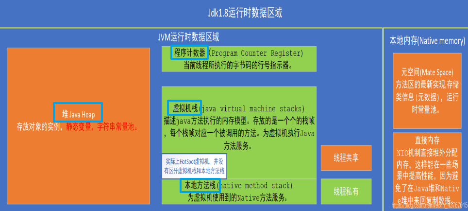

## JAVA类加载过程
（加载（类加载器问题） 验证 准备 解析 初始化）

## 垃圾回收机制
**垃圾回收机制：场景：计算机性能好 但Idea（也是一个Java程序）但比较卡，原因：可能是因为频繁产生Full GC 怎么排查问题进行调整**
    
**Full GC效果不好 每次只能从90%-》85%之后又90%了，这种情况下应该怎么办比较好**

gc[算法](https://www.nowcoder.com/jump/super-jump/word?word=%E7%AE%97%E6%B3%95)有哪些
可达性分析
判断gcroots的原则是什么

1.  JVM内存模型、垃圾收集[算法](https://www.nowcoder.com/jump/super-jump/word?word=%E7%AE%97%E6%B3%95)、判断是否可回收
2. 垃圾回收[算法](https://www.nowcoder.com/jump/super-jump/word?word=%E7%AE%97%E6%B3%95)，jvm运行时区域

Java中有个String类，如果我们自己写一个java.lang.String类，会出现问题吗
(参考《深入理解Java虚拟机》第7章 虚拟机类加载机制，主要讲了类加载器的种类和双亲委派模型)
JVM-   四种引用
-   场景题：如果是一个服务器用于存储数据，然后里面有一些数据是热点数组，需要缓存，用哪种引用
- JVM内存空间分布
垃圾回收[算法](https://www.nowcoder.com/jump/super-jump/word?word=%E7%AE%97%E6%B3%95)（标记-清除，标记-复制，标记-整理）
哪些可以作为GCROOT
常见的垃圾回收器
讲一讲CMS的回收过程

### 双亲委派机制🐋🐋🌟
[深入理解 Tomcat（四）Tomcat 类加载器之为何违背双亲委派模型](https://juejin.cn/post/6844903550300979214)

Java虚拟机把描述类的数据从Class文件加载进内存，并对数据进行校验，转换解析和初始化，最终形成可以被虚拟机直接使用的Java类型，这就是虚拟机的类加载机制。

对于任意一个类，都需要由加载他的类加载器和这个类本身一同确立其在Java虚拟机中的唯一性。

较两个类是否“相等”，只有在这两个类是由同一个类加载器加载的前提下才有意义，否则，即使这两个类来自同一个Class文件，被同一个虚拟机加载，只要加载他们的类加载器不同，那这个两个类就必定不相等。

**双亲委派模型**
1. 从Java虚拟机的角度来说，只存在两种不同类加载器：一种是启动类加载器(Bootstrap ClassLoader)，这个类加载器使用C++语言实现（只限HotSpot），是虚拟机自身的一部分；另一种就是所有其他的类加载器，这些类加载器都由Java语言实现，独立于虚拟机外部，并且全都继承自抽象类`java.lang.ClassLoader`.
2. 从Java开发人员的角度来看，类加载还可以划分的更细致一些，绝大部分Java程序员都会使用以下3种系统提供的类加载器：
	-   **启动类**加载器（Bootstrap ClassLoader）：这个类加载器负责将存放在 JAVA_HOME/lib 目录中的，或者被-Xbootclasspath 参数所指定的路径中的，并且是虚拟机识别的（仅按照文件名识别，如rt.jar，名字不符合的类库即使放在lib目录下也不会重载）。
	-   **扩展类**加载器（Extension ClassLoader）：这个类加载器由sun.misc.Launcher$ExtClassLoader实现，它负责夹杂JAVA_HOME/lib/ext 目录下的，或者被java.ext.dirs 系统变量所指定的路径中的所有类库。开发者可以直接使用扩展类加载器。
	-   **应用程序类**加载器（Application ClassLoader）：这个类加载器由sun.misc.Launcher$AppClassLoader 实现。由于这个类加载器是ClassLoader 中的getSystemClassLoader方法的返回值，所以也成为系统类加载器。它负责加载用户类路径（ClassPath）上所指定的类库。开发者可以直接使用这个类加载器，如果应用中没有定义过自己的类加载器，一般情况下这个就是程序中默认的类加载器。

双亲委派模型要求除了顶层的启动类加载器之外，**其余的类加载器都应当由自己的父类加载器加载**，这里类加载器之间的父子关系一般不会以继承的关系来实现，而是都使用组合关系来复用父加载器的代码。

**双亲委派模型的工作过程**是：如果一个类加载器收到了类加载的请求，他首先不会自己去尝试加载这个类，而是把这个请求委派父类加载器去完成。每一个层次的类加载器都是如此，因此所有的加载请求最终都应该传送到顶层的启动类加载器中，只有当父加载器反馈自己无法完成这个请求（他的搜索范围中没有找到所需的类）时，子加载器才会尝试自己去加载。

先检查是否已经被加载过，若没有加载则调用父加载器的loadClass方法， 如父加载器为空则默认使用启动类加载器作为父加载器。如果父类加载失败，抛出ClassNotFoundException 异常后，再调用自己的findClass方法进行加载。

**Tomcat的问题：**
一个web容器可能需要部署两个应用程序，不同的应用程序可能会依赖**同一个第三方类库的不同版本**，不能要求同一个类库在同一个服务器只有一份。
web容器需要支持 jsp 修改后不用重启。

-   commonLoader：Tomcat最基本的类加载器，加载路径中的class可以被Tomcat容器本身以及各个Webapp访问；
-   catalinaLoader：Tomcat容器私有的类加载器，加载路径中的class对于Webapp不可见；
-   sharedLoader：各个Webapp共享的类加载器，加载路径中的class对于所有Webapp可见，但是对于Tomcat容器不可见；
-   WebappClassLoader：各个Webapp私有的类加载器，加载路径中的class只对当前Webapp可见；

CommonClassLoader能加载的类都可以被Catalina ClassLoader和SharedClassLoader使用，从而实现了公有类库的共用，而CatalinaClassLoader和Shared ClassLoader自己能加载的类则与对方相互隔离。

WebAppClassLoader可以使用SharedClassLoader加载到的类，但各个WebAppClassLoader实例之间相互隔离。

而JasperLoader的加载范围仅仅是这个JSP文件所编译出来的那一个.Class文件，它出现的目的就是为了被丢弃：当Web容器检测到JSP文件被修改时，会替换掉目前的JasperLoader的实例，并通过再建立一个新的Jsp类加载器来实现JSP文件的HotSwap功能。

### 如何打破双亲委派机制？🐋
编写自定义类加载器：
- 继承ClassLoader
- 重写findClass()方法
- 调用defineClass()方法，最后会调用本地方法defineClass1来加载该类获取Class实例

### Java的类加载过程🐋🌟🌟
[Java的类加载过程](https://www.cnblogs.com/javaee6/p/3714716.html?spm=a2c6h.12873639.0.0.c27f75a7uj7pbg)


加载：
1.  通过一个类的全限定名来获取定义此类的二进制字节流。
2. 将这个字节流所代表的静态存储结构转化为方法区的运行时数据结构。
3. 在Java堆中生成一个代表这个类的java.lang.Class对象，作为方法区这些数据的访问入口。
加载阶段既可以使用系统提供的类加载器在完成，也可以由用户自定义的类加载器来完成。

验证：【Class文件并不一定是由Java源码编译而来，可以使用任何途径】
1. 文件格式验证：验证字节流是否符合Class文件格式的规范，并且能被当前版本的虚拟机处理。
2. 元数据验证，是对字节码描述的信息进行语义分析，以保证其描述的信息符合Java语言规范的要求。
3. 字节码验证，主要工作是进行数据流和控制流分析，保证被校验类的方法在运行时不会做出危害虚拟机安全的行为。

准备：准备阶段是为类的静态变量分配内存并将其初始化为默认值，这些内存都将在方法区中进行分配。public static int value=123;//在准备阶段value初始值为0 。在初始化阶段才会变为123 。

解析： 解析阶段是虚拟机将常量池内的符号引用替换为直接引用的过程。

初始化：初始化阶段是执行类构造器方法的过程。

### [运行时数据区](https://www.cnblogs.com/54chensongxia/p/13027602.html)


[参考链接](https://www.cnblogs.com/54chensongxia/p/13027602.html)

堆区是虚拟机管理的内存中最大的一块。这块内存区域的主要功能就是**存放Java对象和数组**。这个区域是被所有线程共享的。

栈区可以分为：虚拟机栈、本地方法栈、程序计数器区，Java虚拟机栈是线程私有的，生命周期和线程相同。

虚拟机栈描述的是Java方法执行的线程内存模型：每个方法被执行的时候，Java虚拟机都会同步创建一个栈帧（StackFrame）用于存储局部变量表、操作数栈、动态连接、方法出口等信息。每一个方法被调用直至执行完毕的过程，就对应着一个栈帧在虚拟机栈中从入栈到出栈的过程。

本地方法栈（Native Method Stacks）与虚拟机栈所发挥的作用是非常相似的，其区别只是虚拟机栈为虚拟机执行Java方法（也就是字节码）服务，而本地方法栈则是为虚拟机使用到的本地（Native）方法服务。

程序计数器可以看作是当前线程**所执行字节码的行号指示器**。在Java虚拟机的概念模型里，字节码解释器工作时就是通过改变这个计数器的值来选取下一条需要执行的字节码指令，它是程序控制流的指示器，分支、循环、跳转、异常处理、线程恢复等基础功能都需要依赖这个计数器来完成。

方法区（Method Area）与Java堆一样，是各个线程共享的内存区域，它用于存储已被虚拟机加载的类型信息、常量、静态变量、即时编译器编译后的代码缓存等数据。

在JDK 8以前，很多地方会将方法区和永久代的概念等价，到了JDK 8中，HotSpot的开发团队完全废弃了永久代（PermGem）的概念，改用与JRockit、J9一样在本地内存中实现的元空间（Meta-space）来代替，把JDK 7中永久代还剩余的内容（主要是类型信息）全部移到元空间中。

运行时常量池也是方法区的一部分。运行时常量池相对于Class文件常量池的另外一个重要特征是具备动态性，Java语言并不要求常量一定只有编译期才能产生，也就是说，并非预置入Class文件中常量池的内容才能进入方法区运行时常量池，运行期间也可以将新的常量放入池中，这种特性被开发人员利用得比较多的便是String类的intern()方法。

### JVM内存模型
常说的 **JVM 内存结构**指的就是上文提交到**运行时数据区**，其中堆、方法区被**线程共享**，程序计数器、栈被**线程独享**。

[重要参考](https://www.shouxicto.com/article/1817.html)
Java 8 后，永久代已经被移除，被称为“元空间”的区域所取代。类的元数据放入native memory, 字符串池和类的静态变量放入java堆中。


 - 常量池是当Class文件被Java虚拟机加载进来后存放在方法区各种字面量 (Literal)和 符号引用 。
 - 运行时常量池是当Class文件被加载到内存后，Java虚拟机会将Class文件常量池里的内容转移到运行时常量池里(运行时常量池也是每个类都有一个)。
 - 字符串常量池

### Java JVM 中 堆，栈存什么？
[参考](https://blog.csdn.net/zhangqiluGrubby/article/details/59110906)
Java栈中存放的是一个个的栈帧，每个栈帧对应一个被调用的方法，在栈帧中包括**局部变量表**(Local Variables)、**操作数栈**(Operand Stack)、指向当前方法所属的类的运行时常量池（运行时常量池的概念在方法区部分会谈到）的引用(Reference to runtime constant pool)、**方法返回地址**(Return Address)和一些额外的附加信息。当线程执行一个方法时，就会随之创建一个对应的栈帧，并将建立的栈帧压栈。当方法执行完毕之后，便会将栈帧出栈。

堆数据区是用来存放对象和数组（特殊的对象）。堆内存由多个线程共享。

### JVM 有哪些垃圾回收算法？🌟
[JVM 有哪些垃圾回收算法？](https://juejin.cn/post/6995539279241822245)
每次回收时只关注如何保留少量存活而不是去标记那些大量将要被回收的对象，就能以较低代价回收到大量的空间；如果剩下的都是难以消亡的对象，那把它们集中放在一块， 虚拟机便可以使用较低的频率来回收这个区域。

标记-清除算法：
分为“标记”和“清除”两个阶段：首先标记出所有需要回收的对象，在标记完成后，统一回收掉所有被标记的对象，也可以反过来，标记存活的对象，统一回收所有未被标记的对象。


标记-复制算法：
它将可用内存按容量划分为大小相等的两块，每次只使用其中的一块。当一块的内存用完了，就将还存活着的对象复制到另外一块上面，然后再把已使用过的内存空间一次清理掉。

如果另外一块 Survivor空间没有足够空间存放上一次新生代收集(Minor GC)下来的存活对象，这些对象便将通过分配担保机制直接进入老年代，这对虚拟机来说就是安全的。


标记整理算法：
其中的标记过程仍然与“标记-清除”算法一样，但后续步骤不是直接对可回收对象进行清理，而是**让所有存活的对象都向内存空间一端移动**，然后直接清理掉边界以外的内存。

HotSpot虚拟机里面关注吞吐量的Parallel Scavenge收集器是基于标记-整理算法的，而关注延迟的CMS收集器则是基于标记-清除算法的。


**分代收集算法就是目前虚拟机使用的回收算法**，它解决了标记整理不适用于老年代的问题，将内存分为各个年代。一般情况下将堆区划分为老年代（Tenured Generation）和新生代（Young Generation），在堆区之外还有一个代就是永久代（Permanet Generation）。

### 并发的可达性分析🌟
[并发的可达性分析](https://segmentfault.com/a/1190000021820577)
判断对象是否被回收的算法有**引用计数**算法和**可达性分析**算法。其中可达性分析算法是根据GC Roots根节点作为起始点向下搜索引用链，如果某个对象到GC Roots间没有任何引用链相连，则判定对象可回收。

虽然循环引用的问题可通过 Recycler 算法解决，但是在多线程环境下，引用计数变更也要进行昂贵的同步操作，性能较低，早期的编程语言会采用此算法。

并发标记要解决什么问题呢？
就是要消减这一部分的停顿时间。那就是让垃圾回收器和用户线程同时运行，并发工作。

**三色标记**
在遍历对象图的过程中，把访问都的对象**按照"是否访问过"这个条件**标记成以下三种颜色：
1. **白色：表示对象尚未被垃圾回收器访问过**。显然，在可达性分析刚刚开始的阶段，所有的对象都是白色的，若在分析结束的阶段，仍然是白色的对象，即代表不可达。
2. **黑色：表示对象已经被垃圾回收器访问过，且这个对象的所有引用都已经扫描过**。黑色的对象代表已经扫描过，它是安全存活的，如果有其它的对象引用指向了黑色对象，无须重新扫描一遍。黑色对象不可能直接（不经过灰色对象）指向某个白色对象。
3. **灰色：表示对象已经被垃圾回收器访问过，但这个对象至少存在一个引用还没有被扫描过**。


垃圾回收器在对象图上面标记颜色，而同时用户线程在修改引用关系，引用关系修改了，那么对象图就变化了，这样就有可能出现两种后果：

1. 一种是把原本消亡的对象错误的标记为存活，这不是好事，但是其实是可以容忍的，只不过产生了一点逃过本次回收的浮动垃圾而已，下次清理就可以。
2. 一种是把原本存活的对象错误的标记为已消亡，这就是非常严重的后果了，一个程序还需要使用的对象被回收了，那程序肯定会因此发生错误。

用户线程的运行让原本已经完成扫描的黑色节点与未经扫描的白色节点产生了引用关系。

用户线程切断引用后重新被黑色对象引用的对象就是原来引用链的一部分。


**当且仅当以下两个条件同时满足时**，会产生"对象消失"的问题，原来应该是黑色的对象被误标为了白色：
1. 赋值器插入了一条或者多条从黑色对象到白色对象的新引用。
2. 赋值器删除了全部从灰色对象到该白色对象的直接或间接引用。

所以，我们要解决并发标记时对象消失的问题，只需要破坏两个条件中的任意一个就行。于是产生了两种解决方案：**增量更新（Incremental Update）和原始快照（Snapshot At The Beginning，SATB）。**
在HotSpot虚拟机中，**CMS是基于增量更新来做并发标记的，G1则采用的是原始快照的方式。**

增量更新破坏了第一个条件：当黑色对象插入新的指向白色对象的引用关系时，就将这个新插入的引用记录下来，等并发扫描结束之后，再将这些记录过的引用关系中的黑色对象为根，重新扫描一次。
原始快照破坏的是第二个条件：SATB 在写屏障里，**把旧的引用所指向的对象都变成非白的**（已经黑灰就不用管，还是白的就变成灰的）。

### GC Roots的对象包括哪几种？🐋
[参考](https://www.cnblogs.com/KeleLLXin/p/14061269.html)
在Java语言中，GC Root主要包括以下几类元素：
1. **虚拟机栈中引用的对象**,比如：各个线程被调用的方法中使用到的参数、局部变量等。
2. **本地方法栈内JNI（通常说的本地方法）引用的对象**
3. 方法区中**类静态属性**引用的对象,比如：Java类的引用类型静态变量
4. 方法区中**常量**引用的对象,比如：字符串常量池（string Table） 里的引用
5. 所有被同步锁synchronized持有的对象
6. Java**虚拟机内部的引用**。基本数据类型对应的Class对象，一些常驻的异常对象（如：NullPointerException、OutOfMemoryError） ，系统类加载器。
7. 反映Java虚拟机内部情况的JMXBean、JVMTI中注册的回调、本地代码缓存等
8. 除了这些固定的GCRoots集合以外，根据用户所选用的垃圾收集器以及当前回收的内存区域不同，还可以有其他对象“临时性”地加入，共同构成完整GC Roots集合。比如：分代收集和局部回收（Partial GC）
***
1. 在虚拟机栈中引用的对象，例如各个线程被调用的方法堆栈中使用到的参数、局部变量、临时变量等。
2. 在方法区中类静态属性引用的对象，例如java类的引用类型静态变量。
3. 在方法区中常量引用的对象，例如字符串常量池里的引用。
4. 在本地方法栈中JNI引用的对象。
5. Java虚拟机内部的引用，如基本数据类型对应的class对象，一些常驻的异常对象等，还有类加载器。
6. 所有被同步锁持有的对象。
7. 反映Java虚拟机内部情况的JMXBean、JVMTI中注册的回调、本地代码缓存等。

除了这些固定的GC Roots集合外，根据用户所选用的垃圾收集器以及当前回收的内存区域不同，还可以有其他对象临时性地加入，共同构成完整GC Roots集合。
  
### 常见的垃圾回收器 🌟🌟🌟
[重点关注](https://juejin.cn/post/6844903685374377998)
**Serial收集器**
Serial，是单线程执行垃圾回收的。当需要执行垃圾回收时，程序会暂停一切手上的工作，然后单线程执行垃圾回收。
因为新生代的特点是对象存活率低，所以收集算法用的是复制算法，把新生代存活对象复制到老年代，复制的内容不多，性能较好。

**ParNew收集器**
ParNew同样用于新生代，是Serial的多线程版本，并且在参数、算法（同样是复制算法）上也完全和Serial相同。Par是Parallel的缩写，但它的并行仅仅指的是收集多线程并行，并不是收集和原程序可以并行进行。ParNew也是需要暂停程序一切的工作，然后多线程执行垃圾回收。

**Parallel Scavenge收集器**
新生代的收集器，同样用的是复制算法，也是并行多线程收集。与ParNew最大的不同，它关注的是垃圾回收的吞吐量。
这里的吞吐量指的是 总时间与垃圾回收时间的比例。这个比例越高，证明垃圾回收占整个程序运行的比例越小。
Parallel Scavenge收集器提供两个参数控制垃圾回收的执行：
- -XX:MaxGCPauseMillis，最大垃圾回收停顿时间。这个参数的原理是空间换时间，收集器会控制新生代的区域大小，从而尽可能保证回收少于这个最大停顿时间。简单的说就是回收的区域越小，那么耗费的时间也越小。
所以这个参数并不是设置得越小越好。设太小的话，新生代空间会太小，从而更频繁的触发GC。
- -XX:GCTimeRatio，垃圾回收时间与总时间占比。这个是吞吐量的倒数，原理和MaxGCPauseMillis相同。
因为Parallel Scavenge收集器关注的是吞吐量，所以当设置好以上参数的时候，同时不想设置各个区域大小（新生代，老年代等）。可以开启-XX:UseAdaptiveSizePolicy参数，让JVM监控收集的性能，动态调整这些区域大小参数。

**Serial Old收集器**
老年代的收集器，与Serial一样是单线程，不同的是算法用的是标记-整理（Mark-Compact）。因为老年代里面对象的存活率高，如果依旧是用复制算法，需要复制的内容较多，性能较差。并且在极端情况下，当存活为100%时，没有办法用复制算法。所以需要用Mark-Compact，以有效地避免这些问题。

**Parallel Old收集器**
老年代的收集器，是Parallel Scavenge老年代的版本。其中的算法替换成Mark-Compact。

**CMS收集器**
CMS，Concurrent Mark Sweep，同样是老年代的收集器。它关注的是垃圾回收最短的停顿时间（低停顿），在老年代并不频繁GC的场景下，是比较适用的。
命名中用的是concurrent，而不是parallel，说明这个收集器是有与工作执行并发的能力的。MS则说明算法用的是Mark Sweep算法。
来看看具体地工作原理。CMS整个过程比之前的收集器要复杂，整个过程分为四步：
- 初始标记（initial mark），单线程执行，需要“Stop The World”，但仅仅把GC Roots的直接关联可达的对象给标记一下，由于直接关联对象比较小，所以这里的速度非常快。
- 并发标记（concurrent mark），对于初始标记过程所标记的初始标记对象，进行并发追踪标记，此时其他线程仍可以继续工作。此处时间较长，但不停顿。
- 重新标记（remark），在并发标记的过程中，由于可能还会产生新的垃圾，所以此时需要重新标记新产生的垃圾。此处执行并行标记，与用户线程不并发，所以依然是“Stop The World”，时间比初始时间要长一点。
- 并发清除（concurrent sweep），并发清除之前所标记的垃圾。其他用户线程仍可以工作，不需要停顿。

缺点：
- Mark Sweep算法会导致内存碎片比较多
- CMS的并发能力依赖于CPU资源，所以在CPU数少和CPU资源紧张的情况下，性能较差
- 并发清除阶段，用户线程依然在运行，所以依然会产生新的垃圾，此阶段的垃圾并不会再本次GC中回收，而放到下次。所以GC不能等待内存耗尽的时候才进行GC，这样的话会导致并发清除的时候，用户线程可以了利用的空间不足。所以这里会浪费一些内存空间给用户线程预留。

当并发清除的时候，用Compact整理内存的话，原来的用户线程使用的内存还怎么用呢？要保证用户线程能继续执行，前提的它运行的资源不受影响嘛。Mark Compact更适合“Stop the World”这种场景下使用。

**G1收集器**
- 高效益优先。G1会预测垃圾回收的停顿时间，原理是计算老年代对象的效益率，优先回收最大效益的对象。
- 堆内存结构的不同。以前的收集器分代是划分新生代、老年代、持久代等。G1则是把内存分为多个大小相同的区域Region，每个Region拥有各自的分代属性，但这些分代不需要连续。这样的分区可以有效避免内存碎片化问题。但是这样同样会引申一个新的问题，就是分代的内存不连续，导致在GC搜索垃圾对象的时候需要全盘扫描找出引用内存所在。为了解决这个问题，G1对于每个Region都维护一个Remembered Set，用于记录对象引用的情况。当GC发生的时候根据Remembered Set的引用情况去搜索。

RSet：全称Remembered Sets, 用来记录**外部指向本Region的所有引用**，每个Region维护一个RSet。【Remembered Set 用于记录从非收集区域指向收集区域的指针集合的抽象数据结构。例如，新生代GC 需要 Remembered Set 记录哪些老年代对象（非收集区域）引用了新生代对象（收集区域）】
Card: JVM将内存划分成了固定大小的Card。这里可以类比物理内存上page的概念。
在 HotSpot 中，卡表是一个字节数组，数组的每一个元素对应着所表示的内存区域中一块特定大小的内存块，这个内存块称为 Card Page（卡页）。Card Table 的每一个元素用来 标记 老年代的某一块内存区域（Card Page）的所有对象是否引用了新生代对象。

在Region层面上，整体的算法偏向于Mark-Compact。因为是Compact，会影响用户线程执行，所以回收阶段（重新标记和清除阶段）需要STW执行。

**ZGC**
与标记对象的传统算法相比，ZGC在指针上做标记，在访问指针时加入Load Barrier（读屏障），比如当对象正被GC移动，指针上的颜色就会不对，这个屏障就会先把指针更新为有效地址再返回，也就是，永远只有单个对象读取时有概率被减速，而不存在为了保持应用与GC一致而粗暴整体的Stop The World。
***
Serial收集器【复制算法】：曾经是HotSpot虚拟机新生代收集器的唯一选择。在它进行垃圾收集时，必须暂停其他所有工作线程，直到它收集结束。


ParNew收集器：实质上是Serial收集器的多线程并行版本。


Parallel Scavenge收集器：也是一款新生代收集器，它同样是基于标记-复制算法实现的收集器，也是能够并行收集的多线程收集器。目标则是达到一个可控制的吞吐量。
吞吐量=运行用户代码时间/(运行用户代码时间+运行垃圾收集时间)

Serial Old收集器是Serial收集器的老年代版本，它同样是一个单线程收集器，使用标记-整理算法。

Parallel Old是Parallel Scavenge收集器的老年代版本，使用多线程和“标记-整理”算法。

Concurrent Mark Sweep（CMS）是老年代垃圾收集器，基于标记-清除算法，在收集过程中可以与用户线程并发操作。CMS牺牲了系统的吞吐量来追求收集速度，适合追求垃圾收集速度的服务器上。

G1收集器是基于标记整理算法实现的，不会产生空间碎片，可以精确地控制停顿，将堆划分为多个大小固定的独立区域，并跟踪这些区域的垃圾堆积程度，在后台维护一个优先列表，每次根据允许的收集时间，优先回收垃圾最多的区域(Garbage First)。


其中Serial Old作为CMS出现"Concurrent Mode Failure"失败的后备预案。
红色虚线：由于维护和兼容性测试的成本，再JDK8时将Serial+CMS、ParNew+Serial Old这两个组合声明为废弃，并在JDK9完全取消了这些组合的支持，即移除。
绿色虚线：JDK14中，弃用Parallel Scavenge+SerialOld组合。删除CMS垃圾回收器。


### 卡表解决的问题
[卡表解决的问题](https://stackoverflow.com/questions/19154607/how-actually-card-table-and-writer-barrier-work)

有个场景，老年代的对象可能引用新生代的对象，那标记存活对象的时候，需要扫描老年代中的所有对象。因为该对象拥有对新生代对象的引用，那么这个引用也会被称为GC Roots。那不是得又做全堆扫描？成本太高了吧。

HotSpot给出的解决方案是一项叫做卡表（Card Table）的技术。该技术将**整个堆划分为一个个大小为512字节的卡**，并且维护一个卡表，用来存储每张卡的一个标识位。这个标识位代表对应的卡是否可能存有指向新生代对象的引用。如果可能存在，那么我们就认为这张卡是脏的。

在进行Minor GC的时候，我们便可以不用扫描整个老年代，而是在卡表中寻找脏卡，并将脏卡中的对象加入到Minor GC的GC Roots里。当完成所有脏卡的扫描之后，Java虚拟机便会将所有脏卡的标识位清零。

想要保证每个可能有指向新生代对象引用的卡都被标记为脏卡，那么Java虚拟机需要**截获每个引用型实例变量的写操作**，并作出对应的写标识位操作。

卡表能用于减少老年代的全堆空间扫描，这能很大的提升GC效率。

***

卡精度：每个记录精确到一块内存区域，该区域内有对象含有**跨代指针**。
“卡精度”所指的是用一种称为“卡表”（Card Table）的方式去实现记忆集，这也是目前最常用的一种记忆集实现形式。

一个卡页的内存中通常包含不止一个对象，只要卡页内有一个（或更多）对象的字段存在着跨代 指针，那就将对应卡表的数组元素的值标识为1，称为这个元素变脏（Dirty），没有则标识为0。在垃 圾收集发生时，只要筛选出卡表中变脏的元素，就能轻易得出哪些卡页内存块中包含跨代指针，把它 们加入GC Roots中一并扫描。

**写屏障**
HotSpot虚拟机里是通过**写屏障**（Write Barrier）技术维护卡表状态的，写屏障可以看作在虚拟机层面对 **“引用类型字段赋值”** 这个动作的AOP切面。

### OopMap
OopMap 记录了栈上本地变量到堆上对象的引用关系。

用空间换时间，在某个时候把栈上代表引用的位置全部记录下来，这样到真正 gc 的时候就可以直接读取，而不用再一点一点的扫描了。

一个线程意味着一个栈，一个栈由多个栈帧组成，一个栈帧对应着一个方法，一个方法里面可能有多个安全点。 gc 发生时，程序首先运行到最近的一个安全点停下来，然后更新自己的 OopMap ，记下栈上哪些位置代表着引用。枚举根节点时，**递归遍历每个栈帧**的 OopMap ，通过栈中记录的被引用对象的内存地址，即可找到这些对象（ GC Roots ）。

每个被JIT编译过后的方法也会在一些特定的位置【安全点】记录下OopMap，记录了执行到该方法的某条指令的时候，栈上和寄存器里哪些位置是引用。这样GC在扫描栈的时候就会查询这些OopMap就知道哪里是引用了。

**安全点**
1. 循环的末尾
2. 方法临返回前 / 调用方法的call指令后
3. 可能抛异常的位置

### 讲一讲CMS的回收过程

```
1、-XX:+UseConcMarkSweepGC   #启动CMS
2、-XX:ConcGCThreads   #CMS并发线程数量
3、-XX:+UseCMSCompactAtFullCollection  #FullGC之后做压缩，减少碎片
4、-XX:CMSFullGCsBeforeCompaction   #多少次FullGC之后压缩一次碎片，默认0，表示每次FullGC后都会压缩
5、-XX:CMSInitiatingOccupancyFraction  #老年代使用多少后会触发FullGC，默认92
6、-XX:+UseCMSInitiatingOccupancyOnly  #固定使用CMSInitiatingOccupancyFraction设置的参数，
如果不设置该参数，CMSInitiatingOccupancyFraction设置的比例只会在第一次GC时使用，后续会自动优化
7、-XX:+CMSScavengeBeforeRemark  #在CMS GC之前触发一次minor gc，降低CMSGC标记阶段的开销
8、-XX:+CMSClassUnloadingEnabled CMS收集器默认不会对永久代进行垃圾回收。如果希望对永久代进行垃圾回收，可用设置标志
```

**CMS的缺点：**
1. 对CPU资源十分敏感，因为并发标记和并发清除都是和程序同时运行，因此会占用CPU导致应用程序变慢。
2. 无法处理浮动垃圾，浮动垃圾就是在并发清除过程中新生成的垃圾，这部分垃圾CMS无法在本次被清理;【重新标记阶段只会利用**增量更新**来解决因并发标记阶段产生的对象消失问题，而浮动垃圾的产生原因是因为已经被GC线程被标记为黑色了，但用户线程取消了它的所有引用，而黑色对象并不会被重新扫描，所以重新标记是找不到浮动垃圾的。】
3. 可能出现Concurrent Mode Failed报错，因此需要预留一定的内存空间，无法等到老年代快被占满时再清除。
4. 产生空间碎片，由于采用的是标记-清除算法，那就无法避免会产生空间碎片的问题，这会给分配大对象带来困难。

[**promotion failed**](https://www.jianshu.com/p/ca1b0d4107c5)
一般是进行Minor GC的时候，发现Survivor空间不够，所以，需要移动一些新生代的对象到老年代，然而，有些时候尽管老年代有足够的空间，但是由于CMS采用标记清除算法，默认并不使用标记整理算法，可能会产生很多碎片，因此，这些碎片无法完成大对象向老年代转移，因此需要进行CMS在老年代的Full GC来合并碎片。

这个问题的直接影响就是它会导致提前进行CMS Full GC, 尽管这个时候CMS的老年代并没有填满，只不过有过多的碎片而已，但是Full GC导致的stop-the-wold是难以接受的。

解决这个问题的办法就是可以让CMS在进行一定次数的Full GC（标记清除）的时候进行一次标记整理算法，CMS提供了以下参数来控制：
-XX:UseCMSCompactAtFullCollection 
-XX:CMSFullGCBeforeCompaction=5
也就是CMS在进行5次Full GC（标记清除）之后进行一次标记整理算法，从而可以控制老年代的碎片在一定的数量以内，甚至可以配置CMS在每次Full GC的时候都进行内存的整理。

有些应用存在比较大的对象朝生熄灭，这些对象在Survivor空间无法容纳，因此，会提早进入老年代，老年代如果有碎片，也会产生promotion failed, 因此我们应该控制这样的对象在新生代，然后在下次Minor GC的时候就被回收掉，这样避免了过早的进行CMS Full GC操作。

**concurrent mode failure**
造成concurrent mode failure的原因是当minor GC进行时，1）旧生代所剩下的空间小于Eden区域+From区域的空间，或者2）在CMS执行老年代的回收时有业务线程试图将大的对象放入老年代，导致CMS在老年代的回收慢于业务对象对老年代内存的分配。

解决这个问题的通用方法是调低触发CMS GC执行的阀值，CMS GC触发主要由CMSInitiatingOccupancyFraction值决定，默认情况是当旧生代已用空间为68%时，即触发CMS GC，在出现concurrent mode failure的情况下，可考虑调小这个值，提前CMS GC的触发，以保证旧生代有足够的空间。

***
[参考](https://blog.51cto.com/u_15297247/3017167)
当young gc的时候，把eden和survivor里的都还存活的对象，统一移到另一个survivor区中时，发现装不下了，就需要把部分对象，放到老年代中去，结果老年代空间也不足，这种场景叫做promotion failed。

在promotion failed的前提下，老年代恰好还正在full gc，那么就会出现concurrent mode failure。

concurrent mode failure情况下的full gc使用的并不是cms的垃圾回收器，而是使用的Serail-Old垃圾回收器，全程是单线程串行操作， 就会比较慢。

首先是排查应用程序的内存泄漏问题，看看是否有频繁且大量的不必要的创建对象的操作，再就是评估下当前的系统负载和容量情况，看是否需要扩容调整。

- -XX:UseCMSCompactAtFullCollection参数来减少内存碎片；
- 本文中的情况是新生代较小(只有300M),因此还有很多对象晋升到老年代，于是老年代内存使用量也涨的比较快，所以可以适当通过-XX:NewSize和-XX:MaxNewSize来调整下新生代的大小。
- 如果新生代大小是合理的话，则可以调大老年代的容量，如果内存有限的话，可以适当调小XX:CMSInitiatingOccupancyFraction参数，让老年代提前进行GC，预留足够的空间来接纳新生代的晋升对象。
***

[CMS优缺点](https://blog.csdn.net/u013905744/article/details/114001066)
优点：并发收集、低停顿
缺点：
- **无法处理浮动垃圾**：因为垃圾收集阶段用户线程也在运行，就会不断产生垃圾，所以得预留一部分空间给用户线程使用，则不能等到老年代几乎全部被填满之后才进行垃圾回收。 1.6 之后当老年代使用 92%，CMS 就启动了，该值可以通过参数：-XX:CMSInitiatingOccupancyFraction 指定，该百分值太小则 GC 过于频繁，太大会导致预留内存无法满足程序需要，出现 “Concurrent Mode Failure”。
- **存在空间碎片**
	- XX:+UseCMSCompactAtFullCollection：用于在 CMS 收集器顶不住要进行 Full GC 时候开启内存碎片合并整理过程。
	- -XX+CMSFullGCsBeforeCompaction：用于设置执行多少次不压缩的 Full GC 之后，跟着来一次带压缩的。默认值为 0 ，表示每次进入 Full GC 都进行碎片整理。
- **GC的时间难以预估**

### CMS知识 🐋🌟🌟
[CMS知识](https://www.cnblogs.com/heyonggang/p/11718170.html)
CMS（Concurrent Mark Sweep）收集器是一种以获取**最短回收停顿时间**为目标的收集器。这是因为CMS收集器工作时，GC工作线程与用户线程可以并发执行，以此来达到降低收集停顿时间的目的。
CMS收集器仅作用于老年代的收集，是基于标记-清除算法的，它的运作过程分为4个步骤：
- 初始标记（CMS initial mark）
- 并发标记（CMS concurrent mark）
- 重新标记（CMS remark）
- 并发清除（CMS concurrent sweep）

其中，初始标记、重新标记这两个步骤仍然需要Stop-the-world。初始标记仅仅只是标记一下GC Roots能直接关联到的对象，速度很快，并发标记阶段就是进行GC Roots Tracing的过程，而重新标记阶段则是为了修正并发标记期间因用户程序继续运作而导致标记产生变动的那一部分对象的标记记录，这个阶段的停顿时间一般会比初始阶段稍长一些，但远比并发标记的时间短。

CMS收集器优点：
- 并发收集、低停顿。

CMS收集器缺点：
- CMS收集器对CPU资源非常敏感。
- CMS收集器无法处理浮动垃圾（Floating Garbage）。
- CMS收集器是基于标记-清除算法，这种方式清理出来的空闲内存是不连续的,产生内存碎片，需要维护一个空闲列表。

**安全点**
程序运行时并非在所有地方都能停顿下来开始GC，只有在到达安全点时才能暂停。安全点的选定基本上是以程序“是否具有让程序长时间执行的特征”为标准进行选定的。“**长时间执行**”的最明显特征就是指令序列复用，例如**方法调用、循环跳转、异常跳转**等，所以具有这些功能的指令才会产生Safepoint。

**安全区域**
指在一段代码片段中，引用关系不会发生变化。在这个区域中任意地方开始GC都是安全的。也可以把Safe Region看作是被扩展了的Safepoint。

**promotion failed & concurrent mode failure**
在进行Minor GC时，Survivor Space放不下，对象只能放入老年代，而此时老年代也放不下造成的。（promotion failed时老年代CMS还没有机会进行回收，又放不下转移到老年代的对象，因此会出现下一个问题concurrent mode failure，需要stop-the-wold 降级为GC-Serail Old）。

造成concurrent mode failure的原因是当minor GC进行时，1）旧生代所剩下的空间小于Eden区域+From区域的空间，或者2）在CMS执行老年代的回收时有业务线程试图将大的对象放入老年代，导致CMS在老年代的回收慢于业务对象对老年代内存的分配。【JVM开发人员将新生代分为一块较大的Eden区，和两块较小的Survivor区，每次可以使用来存放对象的是Eden区和其中一块Survivor区。当回收时，将Eden区和Survivor from中还存活着的对象一次性复制到另一块Survivor to区（这里进行复制算法），然后就清空调Eden区和Survivor from区中的数据。】

**官方文档的解释**
如果在垃圾回收完成前，老生代被耗尽，或者老生代无法分配足够的空间，此时会暂停所有的应用线程（导致了STW）直到垃圾回收完成。没有在并发期间完成垃圾回收工作称为**concurrent mode failure**，这个失败表明我们需要调整CMS收集器的参数。

**解决方法：**
加上-XX:UseCMSCompactAtFullCollection参数来减少内存碎片。

本文中的情况是新生代较小(只有300M),因此还有很多对象晋升到老年代，于是老年代内存使用量也涨的比较快，所以可以适当通过-XX:NewSize和-XX:MaxNewSize来调整下新生代的大小。

如果新生代大小是合理的话，则可以调大老年代的容量，如果内存有限的话，可以适当调小XX:CMSInitiatingOccupancyFraction参数，让老年代提前进行GC，预留足够的空间来接纳新生代的晋升对象。

**CMS与G1的区别：**
- 并行与并发：G1能充分利用多CPU、多核环境下的硬件优势，使用多个CPU来缩短Stop-the-world停顿的时间，部分其他收集器原来需要停顿Java线程执行的GC操作，G1收集器仍然可以通过并发的方式让Java程序继续运行。
- 分代收集
- 空间整合：与CMS的标记-清除算法不同，G1从整体来看是基于标记-整理算法实现的收集器，从局部（两个Region之间）上来看是基于“复制”算法实现的。但无论如何，这两种算法都意味着G1运作期间不会产生内存空间碎片，收集后能提供规整的可用内存。这种特性有利于程序长时间运行，分配大对象时不会因为无法找到连续内存空间而提前触发下一次GC。
- 可预测的停顿：这是G1相对于CMS的一个优势，降低停顿时间是G1和CMS共同的关注点。【在标记完成后，按照优先级选择部分格子使用复制算法进行整理，这样每次整理的内存空间是可控的，STW的时间就相对可控，而且因为使用复制算法就不再会出现内存碎片。】

### G1垃圾收集器🐋
[G1垃圾收集器](https://juejin.cn/post/7010034105165299725#heading-7)
[新的参考，写的很好](http://hbasefly.com/2022/02/23/g1gc1/)

G1收集器将整个Java堆划分为多个大小相等的独立区域（Region），虽然还保留有新生代和老年代的概念，但新生代和老年代不再是物理隔离的了，它们都是一部分Region（不需要连续）的集合。Region的大小是一致的，数值是在1M到32M字节之间的一个2的幂值数，JVM会尽量划分2048个左右、同等大小的Region。

G1会通过一个合理的计算模型，计算出每个Region的收集成本并量化，这样一来，收集器在给定了“停顿”时间限制的情况下，总是能选择一组恰当的Regions作为收集目标，让其收集开销满足这个限制条件，以此达到实时收集的目的。

G1收集的运作过程大致如下：
- 初始标记（Initial Marking）：仅仅只是标记一下GC Roots能直接关联到的对象，并且修改TAMS（Next Top at Mark Start）的值，让下一阶段用户程序并发运行时，能在正确可用的Region中创建新对象，这阶段需要停顿线程，但耗时很短。
- 并发标记（Concurrent Marking）：是从GC Roots开始堆中对象进行可达性分析，找出存活的对象，这阶段耗时较长，但可与用户程序并发执行。
- 最终标记（Final Marking）：是为了修正并发标记期间因用户程序继续运作而导致标记产生变动的那一部分标记记录，虚拟机将这段时间对象变化记录在线程Remembered Set Logs里面，最终标记阶段需要把Remembered Set Logs的数据合并到Remembered Set中，这阶段需要停顿线程，但是可并行执行。
- 筛选回收（Live Data Counting and Evacuation）：首先对各个Region的回收价值和成本进行排序，根据用户所期望的GC停顿时间来制定回收计划。这个阶段也可以做到与用户程序一起并发执行，但是因为只回收一部分Region，时间是用户可控制的，而且停顿用户线程将大幅提高收集效率。

***

global concurrent marking的执行过程分为四个步骤： 
* 初始标记（initial mark，STW）：它标记了从GC Root开始直接可达的对象。 
* 并发标记（Concurrent Marking）：这个阶段从GC Root开始对heap中的对象标记，标记线程与应用程序线程并行执行，并且收集各个Region的存活对象信息。
*  最终标记（Remark，STW）：标记那些在并发标记阶段发生变化的对象，将被回收。 
-  清除垃圾（Cleanup）：清除空Region（没有存活对象的），加入到free list。

G1(Garbage-First)是一款面向服务端应用的垃圾收集器,主要针对配备多核CPU及大容量内存的机器,以极高概率满足GC停顿时间的同时,还兼具高吞吐量的性能特征

1. 应用程序分配内存,当年轻代的Eden区用尽时开始年轻代回收过程；G1的年轻代收集阶段是一个并行(多个垃圾线程)的独占式收集器。在年轻代回收期,G1 GC暂停所有应用程序线程,启动多线程执行年轻代回收。然后从年轻代区间移动存活对象到Survivor区间或者老年区间,也有可能是两个区间都会涉及。
2. 当堆内存使用达到一定值(默认45%)时,开始老年代并发标记过程。
3. 标记完成马上开始混合回收过程。对于一个混合回收期,G1 GC从老年区间移动存活对象到空闲区间,这些空闲区间也就成为了老年代的一部分。和年轻代不同,老年代的G1回收器和其他GC不同,G1的老年代回收器不需要整个老年代被回收,一次只需要扫描/回收一小部分老年代的Region就可以了。同时,这个老年代Region是和年轻代一起被回收的。【年轻代回收，老年代并发标记，混合回收】

年轻代GC：
1. 根扫描：一定要考虑remembered Set,看是否有老年代中的对象引用了新生代对象
2. 更新RSet：处理dirty card queue(见备注)中的card,更新RSet。 此阶段完成后,RSet可以准确的反映老年代对所在的内存分段中对象的引用
3. 处理RSet：识别被老年代对象指向的Eden中的对象,这些被指向的Eden中的对象被认为是存活的对象
4. 复制对象：Eden区内存段中存活的对象会被复制到Survivor区中空的内存分段,Survivor区内存段中存活的对象如果年龄未达阈值,年龄会加1,达到阀值会被会被复制到old区中空的内存分段。如果Survivor空间不够,Eden空间的部分数据会直接晋升到老年代空间。
5. 处理引用

老年代并发标记过程：
1. 初始标记阶段：标记从根节点直接可达的对象。这个阶段是STW的,并且会触发一次年轻代GC。
2. 根区域扫描：G1 GC扫描Survivor区直接可达的老年代区域对象,并标记被引用的对象。这一过程必须在young GC之前完成。
3. 并发标记：在整个堆中进行并发标记(和应用程序并发执行),此过程可能被young GC中断。在并发标记阶段,若发现区域对象中的所有对象都是垃圾,那这个区域会被立即回收。同时,并发标记过程中,会计算每个区域的对象活性(区域中存活对象的比例)。
4. 再次标记：由于应用程序持续进行,需要修正上一次的标记结果。是STW(stop-the-world)的。G1中采用了比CMS更快的初始快照算法：snapshot-at-the-beginning (SATB)。
5. 独占清理：计算各个区域的存活对象和GC回收比例,并进行排序,识别可以混合回收的区域。为下阶段做铺垫。是STW的。
6. 并发清理阶段：识别并清理完全空闲的区域。

混合回收 Mixed GC：老年代的堆占有率达到参数(-XX:InitiatingHeapOccupancyPercent)设定的值则触发Mixed GC，主要使用复制算法,需要把各个region中存活的对象拷贝到别的region里去,拷贝过程中如果发现没有足够的空region能够承载拷贝对象就会触发一次Full GC。

并发标记结束以后，老年代中百分百为垃圾的内存分段被回收了，部分为垃圾的内存分段被计算了出来。G1会优先回收垃圾多的内存分段。垃圾占内存分段比例越高的，越会被先回收。混合回收的算法和年轻代回收的算法完全一样，只是回收集多了老年代的内存分段。

### Young GC和Full GC分别在什么情况下会发生？🌟🌟
[Young GC和Full GC分别在什么情况下会发生？](https://www.cnblogs.com/tiancai/p/12630623.html)
Young GC的触发时机：Young GC其实一般就是在新生代的Eden区域满了之后就会触发，采用复制算法来回收新生代的垃圾。

Full GC的触发时机如下：
1. 发生Young GC之前进行检查，如果“老年代可用的连续内存空间” < “新生代历次Young GC后升入老年代的对象总和的平均大小”，说明本次Young GC后可能升入老年代的对象大小，可能超过了老年代当前可用内存空间，此时必须先触发一次Old GC给老年代腾出更多的空间，然后再执行Young GC。
2. 执行Young GC之后有一批对象需要放入老年代，此时老年代就是没有足够的内存空间存放这些对象了，此时必须立即触发一次Old GC。
3. 老年代内存使用率超过了92%，也要直接触发Old GC，当然这个比例是可以通过参数调整的。

### 为什么要垃圾回收
释放没用的对象，垃圾回收也可以清除内存记录碎片。

### Java分配对象
Java 中对象地址操作主要使用 Unsafe 调用了 C 的 allocate 和 free 两个方法，分配方法有两种：
-   **空闲链表（free list）：** 通过额外的存储记录空闲的地址，将随机 IO 变为顺序 IO，但带来了额外的空间消耗。
-   **碰撞指针（bump pointer）：** 通过一个指针作为分界点，需要分配内存时，仅需把指针往空闲的一端移动与对象大小相等的距离，分配效率较高，但使用场景有限。

### [JVM的线程是用户态线程还是内核态线程？](https://juejin.cn/post/7016228406220029983#heading-24)
JVM 自己本身有一个线程模型。在 JDK 1.1 的时候，JVM 自己管理用户级线程。这样做缺点非常明显，操作系统只调度内核级线程，用户级线程相当于基于操作系统分配到进程主线程的时间片，再次拆分，因此无法利用多核特性。为了解决这个问题，后来 Java 改用线程映射模型，因此，需要操作系统支持。在 Windows 上是 1 对 1 的模型，在 Linux 上是 n 对 m 的模型。映射关系是操作系统自动完成的，用户不需要管。综上，java线程是混合型的线程模型。

### Java中有个String类，如果我们自己写一个java.lang.String类，会出现问题吗?
[https://blog.51cto.com/u_15069472/2930368](https://blog.51cto.com/u_15069472/2930368)

>“即使自定义了自己的类加载器，强行使用defineClass()方法去加载一个以‘java.lang’开头的类也不会成功，如果尝试这样做的话，将会收到一个由虚拟机自己抛出的‘java.lang.SecurityException:Prohibited package name:java.lang’异常”。

不能自己写以"java."开头的类，其要么不能加载进内存，要么即使你用自定义的类加载器去强行加载，也会收到一个SecurityException。

### 怎么查看Java堆的统计信息？【jmap】
jps：可以列出正在运行的虚拟机进程，并显示虚拟机执行主类（Main Class，main()函数所在的类）名称以及这些进程的本地虚拟机唯一ID。
`jps -l`


jstat（JVM Statistics Monitoring Tool）是用于监视虚拟机各种运行状态信息的命令行工具。选项option代表用户希望查询的虚拟机信息，主要分为三类：类加载、垃圾收集、运行期编译状况。
```shell
jstat [ option vmid [interval[s|ms] [count]] ]

# 参数interval和count代表查询间隔和次数，如果省略这2个参数，说明只查询一次。假设需要每250毫秒查询一次进程2764垃圾收集状况，一共查询20次，那命令应当是：
jstat -gc 2764 250 20
```

jinfo（Configuration Info for Java）的作用是实时查看和调整虚拟机各项参数。
```shell
jinfo [ option ] pid

# 查询CMSInitiatingOccupancyFraction参数值
jinfo -flag CMSInitiatingOccupancyFraction 1444
```

jmap（Memory Map for Java）命令用于生成堆转储快照（一般称为heapdump或dump文件）。
jmap的作用并不仅仅是为了获取堆转储快照，它还可以查询finalize执行队列、Java堆和方法区的详细信息，如空间使用率、当前用的是哪种收集器等。
`jmap [ option ] vmid`


### JVM调优🐋
[参考](https://juejin.cn/post/6844903991713742855)
一般情况下，JVM调优可通过以下步骤进行：
- 分析GC日志及dump文件，判断是否需要优化，确定瓶颈问题点；
- 确定JVM调优参数（根据历史JVM参数来调整）；
- 依次调优内存、延迟、吞吐量等指标；
- 对比观察调优前后的差异；
- 不断的分析和调整，直到找到合适的JVM参数配置；
- 找到最合适的参数，将这些参数应用到所有服务器，并进行后续跟踪。

-Xms：初始化堆内存大小，默认为物理内存的1/64(小于1GB)。
-Xmx：堆内存最大值。默认(MaxHeapFreeRatio参数可以调整)空余堆内存大于70%时，JVM会减少堆直到-Xms的最小限制。
-Xmn：新生代大小，包括Eden区与2个Survivor区。
-XX:SurvivorRatio=1：Eden区与一个Survivor区比值为1:1。
-XX:MaxDirectMemorySize=1G：直接内存。报java.lang.OutOfMemoryError: Direct buffer memory异常可以上调这个值。
-XX:+DisableExplicitGC：禁止运行期显式地调用System.gc()来触发fulll GC。
注意: Java RMI的定时GC触发机制可通过配置-Dsun.rmi.dgc.server.gcInterval=86400来控制触发的时间。
-XX:CMSInitiatingOccupancyFraction=60：老年代内存回收阈值，默认值为68。
-XX:ConcGCThreads=4：CMS垃圾回收器并行线程线，推荐值为CPU核心数。
-XX:ParallelGCThreads=8：新生代并行收集器的线程数。
-XX:MaxTenuringThreshold=10：设置垃圾最大年龄。如果设置为0的话，则年轻代对象不经过Survivor区，直接进入年老代。对于年老代比较多的应用，可以提高效率。如果将此值设置为一个较大值，则年轻代对象会在Survivor区进行多次复制，这样可以增加对象再年轻代的存活时间，增加在年轻代即被回收的概论。
-XX:CMSFullGCsBeforeCompaction=4：指定进行多少次fullGC之后，进行tenured区 内存空间压缩。
-XX:CMSMaxAbortablePrecleanTime=500：当abortable-preclean预清理阶段执行达到这个时间时就会结束。
在设置的时候，如果关注性能开销的话，应尽量把永久代的初始值与最大值设置为同一值，因为永久代的大小调整需要进行FullGC才能实现。

### 虚拟机调优参数🌟
其他问法：JVM如何调优，有哪些工具，查看哪些指标？
[参考](https://segmentfault.com/a/1190000039955449)

为什么要调优：
- 防止出现OOM
- 解决OOM
- 减少Full GC出现的频率

监控的依据：
- 运行日志
- 异常堆栈
- GC日志
- 线程快照
- 堆转储快照

指标：
- 垃圾回收中暂停时间：执行垃圾收集时，程序的工作线程被暂停的时间。
- 吞吐量：在GC中：运行用户代码的时间占总运行时间的比例
- 并发数：同一时刻，对服务器有实际交互的请求数
- 内存占用：Java堆区所占的内存大小

命令：
- jps：查看正在运行的Java进程
- jstat：查看JVM统计信息，常用于检测垃圾回收问题以及内存泄漏问题。
```shell
-gc：显示与GC相关的堆信息。包括Eden区、两个Survivor区、老年代、永久代等的容量、已用空间、GC时间合计等信息。
-class：显示ClassLoader的相关信息：类的装载、卸载数量、总空间、类装载所消耗的时间等
-compiler：显示JIT编译器编译过的方法、耗时等信息
```
-  jinfo：查看虚拟机配置参数信息，也可用于调整虚拟机的配置参数。
- jmap：一方面是获取dump文件（堆转储快照文件，二进制文件），它还可以获取目标Java进程的内存相关信息，包括Java堆各区域的使用情况、堆中对象的统计信息、类加载信息等。
- jhat：Sun JDK提供的jhat命令与jmap命令搭配使用，用于分析jmap生成的heap dump文件（堆转储快照）。jhat内置了一个微型的HTTP/HTML服务器，生成dump文件的分析结果后，用户可以在浏览器中查看分析结果（分析虚拟机转储快照信息）。jhat命令在JDK9、JDK10中已经被删除，官方建议用VisualVM代替。
- jstack：用于生成虚拟机指定进程当前时刻的线程快照。线程快照就是当前虚拟机内指定进程的每一条线程正在执行的方法堆栈的集合。
-  jcmd：可以用来实现前面除了jstat之外所有命令的功能。比如：用它来导出堆、内存使用、查看Java进程、导出线程信息、执行GC、JVM运行时间等。
-  jstatd：命令jstatd是一个RMI服务端程序，它的作用相当于代理服务器，建立本地计算机与远程监控工具的通信。jstatd服务器将本机的Java应用程序信息传递到远程计算机。

### Java中一个对象从创建到销毁的过程🌟
```java
Student stu = new Student(“zhangsan”); 
stu.add(); 
stu=null; 
```

1. 用户创建了一个Student对象，运行时JVM首先会去方法区寻找该对象的类型信息，没有则使用类加载器classloader将Student.class字节码文件加载至内存中的方法区，并将Student类的类型信息存放至方法区。
2. 接着JVM在堆中为新的Student实例分配内存空间，这个实例持有着指向方法区的Student类型信息的引用，引用指的是类型信息在方法区中的内存地址。
3. 在此运行的JVM进程中，会首先起一个线程跑该用户程序，而创建线程的同时也创建了一个虚拟机栈，虚拟机栈用来跟踪线程运行中的一系列方法调用的过程，每调用一个方法就会创建并往栈中压入一个栈帧，栈帧用来存储方法的参数，局部变量和运算过程的临时数据。上面程序中的stu是对Student的引用，就存放于栈中，并持有指向堆中Student实例的内存地址。
4. JVM根据stu引用持有的堆中对象的内存地址，定位到堆中的Student实例，由于堆中实例持有指向方法区的Student类型信息的引用，从而获得add()方法的字节码信息，接着执行add()方法包含的指令。
5. 将stu指向null
6. JVM GC

### JVM内存泄漏排查🐋
[参考](https://juejin.cn/post/7006229454523482126)

-XX:+HeapDumpOnOutOfMemoryError：从字面就可以很容易的理解，在发生OutOfMemoryError异常时，进行堆的Dump，这样就可以获取异常时的内存快照了。

-XX:HeapDumpPath=D:\heap-dump\：配置HeapDump的路径，方便我们管理。


jmap -histo:live vmid
生成离线文件：
jmap -dump:live,format=b,file=heap.hprof 351

拿到heap dump文件，利用eclipse插件MAT来分析heap profile：
在MAT里面可以用GUI来展示应用系统各个类产生的实例。

分析引用栈，找到无效引用。

**dump出来的文件一般多大呢？**

### 内存泄漏的原因
当一个对象已经不需要再使用本该被回收时，另外一个正在使用的对象持有它的引用从而导致它不能被回收，这导致本该被回收的对象不能被回收而停留在堆内存中，这就产生了内存泄漏。

单例造成的内存泄漏：
由于单例的静态特性使得其生命周期和应用的生命周期一样长，如果一个对象已经不再需要使用了，而单例对象还持有该对象的引用，就会使得该对象不能被正常回收，从而导致了内存泄漏。

非静态内部类创建静态实例造成的内存泄漏：
非静态内部类默认会持有外部类的引用，而该非静态内部类又创建了一个静态的实例，该实例的生命周期和应用的一样长，这就导致了该静态实例一直会持有该Activity的引用，从而导致Activity的内存资源不能被正常回收。

资源未关闭造成的内存泄漏：比如数据库连接（dataSourse.getConnection()），网络连接(socket)和io连接，以及使用其他框架的时候，除非其显式的调用了其close()方法（或类似方法）将其连接关闭，否则是不会自动被GC回收的。

集合容器中的内存泄露：
我们通常把一些对象的引用加入到了集合容器（比如ArrayList）中，当我们不需要该对象时，并没有把它的引用从集合中清理掉，这样这个集合就会越来越大。如果这个集合是static的话，那情况就更严重了。

### YoungGC频繁和长时
[参考](https://www.jianshu.com/p/c0e1b546ffb1)

### CMS垃圾回收器为什么需要STW
- 初始标记为什么需要STW？
	因为初始标记标记的是GC Root，而GC Root容易变动，比如栈帧中的本地变量表。所以需要STW。

- 重新标记为什么需要STW？
	因为在重新标记之前是并发标记，在并发标记的期间会出现漏标和多标的对象，所以为了修正这部分对象，需要在重新标记期间STW。

- STW什么时候触发？
	虚拟机采用主动式中断方案，各个线程主动轮询标志位，一旦发现中断标志，就在最近的安全点上主动中断挂起，以上的轮询操作，用汇编指令就是poll

### JDK8默认使用的垃圾收集器是什么？
Parallel Scavenge + Parallel Old
[参考](https://www.cnblogs.com/yaochunhui/p/14001172.html)

[parallel scavenge 与parnew 区别](https://blog.csdn.net/luzhensmart/article/details/87902385)
Parallel Scavenge收集器的特点是它的关注点与其他收集器不同，CMS等收集器的关注点是尽可能地缩短垃圾收集时用户线程的停顿时间，而Parallel Scavenge收集器的目标则是达到一个可控制的吞吐量（Throughput）。所谓吞吐量就是CPU用于运行用户代码的时间与CPU总消耗时间的比值。

停顿时间越短就越适合需要与用户交互的程序，良好的响应速度能提升用户体验，而高吞吐量则可以高效率地利用CPU时间，尽快完成程序的运算任务，主要适合在后台运算而不需要太多交互的任务。

### 说一下OOM，哪些区域可能产生OOM？🐋
Java堆用于存储对象实例，只要不断的创建对象，并且保证GC Roots到对象之间有可达路径来避免避免垃圾回收清除对象，那么这些对象达到最大堆的容量限制之后就会产生内存溢出异常。
除了程序计数器外，虚拟机内存的其他几个运行时区都会发生OOM异常的可能。

-XX:+HeapDumpOnOutOfMemoryError
-XX:HeapDumpPath=./（参数为 Dump 文件生成路径）
使用Dump 分析工具可以查看 JVM 内存里保留大小最大的对象。

排查方法：
jmap -heap 查看是否内存分配过小
jmap -histo 查看是否有明显的对象分配过多且没有释放情况
jmap -dump 导出 JVM 当前内存快照，使用 JDK 自带或 MAT 等工具分析快照

### CPU飙到100%怎么排查？🐋
[参考](https://blog.csdn.net/weixin_41563161/article/details/104627299)
- 定位高负载进程 pid：`top -c`命令
- 查看进程里面的线程的占用情况  `top -H -p 31357` -H 指显示线程，-p 是指定进程
- 通过jstack命令获取占用资源异常的线程栈，可暂时保存到一个文件中 `jstack 31357 > jstack.31357.log`
- pid无法响应时，强制打印堆栈  `jstack -F "PID" > jstack."PID".txt`
***
[参考](https://cloud.tencent.com/developer/article/1824235)
- 定位高负载进程 pid：`top -c`命令
- 根据 Pid查出消耗 cpu最高的线程号：`top -Hp 18571`
- 根据线程号查出对应的 java线程：jstack 18571| vim +/0x4898  【线程号转十六进制】
- 将线程的信息导出到 18571.statck 文件： jstack -l 18571 > ./18571.stack
- 查看文件中线程的堆栈信息：cat 18571.stack | grep '0x4898' -C 8
- 可以区分导致 CPU过高的原因具体是 Full GC次数过多还是代码中有比较耗时的计算了

### JVM一些常用的工具
[参考](https://juejin.cn/post/7079739884004442120)
- jps(查看JVM进程基本信息)
- jstat(监视虚拟机各种运行状态信息)
- jinfo(查看jvm相关信息和系统属性信息)
- jmap & jhat (生成dump文件和分析dump文件)
- jstack(监控线程状态)
- javap(反编译)

### JVM调优
[参考](https://zhuanlan.zhihu.com/p/363961261)
[写的不错](https://segmentfault.com/a/1190000021287236)
调优时机：
- Heap内存（老年代）持续上涨达到设置的最大内存值；
- Full GC 次数频繁；
- GC 停顿时间过长（超过1秒）；
- 应用出现OutOfMemory 等内存异常；
- 应用中有使用本地缓存且占用大量内存空间；
- 系统吞吐量与响应性能不高或下降。

调优策略
- 选择合适的垃圾回收器 `-XX:+UseG1GC`   `-XX:+UseSerialGC`
- 调整内存大小
```
 //设置堆初始值
 指令1：-Xms2g
 指令2：-XX:InitialHeapSize=2048m

 //设置堆区最大值
 指令1：`-Xmx2g` 
 指令2： -XX:MaxHeapSize=2048m

 //新生代内存配置
 指令1：-Xmn512m
 指令2：-XX:MaxNewSize=512m
```

- 设置符合预期的停顿时间 `-XX:MaxGCPauseMillis `
- 调整内存区域大小比率
```
 //survivor区和Eden区大小比率
 指令：-XX:SurvivorRatio=6  //S区和Eden区占新生代比率为1:6,两个S区2:6

 //新生代和老年代的占比
 -XX:NewRatio=4  //表示新生代:老年代 = 1:4 即老年代占整个堆的4/5；默认值=2
```

- 调整对象升老年代的年龄 `-XX:InitialTenuringThreshol=7 `
- 调整大对象的标准  `-XX:PretenureSizeThreshold=1000000 `

### Java 对象创建过程
类加载检查，分配内存，初始化零值，设置对象头，执行init方法
[参考](https://juejin.cn/post/6983849300174307365)
1. 类加载检查：当遇到new指令之后，首先会去到静态常量池中看看能否找到这个指令所对应的符号引用，然后会检查符号引用所对应的类是否被加载——连接——初始化，如果有的话就进行第二步，如果没有就要先进行类的加载。
2. 分配内存：当类加载检查通过后，对象的大小在类加载完成之后就可以确定，所以首先会为准备新创建的对象根据对象大小分配内存，这块内存就是在堆中划分。那么如何进行内存的分配呢，一般情况下会有两种情况：“指针碰撞” 和 “空闲列表” 两种，选择那种分配方式由 Java 堆是否规整决定，而 Java 堆是否规整又由所采用的垃圾收集器是否带有压缩整理功能决定。
3. 初始化零值：需要将分配到的内存空间中的数据类型都初始化为零值。
4. 设置对象头：例如这个对象是那个类的实例、如何才能找到类的元数据信息、对象的哈希码、对象的 GC 分代年龄等信息。 这些信息存放在对象头中。 另外，根据虚拟机当前运行状态的不同，如是否启用偏向锁等，对象头会有不同的设置方式。
5. 执行init方法：